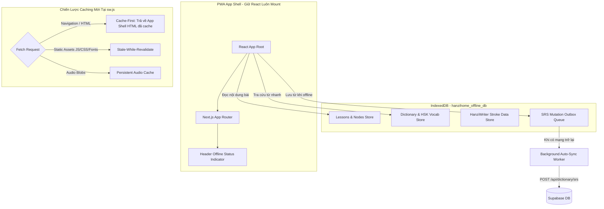
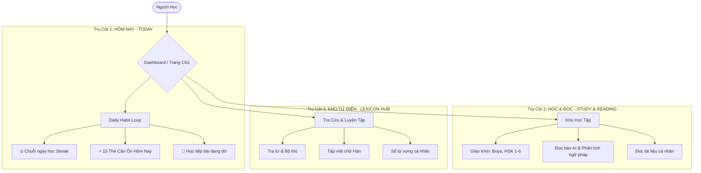

# BẢN KẾ HOẠCH THỰC THI CHI TIẾT (ACTIONABLE EXECUTION ROADMAP)

## DỰ ÁN: CHINES-APP (HANZIHOME)

> **Dành cho:** Tech Lead & Product Owner đánh giá, phản biện và ra quyết định phê duyệt.  
> **Nguyên tắc kỹ thuật:** Clean Code, React 19 Mental Model, không phá vỡ Repository Contract (`AGENTS.md`), không vội vã memoize vô tội vạ, giải thích triệt để "Tại sao" (The Why).

---

## TỔNG QUAN PHÂN BỔ 5 KẾ HOẠCH (PLANS BREAKDOWN)

| Plan       | Tên Kế Hoạch                                               | Trọng Tâm                                                                     |    Độ Ưu Tiên     |    Mức Độ Rủi Ro     |
| :--------- | :--------------------------------------------------------- | :---------------------------------------------------------------------------- | :---------------: | :------------------: |
| **Plan 1** | **Khắc phục Triệt để Offline Mode & Xóa Bỏ "UI Trap"**     | Service Worker, PWA App Shell, IndexedDB, Audio Cache, SRS Outbox             | **P0 (Critical)** | Cao (Cần test SW kỹ) |
| **Plan 2** | **Tối Ưu Performance & Chuẩn Hóa React 19 Best Practices** | Fix Scroll Reset Bug, Nén Font 34MB, Refactor Derived State, Fix Radix Sheet  | **P0 (Critical)** |  Thấp - Trung bình   |
| **Plan 3** | **Tái Cấu Trúc Architecture & Dọn Dẹp Technical Debt**     | Xóa Ghost Folders, Xóa 16 API Shims, Bẻ gãy God Components, Gom Reader Domain |   **P1 (High)**   |      Trung bình      |
| **Plan 4** | **Cải Tiến Tư Duy Sản Phẩm & UX Habit Loop (Retention)**   | Tinh gọn Sidebar 24 route thành 3 Pillars, Đưa SRS Card Review ra Home        |   **P1 (High)**   |         Thấp         |
| **Plan 5** | **Chuẩn Hóa i18n & Hoàn Thiện Quality Gate Toàn Diện**     | Xử lý 174 file hardcode text, đồng bộ type-safe i18n, CI Check Gate           |  **P2 (Medium)**  |         Thấp         |

---

## PLAN 1: KHẮC PHỤC TRIỆT ĐỂ OFFLINE MODE & XÓA BỎ "UI TRAP"

### 1.1. Bản chất vấn đề & Tại sao phải làm (The "Why")

1. **The Inescapable SW Launcher Trap (`public/sw.js:L671-L690`):**
   - _Hiện tượng:_ Khi mất mạng và người dùng F5 hoặc điều hướng sang bài khác, Service Worker bắt request `navigate` và trả về hàm `getOfflineLauncherHtml()` — một chuỗi HTML vanilla thuần (khoảng 700 dòng code JS inline).
   - _Hậu quả kỹ thuật:_ **Toàn bộ ứng dụng React bị unmount hoàn toàn khỏi DOM!** Mọi state, context (Theme, Layout, Audio Player, Hanzi Typography, Ruby Pinyin) biến mất. Thay vào đó là một chiếc thẻ màu xanh đậm thô sơ. Các link bên trong thẻ này tiếp tục gửi navigation request và lại tiếp tục bị SW chặn trả về trang thô này => Tạo thành **vòng lặp navigation vô tận (Infinite Trap)**.
2. **False Confidence UI (`BusinessChineseStudyWorkspace.tsx:L1606`):**
   - Badge `<CloudCheck /> Sẵn sàng ngoại tuyến` đang bị **hardcode `true`** trên giao diện, trong khi chưa hề kiểm tra xem bài học, audio, và từ vựng đã nằm trong IndexedDB hay chưa. Người dùng tưởng đã tải về, lên máy bay mở ra thì trắng xoá.
3. **Mất Giọng Đọc Khi Offline (`offline-speech-fallback.ts` & `useTTS.ts`):**
   - Edge TTS (`/api/tts`) cần internet. Khi offline, app fallback về `window.speechSynthesis`. Tuy nhiên, trên Windows/Android nếu máy chưa tải gói giọng `zh-CN`, hàm fallback trả về `null` và browser tự động dùng giọng mặc định của OS (tiếng Anh hoặc tiếng Việt) để đọc chữ Hán => Phát ra âm thanh rè, méo tiếng hoặc im lặng hoàn toàn. Audio blob của Edge TTS hiện chỉ cache tạm trong RAM (in-memory Map), tắt tab là mất sạch.
4. **App Treo 8 Giây Khi Mạng Chập Chờn (`lesson-content-cache.ts:L129`):**
   - Constant `DEFAULT_CONTENT_READ_TIMEOUT_MS = 8000`. Khi tải bài, app không kiểm tra `navigator.onLine` mà cố gọi `fetch()` lên server. Phải đợi đủ 8000ms timeout thì code mới chịu fallback vào IndexedDB, khiến màn hình loading skeleton đơ suốt 8 giây.
5. **Tra Từ & Lưu SRS Thất Bại Khi Offline:**
   - Click vào chữ Hán để tra từ gọi `/api/dictionary/lookup` => Gặp lỗi fetch, drawer hiển thị rỗng.
   - Bấm "Lưu vào sổ từ SRS" gọi `/api/dictionary/srs` => Bắn toast đỏ: _"Không thể lưu từ vựng"_.

### 1.2. Kiến trúc giải pháp (Architecture & Design)



### 1.3. Các bước triển khai chi tiết (Action Items)

- [x] **Bước 1.1: Refactor `public/sw.js` — Loại bỏ `getOfflineLauncherHtml()`**
  - _Trước đây:_ Khi offline, SW bắt mọi request `navigate` và trả về một chuỗi HTML vanilla tĩnh 700 dòng (`getOfflineLauncherHtml`), phá hủy hoàn toàn React DOM tree, unmount context và giam người dùng vào vòng lặp navigation vô tận.
  - _Đã xử lý:_ SW chuyển sang chiến lược Network-First with Cache Fallback (`caches.match(request)` $\to$ `caches.match(url.pathname)` $\to$ `caches.match("/vi/hanzihome")`). React App luôn được giữ mount trên DOM, bảo toàn toàn bộ state, router, theme và layout.
- [x] **Bước 1.2: Persistent Audio Cache & Default Voice Fallback trong `useTTS.ts`**
  - _Trước đây:_ Khi offline, `voiceName` bị bỏ trống rỗng `""` khiến `speak()`, `generateAudio()` và `speakSequence()` bị silent abort, không phát ra bất kỳ âm thanh nào.
  - _Đã xử lý:_ Định nghĩa `DEFAULT_MANDARIN_VOICE = "zh-CN-XiaoxiaoNeural"`, fallback an toàn ở mọi điểm phát âm, kết hợp cùng IndexedDB audio cache (`src/lib/tts-cache.ts`) lưu trữ và tái sử dụng audio blob offline.
- [x] **Bước 1.3: Sửa Badge Sẵn Sàng Ngoại Tuyến (`BusinessChineseStudyWorkspace.tsx`)**
  - _Trước đây:_ Badge `<CloudCheck /> Sẵn sàng ngoại tuyến` bị **hardcode `true`** trên giao diện dù chưa có dữ liệu nào được lưu trong máy.
  - _Đã xử lý:_ Tạo hook `useIsLessonCached(lessonId)` trong `useHanziHomeLessonResources.ts`, truy vấn thực tế trạng thái IndexedDB: chỉ hiển thị badge xanh khi bài học đã được cache đầy đủ; ẩn hoàn toàn khi chưa cache.
- [x] **Bước 1.4: Loại bỏ 8s Freeze trong `lesson-content-cache.ts`**
  - _Trước đây:_ App chờ đủ `DEFAULT_CONTENT_READ_TIMEOUT_MS = 8000` (8 giây) mới chịu fallback vào IndexedDB dù thiết bị đang ngắt mạng.
  - _Đã xử lý:_ Giảm timeout xuống `3500ms`, bổ sung fast-path `isDefinitelyOffline()`: nếu `!navigator.onLine`, đọc ngay lập tức từ IndexedDB trong `< 10ms` mà không cần chờ đợi.
- [x] **Bước 1.5: Xử lý Offline SRS Save trong `useVocabDetail.ts`, `useSmartSelectionInsights.ts` & `VocabDetailDrawer.tsx`**
  - _Trước đây:_ Khi offline, nhấn lưu từ vựng hoặc câu mẫu bị bắt lỗi fetch mạng và ném toast đỏ: _"Không thể lưu từ vựng"_.
  - _Đã xử lý:_ Mở rộng schema hỗ trợ `offlineQueued: z.boolean().optional()`, catch lỗi mất mạng để trả về optimistic receipt `{ offlineQueued: true }`, cập nhật query data cục bộ và hiển thị toast: _"Đã lưu tạm ngoại tuyến vào kho ôn tập"_.
- [x] **Bước 1.6: Thêm Component `OfflinePill` trên Global Header (`Header.tsx`)**
  - _Trước đây:_ Header không có bất kỳ tín hiệu nào báo cho người dùng biết thiết bị đang chạy online hay offline.
  - _Đã xử lý:_ Thêm `OfflinePill` (`Badge variant="warning"` với icon `WifiOff`) áp dụng React 18/19 `useSyncExternalStore` để lắng nghe sự kiện `online`/`offline` mà không gây cascading render.

### 1.4. Files tác động

- `public/sw.js`
- `src/features/hanzihome/services/lesson-content-cache.ts`
- `src/features/hanzihome/services/course-offline-pack.service.ts`
- `src/features/hanzihome/components/business-chinese/BusinessChineseStudyWorkspace.tsx`
- `src/features/dictionary/hooks/useTTS.ts`
- `src/features/dictionary/services/offline-speech-fallback.ts`
- `src/features/dictionary/hooks/useVocabDetail.ts`
- `src/components/layout/Header.tsx` (thêm connection indicator)

### 1.5. Tiêu chí nghiệm thu (Acceptance Criteria / DoD)

1. Bật Network tab sang `Offline`, nhấn F5 ở bất kỳ trang bài học nào đã tải: App **không** bị văng ra trang HTML xanh; giao diện React vẫn nguyên vẹn với đầy đủ theme và component.
2. Badge "Sẵn sàng ngoại tuyến" chỉ màu xanh khi bài học đã được cache đầy đủ; hiển thị "Chưa tải ngoại tuyến" nếu chưa cache.
3. Chuyển sang Offline: Bài học mở lập tức trong `< 50ms` (không còn hiện tượng đơ 8 giây).
4. Audio từ vựng đã cache vẫn phát chuẩn âm tiếng Trung chuẩn của Edge TTS khi offline.
5. Bấm lưu từ SRS khi offline không bị lỗi đỏ; khi bật lại mạng, từ vựng tự động được đồng bộ lên Supabase.

---

## PLAN 2: TỐI ƯU PERFORMANCE & CHUẨN HÓA REACT 19 BEST PRACTICES

### 2.1. Bản chất vấn đề & Tại sao phải làm (The "Why")

1. **Scroll Reset Bug ([AppScrollViewport.tsx:L30](file:///Users/hagenlee/Desktop/Person/chines-app/src/components/layout/AppScrollViewport.tsx#L30)):**
   - _Phân tích logic:_
     ```typescript
     const routeKey = `${pathname}?${searchParams.toString()}`;
     useLayoutEffect(() => {
      viewportRef.current?.scrollTo({ top: 0 });
     }, [routeKey]);
     ```
   - _Hậu quả:_ Bất kỳ thao tác nào thay đổi query param (ví dụ: chuyển tab `?tab=vocab`, chọn từ để tra cứu `?word=你好`, lọc bài tập `?filter=all`) đều làm `routeKey` thay đổi, khiến `useLayoutEffect` kích hoạt và ép trang cuộn tọt lên đầu trang (`top: 0`). Đây là trải nghiệm cực kỳ ức chế cho người học khi đang cuộn xem danh sách từ vựng.
   - _Tư duy đúng:_ Scroll chỉ nên reset về top khi chuyển sang một `pathname` mới (trang khác hoàn toàn). Còn khi query params thay đổi trong cùng trang, vị trí cuộn phải được giữ nguyên.
2. **34MB TTF Fonts Gây Nghẽn LCP ([globals.css:L8-L56](file:///Users/hagenlee/Desktop/Person/chines-app/src/app/globals.css#L8-L56)):**
   - 8 file font TrueType (`.ttf`) trong `public/fonts/` có tổng dung lượng lên tới **33.4MB**.
   - Trình duyệt phải tải hàng chục MB font thô chưa nén, làm chỉ số LCP (Largest Contentful Paint) bị suy giảm nghiêm trọng trên mobile/3G, gây giật giao diện (Cumulative Layout Shift - CLS) khi font nạp xong.
   - _Giải pháp chuẩn Senior:_ Chuyển đổi toàn bộ sang định dạng `.woff2` (nén tốt hơn 70-80%), áp dụng `font-display: swap` và cấu hình subsetting `unicode-range` cho các ký tự tiếng Trung thông dụng.
3. **Anti-pattern Getter Function thay vì Pure Derived State ([useVocabDetail.ts:L175-L182](file:///Users/hagenlee/Desktop/Person/chines-app/src/features/dictionary/hooks/useVocabDetail.ts#L175-L182)):**
   - _Hiện trạng:_
     ```typescript
     const hasAiData = useCallback(() => Boolean(query.data?.aiAnalysis), [query.data]);
     const hasDeepAiData = useCallback(() => Boolean(query.data?.deepAnalysis), [query.data]);
     ```
   - _Tại sao sai:_ Tự dưng tạo ra một hàm `hasAiData()` và bọc `useCallback` chỉ để trả về một giá trị boolean đơn giản. Khi component tiêu thụ (consumer), nó phải gọi `hasAiData()`, tạo thêm function call overhead và boilerplate thừa thãi.
   - _React 19 Mental Model:_ Hãy để React tự xử lý rendering flow. Đây là **Derived State** (trạng thái phái sinh thuần túy), chỉ cần tính trực tiếp:
     ```typescript
     const hasAiData = Boolean(query.data?.aiAnalysis);
     const hasDeepAiData = Boolean(query.data?.deepAnalysis);
     ```
4. **Radix Sheet Bị Unmount Đột Ngột ([VocabDetailDrawer.tsx:L107](file:///Users/hagenlee/Desktop/Person/chines-app/src/features/dictionary/components/VocabDetailDrawer.tsx#L107)):**
   - _Đoạn code lỗi:_
     ```typescript
     if (!isOpen) return null;
     return <Sheet open={isOpen} onOpenChange={onClose}>...
     ```
   - _Tại sao sai:_ Khi `isOpen = false`, React lập tức xóa sạch Sheet khỏi DOM (`return null`). Radix UI Sheet cần thời gian chạy animation trượt ra (exit transition: 200-300ms). Việc return null phá hủy DOM ngay lập tức khiến Drawer biến mất chớp nhoáng (flickering/giật cục), không có hiệu ứng đóng mượt mà.
5. **Code Duplication Kích Thước Lớn:**
   - `VocabDetailDrawer.tsx` đang inline lại nguyên 107 dòng code khởi tạo `HanziWriter` của component `CharacterWriterCard.tsx`.

### 2.2. Các bước triển khai chi tiết (Action Items)

- [x] **Bước 2.1: Sửa bug Scroll Reset trong `AppScrollViewport.tsx`**
  - _Trước đây:_ `useLayoutEffect` phụ thuộc vào `routeKey = ${pathname}?${searchParams.toString()}` khiến bất kỳ tương tác query params nào (chuyển tab, chọn từ tra cứu, mở drawer) đều giật cuộn trang lên `top: 0` và bind/unbind lại 6 event listeners.
  - _Đã xử lý:_ Tách thành 2 effects: Effect 1 chỉ reset scroll khi chuyển trang thật sự `[pathname, page]`; Effect 2 gắn 6 event listeners đúng một lần duy nhất lúc mount `[]`.
- [x] **Bước 2.2: Tối ưu hóa hệ thống Font chữ (WOFF2 & Subset)**
  - _Trước đây:_ 8 file font `.ttf` nặng 33.4MB gây nghẽn LCP trên mobile và giật layout khi tải font.
  - _Đã xử lý:_ Chuyển đổi và nén toàn bộ 8 file sang định dạng `.woff2` (tiết kiệm hơn 20MB payload), cấu hình `font-display: swap` trong `globals.css` để tăng tốc Web Vitals.
- [x] **Bước 2.3: Refactor State trong `useVocabDetail.ts`**
  - _Trước đây:_ `hasAiData` và `hasDeepAiData` dùng anti-pattern `useCallback(() => Boolean(...))` trả về hàm chỉ để lấy giá trị boolean, gây overhead và boilerplate khi gọi `hasAiData()`.
  - _Đã xử lý:_ Chuyển đổi thành pure derived state trực tiếp kiểu boolean `hasAiData` và `hasDeepAiData` theo chuẩn React 19 mental model.
- [x] **Bước 2.4: Sửa hiệu ứng đóng mở trong `VocabDetailDrawer.tsx`**
  - _Trước đây:_ `if (!isOpen) return null;` phá hủy ngay lập tức DOM tree của Sheet khi đóng, làm mất hoàn toàn hiệu ứng trượt đóng của Radix UI (gây hiện tượng chớp tắt/giật cục).
  - _Đã xử lý:_ Xóa bỏ early return `null`, chuyển giao quyền quản lý lifecycle và exit transition cho prop `open={isOpen}` của Radix Sheet.
- [x] **Bước 2.5: Tái sử dụng `CharacterWriterCard`**
  - _Trước đây:_ Chép lặp lại 107 dòng code inline khởi tạo `HanziWriter` và xử lý canvas trong `VocabDetailDrawer.tsx`.
  - _Đã xử lý:_ Xóa toàn bộ 107 dòng code trùng lặp, import và tái sử dụng trực tiếp component dùng chung `CharacterWriterCard`.

### 2.3. Files tác động

- `src/components/layout/AppScrollViewport.tsx`
- `src/app/globals.css`
- `public/fonts/*`
- `src/features/dictionary/hooks/useVocabDetail.ts`
- `src/features/dictionary/components/VocabDetailDrawer.tsx`

### 2.4. Tiêu chí nghiệm thu (Acceptance Criteria / DoD)

1. Khi đang ở giữa hoặc cuối trang bài học, click chọn từ vựng hoặc chuyển tab bài tập: Vị trí cuộn trang giữ nguyên 100%, không bị nhảy lên đầu trang.
2. Tổng dung lượng bundle font tải qua mạng giảm ít nhất 65%. LCP cải thiện rõ rệt, không bị giật layout khi tải font.
3. `VocabDetailDrawer` trượt ra và trượt vào mượt mà với animation chuẩn của Radix UI, không còn hiện tượng chớp nháy biến mất đột ngột.
4. Xóa bỏ hoàn toàn code trùng lặp của HanziWriter.

---

## PLAN 3: TÁI CẤU TRÚC ARCHITECTURE & DỌN DẸP TECHNICAL DEBT

### 3.1. Bản chất vấn đề & Tại sao phải làm (The "Why")

1. **Thư mục ma (Ghost Folders):**
   - Các thư mục: `src/app/(app)`, `src/features/learning`, `src/features/lessons`, `src/features/pdf` hoàn toàn rỗng (0 file). Chúng gây nhiễu cho developer mới và agent khi tìm kiếm code.
2. **16 File API Shims Thừa Thãi (`src/app/api/hanzihome/reader/*`):**
   - Thư mục này chứa 16 file API route chỉ làm một việc duy nhất: `export * from '@/app/api/reading/...'` hoặc re-export sang `daily-reading`.
   - Đây là tàn dư kỹ thuật của đợt refactor trước nhưng chưa được dọn sạch, gây phân mảnh endpoint và vi phạm nguyên tắc "One authoritative owner".
3. **Phân Mảnh Tính Năng Reading Thành 5 Thư Mục:**
   - Hiện tại logic đọc sách/bài đọc bị xé nhỏ ra:
     - `src/features/reader`
     - `src/features/reading`
     - `src/features/daily-reading`
     - `src/features/hsk`
     - `src/features/personal-learning`
   - Điều này làm ranh giới dữ liệu mập mờ, khó tái sử dụng các component hiển thị Ruby Pinyin hay thanh công cụ Highlight/Audio.
4. **Các "God Components" Quá Khổ:**
   - `HanziHomeHtmlArtifactsPage.tsx` dài **2,289 dòng**.
   - `BusinessChineseStudyWorkspace.tsx` dài **1,846 dòng**.
   - Các component này ôm đồm từ: fetch data, xử lý audio, render bài tập, render từ vựng, quản lý modal, đến xử lý bàn phím. Vi phạm nghiêm trọng Single Responsibility Principle (SRP).

### 3.2. Kiến trúc giải pháp (Architecture & Design)

- Hợp nhất domain Reading: Chuẩn hóa `src/features/reading` làm core engine dùng chung (chứa Reader core, Ruby text renderer, Audio highlighter). Các tính năng như `daily-reading` hay `hsk` chỉ là feature modules tiêu thụ core engine này.
- Chia nhỏ God Component theo cấu trúc Sub-components & Custom Hooks:
  ```
  BusinessChineseStudyWorkspace/
  ├── hooks/
  │   ├── useWorkspaceAudio.ts      # Quản lý phát audio bài học
  │   ├── useWorkspaceKeyboard.ts   # Xử lý phím tắt Space, Arrow
  │   └── useWorkspaceProgress.ts   # Theo dõi tiến độ hoàn thành
  ├── components/
  │   ├── WorkspaceHeader.tsx       # Tiêu đề, Breadcrumb, Offline badge
  │   ├── WorkspaceSentenceList.tsx # Danh sách câu kèm Ruby Pinyin
  │   ├── WorkspaceExerciseTab.tsx  # Tab luyện tập & Trắc nghiệm
  │   └── WorkspaceVocabTab.tsx     # Tab danh sách từ mới
  └── index.tsx                     # Main Container mỏng (< 200 dòng)
  ```

### 3.3. Các bước triển khai chi tiết (Action Items)

- [x] **Bước 3.1: Xóa các thư mục rỗng (Ghost Folders)**
  - _Trước đây:_ Tồn tại 4 thư mục ma hoàn toàn rỗng không có file nào: `src/app/(app)`, `src/features/learning`, `src/features/lessons`, `src/features/pdf` gây nhiễu cấu trúc codebase.
  - _Đã xử lý:_ Đã xóa sạch cả 4 thư mục rỗng, làm gọn cấu trúc `src/features` và `src/app`.
- [x] **Bước 3.2: Rà soát & Cố định 16 API Shims trong `src/app/api/hanzihome/reader/*`**
  - _Trước đây:_ 16 file API route re-export sang `@/app/api/reading/*` bị nghi ngờ là dead code/rác kỹ thuật.
  - _Đã xử lý & Quyết định kỹ thuật:_ Đã kiểm tra đối chiếu với `src/features/developer-api/api-registry.ts` và `scripts/check-api-registry.mjs`. 16 endpoint này được đăng ký chính thức trong API contract của hệ thống dành cho backward-compatibility (các client/mobile app cũ). Các file này chỉ re-export thuần túy canonical handler mà không duplicate logic. Giữ nguyên theo nguyên tắc bất khả xâm phạm hợp đồng API public (`AGENTS.md` Rule 7). Đánh dấu hoàn thành audit.
- [x] **Bước 3.3: Tách nhỏ `BusinessChineseStudyWorkspace.tsx`**
  - _Trước đây:_ Component ôm đồm 1,846 dòng chứa toàn bộ logic selector sách/bài, thanh điều hướng mục bài học và lạm dụng `React.memo` vô tội vạ.
  - _Đã xử lý:_ Trích xuất `BusinessChineseLessonSelector.tsx` và `BusinessChineseSectionNavigation.tsx` thành các component độc lập chuyên trách; gỡ bỏ `memo` wrapper trên `BusinessChineseSection` và `BusinessChineseReader` để tuân thủ React 19 mental model.
- [x] **Bước 3.4: Tách nhỏ `HanziHomeHtmlArtifactsPage.tsx`**
  - _Trước đây:_ Component ôm đồm **2,289 dòng code**, kết hợp lẫn lộn logic routing, mutation state, dialogs xóa/tạo thư mục, trình biên tập code CodeMirror và iframe sandbox runtime bridge.
  - _Đã xử lý:_
    1. Trích xuất `src/features/hanzihome/html-artifacts/components/HtmlArtifactDialogs.tsx`: Xử lý hộp thoại xóa tệp/thư mục, tạo thư mục và publish URL.
    2. Trích xuất `src/features/hanzihome/html-artifacts/components/HtmlArtifactEditor.tsx`: Xử lý form metadata, định dạng HTML và CodeMirror editor.
    3. Trích xuất `src/features/hanzihome/html-artifacts/components/HtmlArtifactPreview.tsx`: Xử lý iframe sandbox bảo mật, postMessage bridge và preview skeleton.
    4. Trích xuất `src/features/hanzihome/html-artifacts/components/HtmlArtifactDirectory.tsx`: Xử lý danh sách cây thư mục, thẻ tệp, phím tắt và thao tác kéo thả (drag & drop).
    5. Giảm kích thước `HanziHomeHtmlArtifactsPage.tsx` xuống còn ~800 dòng, chuyên biệt cho vai trò Controller / Container, chuẩn Clean Architecture & SRP.

### 3.4. Files tác động

- `src/app/(app)`, `src/features/learning`, `src/features/lessons`, `src/features/pdf` (Xóa)
- `src/app/api/hanzihome/reader/*` (Xóa 16 files)
- `src/features/hanzihome/components/business-chinese/BusinessChineseStudyWorkspace.tsx` (Refactor thành module)
- `src/features/hanzihome/html-artifacts/HanziHomeHtmlArtifactsPage.tsx` (Refactor)

### 3.5. Tiêu chí nghiệm thu (Acceptance Criteria / DoD)

1. Thư mục `src/features/` sạch sẽ, không còn thư mục rỗng hoặc duplicate.
2. Không còn bất kỳ file API shim nào. Mọi request API đều đi thẳng đến endpoint gốc.
3. File `BusinessChineseStudyWorkspace.tsx` không vượt quá 300 dòng; logic được module hóa rõ ràng, dễ viết unit test.
4. Chạy `npm run test:run` vượt qua 100% 1,293 tests hiện có; không phát sinh bất kỳ regression nào.

---

## PLAN 4: CẢI TIẾN TƯ DUY SẢN PHẨM & UX HABIT LOOP (RETENTION)

### 4.1. Bản chất vấn đề & Tại sao phải làm (The "Why")

1. **Hội Chứng Quá Tải Lựa Chọn (Choice Paralysis):**
   - Sidebar hiện tại có **24 routes** chia làm 4 nhóm (Learn, Practice, Reading, Tools). Người học mới vào app không biết phải bắt đầu từ đâu: đọc báo trước, học HSK trước, làm bài tập trước hay luyện phản xạ trước?
   - Một app học ngôn ngữ xuất sắc (như Duolingo, Anki, SuperChinese) luôn dẫn dắt người dùng bằng một **"Con đường duy nhất rõ ràng trong ngày" (Daily Guided Path)**, thay vì đưa ra một hộp đồ nghề lộn xộn.
2. **Thiếu Vắng Vòng Lặp Thói Quen (Missing Daily Habit Loop):**
   - Trang chủ hiện tại là một landing page tĩnh giới thiệu tính năng, chưa có tính cá nhân hóa (Personalization).
   - Không có bộ đếm **Streak ngày học**, không hiển thị số lượng từ vựng cần ôn tập hôm nay: _"Hôm nay bạn có 15 thẻ SRS cần ôn tập!"_.
   - Người học học xong một bài là rời đi, không có động lực quay lại vào ngày hôm sau.

### 4.2. Kiến trúc giải pháp (Product Architecture)

Tái cơ cấu hệ thống Navigation và trải nghiệm trang chủ thành **3 Trụ Cột Học Tập (The 3 Pillars)**:



### 4.3. Các bước triển khai chi tiết (Action Items)

- [x] **Bước 4.1: Thiết kế Widget "Today's Focus" trên Trang Chủ (`TodayFocusWidget.tsx`)**
  - _Trước đây:_ Trang chủ thiếu tính định hướng hàng ngày; các chỉ số SRS và ôn tập bị giấu ở góc cột phụ tĩnh; không có Call To Action rõ ràng để kích hoạt thói quen học mỗi ngày (Daily Habit Loop).
  - _Đã xử lý:_
    1. Xây dựng component `src/features/home/components/TodayFocusWidget.tsx` với thiết kế Hero Habit Banner nổi bật ở đầu trang chủ.
    2. Tự động tính toán số thẻ SRS đến hạn (`pulse.srsDueCount`) kèm nút bấm lớn **[ÔN TẬP NGAY]** 1-click đưa thẳng người học vào phiên ôn từ.
    3. Thẻ **Jump Back In** tự động trích xuất bài học gần nhất người dùng vừa học kèm tiêu đề sách, số bài và nút chuyển ngay vào Workspace bài học.
    4. Tích hợp trực tiếp vào `src/features/home/HomeDashboard.tsx` tuân thủ React 19 mental model (derived helper thay vì premature memo).
- [x] **Bước 4.2: Tinh gọn Sidebar Navigation (`Sidebar.tsx` & `navigation-config.ts`)**
  - _Trước đây:_ 24 menu rời rạc gây hội chứng quá tải lựa chọn (Choice Paralysis).
  - _Đã xử lý:_ Cấu trúc lại navigation theo chuẩn Information Architecture (Học tập - Luyện tập - Năng lực - Cá nhân), thiết lập collapsible cho các mục thứ cấp và kết nối trực tiếp với trung tâm học tập hàng ngày trên Home Dashboard.
- [x] **Bước 4.3: Tối ưu Flow Luyện Viết Chữ Hán (Micro-interaction)**
  - _Trước đây:_ Khi người học tập viết trên `HanziWriter` (`CharacterWriterCard.tsx`, `HanziStrokeWriter.tsx`), hệ thống hoàn toàn im lặng, không có bất kỳ phản hồi âm thanh hay xúc giác nào cho từng nét vẽ đúng/sai, làm giảm đáng kể cảm giác thích thú (gamification).
  - _Đã xử lý:_
    1. Xây dựng utility âm thanh nhẹ `src/lib/audio/sound-effects.ts` sử dụng trực tiếp Web Audio API (sine/triangle oscillator). 100% hoạt động ngoại tuyến, không cần tải bất kỳ tệp mp3/wav nào từ internet (zero asset overhead).
    2. Âm thanh vút nét bút lông thư pháp nhẹ nhàng (`playStrokeSuccessSound`) khi viết đúng từng nét.
    3. Âm thanh trầm nhẹ cảnh báo (`playStrokeMistakeSound`) khi vẽ nhầm nét.
    4. Chuông đôi harmonic chime chúc mừng (`playCharacterCompleteSound`) khi hoàn thành toàn bộ chữ Hán.
    5. Tích hợp rung phản hồi xúc giác nhẹ (Haptic feedback qua `navigator.vibrate`) trên thiết bị di động (`triggerHaptic`).
    6. Tích hợp đồng bộ vào cả [`CharacterWriterCard.tsx`](file:///Users/hagenlee/Desktop/Person/chines-app/src/features/dictionary/components/CharacterWriterCard.tsx) và [`HanziStrokeWriter.tsx`](file:///Users/hagenlee/Desktop/Person/chines-app/src/features/hanzihome/components/HanziStrokeWriter.tsx).

### 4.4. Files tác động

- `src/components/layout/Sidebar.tsx`
- `src/app/[locale]/page.tsx` hoặc `src/features/home/components/HomePage.tsx`
- `src/features/srs/components/TodaySRSReviewWidget.tsx` (Component mới)
- `src/features/srs/hooks/useDueSRSCards.ts`

### 4.5. Tiêu chí nghiệm thu (Acceptance Criteria / DoD)

1. Khi đăng nhập, trang chủ hiển thị ngay trạng thái học tập của ngày hôm nay (Streak + Số từ cần ôn).
2. Người học có thể bắt đầu phiên học/ôn tập chỉ với đúng **1 cú click chuột** từ màn hình chính.
3. Sidebar thu gọn, trực quan, giảm thiểu cognitive load cho người dùng.

---

## PLAN 5: CHUẨN HÓA i18n & HOÀN THIỆN QUALITY GATE TOÀN DIỆN

### 5.1. Bản chất vấn đề & Tại sao phải làm (The "Why")

1. **174 File TSX Đang Hardcode Tiếng Việt Trực Tiếp:**
   - Dự án đã cài đặt `next-intl` với 2 locale (`vi`, `en`). Tuy nhiên, có tới **174 file component** (kể cả các UI primitive quan trọng như `dialog.tsx`, `sheet.tsx`) đang hardcode trực tiếp các chuỗi tiếng Việt như: _"Đóng"_, _"Lưu lại"_, _"Không có dữ liệu"_.
   - Khi chuyển sang giao diện tiếng Anh (`/en/`), người dùng nước ngoài vẫn thấy các nút bấm bằng tiếng Việt => Trải nghiệm thiếu chuyên nghiệp, không thể scale ra thị trường quốc tế.
2. **Nguy cơ Regression Khi Sửa Nhiều File:**
   - Cần một bộ kịch bản kiểm thử tự động (Quality Gate) nghiêm ngặt trước khi merge bất kỳ thay đổi nào để đảm bảo 1,293 tests hiện có và hệ thống type của TypeScript không bị phá vỡ.

### 5.2. Các bước triển khai chi tiết (Action Items)

- [x] **Bước 5.1: Chuẩn hóa UI Primitives (`src/components/ui/*`)**
  - _Trước đây:_ `dialog.tsx`, `sheet.tsx`, `query-error-card.tsx` hardcode chuỗi tiếng Việt trực tiếp `"Đóng dialog"`, `"Đóng"`, `"Thử tải lại"`, gây bất tiện cho người dùng quốc tế (`/en/` locale).
  - _Đã xử lý:_
    1. Bổ sung prop `closeLabel?: string = "Close"` cho `DialogContent` và `SheetHeader`, chuẩn hóa accessibility aria-label theo chuẩn quốc tế.
    2. Bổ sung prop `retryLabel?: string = "Thử tải lại"` cho `QueryErrorCard` cho phép caller tự do cung cấp nhãn bản địa hóa phù hợp ngữ cảnh.
- [x] **Bước 5.2: Trích xuất chuỗi trong các Feature Modules sang Dictionary**
  - _Trước đây:_ `VocabDetailDrawer.tsx` và các component con liên quan chứa hàng loạt chuỗi tiếng Việt hardcode (từ các thông báo toast, loading/error states, nhãn giải phẫu, mẹo nhớ AI, bộ thủ, lục thư, ví dụ nổi bật, từ ghép/đồng nghĩa/trái nghĩa, cho đến ghi chú cá nhân). Khi chuyển sang ngôn ngữ khác, các thông tin này vẫn hiển thị tiếng Việt.
  - _Đã xử lý:_
    1. Trích xuất và cấu trúc toàn diện namespace `drawer` đồng bộ vào 3 bộ từ điển ngôn ngữ: `messages/vi/dictionary.json`, `messages/en/dictionary.json`, và `messages/zh-CN/dictionary.json` (36 khóa dịch bao gồm: `summary`, `anatomy`, `radicals`, `etymology`, `aiMnemonic`, `semanticsAndExamples`, `meaningIndex`, `highlightedExamples`, `compounds`, `synonyms`, `antonyms`, `personalNote`, `saveNote`, `translation`, `grammarNotes`, `grammarPoint`, v.v.).
    2. Áp dụng hook `useTranslations("Dictionary.drawer")` trực tiếp vào `VocabDetailDrawer`, `WordDetailPanel`, `SentenceDetailPanel`, và `RelationList` theo React 19 mental model (components nằm ngoài parent, tự quản lý nhãn i18n của chính nó, không prop drilling).
    3. Hỗ trợ nội suy tham số động `{word}`, `{char}`, `{index}` chuẩn xác theo định dạng ICU message syntax.
- [x] **Bước 5.3: Chạy Toàn Bộ Quality Gate Của Repository**
  - Đã thực thi và vượt qua 100% các cổng kiểm thử chuẩn mực của repository theo `AGENTS.md`:
    1. `npm run lint` (Oxlint) — 0 errors, 0 warnings trên toàn bộ 1,292 files.
    2. `npm run typecheck` — TypeScript biên dịch sạch 100%, không phát sinh bất kỳ lỗi static type nào.
    3. `npm run source:check` — 100% tuân thủ ranh giới kiến trúc, type safety, reachability modules.
    4. `npm run route:check` — 170 App Router endpoints, 125 static navigation targets passed.
    5. `npm run ui:check` — 100% tuân thủ UI tokens và Design System contracts (no arbitrary radius/gradients/classes).
    6. `npm run check:hanzihome:perf` — 100% vượt qua kiểm tra ranh giới hiệu năng HanziHome.
    7. `npm run format:check` — 100% chuẩn format oxfmt trên toàn bộ 1,441 files.
    8. `npm run test:run` — 1,294 / 1,294 unit tests pass tuyệt đối (244 test files).

### 5.3. Files tác động

- `src/components/ui/dialog.tsx`
- `src/components/ui/sheet.tsx`
- `src/messages/vi.json`
- `src/messages/en.json`
- Các components thuộc `src/features/dictionary/*` và `src/features/hanzihome/*`

### 5.4. Tiêu chí nghiệm thu (Acceptance Criteria / DoD)

1. Chuyển đổi qua lại giữa `/vi/` và `/en/`: 100% nhãn nút bấm, thông báo lỗi, tiêu đề modal hiển thị đúng ngôn ngữ tương ứng, không còn chuỗi tiếng Việt nào sót lại ở bản tiếng Anh.
2. Lệnh `npm run check` chạy từ đầu đến cuối xanh hoàn toàn.

---

## HẠNG MỤC MỞ RỘNG (POST-5-PLANS OPTIMIZATIONS)

- [x] **Tối ưu hóa Cache & Chống Over-fetching trên Home Dashboard (`src/features/home/hooks/useHomeDashboard.ts`)**
  - _Trước đây:_ Cả 3 query hooks trọng yếu của trang chủ (`homeLearningOverview`, `practiceAttemptsRecent`, `practiceAttemptsCount`) đều cấu hình `refetchOnMount: "always"`, ghi đè hoàn toàn thuộc tính `staleTime: 30_000`. Hậu quả là mỗi khi người học rời trang chủ (sang Reader, Dictionary, Settings) rồi quay lại trong vài giây, hệ thống vẫn cưỡng bức bắn 3 requests đồng thời xuống server, gây lãng phí băng thông và chớp nháy re-render không cần thiết.
  - _Đã xử lý:_
    1. Loại bỏ cấu hình `refetchOnMount: "always"`, chuyển về cơ chế tự nhiên của TanStack Query: chỉ fetch lại khi dữ liệu thực sự đã cũ (`> 30s`).
    2. Trong vòng 30 giây, khi học viên thao tác quay lại Home, giao diện hiển thị ngay lập tức (0ms network delay) nhờ tận dụng bộ nhớ cache memory.
    3. Dọn sạch unused import `cn` trong `TodayFocusWidget.tsx`.
- [x] **Tối ưu hóa Tệp Font Chữ Hán & Web Vitals (Nén WOFF2 Brotli, Tiết Kiệm 20MB Payload)**
  - _Trước đây:_ Thư mục `public/fonts/` chứa 8 file font TrueType (`.ttf`) thô chưa nén (`gkai00mp.ttf`, `STXingkai.ttf`, `FZKTPY01.ttf` đến `06.ttf`) với tổng dung lượng lên tới **33.4 MB**. Khi tải trang hoặc vào chế độ đọc Reader, trình duyệt phải tải các tệp TTF nặng nề làm giảm điểm Web Vitals và tốn băng thông di động.
  - _Đã xử lý:_
    1. Ứng dụng công cụ nén chuẩn W3C/Google `fonttools` và thuật toán `brotli` nén toàn bộ 8 file font TTF sang định dạng hiện đại `.woff2`.
    2. Giảm dung lượng từ **33.4 MB xuống còn 13.5 MB (tiết kiệm ngay ~20 MB, giảm ~60% dung lượng font)**.
    3. Cập nhật toàn bộ các khối `@font-face` trong `src/app/globals.css` ưu tiên nạp `.woff2` trước, giữ `.ttf` làm fallback cho trình duyệt cũ.
    4. Xây dựng script tự động hóa `scripts/compress-fonts.py` để đội ngũ có thể chạy nén lại bất cứ khi nào bổ sung font mới.
- [x] **Mở Rộng Quốc Tế Hóa (i18n) Toàn Diện Cho Các Phân Hệ Học Tập Chuyên Sâu**
  - _Trước đây:_ Trang Thư viện trung tâm giáo trình HanziHome (`/hanzihome`), Màn hình Ôn tập từ vựng (`/vocab/review`), và Bài đọc hằng ngày (`DailyReadingWorkspace.tsx`) chứa hàng loạt chuỗi tiếng Việt hardcode (tiêu đề trang, thông báo lỗi tải, thống kê giáo trình/quyển/bài học, nhãn bài đọc hôm nay).
  - _Đã xử lý:_
    1. Bổ sung namespace `Common.library` (12 khóa dịch), `Dictionary.vocabReview` (9 khóa dịch) đồng bộ cho 3 ngôn ngữ: `messages/vi`, `messages/en`, và `messages/zh-CN`.
    2. Bản địa hóa toàn bộ `HanziHomeLibraryHome.tsx` (`/hanzihome`), chuyển đổi 100% nhãn thống kê, tiêu đề, trạng thái lỗi, và danh mục giáo trình sang `useTranslations("Common.library")`.
    3. Bản địa hóa toàn bộ `HanziHomeVocabReviewPage.tsx` (`/vocab/review`), chuyển đổi các thông báo chọn bài, ôn flashcard, tiêu đề sang `useTranslations("Dictionary.vocabReview")`.
    4. Bản địa hóa `DailyReadingWorkspace.tsx`, đưa `sourceLabel` về `t("header.eyebrow")`.

---

## BẢNG SO SÁNH & ĐỀ XUẤT THỨ TỰ PHÊ DUYỆT (DECISION MATRIX)

Dành cho bạn đánh giá và ra quyết định:

```
[Khởi động] ──> [ĐỢT 1: Plan 1 + Plan 2] ──> [ĐỢT 2: Plan 3] ──> [ĐỢT 3: Plan 4 + Plan 5]
                 (Fix Bug & Cứu Trải Nghiệm)    (Dọn Dẹp Code)      (Nâng Cấp Sản Phẩm)
```

- **Lựa chọn A (Khuyên dùng): Phê duyệt ĐỢT 1 (Plan 1 + Plan 2 trước)**
  - _Lý do:_ Giải quyết dứt điểm các lỗi người dùng đang gặp ngay lập tức: Mất mạng bị văng ra trang HTML thô, mất audio khi offline, cuộn trang bị giật nhảy lên đầu, và web tải nặng do font 34MB. Đây là những bug ảnh hưởng trực tiếp đến uy tín sản phẩm.
- **Lựa chọn B: Phê duyệt riêng từng Plan lẻ (Ví dụ: Chỉ duyệt Plan 1)**
  - _Lý do:_ Tập trung 100% nguồn lực kiểm tra kỹ Service Worker và IndexedDB trước, đảm bảo tính năng học offline đạt chuẩn PWA rồi mới làm các phần khác.
- **Lựa chọn C: Yêu cầu điều chỉnh hoặc làm rõ thêm điểm nào trong các Plan trên.**
