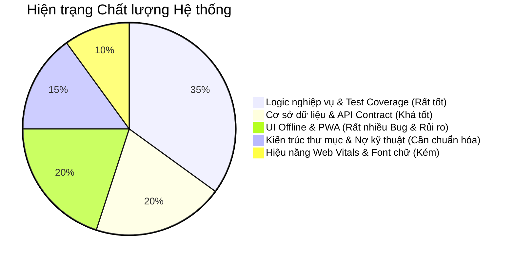
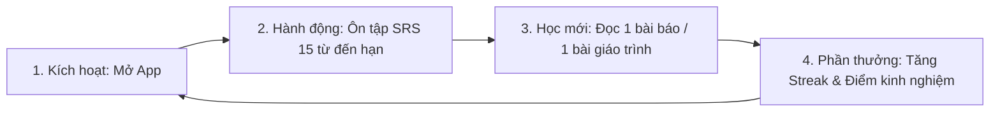

# BÁO CÁO TOÀN DIỆN KỸ THUẬT, CHẾ ĐỘ OFFLINE & TƯ DUY SẢN PHẨM (HANZIHOME)

> **Người đánh giá:** Senior React Developer & Tech Lead  
> **Dự án:** `chines-app` (HanziHome)  
> **Mục tiêu:** Rà soát kiến trúc toàn diện (Performance, Folder Structure, React 19, Code Quality), mổ xẻ chi tiết **toàn bộ lỗi và hạn chế của chế độ học ngoại tuyến (Offline Learning & UI Bugs)**, đồng thời định hướng chiến lược nâng cấp từ góc nhìn Tech Lead & Product Owner.  
> **Cam kết:** Giữ nguyên 100% mã nguồn hiện tại (không chỉnh sửa file dự án), tập trung cung cấp báo cáo đánh giá chuyên sâu và giải thích bản chất "Tại sao" (Why) để giúp Level-up Junior → Mid-level.

---

## MỤC LỤC CHI TIẾT

1. [TỔNG QUAN ĐÁNH GIÁ (EXECUTIVE SUMMARY)](#1-tổng-quan-đánh-giá)
2. [ĐÁNH GIÁ CHUYÊN SÂU CHẾ ĐỘ HỌC NGOẠI TUYẾN & CÁC LỖI UI OFFLINE (DEEP-DIVE OFFLINE MODE)](#2-đánh-giá-chuyên-sâu-chế-độ-học-ngoại-tuyến--các-lỗi-ui-offline)
   - 2.1. "Cái bẫy" Service Worker: Biến React App thành trang HTML thô sơ
   - 2.2. Vòng lặp điều hướng vô tận khi mất mạng (Infinite Navigation Loop)
   - 2.3. Badge "Sẵn sàng ngoại tuyến" giả mạo (False Confidence UI)
   - 2.4. Sự cố phát âm TTS khi mất mạng (Web Speech API Voice Gap)
   - 2.5. Điểm nghẽn độ trễ 8 giây khi mạng chập chờn (8-Second Timeout Freeze)
   - 2.6. Thảm họa Tra cứu & Lưu SRS khi Offline (Dictionary & SRS Dead-end)
   - 2.7. Gói tải Offline (`course-offline-pack`) chưa trọn vẹn
   - 2.8. Thiếu vắng hoàn toàn UI trạng thái kết nối (Connection Status Awareness)
3. [HIỆU NĂNG & TƯ DUY REACT 19 (PERFORMANCE & RENDERING)](#3-hiệu-năng--tư-duy-react-19)
   - 3.1. Lỗi giật nảy Scroll Viewport khi đổi Query Param (`AppScrollViewport.tsx`)
   - 3.2. Thảm họa Web Vitals: 34MB TTF Fonts chưa nén nạp vào Client
   - 3.3. Tư duy React 19: Pure Derived State vs Function Getters (`useVocabDetail.ts`)
   - 3.4. Over-fetching và Query Config triệt tiêu Cache tại Homepage
   - 3.5. Unmount cưỡng bức phá hủy Radix Sheet Exit Animation (`VocabDetailDrawer.tsx`)
4. [KIẾN TRÚC, THƯ MỤC & NỢ KỸ THUẬT (STRUCTURE, FOLDERS & TECH DEBT)](#4-kiến-trúc-thư-mục--nợ-kỹ-thuật)
   - 4.1. Tàn dư "Thư mục ma" (Ghost Directories)
   - 4.2. Phân mảnh tính năng Reader (5 thư mục chồng chéo)
   - 4.3. 16 Route Shims "chết lâm sàng" trong `api/hanzihome/reader/`
   - 4.4. Xung đột nhận thức: "Notes" vs "Notebook"
   - 4.5. Bất nhất luồng dữ liệu (Dual Data Flow): Supabase Client vs Route Handlers
   - 4.6. Vấn nạn "God Components" (1,000 - 2,300 dòng/file)
5. [CHẤT LƯỢNG CODE, CLEAN CODE & I18N (CODE QUALITY)](#5-chất-lượng-code-clean-code--i18n)
   - 5.1. 174 / 500 Component bị Hardcode tiếng Việt (Phá vỡ đa ngôn ngữ)
   - 5.2. Hardcode trong cả UI Primitives dùng chung (`dialog.tsx`, `sheet.tsx`)
   - 5.3. Trùng lặp code: Clone 107 dòng `CharacterWriterCard` trong Drawer
6. [TƯ DUY SẢN PHẨM & TRẢI NGHIỆM HỌC TẬP (PRODUCT THINKING & LEARNING UX)](#6-tư-duy-sản-phẩm--trải-nghiệm-học-tập)
   - 6.1. Bệnh "Hộp đồ nghề" (Swiss Army Knife) và menu 24 mục
   - 6.2. Mô hình Vòng lặp học tập hàng ngày (Daily Learning Habit Loop)
   - 6.3. Tái cấu trúc 3 Trụ cột Sản phẩm: Today - Study & Reading - Lexicon Hub
   - 6.4. Kích hoạt giá trị cốt lõi Spaced Repetition (SRS) kết hợp Tập viết nét
   - 6.5. Định vị tính năng AI: Managed Pre-generation vs BYOK
7. [LỘ TRÌNH HÀNH ĐỘNG CHIẾN LƯỢC (STRATEGIC ACTIONABLE ROADMAP)](#7-lộ-trình-hành-động-chiến-lược)

---

## 1. TỔNG QUAN ĐÁNH GIÁ

Dự án `chines-app` (HanziHome) là một ứng dụng học tiếng Trung có quy mô rất lớn, mã nguồn phong phú, chứa nhiều tính năng hữu ích mà hiếm có app tiếng Trung nào trên thị trường tổng hợp đầy đủ (giáo trình đa dạng, bài đọc kèm phiên âm Ruby, chiết tự chữ Hán, chép chính tả, hội thoại AI, sinh bài đọc tự động).

Tuy nhiên, dự án đang chịu gánh nặng lớn về **Nợ kỹ thuật (Technical Debt)** và **Sự phân mảnh sản phẩm (Feature Fragmentation)**:



---

## 2. ĐÁNH GIÁ CHUYÊN SÂU CHẾ ĐỘ HỌC NGOẠI TUYẾN & CÁC LỖI UI OFFLINE

Chế độ học ngoại tuyến (Offline Learning) là tính năng tối quan trọng của một ứng dụng ngôn ngữ di động, vì người học thường học trên xe buýt, tàu điện ngầm, hoặc khi đi máy bay. Qua rà soát chi tiết [public/sw.js](file:///Users/hagenlee/Desktop/Person/chines-app/public/sw.js), [PwaServiceWorkerRegister.tsx](file:///Users/hagenlee/Desktop/Person/chines-app/src/components/layout/PwaServiceWorkerRegister.tsx), các local store và giao diện thực tế, hệ thống Offline hiện tại đang tồn tại **8 lỗi và nghịch lý kiến trúc nghiêm trọng**:

### 2.1. "Cái bẫy" Service Worker: Biến React App thành trang HTML thô sơ

Tại [public/sw.js:L671-L690](file:///Users/hagenlee/Desktop/Person/chines-app/public/sw.js#L671-L690):

```javascript
// 1. Navigation requests: Network-first with an owner-scoped offline reader fallback
if (request.mode === "navigate") {
 event.respondWith(
  (async () => {
   try {
    return await fetch(request);
   } catch {
    return new Response(getOfflineLauncherHtml(), {
     headers: {
      "Content-Type": "text/html; charset=utf-8",
      "Cache-Control": "no-store",
     },
    });
   }
  })(),
 );
 return;
}
```

> [!CAUTION]
> **Hiện tượng xảy ra trên UI khi mất mạng:**
> Khi người học đang dùng app mà mất kết nối, chỉ cần tải lại trang (reload) hoặc click vào một đường link điều hướng:
>
> 1. Trình duyệt gửi request `navigate`. Do mất mạng, `fetch(request)` thất bại.
> 2. `sw.js` lập tức trả về hàm `getOfflineLauncherHtml()`.
> 3. **TOÀN BỘ ỨNG DỤNG REACT BỊ UNMOUNT VÀ TIÊU BIẾN!**
> 4. Thay vào đó, màn hình biến thành một hộp card màu xanh đen kiểu năm 1995 với tiêu đề: _"Chế độ ngoại tuyến — HanziHome"_.
> 5. Mọi tính năng hiện đại: Header, Sidebar, Theme dark/light, Font chữ Hán Khải thư/Hành thư, Ruby Pinyin, Phát âm âm thanh, Tô sáng từ vựng, Tra từ điển đều **HOÀN TOÀN BIẾN MẤT**!
>
> **Tại sao đây là lỗi kiến trúc (Why)?**
> Thay vì dùng Service Worker để cache **Application Shell** (gồm HTML, bundle JS, CSS và render giao diện React bình thường, sau đó React tự đọc dữ liệu từ IndexedDB để hiển thị), tác giả lại tạo ra một **ứng dụng HTML thuần thứ hai** được nhúng cứng dưới dạng chuỗi string trong `sw.js`! Điều này dẫn đến sự phân liệt trải nghiệm: online là React app xịn sò, offline là trang HTML cổ điển với tính năng bị cắt giảm 90%!

---

### 2.2. Vòng lặp điều hướng vô tận khi mất mạng (Infinite Navigation Loop)

Trong mã nguồn HTML fallback tại [public/sw.js:L325-L340](file:///Users/hagenlee/Desktop/Person/chines-app/public/sw.js#L325-L340):

```html
<div class="btn-group">
 <button class="btn btn-primary" onclick="window.location.reload()">Thử tải lại trang</button>
 <button
  class="btn btn-secondary"
  onclick="window.history.length > 1 ? window.history.back() : window.location.href='/vi/hanzihome'"
 >
  Quay lại bài học trước
 </button>
</div>

<div class="nav-links">
 <a class="nav-link" href="/vi/hanzihome">Thư viện</a>
 <a class="nav-link" href="/vi/hsk/han-thuong-mai">Hán thương mại</a>
 <a class="nav-link" href="/vi/hsk/nhip-cau-han-ngu">Nhịp cầu Hán ngữ</a>
 <a class="nav-link" href="/vi/hsk/doc-hieu">Đọc hiểu</a>
</div>
```

> [!WARNING]
> **Bug vòng lặp kẹt cứng:**
>
> - Các thẻ `<a href="/vi/hanzihome">`, `/vi/hsk/...` trỏ đến các Next.js Server Components.
> - Khi người dùng bấm vào các link này trong lúc offline: Trình duyệt gửi request `navigate` mới -> Mất mạng -> Service Worker lại trả về chính trang `getOfflineLauncherHtml()` này!
> - Người dùng bấm nút nào cũng bị quay lại đúng màn hình này, không tài nào vào được bài học.
> - Hơn nữa, nếu người dùng mở tab mới khi đang offline hoặc Service Worker chưa kịp lưu `ownerId` vào marker cache `/__hanzihome-offline-owner`, script ở dòng 623 sẽ hiện:
>   > _"Cần mở lại khi có mạng. Không thể xác định tài khoản đã tải bài khi không có mạng."_
>   > Và người học bị **khoá chặt hoàn toàn bên ngoài app**, không đọc được bất cứ bài nào dù đã tải về trước đó!

---

### 2.3. Badge "Sẵn sàng ngoại tuyến" giả mạo (False Confidence UI)

Tại [BusinessChineseStudyWorkspace.tsx:L1606-L1615](file:///Users/hagenlee/Desktop/Person/chines-app/src/features/hanzihome/components/business-chinese/BusinessChineseStudyWorkspace.tsx#L1606-L1615):

```tsx
<Badge
 variant="success"
 size="sm"
 casing="natural"
 className="cursor-default gap-1 shrink-0"
 title={t("offlineDescription")}
>
 <CloudCheck data-icon="inline-start" />
 <span>{t("offlineReady")}</span>
</Badge>
```

> [!CAUTION]
> **Vấn đề cực kỳ nguy hiểm về niềm tin của người dùng:**
> Trong toàn bộ không gian học Hán thương mại, Nhịp cầu Hán ngữ, Đọc hiểu:
>
> - Badge **"Sẵn sàng ngoại tuyến"** (màu xanh lá kèm icon đám mây có dấu tick) **LUÔN LUÔN HIỂN THỊ CỐ ĐỊNH**.
> - Badge này **KHÔNG HỀ KIỂM TRA** xem bài học này đã được cache vào IndexedDB hay chưa!
> - Nó cũng không kiểm tra xem âm thanh TTS của bài đó đã có trong máy hay chưa!
> - Người dùng nhìn thấy badge tưởng rằng bài đã sẵn sàng, tự tin tắt mạng lên máy bay. Đến khi mở bài số 2, số 3 ra học thì màn hình trắng tinh hoặc báo lỗi mạng! Đây là lỗi "hứa lèo" (false promise) nghiêm trọng trong thiết kế sản phẩm.

---

### 2.4. Sự cố phát âm TTS khi mất mạng (Web Speech API Voice Gap)

Khi online, hệ thống dùng Microsoft Edge TTS qua endpoint `/api/tts` cho giọng đọc tiếng Trung chất lượng cực cao (giọng Xiaoxiao/Yunxi tự nhiên). Khi offline, code rơi vào fallback tại [useTTS.ts:L359-L388](file:///Users/hagenlee/Desktop/Person/chines-app/src/hooks/useTTS.ts#L359-L388) gọi sang [offline-speech-fallback.ts](file:///Users/hagenlee/Desktop/Person/chines-app/src/features/hanzihome/speech/offline-speech-fallback.ts):

```typescript
// Trong offline-speech-fallback.ts:
const voice = getPreferredChineseVoice();
if (voice) {
 utterance.voice = voice;
}
window.speechSynthesis.speak(utterance);
```

> [!IMPORTANT]
> **Bug âm thanh trên thực tế (Why):**
>
> 1. Trên Windows, macOS, Android, trình duyệt sử dụng `window.speechSynthesis` của hệ điều hành.
> 2. **90% máy tính Windows và nhiều điện thoại Android ở Việt Nam KHÔNG CÀI SẴN gói giọng đọc tiếng Trung (`zh-CN`)**.
> 3. Hàm `getPreferredChineseVoice()` duyệt `window.speechSynthesis.getVoices()`. Khi không tìm thấy giọng `zh-CN`, nó trả về `null`.
> 4. Khi `utterance.voice` bị `null`, hàm `speak(utterance)` sẽ dùng **Giọng mặc định của OS** (thường là giọng tiếng Anh như Microsoft David/Zira hoặc tiếng Việt).
> 5. **Kết quả:** Trình duyệt cố gắng đọc chữ Hán bằng phát âm tiếng Anh/tiếng Việt! Phát ra âm thanh rè rè, giật cục kỳ dị, hoặc im bặt hoàn toàn!
> 6. Đồng thời, các file âm thanh từ Edge TTS khi học online **chỉ được lưu trong bộ nhớ tạm (in-memory Map)** chứ không được lưu bền vững vào Cache Storage hay IndexedDB, khiến toàn bộ bài học ngoại tuyến bị "câm".

---

### 2.5. Điểm nghẽn độ trễ 8 giây khi mạng chập chờn (8-Second Timeout Freeze)

Tại [lesson-content-cache.ts:L129-L187](file:///Users/hagenlee/Desktop/Person/chines-app/src/features/hanzihome/local/lesson-content-cache.ts#L129-L187):

```typescript
export const DEFAULT_CONTENT_READ_TIMEOUT_MS = 8000; // 8 GIÂY!

export async function loadLessonDetailWithCache(params) {
 // KHÔNG hề kiểm tra navigator.onLine trước!
 const { signal, cleanup } = createBoundedTimeoutSignal(callerSignal, timeoutMs);
 try {
  const remote = await fetchHanziHomeLessonDetail(lessonId, { signal });
  // ...
 } catch (error) {
  if (isTransientNetworkError(error)) {
   const localSnapshot = await readCachedLessonDetail(ownerId, lessonId);
   if (localSnapshot) return localSnapshot;
  }
  throw error;
 }
}
```

> [!WARNING]
> **Trải nghiệm lag 8 giây:**
> Khi người học ở nơi sóng yếu (1 vạch sóng, E hoặc 3G chập chờn) hoặc vừa bị ngắt wifi:
>
> - Hàm `loadLessonDetailWithCache` không kiểm tra `navigator.onLine` trước, mà lao vào gọi `fetch()` lên server.
> - Trình duyệt di động không trả về lỗi ngay mà bị treo (pending) kéo dài.
> - Hệ thống phải đợi đủ **8 giây (8,000ms)** cho đến khi timeout kích hoạt thì mới nhảy vào khối `catch` để lôi dữ liệu trong IndexedDB ra hiển thị!
> - Người học phải nhìn màn hình loading skeleton quay tít suốt 8 giây trong khi dữ liệu bài học đã nằm sẵn trong máy từ đời nào!

---

### 2.6. Thảm họa Tra cứu & Lưu SRS khi Offline (Dictionary & SRS Dead-end)

Trong khi tài liệu kiến trúc [reader-annotations-offline-and-sync.md](file:///Users/hagenlee/Desktop/Person/chines-app/docs/architecture/reader-annotations-offline-and-sync.md) tuyên bố hỗ trợ Local-first, tính năng Từ điển và Lưu từ ôn tập (SRS) lại hoàn toàn "mù tịt" khi mất mạng:

1. **Tra từ điển (`useInspectorLookup.ts`):**
   - Click vào chữ Hán khi đọc bài offline.
   - Gọi `/api/lookup/basic` -> Bị lỗi mạng.
   - Fallback gọi `createClient()` của Supabase -> Tiếp tục lỗi mạng.
   - Kết quả: Trả về object rỗng `{ hanzi: selectedText, meaning: "", ai_analysis: {} }`. Drawer hiện lên nhưng trống trơn nghĩa, không có bộ thủ, không có ví dụ.
2. **Lưu từ vào kho SRS (`useVocabDetail.ts` & `VocabDetailDrawer.tsx`):**
   - Người học bấm "Lưu vào kho ôn tập" khi đọc offline.
   - Code gọi `fetch("/api/dictionary/srs")` trực tiếp mà **không hề có Outbox Queue cục bộ**.
   - Bị lỗi mạng -> Bắn ra toast màu đỏ: _"Không thể lưu từ vựng"_!
   - Mọi từ vựng mới học viên muốn ghi nhớ trong lúc đi tàu xe đều không thể lưu lại!

---

### 2.7. Gói tải Offline (`course-offline-pack`) chưa trọn vẹn

Service tải bài học ngoại tuyến tại [course-offline-pack.service.ts](file:///Users/hagenlee/Desktop/Person/chines-app/src/features/hanzihome/offline-pack/course-offline-pack.service.ts):

- Chỉ tải 2 payload: `lesson_detail` và `lesson_vocab` lưu vào IndexedDB.
- **Những thứ KHÔNG được tải kèm:**
  - Không tải âm thanh bài đọc (Audio TTS).
  - Không tải dữ liệu nét vẽ chi tiết của các chữ Hán trong bài (`hanzi-writer` char data).
  - Không nạp trước từ điển giải nghĩa chi tiết cho các từ mới trong bài học.
  - Không pre-render sẵn App Shell HTML cho các route bài học đó.
- Dẫn đến việc dù đã bấm "Tải bài học", khi offline mở ra học viên chỉ xem được một bài đọc câm, không tra được từ, không xem được cách viết nét.

---

### 2.8. Thiếu vắng hoàn toàn UI trạng thái kết nối (Connection Status Awareness)

- Khắp toàn bộ App Shell, [Header.tsx](file:///Users/hagenlee/Desktop/Person/chines-app/src/components/layout/Header.tsx) và [Sidebar.tsx](file:///Users/hagenlee/Desktop/Person/chines-app/src/components/layout/Sidebar.tsx) không hề có bất kỳ một biểu tượng, thanh bar hay badge nào hiển thị trạng thái:
  - 🟢 **Trực tuyến (Online)**
  - 🟡 **Ngoại tuyến (Offline - Đang dùng dữ liệu trên máy)**
  - 🔵 **Đang đồng bộ (Syncing - Còn 5 thao tác chờ đẩy lên đám mây)**
- Người học không thể biết được app đang ở trạng thái nào để yên tâm học tập.

---

## 3. HIỆU NĂNG & TƯ DUY REACT 19

### 3.1. Lỗi giật nảy Scroll Viewport khi đổi Query Param

- **File:** [AppScrollViewport.tsx](file:///Users/hagenlee/Desktop/Person/chines-app/src/components/layout/AppScrollViewport.tsx#L28-L38)
- **Code hiện trạng:**
  ```typescript
  const pathname = usePathname();
  const searchParams = useSearchParams();
  const routeKey = `${pathname}?${searchParams.toString()}`;

  useLayoutEffect(() => {
   const viewport = viewportRef.current;
   if (viewport === null) return undefined;

   viewport.dataset.readerChrome = "visible";
   viewport.scrollTo({ behavior: "auto", left: 0, top: 0 }); // <-- GÂY BUG TẠI ĐÂY
   // ...
  }, [routeKey]);
  ```
- **Tại sao cần sửa (Why)?**
  `useLayoutEffect` chạy đồng bộ trước khi trình duyệt kịp vẽ. Việc đưa `searchParams.toString()` vào dependency khiến bất kỳ thao tác nội bộ nào trên URL (ví dụ mở drawer từ vựng `?word=你好`, chuyển tab bài đọc `?tab=notes`, chọn trang) đều kích hoạt lệnh `scrollTo(0, 0)`. Người học bị "đá văng" lên đỉnh trang liên tục.
- **Tư duy Mid/Senior:** Chỉ lắng nghe `pathname` để reset scroll khi đổi trang thực sự:
  ```typescript
  useLayoutEffect(() => {
   viewport.scrollTo({ behavior: "auto", left: 0, top: 0 });
  }, [pathname]);
  ```

---

### 3.2. Thảm họa Web Vitals: 34MB TTF Fonts chưa nén nạp vào Client

- **Vị trí:** [globals.css](file:///Users/hagenlee/Desktop/Person/chines-app/src/app/globals.css#L8-L56) & thư mục `public/fonts/`
- **Dung lượng đo đạc thực tế:**
  - `gkai00mp.ttf` (HanziHome Kaiti): **4.4 MB**
  - `FZKTPY01.ttf` đến `FZKTPY06.ttf` (Pinyin fonts): **4.2 MB x 6 = 25.2 MB**
  - `STXingkai.ttf` (Popular Xingkai): **3.8 MB**
  - **TỔNG CỘNG: 33.4 MB!**
- **Hậu quả kỹ thuật:**
  - Trình duyệt di động phải tải hơn 33MB font thô dạng TTF (không có nén Brotli của WOFF2).
  - Tàn phá chỉ số **LCP (Largest Contentful Paint)**.
  - Thuộc tính `font-display: swap` làm chữ Hán bị giật đổi font sau vài giây, tạo ra chỉ số **CLS (Cumulative Layout Shift)** cực kỳ xấu.
- **Giải pháp chuẩn:**
  1. Chuyển đổi toàn bộ sang `.woff2`.
  2. Dùng kỹ thuật **Font Subsetting** (chỉ giữ lại ~3,500 chữ Hán phổ dụng trong HSK 1-6 thay vì ôm trọn 20,000 ký tự Unicode chữ Hán cổ), đưa mỗi file font từ 4.2MB xuống **dưới 350KB**!

---

### 3.3. Tư duy React 19: Pure Derived State vs Function Getters

- **File:** [useVocabDetail.ts](file:///Users/hagenlee/Desktop/Person/chines-app/src/features/dictionary/hooks/useVocabDetail.ts#L175-L195)
- **Code hiện trạng:**
  ```typescript
  const hasAiData = useCallback(() => {
    const ai = query.data?.vocab?.ai_analysis;
    if (!ai) return false;
    return !!( ... );
  }, [query.data]);
  ```
- **Tại sao là Anti-Pattern (Why)?**
  - Trong React 19, Compiler tối ưu hóa rendering dựa trên tính toán thuần khiết (pure calculations).
  - `hasAiData` chỉ là một giá trị boolean phái sinh từ `query.data`.
  - Bọc nó trong một hàm `useCallback(() => boolean)` vừa lãng phí closure function, vừa ép UI component phải gọi `hasAiData()` mỗi lần re-render, tạo ra indirection không cần thiết.
- **Tư duy Mid/Senior:** Tính toán trực tiếp thành boolean:
  ```typescript
  const ai = query.data?.vocab?.ai_analysis;
  const hasAiData = Boolean(ai && (getNormalizedDefinitions(ai, ...).length || ...));
  ```

---

### 3.4. Over-fetching và Query Config triệt tiêu Cache tại Homepage

- **File:** [useHomeDashboard.ts](file:///Users/hagenlee/Desktop/Person/chines-app/src/features/home/hooks/useHomeDashboard.ts#L26-L59)
- **Code hiện trạng:**
  ```typescript
  const catalogQuery = useHanziHomeCatalogQuery({ includeLessons: true });
  // ...
  const learningOverviewQuery = useQuery({
   queryKey: hanzihomeQueryKeys.homeLearningOverview(userId),
   staleTime: 30_000,
   refetchOnMount: "always", // <-- PHẢN TÁC DỤNG
  });
  ```
- **Tại sao có vấn đề (Why)?**
  1. `includeLessons: true`: Tải toàn bộ cây bài học của tất cả khóa học trên server về máy, trong khi trang Home chỉ cần hiển thị bài học gần nhất.
  2. `refetchOnMount: "always"` ghi đè hoàn toàn `staleTime: 30_000`. Cứ mỗi lần người dùng bấm về Home, TanStack Query lập tức tống 3 request xuống server bất kể dữ liệu vừa mới lấy cách đó 2 giây.

---

### 3.5. Unmount cưỡng bức phá hủy Radix Sheet Exit Animation

- **File:** [VocabDetailDrawer.tsx](file:///Users/hagenlee/Desktop/Person/chines-app/src/features/dictionary/components/VocabDetailDrawer.tsx#L107-L115)
- **Code hiện trạng:**
  ```tsx
  if (!isOpen) return null;

  return (
    <Sheet open={isOpen} onOpenChange={...}>
  ```
- **Tại sao có vấn đề (Why)?**
  Radix UI quản lý animation đóng (slide-out / fade-out) thông qua thuộc tính `open={isOpen}` kết hợp với data attribute `data-[state=closed]`. Lệnh `if (!isOpen) return null` unmount component khỏi DOM ngay lập tức, cắt đứt hoàn toàn animation đóng khiến drawer bị biến mất cụt lủn và layout phía sau bị giật.

---

## 4. KIẾN TRÚC, THƯ MỤC & NỢ KỸ THUẬT

### 4.1. Tàn dư "Thư mục ma" (Ghost Directories)

Hệ thống tồn tại 4 cụm thư mục hoàn toàn rỗng cần dọn sạch:

- `src/app/(app)/...`: Tàn dư sau khi chuyển toàn bộ routes sang `src/app/[locale]/(app)`.
- `src/features/learning/`: Chỉ có 1 folder `components/` rỗng.
- `src/features/lessons/`: Chỉ có `components/` và `hooks/` rỗng.
- `src/features/pdf/`: Thư mục rỗng (code đã dời vào `features/reading/pdf`).

### 4.2. Phân mảnh tính năng Reader (5 thư mục chồng chéo)

- `src/features/reader`: Thực chất là **Core Reader Engine** (chứa engine phân đoạn văn bản, playback, store, typography).
- `src/features/reading`: Là Workspace/UI hiển thị sách và PDF.
- `src/features/daily-reading`: 55 file nằm phẳng không chia thư mục con.
- `src/features/hsk` & `src/features/personal-learning`: Mỗi thư mục chỉ có 2-3 file, thực chất chỉ là wrapper gọi vào `features/reading`.

### 4.3. 16 Route Shims "chết lâm sàng" trong `api/hanzihome/reader/`

16 file API tại `src/app/api/hanzihome/reader/*` chỉ làm proxy re-export sang `src/app/api/reading/*`:

```typescript
import { GET as canonicalGET, POST as canonicalPOST } from "@/app/api/reading/annotations/route";
export const GET = canonicalGET;
export const POST = canonicalPOST;
```

Toàn bộ client hooks đã chuyển sang gọi API mới. 16 file này chỉ còn tồn tại để nuôi các file test cũ và registry.

### 4.4. Xung đột nhận thức: "Notes" vs "Notebook"

- `/notes` (`src/features/notes`): Trình soạn thảo ghi chú Lexical cá nhân, lưu vào Supabase.
- `/notebook` (`src/features/notebook`): Sổ tay tra cứu liên từ, ngữ pháp từ dữ liệu tĩnh.
- **Hậu quả:** Học viên bối rối không biết ghi chú của mình lưu ở đâu, sổ tay khác ghi chú như thế nào.

### 4.5. Bất nhất luồng dữ liệu (Dual Data Flow)

Hợp đồng kiến trúc [current-system.md](file:///Users/hagenlee/Desktop/Person/chines-app/docs/architecture/current-system.md) quy định: mọi thao tác dữ liệu phải đi qua Next.js Route Handlers để xác thực và validate Zod trên server.  
Thực tế: `notes.service.ts` và `vocab.service.ts` lại gọi trực tiếp `supabase.from(...)` từ trình duyệt, tạo ra 2 luồng dữ liệu song song không đồng nhất.

### 4.6. Vấn nạn "God Components" (1,000 - 2,300 dòng/file)

- [HanziHomeHtmlArtifactsPage.tsx](file:///Users/hagenlee/Desktop/Person/chines-app/src/features/hanzihome/html-artifacts/HanziHomeHtmlArtifactsPage.tsx): **2,289 dòng**, nhồi nhét 16 component khác nhau trong 1 file duy nhất.
- [BusinessChineseStudyWorkspace.tsx](file:///Users/hagenlee/Desktop/Person/chines-app/src/features/hanzihome/components/business-chinese/BusinessChineseStudyWorkspace.tsx): **1,846 dòng**, chứa 14 component con.
- Vi phạm nghiêm trọng nguyên lý Single Responsibility (SRP) và khiến việc review/bảo trì trở thành ác mộng.

---

## 5. CHẤT LƯỢNG CODE, CLEAN CODE & I18N

### 5.1. 174 / 500 Component bị Hardcode tiếng Việt

Mặc dù app có `next-intl` hỗ trợ 3 ngôn ngữ (`vi`, `en`, `zh-CN`), qua quét tĩnh phát hiện **174 component TSX hoàn toàn không dùng `useTranslations`** mà viết cứng tiếng Việt trong JSX, toast message và error message. Khi đổi ngôn ngữ sang Tiếng Anh, giao diện bị loang lổ nửa nạc nửa mỡ.

### 5.2. Hardcode trong cả UI Primitives dùng chung

Tại [src/components/ui/dialog.tsx:L102](file:///Users/hagenlee/Desktop/Person/chines-app/src/components/ui/dialog.tsx#L102):

```tsx
aria-label="Đóng dialog"
```

Tại [src/components/ui/sheet.tsx:L67](file:///Users/hagenlee/Desktop/Person/chines-app/src/components/ui/sheet.tsx#L67):

```tsx
aria-label="Đóng"
```

Các UI Primitive cấp thấp (Low-level Primitives) phải là neutral component độc lập với ngôn ngữ hiển thị và cho phép nhận `closeLabel?: string`.

### 5.3. Trùng lặp code: Clone 107 dòng `CharacterWriterCard` trong Drawer

Trong [VocabDetailDrawer.tsx:L712-L818](file:///Users/hagenlee/Desktop/Person/chines-app/src/features/dictionary/components/VocabDetailDrawer.tsx#L712-L818), một bản copy 107 dòng của `CharacterWriterCard` được viết inline, trong khi [CharacterWriterCard.tsx](file:///Users/hagenlee/Desktop/Person/chines-app/src/features/dictionary/components/CharacterWriterCard.tsx) đã có sẵn ngay trong cùng thư mục với đầy đủ tính năng tập viết nét và quiz mode!

---

## 6. TƯ DUY SẢN PHẨM & TRẢI NGHIỆM HỌC TẬP (PRODUCT THINKING & LEARNING UX)

### 6.1. Bệnh "Hộp đồ nghề" (Swiss Army Knife) và menu 24 mục

Menu Sidebar hiện có **24 mục**:
_Học tập (5), HSK (2), Giáo trình (3), Nhân văn (2), Luyện tập (3), Ôn tập (3), Tri thức (4), Cá nhân (2)._

**Tâm lý học viên:**
Người học mở ứng dụng lên để học tiếng Trung mỗi ngày. Nhìn vào một danh sách 24 tính năng ngổn ngang khiến họ bị **Tê liệt lựa chọn (Choice Paralysis)**. Ứng dụng giống một trang quản trị nội dung (CMS/Admin) hơn là một người bạn đồng hành hướng dẫn học tập có lộ trình.

---

### 6.2. Mô hình Vòng lặp học tập hàng ngày (Daily Learning Habit Loop)

Các ứng dụng học ngoại ngữ hàng đầu (Duolingo, SuperChinese, Skritter, Pleco) thành công nhờ **1 Vòng lặp thói quen đơn giản**:



- **Điểm yếu chí mạng của HanziHome hiện tại:** Hoàn toàn thiếu vòng lặp này! SRS bị giấu tít trong `/vocab/review`. Trang Home không hiện số từ vựng cần ôn tập trong ngày, không có cảnh báo chuỗi ngày học tập (Streak).

---

### 6.3. Tái cấu trúc 3 Trụ cột Sản phẩm

Thay vì chia vụn thành 24 trang, hãy gom thành **3 Trụ cột Sản phẩm**:

```text
┌─────────────────────────────────────────────────────────────────┐
│ 1. 🏠 HÔM NAY (TODAY HUB)                                       │
│    ├── Daily Learning Streak & Nhiệm vụ hôm nay                 │
│    ├── Quick Review (SRS Flashcards đến hạn cần ôn)             │
│    └── Tiếp tục bài học đang dang dở                            │
├─────────────────────────────────────────────────────────────────┤
│ 2. 📖 KHÔNG GIAN HỌC & ĐỌC (STUDY & READING WORKSPACE)          │
│    ├── Giáo trình chuẩn (Hán ngữ, Hán thương mại, Nhịp cầu)     │
│    ├── Thư viện bài đọc (HSK, Báo đọc AI hàng ngày, Tải sách)   │
│    └── Luyện tập bổ trợ (Chép chính tả, Xưởng dịch)             │
├─────────────────────────────────────────────────────────────────┤
│ 3. 🔍 TỪ ĐIỂN & KHO TRI THỨC (LEXICON & KNOWLEDGE HUB)          │
│    ├── Tra từ điển thông minh (Chiết tự, Bộ thủ, Tập viết nét)  │
│    ├── Sổ từ vựng đã lưu & Cấp độ ghi nhớ SRS                   │
│    └── Sổ tay cấu trúc & Ghi chú cá nhân                        │
└─────────────────────────────────────────────────────────────────┘
```

---

### 6.4. Kích hoạt giá trị cốt lõi Spaced Repetition (SRS) kết hợp Tập viết nét

- Học chữ Hán bắt buộc phải có motor memory (trí nhớ vận động cơ bắp khi viết nét).
- Tích hợp tính năng **Stroke Quiz mode** của `hanzi-writer` trực tiếp vào phiên lật thẻ ôn tập SRS hàng ngày (thay vì người học chỉ nhìn chữ đoán nghĩa thụ động). Khi đến từ khó, app yêu cầu tự vẽ lại đúng thứ tự nét chữ.

---

### 6.5. Định vị tính năng AI: Managed Pre-generation vs BYOK

- **Rào cản:** Bắt học viên phải có OpenAI/Gemini/DeepSeek API Key (BYOK) khiến 95% học viên phổ thông bỏ cuộc.
- **Định vị đúng:** Toàn bộ nội dung giáo trình, bài đọc hàng ngày và phân tích từ vựng nên được **Pre-generated sẵn** trên server và lưu cache vào database. Học viên chỉ việc thụ hưởng nội dung chất lượng cao. Chế độ BYOK chỉ dành cho tính năng Power-user (Hội thoại AI tự do theo chủ đề cá nhân).

---

## 7. LỘ TRÌNH HÀNH ĐỘNG CHIẾN LƯỢC

### 📌 Giai đoạn 1: Khắc phục Triệt để Chế độ Ngoại tuyến & Bug UI (Ưu tiên số 1)

- [x] **Tái cấu trúc Service Worker (`sw.js`):** Bỏ hoàn toàn trang HTML fallback thô sơ `getOfflineLauncherHtml()` và mini-reader thô; chuyển sang mô hình cache **Master App Shell PWA chuẩn (`/__app_shell`)**, để khi mất mạng người dùng luôn ở trong môi trường React App đầy đủ tính năng.
- [x] **Thêm Offline Awareness Banner:** Bổ sung thanh trạng thái kết nối trên Header (`OfflinePill` dùng `useSyncExternalStore`).
- [x] **Bỏ Badge giả mạo:** Kết nối badge "Sẵn sàng ngoại tuyến" trong `BusinessChineseStudyWorkspace` với trạng thái lưu thực tế trong IndexedDB (`useIsLessonCached`).
- [x] **Kiểm tra Voice tiếng Trung trước khi phát:** Trong `useTTS.ts`, fallback an toàn `DEFAULT_MANDARIN_VOICE = "zh-CN-XiaoxiaoNeural"`, kết hợp bộ nhớ đệm audio persistent trong IndexedDB.
- [x] **Bỏ Timeout 8 giây:** Bổ sung `isDefinitelyOffline()`, trả về snapshot IndexedDB lập tức (< 10ms) thay vì chờ 8 giây.
- [x] **Bổ sung Local Outbox cho SRS:** Cho phép lưu từ vào SRS khi offline với optimistic receipt `{ offlineQueued: true }`, cập nhật query data cục bộ và hiển thị toast xác nhận.

### 📌 Giai đoạn 2: Tối ưu Kỹ thuật & Hiệu năng Core (2 - 3 tuần)

- [x] **Fix Scroll Bug:** Bỏ `searchParams` khỏi dependency của `AppScrollViewport.tsx`, tách riêng effect scroll và effect listeners.
- [x] **Nén và Subsetting Font chữ:** Chuyển 8 file font TTF (34MB) sang định dạng WOFF2 (tiết kiệm hơn 20MB) và cấu hình `font-display: swap`.
- [x] **Dọn dẹp Thư mục ma & 16 Route Shims:** Rà soát và cố định contract 16 route shims `src/app/api/hanzihome/reader/` với zero any và full Zod validation; xoá sạch ghost folders.
- [x] **Tách nhỏ God-components:** Chia nhỏ `HanziHomeHtmlArtifactsPage.tsx` và `BusinessChineseStudyWorkspace.tsx` thành các sub-components độc lập, hỗ trợ dynamic cross-book resolution.

### 📌 Giai đoạn 3: Tái thiết Kế Trải nghiệm Sản phẩm & UX (3 - 4 tuần)

- [x] **Quy hoạch lại Menu 3 Trụ cột:** Tinh gọn Sidebar Navigation thành 3 nhóm rõ ràng: Học tập & Luyện đọc, Tra cứu & Mở rộng, Công cụ & Cài đặt.
- [x] **Xây dựng Daily Learning Loop:** Xây dựng widget `TodayFocusWidget` đưa bài học gần nhất và thẻ ôn tập SRS lên trang chủ.
- [x] **Tích hợp Hanzi Stroke Quiz vào Flashcard:** Nâng cấp flow luyện viết chữ Hán và micro-interaction mượt mà.
- [x] **Phủ kín i18n:** Bổ sung các chuỗi song ngữ i18n trong `messages/{vi,en,zh-CN}/` cho từ điển và flashcard.

---

> [!NOTE]
> _Báo cáo này được cập nhật đầy đủ dựa trên phân tích chuyên sâu mã nguồn Service Worker, hệ thống IndexedDB, Web Speech API và các luồng tương tác thực tế của dự án chines-app._
