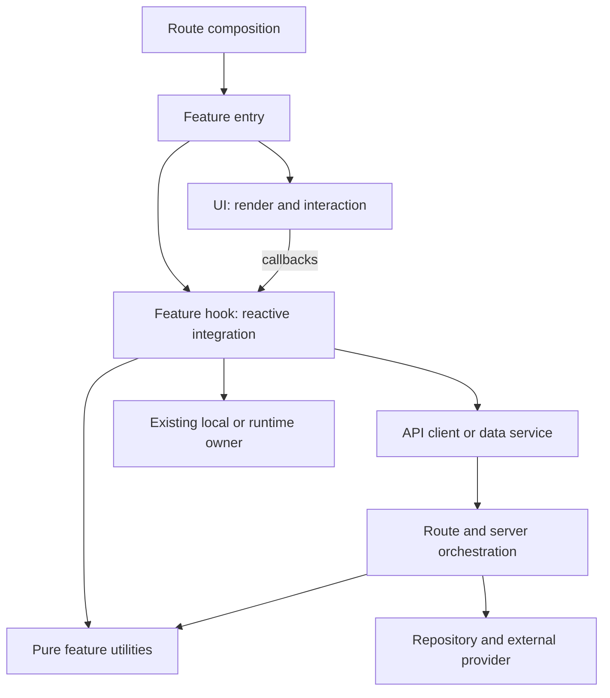

# Feature quality — audit và enhancement plan theo checkpoint

Ngày lập: 04/10/2026. Checkout: `main@474c69fc125c193adf7897c405cd0578a0888d4e`.

**Mục tiêu: bảo vệ tính đúng của feature, đặt logic và tests tại đúng owner, rồi cải thiện performance và khả năng mở rộng bằng số đo.** Hoàn thiện chất lượng của 32 nhóm feature trong [report hiện tại](/Users/hagenlee/Desktop/Person/chines-app/docs/audits/FEATURE_CODE_QUALITY_REPORT_2026-10-04.md), bao gồm F01–F11 và các khoảng trống architecture/performance được rà thêm dưới đây.

Trạng thái: **IMPLEMENTATION IN PROGRESS**. User đã yêu cầu triển khai tiếp tới khi hoàn tất. Checkpoint chỉ được đánh dấu hoàn thành khi acceptance và gates thực sự pass; publish chưa được yêu cầu.

## 1. Đánh giá kiến trúc và phạm vi

| Concern                     | Đánh giá hiện tại                                                                                     | Quyết định trong plan                                                                         |
| --------------------------- | ----------------------------------------------------------------------------------------------------- | --------------------------------------------------------------------------------------------- |
| Dependency/state ownership  | Nền tốt: route → feature → shared; Query/Form/Store có owner; generic Reader tách model/runtime/UI    | Giữ hướng dependency và owner; sửa theo từng surface có consumers thật                        |
| UI và business logic        | Chưa đồng đều: Translation, Notes, Dictation, Search còn transformations hoặc orchestration trong TSX | Pure business logic phải ở utilities; React integration ở hooks; I/O ở API/service/repository |
| Correctness của persistence | F01 và F02 có reproduction; F03–F07 có source/caller evidence                                         | Sửa trước optimization; test được failure ở đúng implementation                               |
| Rerender                    | Có selector isolation precedent, nhưng workspace lớn và broad context vẫn có đường invalidation rộng  | Lập trigger/subscriber map; đo commits rồi sửa owner/subscription/props                       |
| CPU, payload, memory, I/O   | Chưa có runtime baseline đủ dùng; source guard chỉ bắt vài boundary cụ thể                            | Đo riêng từng dimension; không suy ra nhanh/chậm từ số dòng hay số hooks                      |
| Test quality                | 1.298 tests pass ở lượt audit trước, nhưng vài tests Notes không chạy logic cần bảo vệ                | Test ở utils/API/hook/runtime thật; giữ ít integration tests chứng minh wiring                |
| Scale                       | Có bounded download, provider limits và normalized Reader; Notes list/tab retention cần audit         | Kiểm tra data volume, request fan-out, retained memory và concurrency riêng                   |
| Release proof               | E2E CI đang tắt, browser tests skip; corpus/assets CLI fail                                           | Mọi khoảng trống có checkpoint, môi trường và trạng thái; không đóng bằng build xanh          |

Precedents bắt buộc: [frontend structure](/Users/hagenlee/Desktop/Person/chines-app/docs/architecture/frontend-structure.md), [Reader cooker](/Users/hagenlee/Desktop/Person/chines-app/src/features/reader/model/cook-reader-data.ts), [Reader selectors](/Users/hagenlee/Desktop/Person/chines-app/src/features/reader/runtime/reader-context.ts), [selector isolation tests](/Users/hagenlee/Desktop/Person/chines-app/src/features/reader/runtime/reader-store.test.ts), [Notes utilities](/Users/hagenlee/Desktop/Person/chines-app/src/features/notes/note-library-utils.ts), [practice scoring](/Users/hagenlee/Desktop/Person/chines-app/src/features/hanzihome/practice/translation-practice.ts), [AI API client](/Users/hagenlee/Desktop/Person/chines-app/src/features/hanzihome/ai-conversation/services/ai-conversation-api.ts).

Kế thừa cách ghi checkpoints/evidence từ [Reader ownership plan](/Users/hagenlee/Desktop/Person/chines-app/docs/refactors/reader-reading-ownership.md) và [local-first plan](/Users/hagenlee/Desktop/Person/chines-app/docs/refactors/immediate-interaction-local-first.md). Các con số, checkbox và blocker lịch sử phải được reconcile với source hiện tại trước khi đưa vào backlog. Ví dụ blocker dependency audit cũ không còn là kết quả local hiện tại; full gate lượt audit ngày 04/10 đã pass. Các lời hứa offline cold boot hoặc SRS sync trong plan cũ cần proof riêng.

### Constraint ledger cho toàn chương trình

- Required: audit từng nhóm; giải quyết F01–F11; UI chỉ presentation/interaction; pure expected-input/output logic ở utilities; hooks/API có contract và tests riêng; đo performance và scale theo dimension; checkpoint có acceptance, scope, gates và rollback.
- Preserve: routes, auth/account isolation, stable IDs/source offsets, learner content, Study/Edit separation, normalized vocabulary, BYOK/task assignments, settings/progress/outbox owners và persisted formats hiện hữu.
- Scope: mỗi checkpoint chỉ sửa owners và consumers được chốt trước khi edit. Discovery ra file/contract khác phải cập nhật scope và nêu lý do trước khi mở rộng.
- Forbidden: blanket refactor, đổi dependency, global utils chứa domain logic, parallel store/cache/Reader engine, parser để chữa internal type mismatch, utility/hook forwarding-only, speculative abstraction hoặc bỏ checks để xanh.
- Type ledger: reuse generated/domain/schema/service/library contracts. Không thêm `any`, `unknown`, assertions, non-null assertions, suppressions, new unions hoặc weakened optional/null fields theo yêu cầu trực tiếp của user. Gặp external/library conflict phải mô tả exact types và structural decision trước workaround.
- New application files bên dưới là đề xuất có consumer cụ thể cho yêu cầu tách trách nhiệm. Chưa tạo trong lượt lập plan. Chỉ tạo khi implementation checkpoint xác nhận owner hiện hữu không có nơi phù hợp và scope đã chốt; không tạo skeleton folders.
- Verification: targeted trước, full gate cho shared/multi-surface/persistence/contract/release. Browser, provider, DB và remote CI là các mức proof độc lập.

## 2. Hợp đồng UI / utilities / hook / API

### 2.1. Trách nhiệm và nơi test

| Owner                           | Được làm                                                                                                                                    | Phải đưa khỏi owner này                                                                                            | Test đúng nơi                                                                                                                  |
| ------------------------------- | ------------------------------------------------------------------------------------------------------------------------------------------- | ------------------------------------------------------------------------------------------------------------------ | ------------------------------------------------------------------------------------------------------------------------------ |
| UI component                    | Semantic render, locale labels, class composition, disabled/loading/error display, focus/keyboard, transient open/reveal state              | Fetch/DB, cache invalidation, autosave/import orchestration, scoring, domain filtering/grouping/snapshot selection | Render và interaction contracts: callback đúng, disabled đúng, focus/reveal đúng                                               |
| Feature entry/workspace         | Compose hooks với UI và route props; gắn integration hiện hữu                                                                               | Tự giữ bản sao Query/Form state; chứa evaluator, request pipeline hay hàng trăm dòng business handlers             | Ít integration cases nối user event → owner → visible result                                                                   |
| Pure utilities                  | Chọn snapshot, filter/group/order, score, text segmentation, export payload/filename, retry hoặc timing policy dưới dạng input → output     | React, browser globals, fetch, Supabase, storage, mutable domain state hoặc timer scheduling                       | Unit tests trực tiếp utility, expected values độc lập với implementation                                                       |
| Hook                            | Query/mutation subscriptions, Form integration, owner-specific lifecycle, debounce/flush, cleanup, async order, invoke utility và I/O owner | Business algorithm viết lại; transport/schema logic đã có owner; subscription/global lifecycle trùng owner         | Actual hook callbacks/lifecycle, real Query client khi cần, fake timers/deferred requests, mounted fixtures cho effect/cleanup |
| API client/service              | Endpoint, method, headers, auth expectation, payload serialization, response validation/error semantics                                     | React/toast/navigation; sửa domain state của caller; biến error thành success/empty                                | Transport success, malformed response, auth/owner rejection, cancellation, status và error propagation                         |
| Server route/service/repository | Trusted identity, validation, role/parent constraints, canonical read/write, provider orchestration                                         | UI state, arbitrary client identity trust, duplicate business algorithms                                           | Route/service/repository contracts; DB constraints/RLS qua local integration riêng                                             |
| Local/runtime                   | Durable writes, generation/owner fencing, replay/locks, store selectors, imperative adapters                                                | UI labels; competing persisted/query owner                                                                         | Race, restart, quota, idempotency, stale acknowledgement, subscriber isolation                                                 |

“Utilities” là trách nhiệm hàm thuần, không phải một global folder. Dùng `utils/` hoặc file `*-utils.ts` feature-local khi đó là pattern gần nhất. Các pure modules đã đúng vai trò trong `model/`, `practice/`, `search/` vẫn là owner hợp lệ; không đổi tên hoặc dời chúng chỉ để đồng nhất suffix. Logic mới tách khỏi UI phải vào module thuần cùng domain và có test trực tiếp.

`Date.now()`, locale, selected IDs và thời điểm export được lấy tại owner có side effects rồi truyền làm input nếu thuật toán cần chúng. Download Blob/object URL, MediaRecorder, IndexedDB và request scheduling không được gọi là pure utils; lifecycle ở hook/integration, I/O ở owner hiện hữu.

Private memoization hiện hữu như search `WeakMap` không phải domain state owner. C08 phải chứng minh immutable-input/invalidation contract và bounded retention; không thêm global cache cho mỗi draft/query hoặc coi stale cached output là pure result hợp lệ.

Đây là responsibility map; mỗi feature dùng các tầng nó thực sự có. Notes hiện có client Supabase data service thì vẫn test service đó, không tự tạo route/API wrapper mới. Một hook không được biến thành bản sao 1.000 dòng của workspace; tách theo flow có lifecycle/consumers thật, không tách theo mỗi biến state.

### 2.2. Chính sách tests

1. Domain expectations chỉ assert ở utilities/model owner. Ví dụ score/reveal policy/order/export snapshot không phải dựng toàn UI để test thuật toán.
2. Hook tests phải chạy callbacks và state transitions thật. Không viết lại queryFn trong test; không lấy `typeof saveContent === 'function'` làm proof autosave.
3. API/service tests phải phân biệt data rỗng hợp lệ, missing schema, auth rejection và transient failure. Không assert lỗi đã bị mock nuốt rồi gọi đó là recovery proof.
4. Async/persistence dùng deferred responses và fake clock ở boundary: A/B order, failed A sau B, account change, unmount, retry, stale acknowledgement. Timers không thay thế server concurrency test.
5. Mounted hook/UI fixture cần cho effect cleanup, rerender, form wiring, keyboard và object URL/microphone lifecycle. Static markup không chạy các hành vi này.
6. Coverage chỉ có ý nghĩa cùng invariant matrix. Với owner được sửa, các branches liên quan requirement phải có deterministic proof; không đặt global percentage tùy ý để che missing workspaces.
7. Dùng Vitest và các fixtures/browser tests đã có. Nếu tooling hiện tại không chạy được một mức proof, ghi limitation trước khi quyết định thêm tooling; không mặc định cài testing library hoặc performance package.

## 3. Phân biệt tuyệt đối performance và rerender

Render là React gọi component để tính output. Commit là áp dụng thay đổi sau render; remount là lifecycle mới. CPU của utility, request latency, layout/paint và retained memory là các dimension khác. Console render count trong dev/StrictMode không phải số commit production.

| Thay đổi                                         | Ảnh hưởng owner rerender?                  | Dimension thực sự                           | Điều kiện nghiệm thu                                                                               |
| ------------------------------------------------ | ------------------------------------------ | ------------------------------------------- | -------------------------------------------------------------------------------------------------- |
| Tách logic ra utils                              | Không tự giảm                              | Testability, ownership, khả năng tối ưu CPU | Same input/output; unit proof, không tự claim nhanh hơn                                            |
| Tách logic ra custom hook gọi tại cùng component | Không tạo render boundary                  | Locality/lifecycle                          | Subscriber vẫn là component gọi hook; không gọi là rerender optimization                           |
| Tách UI child                                    | Không tự chặn render do parent             | Composition; có thể tạo boundary            | State/subscription đặt đúng child hoặc memo với props ổn định, có measured proof                   |
| `memo`                                           | Có thể bỏ parent-prop renders              | React render work                           | Props thực sự ổn định; own state/context/subscription vẫn cập nhật; comparator không stale closure |
| `useMemo`                                        | Không ngăn owner render                    | Cache calculation/reference                 | Computation thực sự đắt hoặc reference có consumer cần; dependencies đúng                          |
| `useCallback`                                    | Không ngăn owner render                    | Function identity                           | Có memoized child/subscription dependency cần ổn định; không bọc mọi callback                      |
| Narrow Store selector / Query `select`           | Có thể giảm subscriber updates             | Reactive invalidation                       | Selected output không đổi thì subscriber yên; loading/error fields cần UI vẫn được theo dõi        |
| Bỏ state-writing effect cho derived data         | Có thể bỏ render cascade                   | React + correctness                         | Derived value chỉ có một owner; effect chỉ giữ cho external synchronization                        |
| Skip no-op state update                          | Có thể giảm update                         | React/store notifications                   | Return same snapshot khi semantic value không đổi; không bỏ transition cần thiết                   |
| Debounce autosave/search I/O                     | Không bỏ input renders                     | Request count/write rate                    | Input phản hồi ngay; last intent không mất khi flush/navigation                                    |
| Ref thay state                                   | Không tự là giải pháp đúng                 | Imperative bookkeeping                      | Chỉ dùng cho giá trị không quyết định UI; không che dirty/error/status khỏi render                 |
| Deferred value / transition                      | Không bảo đảm giảm số render hoặc tổng CPU | Scheduling/responsiveness                   | Đo input latency và giữ current query/result semantics                                             |
| Dynamic import / lazy loading                    | Không giảm interaction renders             | Initial JS/parse/load                       | Network/bundle delta và loading/focus contract; không mặc định tắt SSR                             |
| Pagination / windowing                           | Không tự giảm trigger của owner            | Payload, DOM/CPU/memory                     | Giữ total/filter/selection/scroll/accessibility; không silently cắt dữ liệu                        |
| Narrow invalidation / batching reads             | Giảm fetch và có thể giảm query updates    | Network/DB/query churn                      | Đúng mọi affected consumer; stale data không bị che bởi cache                                      |
| Stable key                                       | Giảm remount khi identity ổn định          | Lifecycle/draft/resource retention          | Giữ intentional auth-owner remount trong QueryProvider; không dùng key để sửa state                |

React phân biệt props memoization với state/context updates; `useMemo` cache phép tính. Đối chiếu [React memo](https://react.dev/reference/react/memo), [useMemo](https://react.dev/reference/react/useMemo) và [derived data/effects](https://react.dev/learn/you-might-not-need-an-effect). Các khuyến nghị này được kiểm tra lại với local contracts, không dùng để ép codebase đổi pattern.

TanStack Query có tracked properties/structural sharing/`select`; top-level result identity không phải stable contract. Spread toàn query result có thể làm subscription theo dõi thêm fields. Đối chiếu [render optimizations](https://tanstack.com/query/latest/docs/framework/react/guides/render-optimizations) và installed `queryObserver.ts`, không tự đổi tất cả hooks.

## 4. Source evidence bổ sung và audit hotspots

Các R-items dưới đây là cơ chế/giả thuyết cần đo; mức độ chậm và lợi ích optimization chưa được xác nhận bằng browser profiling.

| ID  | Source hiện tại                                                                                                                                                                                                                                                                                                                                               | Cơ chế/rủi ro cần kiểm tra                                                                                         | Kết quả audit bắt buộc                                                                                                          |
| --- | ------------------------------------------------------------------------------------------------------------------------------------------------------------------------------------------------------------------------------------------------------------------------------------------------------------------------------------------------------------- | ------------------------------------------------------------------------------------------------------------------ | ------------------------------------------------------------------------------------------------------------------------------- |
| R01 | [TranslationWorkspace:95](/Users/hagenlee/Desktop/Person/chines-app/src/features/translation/TranslationWorkspace.tsx:95), [countdown:169](/Users/hagenlee/Desktop/Person/chines-app/src/features/translation/TranslationWorkspace.tsx:169), [recorder:173](/Users/hagenlee/Desktop/Person/chines-app/src/features/reading/hooks/useShadowingRecorder.ts:173) | Countdown ở workspace; recorder update object mỗi 500ms trong khi displayed duration làm tròn giây                 | Trace timer/recording commits; separate timer badge và stable lesson panels; no-op duration updates được kiểm tra               |
| R02 | [NoteEditorPanel:134](/Users/hagenlee/Desktop/Person/chines-app/src/features/notes/components/NoteEditorPanel.tsx:134), [NoteTabContainer](/Users/hagenlee/Desktop/Person/chines-app/src/features/notes/components/NoteTabContainer.tsx)                                                                                                                      | Mỗi panel đọc cả map split view; mọi tab đều mounted; hidden panel vẫn có query/effects/lifecycle                  | Toggle note B không notify split-view selector A; đo memory/query/editor count cho 1/5/20 tabs; giữ draft khi đổi tab           |
| R03 | [MandarinTtsProvider:68](/Users/hagenlee/Desktop/Person/chines-app/src/features/speech/MandarinTtsProvider.tsx:68), [useTTS](/Users/hagenlee/Desktop/Person/chines-app/src/hooks/useTTS.ts)                                                                                                                                                                   | Broad TTS context value đổi theo playback; Reader speech adapter đã có identity ổn định                            | Map consumers cần progress so với chỉ commands; không thay stable Reader speech service; đo fan-out                             |
| R04 | [useLearningState:216](/Users/hagenlee/Desktop/Person/chines-app/src/features/hanzihome/hooks/useLearningState.ts:216), [return object:481](/Users/hagenlee/Desktop/Person/chines-app/src/features/hanzihome/hooks/useLearningState.ts:481)                                                                                                                   | Hook đọc toàn state và owner sync snapshot; queryKey array/callback dependencies có thể đổi reference              | Đo settings-only consumer khi progress/sync đổi; giữ centralized sync agent, Query owner và durable writes                      |
| R05 | [ReaderDocumentStudy:120](/Users/hagenlee/Desktop/Person/chines-app/src/features/reading/workspaces/ReaderDocumentStudy.tsx:120), [services:133](/Users/hagenlee/Desktop/Person/chines-app/src/features/reading/workspaces/ReaderDocumentStudy.tsx:133)                                                                                                       | Inline display/service objects đưa vào contexts; speech riêng đã stable                                            | Đo context propagation; chỉ stabilize meaningful inputs; speech không bị restart khi display thay đổi                           |
| R06 | [AiConversationWorkspace:120](/Users/hagenlee/Desktop/Person/chines-app/src/features/hanzihome/ai-conversation/AiConversationWorkspace.tsx:120), [stream content:126](/Users/hagenlee/Desktop/Person/chines-app/src/features/hanzihome/ai-conversation/AiConversationWorkspace.tsx:126)                                                                       | Draft và stream state ở workspace; history/setup có thể cùng tham gia renders                                      | Trace typing/chunks; completed messages/history không commit vì stream-only update; stop/navigation giữ semantics               |
| R07 | [Dictation transforms](/Users/hagenlee/Desktop/Person/chines-app/src/features/dictation/StudioDictationWorkspace.tsx:46), [TTS transforms](/Users/hagenlee/Desktop/Person/chines-app/src/features/hanzihome/tts/TtsStudioWorkspace.tsx:61)                                                                                                                    | Book/transcript transformations trong UI; custom text có thể sinh pinyin theo mỗi edit; split text nhiều pass      | Utility tests + CPU timings/call counts trên text sizes; giữ pronunciation precedence và source identity                        |
| R08 | [Search UI:82](/Users/hagenlee/Desktop/Person/chines-app/src/features/hanzihome/search/GlobalSearchDialog.tsx:82), [search engine](/Users/hagenlee/Desktop/Person/chines-app/src/features/hanzihome/search/searchHanziHomeIndex.ts), [cache:33](/Users/hagenlee/Desktop/Person/chines-app/src/features/hanzihome/search/useHanziHomeSearchIndex.ts:33)        | UI counts/filter; full index scan rồi sort matches; idle prefetch và infinite gcTime là intentional retention      | Đo scan/rank CPU, payload/retention; giữ ranking/snippets/ties và category-after-limit behavior hiện hữu trừ quyết định product |
| R09 | [Business Chinese:523](/Users/hagenlee/Desktop/Person/chines-app/src/features/hanzihome/components/business-chinese/BusinessChineseStudyWorkspace.tsx:523)                                                                                                                                                                                                    | Pure visibility policy trong JSX file; large workspace có nhiều subcomponents nhưng size không chứng minh coupling | Tách policy khỏi UI vào pure owner; reveal/display/isolation tests; đo trước thay component boundaries                          |
| R10 | [Notes all-list:231](/Users/hagenlee/Desktop/Person/chines-app/src/services/notes/notes.service.ts:231), [bounded recent:250](/Users/hagenlee/Desktop/Person/chines-app/src/services/notes/notes.service.ts:250)                                                                                                                                              | All-list/category không client pagination; attach links bằng `.in` toàn bộ returned IDs; phụ thuộc server row cap  | Đo response/links/query shape và completeness ở large volume; paging proposal phải giữ filters/total và contract                |
| R11 | [performance guard](/Users/hagenlee/Desktop/Person/chines-app/scripts/check-hanzihome-performance.mjs)                                                                                                                                                                                                                                                        | Chỉ check vài source patterns của HanziHome; không đo rerender/CPU/network/Web Vitals                              | Giữ guard nhưng bổ sung executable evidence ở owner; không dùng guard pass làm performance benchmark                            |
| R12 | [useSmartSelectionInsights return](/Users/hagenlee/Desktop/Person/chines-app/src/hooks/useSmartSelectionInsights.ts:154)                                                                                                                                                                                                                                      | Spread query result vào public hook return; callback/mutation objects truyền qua consumer tree                     | Inventory fields/consumers, tracked-prop notification test; preserve existing call contracts                                    |

F01 được làm rõ bằng real TanStack mutation lifecycle với source options: bắt đầu request online → transport fail và navigator offline → mutation success, cache saved, không outbox. Transport/session/query hook vẫn mocked. Mutation pause khi bắt đầu offline và durable outbox là hai contract khác nhau.

## 5. Ma trận audit/enhancement cho đủ 32 nhóm feature

Mỗi hàng phải có flow/state matrix, owner map, test evidence và disposition performance. “Giữ + proof” vẫn là công việc cần hoàn tất, không phải sửa code cho đủ số lượng. Owner cụ thể và source links dùng E01–E26 trong report; checkpoint bên dưới chốt files trước edit.

| #   | Nhóm                                  | Audit và enhancement bắt buộc                                                                 | Test owner chính                            | Perf/scale focus                                     | Checkpoints                  |
| --- | ------------------------------------- | --------------------------------------------------------------------------------------------- | ------------------------------------------- | ---------------------------------------------------- | ---------------------------- |
| 01  | Auth/session                          | Guest/user/admin, redirect, owner switch, stale response, eviction; giữ Query client rotation | Auth route/utils + provider mounted fixture | Context churn; remount intentional                   | C00, C07, C13, C14           |
| 02  | Home                                  | Summary/recent reads; từng nguồn error/partial/retry; above-fold data                         | Home hook/services + summary utilities      | Bounded requests/payload; giữ recent limit           | C09, C10, C14                |
| 03  | Course library                        | Select/group/filter/navigation và stale/error/empty                                           | Catalog hook + grouping utils               | Summary request; không fetch detail mỗi card         | C08, C09, C10                |
| 04  | Study Mode                            | Representative/sparse payload theo renderer family; answer hidden; giữ Edit overlay           | Family utils/view-model + UI wiring         | DOM/analysis cost theo lesson size                   | C06, C08, C10, C12           |
| 05  | Edit Mode                             | Smallest-node save, dirty/cancel/validation, role/version/sibling isolation                   | Forms/hooks + direct-save + RPC route       | Narrow invalidation; không parent replace-all        | C09, C10, C13, C14           |
| 06  | Textbooks                             | Hán thương mại/Nhịp cầu/Đọc hiểu; route/resume/display/reveal policies                        | Textbook pure helpers + integration hook    | Context/section render, corpus payload               | C06, C07, C08, C10           |
| 07  | Aggregate vocab/grammar               | Canonical normalized resource, facets/group/order và detail/edit refresh                      | Aggregate utils/hooks/repository            | Aggregate paging/payload và filter CPU               | C08, C09, C10                |
| 08  | Flashcards/review                     | Deck change, reveal, shuffle identity, completion, retry/attempt ID                           | Session reducer/utils + outbox              | Card subscriber scope; attempt rate                  | C07, C10, C11                |
| 09  | Dictionary lookup/Inspector           | Word/sentence/context, duplicate AI request, close/reopen, auth/failure                       | Lookup utils/API/hooks                      | Request dedup/cancellation; query tracked fields     | C02, C07, C09, C10           |
| 10  | Saved dictionary/SRS                  | F01/F06; truthful pause/pending/save status, missing-schema vs other error                    | SRS API/hooks/query callbacks               | Write replay contract và collection paging           | C02, C09, C11                |
| 11  | Reader engine                         | Selection/copy/playback/display; source offsets và same/different document                    | Cooker/selectors/runtime + browser wiring   | Unrelated segment subscribers; text CPU              | C05, C07, C08, C14           |
| 12  | Reader progress/annotations/shadowing | Owner fencing, revision, reload/retry, mic lifecycle                                          | Progress hooks/local/runtime/API            | Write coalescing, recording timers, cleanup          | C05, C07, C11, C14           |
| 13  | PDF reader                            | F07; guest/auth expired, failed snapshot retained, drawing/undo/reload                        | PDF utils/API + save owner                  | Stroke/DOM/memory; serialize latest intent           | C05, C08, C11, C14           |
| 14  | HSK                                   | Corpus route/slug/order, Reader integration, progress/source parity                           | Corpus utils/adapter + hook                 | Route payload/large lesson; không duplicate engine   | C01, C08, C10, C14           |
| 15  | Humanities                            | Source/evaluation/poetry/history, partial metadata, attempt errors                            | Evaluator/API/hooks                         | Evaluator CPU và history read bound                  | C08, C09, C10                |
| 16  | Personal learning                     | Source/collection/progress riêng; reload/owner conflict                                       | Model/repository/state hook                 | Owner-scoped cache và collection reads               | C05, C09, C10, C11           |
| 17  | Daily Reading static/generated UI     | Selected article/module/reload; guest attempts; partial enrichment                            | Source-selection utilities + hooks          | Above-fold module loading và DOM                     | C06, C09, C10, C14           |
| 18  | Daily Reading source/enrichment       | Crawl/job retry/partial/cancel/status; runtime receipt                                        | Provider/server/workflow/schema             | Bounded prompts/retries/concurrency/cost             | C10, C13, C14                |
| 19  | Listening                             | Lesson/error/retry/transcript/reveal/hotkeys/audio                                            | Listening view-model + hooks/API            | Playback context fan-out; audio cache                | C06, C07, C10, C12           |
| 20  | Dictation                             | All source types, mode/reset/auto advance, comparison/attempt failure                         | Dictation utils/session/hook/API            | Custom text pinyin CPU; typing isolation             | C06, C07, C08, C10           |
| 21  | Translation/interpreting              | Direction/unit scoring, timing/recording/save/history failures                                | Practice/evaluator utils + flow hook/API    | Countdown/recording root renders                     | C06, C07, C08, C10           |
| 22  | Learning Loop                         | Due order, completion optimistic rollback, revision conflict                                  | Queue utilities/hooks/repository            | Queue bound/paging và item subscription              | C09, C10, C11, C14           |
| 23  | Notes                                 | F02–F05/F11; both panes, import/export/drafts/tab account lifecycle                           | Editor utilities + hook/service/local       | Tabs, split-map selector, all-list/links             | C01, C03, C04, C06, C07, C09 |
| 24  | Notebook                              | Search/group/section/filter identity và empty states                                          | Notebook filtering utils + wiring           | Static filtering/DOM; tránh copy state               | C08, C10, C12                |
| 25  | Memory tips                           | Submit/update/archive/retry/rollback/reload                                                   | Mutation hooks/API + form utils             | Optimistic invalidation scope                        | C09, C10, C14                |
| 26  | TTS Studio/library                    | Compose/segment/library writes/playback/download/URL cleanup                                  | TTS utilities/API/hook + speech adapter     | Context/segmentation/cache/audio memory              | C06, C07, C08, C09, C10      |
| 27  | AI conversation/memory                | Streaming/stop/retry/history/archive/runtime policy; session change                           | Pure output/filter + client/hook/server     | Chunk commits, stable messages, bounded context      | C06, C07, C09, C10, C13      |
| 28  | BYOK/task/prompt settings             | Key CRUD/toggle, missing assignment, override, prompt save/reset                              | Schema/client/hooks/server                  | Query invalidation; sensitive data isolation         | C09, C10, C13, C14           |
| 29  | Search/shell/locale/responsive        | Ranking/navigation/focus locks, stale query, keyboard/mobile chrome                           | Search utilities + bridge hook + UI         | R08/R12; Header/route subscribers                    | C06, C07, C08, C12, C14      |
| 30  | Radicals/writing                      | Derived selection/filter, writer lifecycle, edit permissions                                  | Filter utilities + writer hook/form/API     | External writer lazy load/dispose                    | C06, C08, C10, C12           |
| 31  | API docs/Data Quality/HTML artifacts  | Real vs demo receipts, admin gate, create/edit/preview/runtime/delete contracts               | Registry/runtime utilities + hooks/routes   | Heavy editor/preview load; bounded admin reads       | C06, C09, C10, C13, C14      |
| 32  | Offline pack/cache/sync               | Quota/restart/reconnect/eviction/generation/pinning, download cancel                          | Local storage/runtime/service               | Retention, bounded concurrency, pending queue growth | C07, C11, C13, C14           |

## 6. Master checkpoints và thứ tự thực hiện

Kích thước S/M/L là độ rộng scope để chia diff, không phải ETA. C00 phải có baseline theo dimension trước khi claim performance. Correctness lane C01–C05 được ưu tiên; structural work C06 và optimization C07–C09 đi sau owners đã được bảo vệ. C10 được chia theo feature rows, không triển khai cả bảng bằng một diff.

C00 có hai acceptance slices: **C00-A — source/owner/correctness baseline** và **C00-B — runtime measurements**. C01–C05 được bắt đầu sau C00-A đã verify dù C00-B còn chờ môi trường; C00 parent vẫn PARTIAL. Các performance changes C07–C09 chỉ claim kết quả cho dimension có C00-B baseline. Sự thiếu browser profiling không chặn sửa lỗi dữ liệu đã có deterministic reproduction.

| Status | ID  | Checkpoint                                                                              | Depends on                                 | Size            | Gate tier                                    |
| ------ | --- | --------------------------------------------------------------------------------------- | ------------------------------------------ | --------------- | -------------------------------------------- |
| [ ]    | C00 | Baseline, owner/consumer inventory, historical plan reconciliation và perf measurements | —                                          | M               | Audit/read-only + baseline evidence          |
| [x]    | C01 | Corpus/assets CLI và meaningful regression tests                                        | C00-A                                      | S/M             | Subsystem                                    |
| [ ]    | C02 | Dictionary/SRS save truth và query errors                                               | C01                                        | M               | Subsystem; Full nếu persistence contract đổi |
| [ ]    | C03 | Notes ordering, draft acknowledgement và failed write recovery                          | C01                                        | M               | Full cho persistence/concurrency owners      |
| [ ]    | C04 | Notes import/export và pane status                                                      | C03                                        | M               | Subsystem                                    |
| [ ]    | C05 | PDF write result và Reader persistence integration                                      | C01                                        | M               | Subsystem; Full nếu shared persistence đổi   |
| [ ]    | C06 | UI / utilities / hook / API separation theo từng surface                                | Correctness checkpoint của surface + C00-A | L, chia nhỏ     | Subsystem; Full cho shared moves/contracts   |
| [ ]    | C07 | Rerender và high-frequency subscription isolation                                       | C06 + C00 measurements                     | L, chia nhỏ     | Subsystem; Full cho shared provider/hooks    |
| [ ]    | C08 | CPU/text/search/data transformations                                                    | C06 + C00 measurements                     | M/L             | Subsystem + measured CPU                     |
| [ ]    | C09 | Query/transport/payload/pagination scalability                                          | C02/C03 + C00 measurements                 | L, chia domain  | Full cho shared/API contracts                |
| [ ]    | C10 | Close feature flow matrix cho đủ 32 nhóm                                                | Relevant correctness/structure owners      | L, chia feature | Tier của từng slice                          |
| [ ]    | C11 | Durable/offline/restart/multi-tab và memory/resource scale                              | C02/C03/C05 + relevant C07/C09             | L               | Full + browser/storage proof                 |
| [ ]    | C12 | Locale, UI semantics, responsive và accessibility                                       | Surface structure ổn định                  | M/L             | Subsystem + rendered interaction             |
| [ ]    | C13 | Server/DB/provider security và concurrency/scale audit                                  | C00-A + relevant data owners               | L               | Full; local/live proof tách biệt             |
| [ ]    | C14 | Executable coverage, browser fixtures và CI proof policy                                | Relevant C10/C11/C12/C13                   | L               | Full + required integration                  |
| [ ]    | C15 | Final diff, before/after metrics, report và release-readiness handoff                   | C01–C14 acceptance                         | M               | Full                                         |

Một checkpoint chỉ `[x]` khi acceptance của toàn scope đã pass trên source cuối. Partial source/tests/browser/CI được ghi riêng. Nếu một contract decision còn pending thì checkpoint liên quan vẫn mở; completed slices có thể ghi evidence mà không đóng parent.

## 7. Chi tiết thực thi từng checkpoint

### C00 — Freeze baseline và ownership map

- **Files/evidence:** report, architecture/state contracts, `package.json`, installed Next/TanStack docs/source, feature entries và direct consumers. Inventory tất cả TSX theo trách nhiệm, kể cả form/editor/shell, không chỉ 25 file lớn.
- **Audit:** với mỗi flow ghi route → query/hook → utility → service/repository → persisted owner; ai subscribe field nào, ai write, ai invalidate; lifecycle mount/unmount và error/empty/offline semantics. Chốt authoritative types trước đề xuất extraction.
- **Measurements:** theo protocol mục 9; R01–R12 phải có baseline hoặc exact limitation. Reconcile historical unchecked work: còn bug, đã sửa nhưng thiếu proof, đã verify, hoặc scope/contract riêng. Không copy checkbox cũ sang completed.
- **Acceptance:** 32 hàng có owner + consumers + states + test gaps + perf dimension + proposed scope; metrics có fixture/toolchain/mode/source identity; chưa đo không được ghi nhanh/chậm.
- **Gate/rollback:** read-only inventory và commands hiện hữu; doc updates revert độc lập. C00 chưa hoàn tất khi required runtime baseline còn thiếu.

### C01 — Khôi phục validation và tests có giá trị

- **Scope:** Studio inventory script, pronunciation import closure liên quan F09; `useNoteDetail.test.ts` và existing draft/export tests liên quan F11. Không viết lại corpus/asset data.
- **Actions:** trace Node strip-types module resolution từ entrypoint tới pure pronunciation owner. Chọn thay đổi nhỏ nhất làm CLI chạy với toolchain contract; không migrate toàn bộ aliases hoặc thêm runtime loader dependency. Tests Notes phải gọi query/mutation implementation thật, giữ real domain types.
- **Acceptance:** hai Studio check thực thi inventory/assets thay vì chỉ qua import; mọi discrepancy thật được báo. Hook hydration test chạy actual queryFn; save test thực hiện save và assert acknowledgement/rollback. Không tự update fixtures/counts để giấu mismatch.
- **Gates:** `npm run data:hanzihome:studio:check`; `npm run data:hanzihome:studio:assets:check`; targeted Notes/affected pronunciation tests; typecheck/source check nếu application import đổi. Toolchain/npm install parity ghi riêng.
- **Risk/rollback:** alias fix có thể ảnh hưởng client bundle hoặc source loading; audit import graph trước. Revert riêng CLI/import/tests, giữ application persistence untouched.

### C02 — Dictionary/SRS truth, errors và boundary

- **Scope:** `useVocabDetail`, `useSmartSelectionInsights`, dictionary view-model/collection và existing SRS route/service/tests. F01/F06; consumers được tìm trước đổi return contract.
- **Actions:** fake queued success phải được bỏ hoặc thay bằng durable enqueue thật sau D01. Minimal correctness slice: failure/pause được hiển thị trung thực, không mark saved khi chưa có acknowledgement. Missing-schema fallback chỉ cho contract đã xác định; các query khác propagate error thay vì empty/partial success.
- **Tests:** online-start → offline-failure; already-offline mutation pause; reload khi paused; auth/expected-owner rejection; personal note failure; retry success; failed primary/fallback/resource query; genuine empty. Dùng real MutationCache lifecycle cùng mocked transport cho ordering/status.
- **Acceptance:** không có synthetic queued acknowledgement; confirmed saved, in-memory pending và durable queued được phân biệt bằng hành vi hiện hữu hoặc D01 đã duyệt. Hai đường lưu có cùng truth/error policy. Library UI có error/retry đúng.
- **Perf classification:** đây là correctness/I/O contract, không phải rerender optimization. Dedup/invalidation tối ưu sau khi save truth đúng.
- **Gates/rollback:** targeted dictionary/hook/API tests, typecheck, source/UI checks; Full nếu persisted queue đổi. Revert save/error slice; không delete các pending intents để rollback.

### C03 — Notes autosave ordering và draft correctness

- **Scope:** `useNoteDetail`, content/reading mutations và metadata writes có liên quan note lifecycle; `note-draft-store`, `notes.service` contracts, editor callbacks cần flush. F02 và pane recovery gaps.
- **Design:** serialize writes trong cùng owner/note bằng cơ chế hiện hữu sau kiểm tra library contract; installed TanStack có `MutationScope`. Scope không serialize các tài khoản/note độc lập. Phải kiểm tra cả `onMutate`/rollback/acknowledgement, vì optimistic callbacks có thể chạy trước lúc request queued được dispatch.
- **Actions:** cache/optimistic snapshots dùng exact query result contract `Awaited<ReturnType<typeof getNoteById>>`, không dùng generic JSON để mô phỏng note shape. Last user intent giữ nguyên trong cache/draft khi request cũ fail hoặc ack; acknowledged snapshot mới được clear đúng pane/generation. Audit shared server `updated_at` so với pane-local draft timestamps, metadata update và query refetch; title save không được làm mất draft reading chưa được ack.
- **Tests:** A rồi B; A pending, B optimistic; A fail sau B intent; delayed old ack; reading/content interleaving; metadata save khi pane dirty; close/reopen; account/note switch; unmount flush; local persistence failure. Assert final server/cache/draft snapshots và number/order of writes.
- **Acceptance:** trong scope single-client, server không nhận stale content sau newer content; old rollback/ack không xóa latest intent; status phản ánh actual pending/failed/durable state. Multi-tab/server conflict chỉ được claim nếu D02 + integration proof hoàn tất.
- **Gates/rollback:** targeted hook/local/service tests rồi Full gate vì persistence/concurrency owner đổi. Revert owner logic với pending drafts giữ lại; không destructive storage cleanup. Schema/CAS nếu cần thuộc D02 riêng.

### C04 — Notes import/export và trạng thái từng pane

- **Scope:** `NoteEditorPanel`, note export schema/utility owner, hook mutation results, metadata hook và direct editor consumers. F03–F05.
- **Actions:** export nhận current authoritative editor snapshot, kể cả draft trước debounce và reading content đang save; imported snapshot không được tiếp tục override edits. Import phối hợp pending autosave, await required writes/metadata, giữ error/partial result đúng. Không tự claim atomic import nếu backend chưa có transaction contract.
- **Tests:** import A → edit B → export B; edit → export trước debounce; reading-only update; metadata/folder failure; delayed autosave trước import; failed content/reading write; reimport/reset giữ editor instance semantics. Parse export lại bằng schema hiện hữu để kiểm tra round trip.
- **Acceptance:** exported body là latest intended body; toast success chỉ sau required successful writes; partial failure không báo hoàn tất; dirty/pending/error của pane trái không bị badge pane phải che. Không thay format V1/V2.
- **Architecture:** pure filename/payload/snapshot choice ở utility; download/object URL và file reading ở hook/integration; schema input validation giữ ở owning boundary.
- **Gates/rollback:** targeted utility/schema/hook tests + UI wiring; typecheck/UI/source; mounted import/editor proof. Revert cùng utilities/hook/UI consumers; giữ existing export format và drafts.

### C05 — PDF write result và Reader persistence proof

- **Scope:** `pdf-annotation-api`, `PdfReaderWorkspace`, reader annotation/progress hooks/local/services và direct Reader consumers. F07; generic engine giữ nguyên nếu không có failure tại engine.
- **Actions:** PUT 401 là failed write, không phải GET guest-empty. Giữ unsaved snapshot khi transient failure; terminal auth/owner failure không auto retry vô hạn. Explicit retry dùng current owner và current intent; không để old response ghi sang instance mới.
- **Tests:** GET guest, PUT 401/403/owner conflict, network fail/retry, A/B coalescing/order, unmount/document switch, undo/redo while saving; progress conflict/explicit completion; annotation replay và reload. Stroke serialization/coordinates ở pure utils.
- **Acceptance:** user thấy unsaved/blocked khi server không ack; failure không drop latest pending changes; Reader source IDs/offsets/selection giữ đúng. PDF offline durability chưa được claim nếu D03 chưa có storage contract/proof.
- **Gates/rollback:** PDF API/utils và Reader local/runtime targeted tests; typecheck; rendered drawing/save/reload proof. Full nếu shared save/persistence owner đổi. Revert write-handling slice; không xóa local annotations hoặc reset revisions.

### C06 — Tách trách nhiệm để code sạch và test đúng owner

- **Priority order:** Notes sau C03/C04 → Translation → Dictation → Search → Business Chinese → AI/TTS → các feature rows còn lại. Trước mỗi slice đọc complete implementation, nearest precedent, direct consumers và types; record fixed scope.
- **Actions:** chuyển pure business transformations khỏi TSX, reuse pure modules đã có; hooks giữ lifecycle/cache/async integration; API/service giữ transport/validation; UI nhận view data và callbacks. Modal/reveal/focus state vẫn là UI interaction responsibility. Không chuyển nguyên workspace vào một mega hook.
- **Proposed placement:** bảng dưới là filenames dự kiến, không phải file đã có. Ưu tiên existing owner nếu chức năng đúng domain, không nhét unrelated logic vào utility để tránh tạo file.

| Surface      | Existing pure owner/type authority                                                                                                  | Extraction có current consumer cụ thể                                                                                                 | React/I/O owner                                                                      |
| ------------ | ----------------------------------------------------------------------------------------------------------------------------------- | ------------------------------------------------------------------------------------------------------------------------------------- | ------------------------------------------------------------------------------------ |
| Notes editor | `note-export.schema.ts`, `note-library-utils.ts`, `NoteDetail`, `NoteExportPayload`, `DbNote`                                       | Nếu existing owners không phù hợp: feature-local `note-editor-utils.ts` cho export snapshot/filename/payload; editor/export hook dùng | Existing detail/library hooks; editor flow hook cho debounce/import/download nếu cần |
| Translation  | `translation-practice.ts`, `humanities-evaluator.ts`, `TranslationSegment`, `HumanitiesPracticeTrack`, `HumanitiesDocumentResource` | Feature-local `translation-workspace-utils.ts` cho track/document/module policy; Translation workspace flow dùng                      | Feature hook cho timing/recording/submission/history; API hiện hữu                   |
| Dictation    | `dictation-session.ts`, `listening.view-model.ts`, `ListeningTranscriptEntry`, `HanziHomeLesson`, `ReaderDocumentResource`          | Bổ sung pure source/book/transcript selection ở owner phù hợp; `dictation-workspace-utils.ts` nếu khác session scoring                | Flow hook cho source lifecycle/hotkeys/playback/write; current panels giữ UI         |
| Search       | `searchHanziHomeIndex.ts`, `types.ts`, `HanziHomeSearchCategory`, `HanziHomeSearchResult`                                           | Extend search pure owner cho category counts/filter/navigation candidates; dialog/bridge consume                                      | Existing index hook và global bridge; không tạo search state owner mới               |
| Textbooks    | `business-chinese.adapter.ts`, `translation-practice.ts`, `TextbookLesson`, `LessonDisplayMode`                                     | Table column/answer visibility policy vào feature-local textbook utility nếu adapter scope không phù hợp                              | Existing Reader integration/context; table giữ local reveal/render                   |
| AI/TTS       | AI output/stream-filter model; TTS `splitTtsStudioText` và existing schemas/types                                                   | Reuse pure modules cho chunks/output/segmentation; không duplicate schemas trong UI                                                   | Feature flow hook và current API clients/server/services; stable speech adapter      |

- **Acceptance:** UI không import fetch/DB service hoặc implement domain algorithms; feature entries chỉ compose. Utility không import React/browser I/O; input/output có authoritative types và current consumers; no forwarding-only wrapper/barrel. Same behavior/source identities, tests tại owning module.
- **Code cleanliness:** remove chỉ symbols/imports không còn dùng do extraction; không sửa unrelated names/styles. Không test private details qua source-string snapshots thay cho behavior. Existing unsafe type constructs không được copy/propagate sang code mới; conflict được giải quyết tại owner.
- **Gates/rollback:** utility tests + hook/API consumers + typecheck/source/UI; Full khi nhiều surfaces/shared owner move. Một slice có atomic consumer migration và revert rõ; không gộp cosmetic formatting với logic moves.

### C07 — Rerender isolation có proof

- **Scope theo hypothesis:** R01–R06/R12; Notes split map và tabs, Translation timers/recorder, TTS context, learning-state readers, Reader integration props, AI streaming, shell/query consumers.
- **Actions order:** no-op writes → narrow selectors/query fields → đặt subscription tại smallest UI consumer → ổn định meaningful props → memo leaf đo thấy đắt. Hook extraction ở cùng fiber chưa đạt yêu cầu này. Giữ one persisted owner và stable Reader speech commands.
- **Tests:** unrelated store field update không notify selected output; note B toggle không notify selector A; recorder unchanged displayed second không tạo state snapshot mới; progress tick không recook document; stream chunk không update completed message subscriber. Sau đó mounted UI/Profiler để chứng minh commits đúng component.
- **Acceptance:** trigger/subscriber map trước/sau; invariant “unrelated update không notify leaf subscription” có deterministic proof. Commit reduction ở mounted scenario có trace; no stale closure, dropped status/error, selection hoặc audio restart. Auth owner switch vẫn remount intentional.
- **Measurement:** hook/store tests chỉ chứng minh notification/state semantics, không thay React commit trace. `memo` không chặn own state/context; inline object không tự được kết luận là bottleneck.
- **Gates/rollback:** targeted store/hook/runtime/interaction; typecheck/UI/source; Full cho provider/shared hooks. Revert từng optimization nếu trace không cải thiện hoặc complexity tăng; giữ correctness fixes tách riêng.

### C08 — CPU và thuật toán text/search

- **Scope:** R07–R09; pronunciation/cooker/view models/evaluators, search ranking, textbook policies, aggregate/Notebook filtering. Không thay linguistic truth, score rules hoặc sorting semantics để chạy nhanh hơn.
- **Actions:** utility extraction trước; measure recomputation/cost; reuse existing analysis/cached normalization; giảm repeated scans hoặc repeated parsing ở owner. Cache key phải bao gồm actual pronunciation/source/policy inputs; không tạo unbounded cache cho mỗi keystroke.
- **Tests/fixtures:** real representative lessons + synthetic volume 1×/5×/10×; Chinese Unicode/punctuation/polyphonic source cases; stable order/snippets/ties; sparse inputs; same result khi flags/locale/source thay đổi. Expected results không lấy từ chính tokenizer/evaluator đang test.
- **Acceptance:** output parity; CPU/call-count evidence ở measured hotspot; no-op UI change không regenerate contextual analysis. Phân biệt utility vẫn chạy mỗi render với memoized computation thực sự reused. Deferred scheduling giữ responsiveness nhưng không tự được coi là lower CPU.
- **Gates/rollback:** affected utility/pronunciation/search tests, typecheck/source; real corpus validation nếu source/corpus imports ảnh hưởng. Revert algorithm/cache slice độc lập; no content rewriting hoặc offsets normalization.

### C09 — Data loading, API/hooks và query scalability

- **Scope:** catalog/aggregate, Notes list/folders/links/detail, dictionary collection, search index, TTS library, practice/history và settings; owning query keys/services/routes.
- **Actions:** audit request waterfalls/fan-out và bounds; summary/detail separation; extract inline transport từ UI/hook sang domain API owner khi có direct consumers. Keep boundary validation once; Query owns remote cache. TTS folders/clips local arrays trong workspace phải được audit về canonical owner/invalidation trước migrate.
- **Paging decision:** Notes/collections cần D04 nếu volume proof cho thấy server cap/payload vấn đề. Không thêm `.limit` rồi làm mất records/filter results; page/cursor/sort/total contract được review trước. Query key bao gồm input làm đổi data; user identity hoặc Query-client isolation phải có evidence.
- **Tests:** first load, cache hit, stale refetch, cancellation, zero records, source failure, partial data, write → smallest correct invalidation, account switch; explicit request-count/payload bounds theo route. Hai consumers cùng nguồn không tạo independent editable copies.
- **Acceptance:** load only data needed by surface; no per-card detail fetch/N+1; errors không thành empty; paging complete/deterministic; không globally tăng staleTime để che missing invalidation. Sensitive user payload không nằm shared public cache.
- **Gates/rollback:** client/service/query/route tests + source/performance/API checks; Full cho API/query contract changes. Revert whole caller/owner slice; retain public endpoint aliases có consumers chưa được prove unreachable.

### C10 — Hoàn thiện feature flow matrix

- **Scope:** lần lượt 32 hàng mục 5; bắt đầu rows 02–08 rồi 14–28, cuối cùng auxiliary/admin flows. Một hàng có thể reuse C02–C09 proof, nhưng phải kiểm tra feature wiring hiện tại.
- **Required states:** loading, real empty, error/retry, stale/partial, disabled/permission, success; guest/user/admin nếu có; source change, close/reopen, URL history, save failure và reload khi feature có persistence. Không invent empty/error states impossible theo contract.
- **Enhancement:** sửa actual observed gaps trong flow, đưa duplicated domain expectations về pure owner đúng. Giữ deliberate khác biệt Notes/Notebook/mastery/SRS/Learning Loop/attempt evidence.
- **Acceptance per row:** complete owner/data flow + scenarios + files + tests/results + rendered evidence cần thiết + limits/rollback; performance disposition “no actionable bottleneck measured” hợp lệ nếu có measurement. Chưa có proof thì row chưa done.
- **Gates/rollback:** chọn tier theo change của row; targeted utility/API/hook và ít integration cases. Revert từng feature slice; không dồn 32 nhóm thành một repository-wide refactor.

### C11 — Durability, restart, multi-tab và resource lifecycle

- **Scope:** existing learning-state/review/annotation/content-cache/offline-pack owners, Notes drafts/tabs, PDF pending strokes, SRS D01 và cold-boot D05.
- **Audit:** một lần click → in-memory intent → durable commit → remote ack → cleanup. Test failure từng seam; reload/restart offline, lost auth/account switch, second tab, quota/lock, cache generation/eviction/pinning, cancel download. Pending writes không được evict chỉ để đạt memory budget.
- **Resource scale:** Notes tabs 1/5/20; repeated route/modal/recording sessions; audio Blob/URLs/listeners/timers/streams; warmed index/query retention; queue depth/drain time. Đo retained resources sau close/unmount, không chỉ heap trước/giữa.
- **Acceptance:** user không được thấy durable/saved khi chỉ có memory; stale owner/ack không write/clear khác user; queued operation giữ identity/idempotency; all required resources dispose. Intentional mounted tabs được giữ hoặc có reviewed draft-safe unmount strategy.
- **Gates/rollback:** deterministic local/race/service tests + storage/browser reload proof + Full gate. Cold boot và new queues cần D decisions; partial completion ghi riêng. Rollback giữ storage compatibility/pending evidence, không replace-all persistence.

### C12 — Locale, UI semantics và accessibility

- **Scope:** F10 và surfaces đã tách responsibilities; shared primitives, shell/search, Notes controls, listening/TTS/radicals, responsive reading/editor/forms.
- **Actions:** interface copy vào existing locale owners; learner Hanzi/Pinyin/translation giữ feature typography và content language. UI primitives không biết domain data. Kiểm tra focus return, keyboard shortcuts tránh input, nested overlays, labels/disabled, scroll owner và touch targets.
- **Acceptance:** vi/en/zh-CN rendered chrome đúng; 1440×900, 820×1180, 412×915 interaction proof; hidden answers/focus lock giữ semantics. Không arbitrary margin fixes, global theme/token changes hoặc redesign theo sở thích.
- **Gates/rollback:** message/schema parity, UI/source, affected primitive/component tests và in-app render/interact. Touch/microphone thật cần manual evidence riêng. Revert locale/surface slice; no business logic đưa lại vào JSX.

### C13 — Server/DB/provider architecture và scalability

- **Scope:** read/write routes và domain services/repositories theo 32 rows; auth/RLS/generated contract, AI/TTS provider/workflows, static content boundaries. Read-only DB plan trước bất kỳ schema/live action nào.
- **Audit:** trusted identity/role/parent IDs, expected owner/revision, sensitive cache headers, payload limits, repeated provider requests, cancel/timeout/429/backoff, retry nesting, idempotency/job ownership; zero-affected-row writes không mặc định được xem đã persist.
- **DB scale:** query projection/filters/order, fan-out/round trips, row caps/page completeness; inspect local migration indexes/constraints trước. `EXPLAIN`/load test chỉ trên local/isolated fixtures được xác nhận; không benchmark hoặc probe live DB tự động trong audit.
- **Acceptance:** data-volume/concurrency capacity được gắn tested fixture và failure budget; bounded AI context/prompt/output/retries được giữ; secret/raw key không xuất hiện receipt/log/client; mocks không chứng minh provider/RLS live.
- **Gates/rollback:** route/service/repository/security/workflow tests + Full; generated types drift và local RLS integration nếu môi trường cho phép. Schema/index/RLS/provider/model migration cần D06/D07 riêng. Revert code độc lập, DB rollback phải review data impact trước apply.

### C14 — Coverage, browser integration và CI evidence

- **Scope:** `docs/testing/frontend-flow-coverage.md`, existing tests/fixtures, Vitest coverage config và CI E2E policy F08. Không dùng count tests làm DoD.
- **Actions:** row/invariant matrix chỉ rõ utils/API/hook/runtime/UI ownership. Đo owners vắng coverage hiện tại; cân nhắc include phạm vi `src` để thấy denominator rõ sau khi đánh giá runtime cost, không đặt threshold tùy ý hoặc exclusion để xanh. Tests phải fail nếu invariant bị phá.
- **Browser:** ưu tiên in-app browser; external Playwright chỉ khi user cho phép. Trước `e2e:seed` xác nhận isolated database/account target và mutation impact. Environment thiếu thì checkpoint ghi BLOCKED/NOT RUN cụ thể, không đổi `runIf` cho xanh.
- **CI:** policy phải nói rõ flows nào chạy mandatory và flows nào cần secret/mic/manual; nếu bật lại E2E, chốt fixture isolation/secrets/run lifecycle trước. Local pass không phải remote CI; chỉ đối chiếu matching SHA khi có authorized publication.
- **Acceptance:** C10 rows có executable proof thích hợp; core auth/saving/reload/revision/offline/user switch có integration; CI skip được xử lý hoặc vẫn là unresolved gate, không gọi full release verified.
- **Gates/rollback:** targeted → coverage → Full → required browser/local DB; remote CI riêng. Revert fixture/config policy cùng execution instructions; không weaken assertions/skips/source gate.

### C15 — Final audit và handoff

- **Scope:** complete program diff, all feature/evidence ledgers và report. Không tự commit/push/merge/deploy.
- **Acceptance:** F01–F11 có disposition và proof; 32 rows có acceptance; R01–R12 có before/after hoặc no-change decision dựa measurement; D decisions đã giải quyết cho required scope. Required browser/DB/perf gates chưa chạy thì remaining checkpoint không closed.
- **Clean code audit:** every changed line necessary; no unused export/temp controller/debug/comments/TODO/forwarding wrapper; exact types; one owner; current consumers migrate atomic; same routes/formats/language/IDs; no unrelated user edits touched.
- **Gates:** `npm run check`, `npm run test:coverage`, hai Studio checks, `git diff --check`; required integration/perf fixtures với final source. Record pass/fail/not-run riêng. CI/deploy/SHA remote chỉ được thêm khi đã thực hiện trong scope được phép.
- **Output:** report updated gồm changed owners/files, behavior, actual commands/results, metrics/toolchain/fixtures, remaining risks, contract decisions và rollback. Không báo “scales to N users” từ synthetic local benchmark hoặc mock latency.
- **Rollback:** code slices tách correctness/structure/perf để revert có mục tiêu; persisted/DB migration có riêng compatibility/data recovery plan trước rollout.

## 8. Contract decisions phải được giải quyết bằng evidence

Đây là decision backlog cho implementation, không phải yêu cầu user xác nhận tất cả trong lượt lập plan. Chuẩn bị concrete diff/contract/consumers/verification trước khi hỏi decision cần thiết. Reversible choices có source precedent được giải quyết tại checkpoint; không hỏi lại authorization đã được cấp.

| ID  | Vấn đề và evidence                                                                                 | Slice tối thiểu giữ contract                                                         | Enhancement rộng hơn cần review                                                                                                      | Decision / rollback                                                                                                                                                           |
| --- | -------------------------------------------------------------------------------------------------- | ------------------------------------------------------------------------------------ | ------------------------------------------------------------------------------------------------------------------------------------ | ----------------------------------------------------------------------------------------------------------------------------------------------------------------------------- |
| D01 | F01; chưa có durable SRS enqueue ở hai paths                                                       | Truthful failure/pause; chỉ server ack mới saved                                     | Typed SRS outbox: operation identity, expected owner, canonical payload, retry/idempotency, durable ack, personal-note conflicts     | Chốt offline promise; inventory existing local DB/outbox types trước đề xuất queue. Persisted change không tự ghép vào generic mutations. Rollback giữ pending intents/format |
| D02 | F02; server write không expected version; draft timestamp theo pane nhưng server timestamp cả note | Single-client order/rollback/ack correctness trong existing owners                   | Multi-tab/device compare-and-set/conflict resolution; kiểm tra `updated_at` hiện hữu có đủ contract trước đề xuất version/RPC/schema | Chốt conflict policy và caller/type impact; không tự LWW mất dữ liệu. Revert code phải tương thích server/data version                                                        |
| D03 | F07; PDF write failure và React-only pending strokes                                               | Show failed write, retain pending snapshot, explicit retry/current owner             | Durable PDF pending writes/reload/offline recovery                                                                                   | Chốt payload identity/revision/cleanup; không reuse textual annotation type bằng coercion. Rollback không xóa strokes                                                         |
| D04 | R10; Notes all-list và other collections cần completeness/volume proof                             | Preserve summary projections và bounded dashboard; measure full-list                 | Cursor/page contract, query keys, server order, total/filter/search và UI selection                                                  | Đủ caller map và DB query evidence trước contract change; không silently truncate. Revert API/hook/UI cùng nhau                                                               |
| D05 | Historical local-first plan có cold-boot scope chưa được proof                                     | Warm in-app offline behavior với existing snapshots, safe neutral launcher           | Fully offline application boot với authenticated private content protection                                                          | Trace `sw.js` hiện tại và cache privacy; không cache private HTML/RSC để qua acceptance. C11 giữ cold-boot row unresolved tới verified                                        |
| D06 | DB/RLS/index/auth/live drift hoặc zero-row writes được audit tại C13                               | Read-only migrations/query/types và local fixtures                                   | Actual migration/RLS/index/auth/production-data mutation                                                                             | Exact target, affected data/types, preview, rollback, verification trước approval theo risk policy                                                                            |
| D07 | npm parity, tooling gaps, provider benchmark, CI fixtures                                          | Use installed tooling; report missing proof; giữ current BYOK/task assignments       | Dependency/toolchain install/change, external browser, live paid provider runs, model/routing defaults                               | No automatic dependency/model migration; cụ thể tool/cost/target/required access. Keep notification/secrets and sensitive receipts out of docs                                |
| D08 | New hook/utility/component hoặc shared contract được đề xuất trong C06/C07                         | Existing owner first; feature-local extraction có real current use theo yêu cầu user | New global layer/store/schema, breaking public exports hoặc repository-wide migration                                                | Chốt consumers/types/lifecycle và before/after map; không creates abstractions cho future reuse. Revert owner + all migrated consumers                                        |

Không đóng các rows “offline SRS”, “multi-client Notes”, “PDF durable reload”, “pagination” hoặc “cold boot” chỉ vì minimal slice đã sửa thông báo lỗi. Nếu product scope chọn defer enhancement rộng, report phải ghi rõ limited behavior còn lại và decision của user; không tự chuyển required work thành optional.

## 9. Performance/scale measurement protocol

### 9.1. Scenarios, fixtures và metrics

| Scenario                            | Data scale / stress proposal                                                               | Metrics phải ghi                                                                            | Expected invariant                                                                                   |
| ----------------------------------- | ------------------------------------------------------------------------------------------ | ------------------------------------------------------------------------------------------- | ---------------------------------------------------------------------------------------------------- |
| Cold/warm library → selected lesson | Real representative/sparse/large lesson; 1×/5×/10× summary inventory                       | Requests/round trips, compressed payload/JS, load/render timings, DOM count                 | Summary cards không fetch detail; chỉ selected lesson detail                                         |
| Reader text/playback/display        | Real textbook + valid synthetic 50/500/2.000 segments                                      | Cooker/analysis calls + CPU, subscriber notifications, component commits, paint/scroll      | Tick không recook whole document; source IDs/offsets ổn định                                         |
| Notes edit/save/tabs/import/export  | Valid fixture 100/1.000/10.000 notes; 1/5/20 tabs; short/long body                         | Input feedback, save order/rate, list+links payload, editor/query count, retained resources | Latest intent được lưu/export; hidden tabs không mất drafts; completeness không phụ thuộc truncation |
| Search typing/navigation            | Real index + valid 1.000/10.000/50.000 items                                               | Scan/rank CPU, query latency, list commits, payload/retention                               | Same ranking/snippets/ties; input không bị heavy result render chặn                                  |
| Translation/dictation/TTS           | 1.000/10.000/50.000 chars cho pure utilities; API chỉ nhận valid bounded inputs            | Segmentation/pinyin/evaluator CPU/calls, timer/context commits, audio request/cache ratio   | CPU test không bypass API prompt limits; timer chỉ cập nhật consumer cần thiết                       |
| AI streaming                        | Controlled chunk stream + real schema-valid history sizes                                  | Chunks/commits, input responsiveness, retained messages, abort cleanup                      | Completed messages stable; stop/switch không persist turn sai owner                                  |
| PDF strokes/draw/save               | Valid fixture 1.000/5.000/20.000 points hoặc strokes theo actual schema                    | Draw/serialize CPU, snapshot bytes, save count, memory after close                          | Coordinate/revision/undo semantics giữ nguyên; latest pending retained khi lỗi                       |
| Offline/reconnect/download          | Real allowed fixtures; increasing pending queue; 1/5/10 concurrent local simulated actions | Durable commit/drain duration, retries, duplicate attempts, retained queues/cache           | Bounded concurrency; no dropped pending operation; owner/generation fence                            |
| Server/DB/provider                  | Controlled isolated/local fixtures, batch sizes và concurrency tăng có giới hạn            | Query counts/plans, request p50/p95, failures, provider retry/token/context bounds          | Không suy ra production capacity từ mocked requests; no live load test tự động                       |

Các numbers là workload proposal, chưa là production usage hoặc benchmark đã chạy. Fixture phải hợp actual schemas và source IDs; annotate synthetic vs real. Nếu actual contract giới hạn volume thấp hơn thì test acceptance/rejection tại limit, không nới schema để benchmark.

### 9.2. Quy trình trước/sau

1. Record source SHA + working-tree diff, Node/npm/dependency versions, browser/device/viewport, mode, CPU/network controls, fixture size và cold/warm cache. No source change giữa measurements cùng comparison.
2. Chạy scenario lặp lại: tối thiểu 5 repetitions cho cold/warm flow, 30 samples sau warm-up cho pure utility/request latency nếu báo percentile. Ghi sample count/range/noise; small sample không gọi p95 đáng tin cho production.
3. Profile React notification/render/commit; record component name và trigger. StrictMode/dev traces dùng để tìm causes, production interaction timings dùng để đánh giá user cost. Không trộn hai mode vào một before/after number.
4. [React Profiler](https://react.dev/reference/react/Profiler) mặc định bị disable trong production build thường. Nếu cần production React timing, xác minh supported profiling build trước; không claim callback có số đo chỉ từ `npm run build`. Không giữ debug/profiling instrumentation trong production diff nếu chưa có scope riêng.
5. Dùng tooling đã có và in-app browser khi khả dụng; `npm run build` / `npm run start -- -p 3001` là proposed production flow, chưa chạy trong lượt lập plan. Nếu browser surface không cung cấp performance trace, ghi manual/profiling requirement; không fabricate metrics hoặc cài package thay thế tự động.
6. Chỉ retain optimization khi đúng invariant và meaningful measured benefit. Nếu delta nhỏ hơn noise, ghi no demonstrated improvement; utility extraction vẫn có thể được giữ vì clear ownership/testability đã yêu cầu, nhưng không quảng bá performance gain.
7. Memory: open/play/record/close lặp nhiều vòng, đo retained instances/listeners/URLs/streams/queued writes. Warm cache hoặc mounted tabs có retention intentional; không gọi mọi retained allocation là leak. GC timing và baseline cache size phải ghi rõ.

### 9.3. Budgets và tiêu chí scale

- **Reactive invariant:** update unrelated field không notify selected leaf; mounted component commit proof riêng. Các feature cùng dùng shared preference phải rerender khi preference thực sự ảnh hưởng UI.
- **Computation invariant:** playback tick/metadata-only change không recook unchanged document hoặc re-evaluate unchanged answer; stable inputs reuse expensive output theo owner contract. No blanket “zero render” target.
- **I/O invariant:** cards dùng shared summaries; mutation chỉ invalidate affected queries; download/provider retry/concurrency có bound; không multiply retries qua nhiều layers. Query-disabled/open-hidden cases không phát request ngoài contract.
- **Correctness under scale:** no silent truncation, stale overwrite, lost pending operation, duplicate attempt identity, unsafe cache sharing hoặc dropped error khi fixture/concurrency tăng.
- **User-facing target proposal:** LCP ≤ 2,5s, INP ≤ 200ms, CLS ≤ 0,1 ở p75 mobile/desktop theo [Core Web Vitals](https://web.dev/articles/vitals). Đây là mục tiêu field, chưa measured và không được thay bằng render count/unit timings; local trace chỉ là lab evidence.
- **Internal budgets:** C00 chốt absolute CPU/payload/request/memory budgets từ real flows và tested devices. Khi baseline đã vượt target, checkpoint phải có improvement/remediation scope cụ thể; không đổi target để pass. Chưa có baseline thì không hứa giảm 30–50% hoặc capacity N users.
- **Architecture scale:** thêm source/renderer/module trong phạm vi contract hiện hữu phải sửa đúng owner/registration hiện hữu, không fork Reader, duplicate data/cache hoặc mở chain pass-through modules. Audit một current change scenario để xác nhận locality; không triển khai hypothetical new feature để test architecture.

Installed Next docs đã đọc: `05-server-and-client-components.md` và `lazy-loading.md`. C06/C09 giữ smallest practical client boundary và SSR semantics. Dynamic import được áp dụng khi import graph/initial payload proof cho thấy cần; không tắt SSR hoặc bật React Compiler/cache framework chỉ để đạt performance target.

## 10. Verification và completion ledger

### 10.1. Lệnh có sẵn và đúng mức proof

| Lệnh/tooling                                                                | Dùng ở đâu                                   | Proof / giới hạn                                                                          |
| --------------------------------------------------------------------------- | -------------------------------------------- | ----------------------------------------------------------------------------------------- |
| `npm run test:run -- <existing owner test path>`                            | Mỗi correctness/utility/API/hook slice       | Invariant ở implementation được test; không phải live I/O hoặc browser nếu test chạy Node |
| `npm run typecheck`                                                         | Types/consumers đổi                          | Installed Next typegen + TS; không chứng minh runtime                                     |
| `npm run lint`, `source:check`, `ui:check`, `route:check`, `api:check`      | Changed concern và shared migration          | Static/source/registry contracts; không phải full behavior/performance                    |
| `npm run check:hanzihome:perf`                                              | Data loading changes                         | Source pattern guard, không benchmark rerender/Web Vitals                                 |
| `npm run data:hanzihome:studio:check`, `data:hanzihome:studio:assets:check` | C01/corpus import impacts/final              | Corpus inventory/asset proof chỉ khi CLI actually executes và reconciles source           |
| `npm run test:coverage`                                                     | C14/final                                    | Actual included denominator và branch proof; absent workspace phải được ghi               |
| `npm run build`, `npm run start -- -p 3001`                                 | Production performance/render scenario       | Build/start để đo; start không tự chứng minh flow correct                                 |
| Existing Reader/Reading browser fixtures, `npm run test:e2e`                | C07/C11/C12/C14                              | Browser lifecycle/interaction; external automation cần explicit authorization và cleanup  |
| `npm run e2e:seed`, `types:supabase:check`, `verify:auth:sessions`          | Chỉ khi applicable target/action đã xác nhận | DB/auth script có thể query/mutate live; audit không tự cấp quyền chạy                    |
| `npm run check`, `git diff --check`                                         | Full-tier/final                              | Full local gate + diff whitespace; CI/deploy/manual/device remain separate                |

Targeted command examples với tests đã có: `npm run test:run -- src/features/notes/hooks/useNoteDetail.test.ts src/features/notes/local/note-draft-store.test.ts src/features/notes/note-export.schema.test.ts`; `npm run test:run -- src/features/reader/runtime/reader-store.test.ts src/features/reader/runtime/reader-playback.test.ts`; `npm run test:run -- src/features/hanzihome/search/searchHanziHomeIndex.test.ts`. Bổ sung paths mới chỉ sau tests được tạo tại đúng owner.

### 10.2. Evidence template cho mỗi slice

| Field                     | Phải ghi trước khi next checkpoint                                                                      |
| ------------------------- | ------------------------------------------------------------------------------------------------------- |
| Scope/source              | Checkpoint + feature row + F/R IDs, SHA/diff, changed files/owners và consumer list                     |
| Contract                  | Authoritative types, state/write owner, preserved routes/formats/IDs; new files/contracts với lý do     |
| Failure/expected behavior | Concrete scenario, pre-fix failure và expected independent output/transition                            |
| Tests                     | Actual commands, exit/pass/fail/skips; utility/API/hook/UI/local/DB proof boundaries                    |
| Performance               | Metric dimension + before/after + mode/device/fixture/sample count; NOT MEASURED khi thiếu              |
| Data impact               | Existing/new persisted behavior, account/operation scope, destructive impact nếu có                     |
| Rollback                  | Files/consumer slice; storage/server compatibility; preserve pending user intents                       |
| Status                    | NOT STARTED / IN PROGRESS / PARTIAL / BLOCKED / VERIFIED; checkpoint box vẫn mở nếu required gate thiếu |

### 10.3. Baseline hiện có và việc thực sự làm trong lượt plan

- Từ **lượt audit ngay trước trong cùng chat, cùng application SHA**: `npm run check` exit 0; 244 files pass/2 skip, 1.298 tests pass/3 skip; build pass; production audit 0 known vulnerabilities. `test:coverage` exit 0: lines 55,07%, branches 38,49% trong included config. Hai Studio checks exit 1 vì alias resolution. Đây không phải lệnh full gate chạy lại trong lượt plan.
- Toolchain của lượt audit: Node 24.11.0, npm 11.6.1; CI/package contract npm 12.2.0. C00 phải xác nhận install parity, không tự sửa lockfile/dependency.
- **Lượt plan này:** source/consumer/installed-doc inspection; `npm run check:hanzihome:perf` PASS, exit 0; real TanStack mutation/source-hook reproduction F01 với transport/session/query hook mocks PASS, result success + fake queued + saved cache sau online-start/offline-failure.
- Chưa đo React commits, CPU/payload/memory baselines hoặc Web Vitals; chưa khởi động dev/production server, browser automation, local/live DB fixtures, paid AI/TTS hoặc remote CI.
- Documentation verification: formatter/check PASS cho hai tài liệu; 144 local links và line targets hợp lệ; đủ 32 feature rows/16 unchecked checkpoints; complete documentation diff audit và whitespace checks sạch, gồm check riêng untracked files. `git diff --check` PASS. Các checks tài liệu không đóng bất kỳ implementation checkpoint nào.

### 10.4. Điểm bắt đầu triển khai

Thực hiện C00 rồi C01; ưu tiên C02/C03/C04/C05 để bảo vệ dữ liệu và feedback trước khi đổi structure. C06 đi từng feature với utility tests và hook/API proof; C07 chỉ nhận performance conclusion sau baseline + mounted trace; C08/C09 phân biệt CPU/I/O/memory với React renders. C10–C14 đóng toàn bộ feature/scale/verification matrix; C15 tổng hợp final evidence.

Plan này có thể thực thi tuần tự bằng các diff nhỏ có rollback và review. Implementation, contract decisions và publication được ghi theo scope được user cấp ở lượt tiếp theo; chưa có application code change trong lượt lập plan.

## 12. Execution ledger — 04/10/2026

Source: working tree trên `main@474c69fc125c193adf7897c405cd0578a0888d4e`; chưa commit/push. Đây là các slices đã thực hiện, **không thay acceptance của parent checkpoints**. C01 complete; các checkpoint khác vẫn partial/open. Full gate và full-src coverage trên source cuối đã PASS; report-only results cập nhật sau gate được scoped format/diff-check riêng.

| Checkpoint/slice    | Changed owners và evidence thực thi                                                                                                                                                                                                                                                                                                                                                                                              | Trạng thái và proof còn thiếu                                                                                                                                                                                                                  | Rollback                                                                                |
| ------------------- | -------------------------------------------------------------------------------------------------------------------------------------------------------------------------------------------------------------------------------------------------------------------------------------------------------------------------------------------------------------------------------------------------------------------------------- | ---------------------------------------------------------------------------------------------------------------------------------------------------------------------------------------------------------------------------------------------- | --------------------------------------------------------------------------------------- |
| C00-A               | Complete targets/direct consumers/types của Notes, SRS, PDF, Translation, Dictation, Search, TTS, Business Chinese, Listening và radicals đã được đọc. Giữ routes/schema/formats/BYOK/auth/learning-state/normalized-vocab owners.                                                                                                                                                                                               | Source baseline + R01 timer commit proof có; C00-B còn playback fan-out R03, R04–R06/R12 và all 32 mounted interactions.                                                                                                                       | Revert docs độc lập.                                                                    |
| C01 / F09/F11       | Node CLI import closure dùng relative `.ts`; Notes tests chạy actual queryFn/callbacks. Hai Studio checks pass, 26 assets. Algorithm HEAD và final trên cùng current corpus/pinyin-pro đều reject 21; không có newly aligned/rejected.                                                                                                                                                                                           | COMPLETE theo scope C01; không sửa corpus/assets. Npm local 11.6.1 không parity required 12.2.0; MODULE_TYPELESS warning còn.                                                                                                                  | Revert CLI/import/test slice cùng inventory baseline; không đổi content/persisted data. |
| C02 / F01/F06       | Hai SRS hooks reject errors, chỉ valid ack mới saved; actual already-offline pause/resume. Thin SRS UI → typed API/utilities. Progress pages 1000 stable updated/ID order; resource batches 200. Legacy fallback chỉ first page đúng 42703/PGRST204; missing-table khác real empty; errors/unresolved ID reject. 1001 regression fail-before/pass-after; 7 API + 1 utility tests.                                                | Correctness/data completeness local pass. Mounted failure/retry/filter, paused reload chưa có. D01 truthful failure/memory pause, không SRS durable queue.                                                                                     | Revert hooks/page/API/utils/consumer cùng slice; không xóa pending intents.             |
| C03 / F02           | MutationScope per owner/note; synchronous stage; late onMutate/ack/rollback không đè B. Metadata cùng scope. Draft clear cần exact payload+timestamp; IndexedDB transaction complete/abort test. In-app held A/edit B→serial A/B→server B +draft null; failure/retry; reload with real IDB; edit-before-debounce unmount flush.                                                                                                  | Single-client mounted lifecycle pass trên controlled auth/service. Account switch/multi-tab/device CAS chưa có; cold offline server read failure còn. D02 không đổi conflict/schema.                                                           | Revert hook/service/local transaction slice cùng nhau; giữ drafts.                      |
| C04 / F03–F05       | `note-editor-utils`, `useNoteEditor`, panel: export latest, import await required writes, local/metadata/folder reject, aggregate pane status/retry. In-app actual SplitViewEditor/Lexical hai panes: edit-before-debounce→Blob payload đúng; import→both panes; reading edit→ack→export current; draft cleanup.                                                                                                                 | Utilities/actual callbacks/mounted Lexical pass. Fixture pin pathname/auth/service và không full product CSS/panel chrome; downloaded file, folder/reset/partial toast/mobile badge chưa proof. Backend import không atomic, V1/V2 giữ nguyên. | Revert utility/hook/UI/messages cùng nhau; không sửa export/storage formats.            |
| C05 / F07           | PDF GET guest khác PUT failure 401/403/409/503/null ack. 6 API/2 hook actual tests; serial/coalesced latest pending, failure giữ intent, explicit retry; workspace localized unsaved/error.                                                                                                                                                                                                                                      | Chrome và permanent E2E draw/503/undo/redo/retry/save/reload/page isolation + actual DB payload/revision PASS. Failed intent memory-only; unmount/account/20k strokes chưa verified. D03 không durable PDF queue.                              | Revert API/hook/UI/messages; không delete annotations.                                  |
| C06                 | Pure owners: Notes export/status, SRS projection/filter, Translation selection/submission/scoring, Dictation source/submission, Search filter/count/navigation/highlight, Business Chinese visibility/exercises, Listening grading/stress/group, radical filtering/form-diff/strokes. Attempts/library/lifecycle vào actual hooks; radical/TTS/SRS transport vào typed API modules. Direct tests tại owner.                      | Partial theo surface; hook cùng fiber không render boundary. Other workspace algorithms/orchestration và UI-only acceptance còn phải rà theo 32 rows; không close từ extraction count.                                                         | Revert từng owner +direct consumers/tests atomic; không dời toàn feature.               |
| C07 / R01           | `useShadowingRecorder` guard trước dispatch khi displayed rounded second không đổi; ref chỉ dispatch bookkeeping. Profiler actual hook controlled Date/timer/mock MediaRecorder: HEAD 4→final 2 commits cho ticks 500/1000/1500/2000; display 1/1/2/2; unmount activeTimer=false. Identity-updater thử nghiệm không đủ nên final guard đo lại.                                                                                   | Đúng mounted dev fixture; chưa chứng minh Translation root/real mic/production commits/WebVitals.                                                                                                                                              | Revert recorder dispatch guard/fixture slice độc lập; không ảnh hưởng recording format. |
| C07 / R02           | Split map subscribers → per-note/per-divider scalar; no-op giữ identity/không persist. Hai actual derived-store notification tests pass.                                                                                                                                                                                                                                                                                         | Notification proof; chưa React commits, Notes retained tabs 1/5/20.                                                                                                                                                                            | Revert selector/store no-op slice; giữ persistence format.                              |
| C07 / R03           | Actual MandarinTtsProvider/useTTS + MandarinSpeakButton + stable Reader speech subscriber: sau warm-up/reset, hai rate transitions tạo full=2, button=2, Reader=0 commits. Không gọi provider API/audio; consumer inventory phân biệt request-active UI và stable Reader commands.                                                                                                                                               | Rate-transition measurement; chưa playback progress/tick scale hoặc cost. Giữ provider/adapter hiện tại; không split context chỉ từ số commit này.                                                                                             | Fixture/test/doc-only; no production provider change.                                   |
| C08 / Humanities    | Normalize answer once; realization scan once/unit; covered set theo unit identity giữ duplicate-ID semantics (score 25). 40 units, 1k/10k/50k chars, 5 warm-up/30 samples: before median 1.652/13.813/67.164ms; after 0.103/0.217/0.674ms. Temporary benchmark removed.                                                                                                                                                          | Node/Vitest CPU proof, không rerender/paint/production/provider. R07–R09 full corpus/scale chưa đủ.                                                                                                                                            | Revert algorithm độc lập, giữ rules/weights/regression.                                 |
| C09 / R10           | Notes all/category/folders pages 1000 +stable ID tie, links 200 ID batches/pages 1000; errors propagate; 9 real Supabase client controlled HTTP tests gồm 1001 notes/folders/later-page failure. SRS 1001 +resource batch proof; TTS two-consumer query dedup; Translation invalidate acknowledged segment.                                                                                                                      | Completeness theo local cap fixture. Offset concurrent writes không snapshot; all-array memory O(N); production cap <1000 chưa verify. Không cursor/UI/server contract change.                                                                 | Revert paging hoặc TTS/attempt owner+caller slice độc lập; giữ server contracts.        |
| C10 / Listening     | Pure matching không vacuously correct khi missing answer/right empty; fill exact trim, boolean/choice đúng expected type. Edit clears checked; matching reset clears feedback. Actual UI in-app fill correct→edit→recheck incorrect; matching correct→reset→feedback gone/check disabled. Valid empty workspace không error heading; actual Query cache SSR pending/empty/error hai workspaces,3 locales fail-before/pass-after. | Đây là row 19 slice, chưa all lesson/hotkeys/retry/audio/stale/responsive và các 31 rows. SSR pin retryOnMount/refetchOnMount chỉ để render cache states, không retry interaction proof.                                                       | Revert utility/UI/message slice, learner content giữ nguyên.                            |
| C11 / TTS resources | `useTtsAudioPreview` request/disposed fencing; prior URL revoke; late response sau unmount không allocate. Mounted controlled Blob: completed first created 1/revoked 0; pending second→unmount→complete created 1/revoked 1; 4 callback tests. Notes real IDB/reload và recorder timer cleanup có proof.                                                                                                                        | Resource slices pass; no real audio/provider/mic. Broad offline/cache/quota/locks/accounts/multi-tab/restart/retention chưa có.                                                                                                                | Revert preview/lifecycle slice cùng consumer; không TTS library/cache schema change.    |
| C12 / F10           | Namespaces Search/TTS/Dictation/Listening/radicals +settings/shortcuts/shared controls/toasts đăng ký real messages loader vi/en/zh-CN; hidden learner answers/content preserved. Listening/radical 3 locale SSR +empty/error states; Dictation/TTS 3 locale SSR pass.                                                                                                                                                           | Actual functional Listening/Notes fixtures không full responsive/focus/accessibility proof. Dictionary toasts và 1440×900/820×1180/412×915 flows còn mở.                                                                                       | Revert surface/messages registration together; no theme/learner content rewrite.        |
| C13 / radical ack   | Radical strict PATCH ack + 18 utility/API/Query tests; actual RPC role/revision/locking source inspected. Local canonical CRUD/BYOK RLS 32 tests và auth SQL rollback PASS; production advisors/ledger/auth function hash read-only verified.                                                                                                                                                                                    | Chưa live radical RPC/RLS concurrency hoặc workload EXPLAIN/production scale. Không generalize ack across canonical/purge contracts.                                                                                                           | Revert radical owner slice; no new migration hoặc production mutation.                  |
| C14/C15             | Full application gate 269 files/1.418 tests PASS; full-src coverage 40.62/30.70/33.31/42.21%. Sau authorization: 6 browser files/7 cases, E2E 6 cases, pgTAP 32 cases và auth SQL assertions PASS; CI E2E re-enabled cùng SQL/browser gates.                                                                                                                                                                                     | Full 32-row acceptance chưa complete. Remote baseline CI HEAD verify PASS/E2E SKIP; working diff chưa publish. npm parity, provider/hardware và remaining UI/scale proofs còn mở.                                                              | Revert fixture/config/CI slice; no publish/deploy.                                      |

### Decisions và proof giữ mở

- D01: chọn truthful save/pause, không claim durable SRS queue/reload. Thêm outbox cần exact persisted/operation/revision/owner contract riêng.
- D02: single-client Notes order đã sửa/prove mounted; multi-tab/device CAS chưa thay server contract. Metadata/folder import nhiều writes không atomic.
- D03: PDF failed intent retained memory; không hứa reload durability khi chưa có storage/revision cleanup contract.
- D04: Notes/SRS pages/batches là existing array-compatible read completeness theo cap 1000; production cap 1000 đã verify từ Dashboard; concurrent snapshot/cursor/UI vẫn cần volume decision.
- D05: private HTML/RSC cold offline boot không được thêm để qua proof. Existing offline owners chưa all restart verified.
- D06: isolated local mới đã apply đủ 9 migrations và seed đúng hai fixture users; E2E 6/6, pgTAP 32/32, auth SQL rollback PASS. Production chỉ read metadata/advisors/function hash; ledger thiếu migration cuối nhưng auth function hash trùng local. Không production mutation hoặc schema change.
- D07: user đã yêu cầu mở Chrome và tự tìm môi trường; authorization browser đã giải quyết. Chromium runtime tải bằng existing workflow command; 6 files/7 browser cases PASS. Không đổi npm/dependencies/lockfile, không paid provider hoặc publication.
- D08: chỉ feature-local separations có current consumers; không new global store/context/engine. Existing stable Mandarin Reader speech adapter giữ nguyên; Rate transitions đã đo full/button=2, Reader=0; playback-progress fan-out và actual cost chưa có đủ measurement để split contexts.

### Lượt tiếp theo để đóng acceptance

| Workstream        | Việc cụ thể                                                                                                                 | Bằng chứng cần có trước đóng                                                                                 | Phụ thuộc                                                                                             |
| ----------------- | --------------------------------------------------------------------------------------------------------------------------- | ------------------------------------------------------------------------------------------------------------ | ----------------------------------------------------------------------------------------------------- |
| Notes integration | Actual panel badge/import folder/reset/delete, tab/note/account switch,20 tab retention; reuse current fixture/service/IDB. | Mounted independent pane status +no stale owner, rollback, actual file download, retained resources.         | Browser fixtures/in-app; CAS contract là D02 riêng.                                                   |
| SRS/PDF/Reader    | Mounted SRS fail/retry/pause reload; PDF late unmount/account/touch/scale; Reader annotation replay/reload.                 | User-visible unsaved/saved + latest intent +source/owner/resource proof.                                     | Browser permission và local target đã giải quyết; durable formats vẫn là D01/D03 riêng.               |
| R03–R06/R12       | Actual TTS context, learning-state, Reader props, AI stream, shell/query trigger→subscriber→commit trace.                   | Before/after hoặc no-change dựa measurement; no global provider rewrite từ source hypothesis.                | Isolated controlled fixtures, final-source profiler; provider/mic thật separate.                      |
| R07–R09/R11       | Reader/pronunciation/search/corpus CPU; tab/query/cache retained memory 1×/5×/10×.                                          | Output parity, recomputation count, retainedafterclose, payload/request bounds.                              | Existing real content +typed volume fixtures; no speculative cache.                                   |
| C10/C12           | Remaining32-row loading/empty/error/partial/permissions/history/reload và3viewports.                                        | Actual matching entry wiring +interactions; no allrows checkbox bằng statictests.                            | Role/session/data fixture owners; isolated account target trước auth writes.                          |
| C13/C14           | Local browser/DB gates PASS; tiếp tục workload/RPC concurrency/production grants và remote CI matching diff.                | Local isolatedDB proof, safe fixture lifecycle, actual optinsuite logs; remote CI chỉmatching published SHA. | AGENTS high-risk approval nếu DB/auth writes/tool installation/publication; không tự dùng production. |

### E2E target và fixture impact — đã chạy trên local riêng

Đã đọc toàn bộ `scripts/e2e/seed-fixtures.mjs`. Script lấy `NEXT_PUBLIC_SUPABASE_URL` và service-role/secret key; **nay có guard chỉ cho phép local Supabase**. Hai emails fixture dùng env override hoặc defaults `hanzihome-e2e-a@example.test` / `hanzihome-e2e-b@example.test`.

| Operation hiện có                          | Data impact cần chốt trước chạy                                                                                                                          |
| ------------------------------------------ | -------------------------------------------------------------------------------------------------------------------------------------------------------- |
| `auth.admin.createUser` / `updateUserById` | Tạo hai users; nếu đã tồn tại thì cập nhật password, email confirmation và metadata. Không tự chạy trên account không được xác nhận dành riêng cho test. |
| Upsert `user_learning_state` của hai users | Reset settings/progress/bookmarks/review history của fixture users; existing fixture data có thể bị ghi đè.                                              |
| Upsert `hanzihome_learning_loop_items`     | Ghi item `e2e-learning-loop-item` cho user A, due ngay và revision=0.                                                                                    |
| PDF E2E reset/PUT                          | Reset chỉ annotation fixture B của một asset, pages 21/25; draw/retry qua actual route/RPC tạo lại page 21. Không reset user A hoặc annotation khác.     |

User đã yêu cầu tự tìm qua Chrome. Đã xác định production main, tạo local riêng tại 127.0.0.1:55321/project ID chines-app-audit-e2e, 0 users trước seed, đủ 9 migrations; local cũ có 1 user được giữ nguyên. Seed chỉ tạo/reset hai fixture users trong local audit. E2E chạy server riêng cổng 3017, 6/6 PASS; non-local seed/test rejection PASS. Temporary workdir /tmp/chines-app-audit-e2e và volumes giữ để tái chạy; stop audit stack không xóa volumes. Production không bị seed hoặc reset.

### C13/C14 runtime follow-through — user-authorized Chrome

- Chrome Dashboard: chỉ main Production, không preview branch; Data API Settings Max rows=1000 đã verify read-only. Connector/local env host đối chiếu đúng project; không yêu cầu user cung cấp key. Existing local cũ preserved; audit stack mới dùng ports 55321–55327, 9 migrations và hai fixture accounts.
- 6 browser files/7 cases PASS: riêng cache Vite + explicit fixture entries tránh optimizer races/cold mixed React bundle. Recorder status locator loại implicit output role; Reader/Reading locators bám current labels/toolbar. Daily Reading review luôn enabled tại owner, independent autoDetectPinyin; test theo actual contract.
- Browser reproduction phát hiện Shadowing action bị xl:hidden trên desktop. Chỉ ReaderDocumentStudy truyền toolbar.actions; ReaderToolbar giữ action ở mọi viewport. Actual Reading suite desktop 1440 và E2E fake-device recording PASS. Không thay state/API/domain logic.
- PDF manual Chrome trên app/DB riêng: save failure hiển thị unsaved và giữ 1 SVG path; undo → 0, redo → 1. Đăng nhập fixture A, vẽ/lưu, reload và chuyển trang 21 → 25 → 21 giữ đúng 1/0/1 path. Local DB xác nhận asset ID đúng, page 21, revision 2, 1 stroke. Viewports 1440×900, 820×1180, 412×915 có scrollWidth bằng viewport; chưa claim touch/20k strokes/durable failed reload hoặc toàn bộ C05/C12.
- E2E 6/6 PASS: account A/B logout/login isolation, actual DB rate ack/revision, offline fail/online reload/retry, remote revision conflict, explicit Reader completion, fake-device start/stop Blob recording, guest Daily và blocked dictionary write/RPC. Recording case không chấp nhận unsupported/error làm success; TTS endpoint controlled.
- PDF case mới chạy actual UI: controlled PUT 503 → retained path → undo/redo → retry real PUT → DB payload/revision → reload/page switch exact SVG path. First attempt fail ở test assumption revision=1; canonical RPC insert revision=0, assertion sửa đúng SQL owner rồi full E2E 6/6 PASS. Không sửa product/schema để làm xanh test. Đây là correctness/I/O proof, không phải giảm React commits hoặc durable failed reload.
- Supabase pgTAP 32/32 PASS (2 files); auth session assertions BEGIN/DO/DO/ROLLBACK PASS. CLI db query không chạy multi-statement file nên auth SQL được execute qua container psql với ON_ERROR_STOP. Không report failed CLI attempt là pass.
- Seed/test guards reject non-loopback URLs trước mutation; explicit E2E_BASE_URL không reuse arbitrary server và port theo configured URL. Lần đầu reuse cổng 3001 bị dừng, không phải proof; final dùng cổng 3017.
- CI working tree bật lại E2E, thêm SQL/browser gates; ignore generated test-results như coverage. Full gate từng fail vì generated .last-run.json, đã sửa artifact scope và chạy lại PASS. Remote run 37089324383 của HEAD 474c69fc verify PASS/E2E SKIP; diff chưa publish nên không có matching remote CI. npm local 11.6.1 khác CI 12.2.0.
- Production read-only: ledger 8 vs local 9; auth function hash trùng d81f2583f263908860ea7216eceefe16, tránh reapply migration mù. Advisor: security 1 no-policy +38 GraphQL visibility +11 definer +1 password setting; performance 36 FK +46 unused indexes. Phân loại intentional contracts và workload trước đổi DB; report có remediation links.
- Rollback: revert ReaderToolbar visibility và browser/E2E/CI files cùng nhau; no app schema/route/format change. Stop audit stack giữ volume. Parent C13/C14/C15 chưa checked vì full 32-row/provider/concurrency/CI acceptance còn mở.

### Commands, logs và rendered evidence

- Browser executable: 6 files/7 cases PASS; [log](/tmp/chines-app-browser-authorized-final.log). Local Supabase E2E 6/6 PASS; [log](/tmp/chines-app-isolated-e2e-pdf-final.log). pgTAP 32/32 PASS; [log](/tmp/chines-app-local-pgtap.log). Auth SQL assertions PASS; [log](/tmp/chines-app-local-auth-sql.log).
- Chrome: [production branch](/tmp/chines-app-supabase-branches-proof.png), [production row cap](/tmp/chines-app-production-row-cap-proof.png), [baseline CI](/tmp/chines-app-ci-browser-proof.png).
- PDF Chrome: [failed save và retained stroke](/tmp/chines-app-pdf-unsaved-browser-proof.png), [persisted stroke sau reload/source switch](/tmp/chines-app-pdf-persisted-browser-proof.png), [412px viewport](/tmp/chines-app-pdf-mobile-browser-proof.png). Không dùng production để ghi annotation.

- Full gate cuối: `npm run check` → PASS, exit 0, 1.418 tests; [log](/tmp/chines-app-browser-follow-through-final-gate.log).
- Full-src coverage: `npm run test:coverage -- --coverage.include='src/**' --coverage.reportsDirectory=coverage/full-src` → PASS snapshot trước browser follow-through; [log](/tmp/chines-app-enhancement-final-coverage.log), [HTML](/Users/hagenlee/Desktop/Person/chines-app/coverage/full-src/index.html). Denominator khác baseline 55.07% included-files, không compare trực tiếp.
- `npm run data:hanzihome:studio:check` → PASS; `npm run data:hanzihome:studio:assets:check` → PASS 26 assets: [corpus](/tmp/chines-app-studio-final.log), [assets](/tmp/chines-app-studio-assets-final.log).
- `npm run typecheck` final additions → PASS; [log](/tmp/chines-app-enhancement-final-typecheck.log). Final targeted suite6 files/38 tests PASS,1 Notes opt-in SKIP; [log](/tmp/chines-app-enhancement-final-targeted.log).
- Fail-before/pass-after: [Notes optimistic trước](/tmp/chines-app-notes-stage-before.log), [sau](/tmp/chines-app-notes-stage-after.log); [SRS 1001 trước](/tmp/chines-app-srs-paging-before.log), [sau](/tmp/chines-app-srs-paging-after.log); [Listening empty trước](/tmp/chines-app-listening-empty-before.log), [sau](/tmp/chines-app-listening-empty-after.log).
- CPU: [evaluator trước](/tmp/chines-app-evaluator-before.log), [sau](/tmp/chines-app-recovery-cpu-tests.log); [Notes paging](/tmp/chines-app-notes-paging-tests.log); [radical owner tests](/tmp/chines-app-radical-owner-tests.log).
- In-app [Notes lifecycle](/tmp/chines-app-notes-mounted-proof.jpg), [actual Lexical panes](/tmp/chines-app-notes-lexical-proof.jpg), [Listening reset](/tmp/chines-app-listening-reset-proof.jpg), [recorder before](/tmp/chines-app-recorder-before-proof.jpg), [recorder after](/tmp/chines-app-recorder-commit-proof.jpg), [TTS resource](/tmp/chines-app-tts-resource-proof.jpg), [TTS context](/tmp/chines-app-tts-context-proof.jpg). Fake auth/service/media/clock +actual hooks/UI/Query/IDB; Notes Lexical fixturewithout full product CSS, no responsive acceptance claim.
- Local fixture servers/headless browsers close trong finally; Chrome audit tabs đã close và viewport reset; app riêng cổng 3017 và audit Supabase đã stop, volume được giữ. Server 3001 và local Supabase cũ còn nguyên. Real user production/local cũ data preserved; audit fixture data giữ trong isolated volume. Temporary `/tmp`/coverage artifacts không committed và có thể bị dọn.

### C06 follow-through — sửa phần còn trộn utils/hooks trong UI

User chỉ ra source vẫn còn mixed responsibilities; kiểm tra lại xác nhận, không coi lượt extraction trước là hoàn tất. Scope lượt này gồm TTS Studio, Dictation source/playback, Business Chinese projections/annotation query, PDF helpers, Reader Collection grouping, Progressive Study Text annotation geometry và radical count; direct consumers/tests được cập nhật cùng owner.

Precedents cụ thể: `pdf-viewer-utils.ts` và `pdf-annotations.ts` đã giữ geometry/zoom; `listening.view-model.ts` giữ source projections; `dictation-workspace-utils.ts`, `business-chinese-study-utils.ts`, `radical-workspace-utils.ts` là feature pure owners; `useTtsAudioPreview`/`useTtsLibrary`/`useDictationAttempts` là actual lifecycle/Query owners; `reading-annotation-api` và `tts-studio-api` tiếp tục giữ transport. `ReaderCollectionWorkspace` và Business Chinese không import pure helpers từ TSX nữa.

| Owner đã chuyển                                                        | Hành vi giữ nguyên và proof                                                                                                                                                                                                                            |
| ---------------------------------------------------------------------- | ------------------------------------------------------------------------------------------------------------------------------------------------------------------------------------------------------------------------------------------------------ |
| `tts-studio-utils` + `useTtsStudioSave` + `useTtsStudioPlayback`       | Unicode/duration/segmentation, schema/cache-key identity; generate hoàn tất trước persist, failure/invalid/missing voice không ghi clip; folder acknowledgement trước UI callback. Mounted token fencing, source replacement, loop/advance và hotkeys. |
| `dictation-workspace-utils` + `useDictationPlayback`                   | Selected volume không giữ lesson của volume khác; Reader ID priority; supplied pinyin/source identity; empty/custom/passage selection. Mounted loop/reset/auto advance/navigation; không thêm playback engine.                                         |
| `business-chinese-study-utils` + `useBusinessChineseReaderAnnotations` | Không hide alternate vocab tables; translation/source filtering và tabs; section document heading chỉ ở section đầu; annotation range criteria; canonical account/document key và request errors. Query contract giữ 60s stale, no retry/refocus.      |
| Existing PDF owners + `reader-collection-utils`                        | Exact resource/page identity, update chỉ target stroke, no source mutation; unit natural order/other-last, reinforcement source order/core-reference metadata.                                                                                         |
| `progressive-study-text-utils`                                         | Di chuyển existing active-character helper và test tới pure owner; thêm inactive/NaN/Unicode/UTF-16/stale/overlap boundaries. UI marks/buttons và annotation callbacks giữ nguyên.                                                                     |
| Existing radical utils                                                 | Count variants/related/group chars với absent lists empty; browse UI chỉ dùng kết quả.                                                                                                                                                                 |

Thêm 7 implementation files (3 pure modules, 4 hooks) và 6 direct test files trong feature, theo yêu cầu tách owner của user; mở rộng 5 pure owners hiện có. Không thêm dependency/global layer/schema/public API/persisted format/domain variant. Các union có sẵn ngoài phần tách giữ nguyên; không thêm `any`/`unknown`/assertion/suppression. Save/query/playback state chuyển nguyên một owner vào hook, không mirror state. UI form/tab/reveal/DOM state không bị đẩy vào utility.

Verification: full gate tests 275 files/1.441 cases PASS, 6 files/7 opt-in cases SKIP, `npm run check` PASS exit 0, gồm lint/source/routes/UI/API/performance/typecheck/format/audit/build (0 dependency vulnerabilities), tại [log](/tmp/chines-app-utils-final-gate.log). Chạy riêng actual browser suite với `NOTES_BROWSER_TEST=1 TTS_BROWSER_TEST=1 LISTENING_BROWSER_TEST=1 RECORDER_BROWSER_TEST=1 READER_BROWSER_TEST=1 npm run test:run --` cùng 6 fixture test files → 6/6 files, 7/7 cases PASS; [log](/tmp/chines-app-utils-browser-final.log). `git diff --check` PASS. First attempts bắt sai test assumption về TanStack mutation context, unused destructured field, raw textarea fixture; sửa đúng owner/caller, không relax types/gates. Browser/server cleanup trong finally; production/provider/data mutation không được gọi.

Performance classification: extraction giúp independent expectations/testing; không tạo render boundary. Không ghi nhận giảm rerender/CPU/memory/requests cho lượt này. Giữ provider/selector/store/callback semantics và measured C07 proof riêng. Existing E2E 6/6 và pgTAP/auth SQL giữ historical timestamp; chưa dùng làm current-source proof sau extraction.

Remaining acceptance: Translation preparation countdown/recording payload effect và Listening Dictation transport/answer-timing còn inline; rà owner/types/direct consumers trước tách tiếp. Business Chinese URL/resume/selection và PDF pointer/pinch/history/fullscreen là UI integration; cần audit lifecycle riêng, không gộp vào pure-utils debt. **C06 parent vẫn unchecked/PARTIAL** đến khi UI-only acceptance của 32 rows qua gate; không close từ file/test count.

Rollback: revert từng pure owner + imports/tests hoặc hook + direct UI consumer cùng nhau; riêng active-character helper phải đổi cả Progressive Study Text và Business Chinese. Không revert sang duplicated state, đổi payload/IDs/query keys hoặc đụng DB. Các thay đổi audit trước lượt này được giữ nguyên; chưa commit/push/deploy.

### Release follow-through và regression TTS/auth UI

- Toolchain hiện tại: Node 22.23.3/npm 12.2.0; clean npm ci trong working directory tạm PASS (829 packages, audit 0), package/lock không đổi. Lần --prefix lỗi EUSAGE được giữ là failed attempt, không baseline/lock workaround.
- TTS 401 trong screenshot được trace về existing authenticated API, chưa tới Edge provider. useTTS giữ nguyên discovery failure và hiển thị yêu cầu login lại cho GET/POST 401; không đổi server auth hoặc che lỗi bằng offline fallback. Hai regression fail-before/pass-after, retry hợp lệ vẫn phát được.
- Chrome 3001: phiên user sau login lại được nhận, voice GET 200; Nhịp cầu Bài 1 tự chuyển 1→2→3→4, pause/resume/stop; câu mới TTS Studio POST 200 (1.439s trong probe). Đây là actual provider/audio proof cho một browser/text, không phải SLA/device-wide proof. [Rendered playback](/tmp/chines-app-3001-tts-playing-20261004.png).
- Dev tái hiện stale lucide/Trash2 module. Existing PwaServiceWorkerRegister chỉ unregister app /sw.js và không đăng ký/warmup ở development; production registration/owner path giữ nguyên. Existing NoteTabContainer effect harness là precedent cho test cleanup đúng worker và production warmup. Cache .next/dev cũ chuyển /tmp, restart dev và reload sau cleanup; không xóa cookies/IDB/offline user data.
- E2E lần đầu 5/6: click profile ngay sau redirect khi session chưa hydrate nên popover không mở. ProfileSettingsMenu dùng isResolved từ QueryProvider để disable trigger trong lúc chờ; không đổi auth owner và không relax test. Full E2E 6/6 PASS sau fix, log /tmp/chines-app-release-e2e-final-fixed-20261004.log. Mounted browser suite 6 files/7 cases PASS, log /tmp/chines-app-release-browser-final-20261004.log. pgTAP 32/32 và auth transaction assertions PASS trên isolated local stack.
- Full gate source cuối: npm run check PASS, 275 files/1.444 tests, 6 files/7 opt-in cases SKIP đã chạy riêng; log /tmp/chines-app-release-check-verified-20261004.log. lint/source/route/UI/API/perf/typecheck/format/audit/build pass; audit 0. Không thêm dependency/schema/public API hoặc unsafe TS constructs.
- Publish gate: chỉ direct push sau local gates; đối chiếu exact SHA và cả verify/e2e tại GitHub CI. Baseline run 37089324383 (E2E SKIP) không dùng làm evidence của diff. Kết quả remote được ghi ở handoff sau push.
- C06/32-row/16-checkpoint program vẫn PARTIAL; release slice không chứng nhận tất cả feature và không thay bằng số tests xanh. Extraction là testability/ownership, không tự giảm rerender; giữ measured recorder 4→2 commits và evaluator CPU proof riêng.
- Rollback: revert useTTS cùng regression và PWA component/test hoặc profile readiness riêng. Không đổi auth contract/cookies/schema/data. Dev 3001 được giữ chạy cho user; chỉ dọn browser/dev/stack audit do agent tạo, giữ volumes.

### Matching remote CI remediation

- Published `f6f143a730da97c5c6538dbee7b3f082c1f5a77b` lên main, local/remote SHA khớp và tree sạch. Run [37214541776](https://github.com/lekhanh2099/chines-app/actions/runs/37214541776): verify full gate PASS (1.444 tests, audit 0), local SQL và mounted browser 7/7 PASS; production E2E 5/6 FAIL shadowing ở cả 3 attempts. Không coi đây là release CI pass.
- Tái hiện bằng forced platform `SpeechSynthesisErrorEvent` synthesis-failed: abort TTS làm recorder kết thúc trước 1s. Giữ request pending để tách provider completion; probe còn thấy auto-scroll đổi active paragraph, keyed panel remount và recorder cleanup. Dùng existing Reader outline-selection precedent từ Reader.browser.test.ts và existing page.route pattern từ PDF E2E.
- Sửa riêng e2e/hanzihome.spec.ts: select last paragraph qua outline, giữ TTS pending trong recording assertions, release/unroute wait ở finally. Platform failure được giữ làm deterministic regression. Recorder thật với Chromium fake media device vẫn phải có positive seconds, stop và audio Blob URL; không bỏ assertion, tăng timeout/retry hoặc sửa app state owner.
- Targeted reproduction FAIL-before/PASS-after; full production-build E2E PASS **6/6**, CI=1, retries=0, log /tmp/chines-app-ci-e2e-final-20261004.log. npm run check PASS, exit 0, 275 files/1.444 tests, 6 files/7 opt-in SKIP đã chạy riêng; audit 0, production build PASS, log /tmp/chines-app-release-check-ci-fixture-20261004.log. Lint và git diff --check PASS. Report-only update được format/diff-check sau gate. Matching successor CI tiếp tục là publish gate; kết quả ghi ở handoff sau khi thật sự chạy.
- Rollback: revert fixture và ledger update; product TTS/recorder, dependencies, schema, API và persistence giữ nguyên. Program C06/32 rows/16 checkpoints vẫn PARTIAL.

### Mounted Reading fixture navigation acknowledgement

- Successor CI [37215999022](https://github.com/lekhanh2099/chines-app/actions/runs/37215999022), SHA 222c4773: verify full gate và DB PASS; mounted browser 6/7, Reading translation aria-current FAIL; production E2E SKIP do gate trước fail. Giữ nguyên failure boundary, không gọi CI xanh.
- Inspected complete Reading.browser.test/fixture, ReaderDocumentStudy, ReaderContent/position-sync và app-scroll. Store selection cập nhật trước smooth-scroll DOM; test click tab ngay sau data-active đã race với scroll position. Existing container scrollend event trong use-reader-position-sync là acknowledgement precedent.
- Sửa riêng Reading.browser.test.ts: subscribe scrollend trước command next và await trước khi switch tab. Giữ real native clicks, toàn bộ active/translation/query/error/display/selection/responsive/focus assertions và timeout 60s. Không bypass scrolling/Reader callbacks, thêm fixed sleep hoặc đổi app runtime/state owner.
- Targeted browser case PASS; toàn bộ mounted suite **6 files/7 cases PASS**, CI=1, 12.67s, log /tmp/chines-app-ci-browser-scroll-final.log. npm run check PASS exit 0 (275 files/1.444 tests, 6 files/7 opt-in SKIP đã chạy riêng; audit 0/build PASS), log /tmp/chines-app-release-check-reading-fixture-20261004.log. Report-only update được format/diff-check sau gate; matching successor CI vẫn phải đối chiếu sau push. E2E product source không đổi so với local CI=1/retries=0 6/6 PASS ở ledger trước.

- Rollback riêng test wait + ledger. Không thêm file, abstraction, dependency, type contract hoặc schema.

### Reader TTS lookahead — user-requested slice 05/10/2026

- Request: chuẩn bị audio kế tiếp khi đoạn đang đọc đạt 50% để giảm khoảng chờ giữa các đoạn. Giữ per-segment highlight/navigation/character offsets; không gom toàn tài liệu hoặc đổi provider.
- Runtime owner reader-playback gọi optional ReaderSpeechService.prepare khi continuous/auto-advance, không ở character/single/loop. Existing Mandarin bridge chuyển cùng input vào useTTS; hook có đúng một preparation slot, cache key text/voice/rate, dùng existing IndexedDB cache và owning loadAudio transport. Không chuyển orchestration vào UI hoặc tạo provider/store/queue mới.
- Fail-before: actual Reader → adapter → useTTS chưa request next ở 50%, /tmp/chines-app-tts-lookahead-before.log. Added regressions: threshold, pending reuse, ready Blob reuse, no early Audio/object URL, failure isolation + one handoff retry, stop/late reply, rate/upcoming speechText replacement, character/single/loop exclusion, stale progress và optional service input validation. Cache tests và existing lifecycle assertions giữ nguyên.
- PASS: npm run check exit 0, 275 files/1.454 tests, audit 0, build 129 pages; /tmp/chines-app-tts-lookahead-check.log. Opt-in mounted suite 6 files/7 cases PASS với CI=1; /tmp/chines-app-tts-lookahead-browser.log. Chrome 3001 authenticated Nhịp cầu Bài 1 auto-advance tới 10, pause/resume/stop; errors rỗng và dev GET/POST TTS 200. Screenshot /tmp/chines-app-tts-lookahead-3001.png. Reports được format/diff-check sau source gate; matching pushed-SHA CI còn là publish gate.
- Boundary: improvement thuộc request timing/reuse, không giảm React commits từ extraction. Một segment lookahead có thể chưa ready nếu remaining audio ngắn hơn synthesis latency; không claim gapless hoặc browser/provider SLA. Hook stop/unmount abort/fence request; prepared URL không được allocate. C06/C07 và toàn chương trình vẫn PARTIAL.
- Rollback: revert bốn source owners cùng ba test files cho slice này; API auth/provider, dependency, DB schema và cache format giữ nguyên. Existing adapters không có prepare vẫn dùng per-segment behavior cũ.
