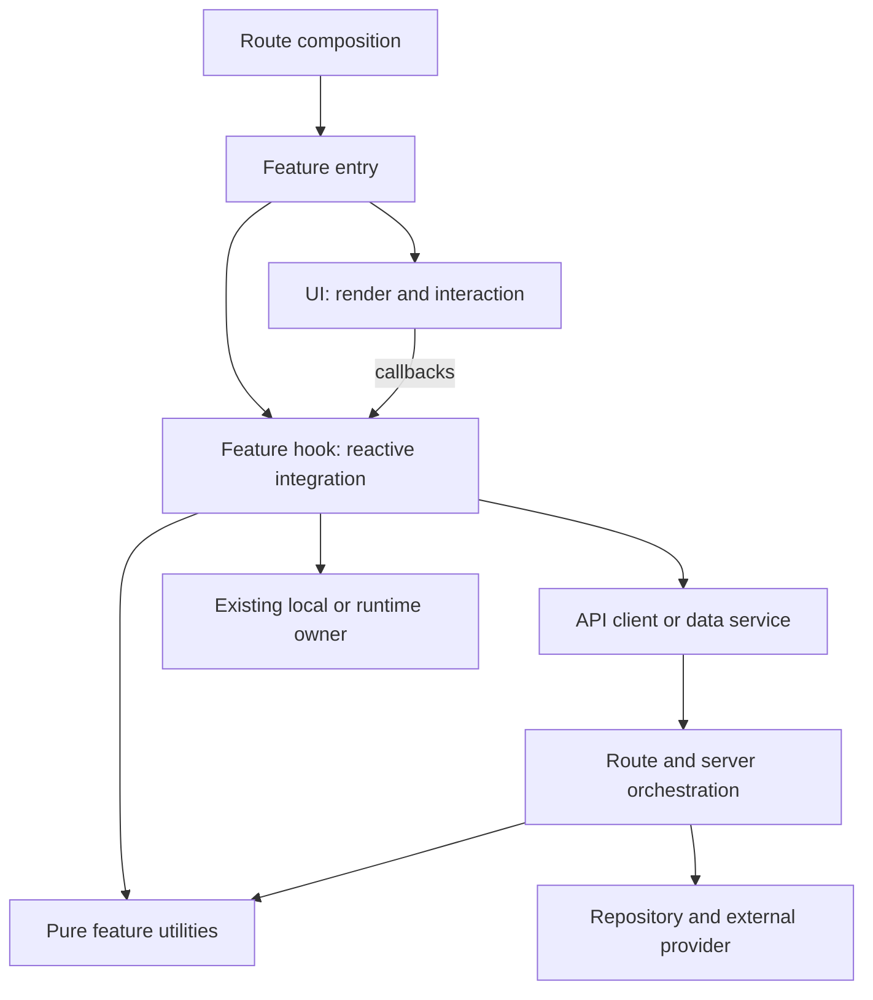

# Feature quality — audit và enhancement plan theo checkpoint

Ngày lập: 04/10/2026. Checkout: `main@474c69fc125c193adf7897c405cd0578a0888d4e`.

**Mục tiêu: bảo vệ tính đúng của feature, đặt logic và tests tại đúng owner, rồi cải thiện performance và khả năng mở rộng bằng số đo.** Hoàn thiện chất lượng của 32 nhóm feature trong [report hiện tại](/Users/hagenlee/Desktop/Person/chines-app/docs/audits/FEATURE_CODE_QUALITY_REPORT_2026-10-04.md), bao gồm F01–F11 và các khoảng trống architecture/performance được rà thêm dưới đây.

Trạng thái: **IMPLEMENTATION IN PROGRESS**. User đã yêu cầu triển khai tiếp tới khi hoàn tất và duyệt publication của các slice đã hoàn thành tại C15-P ngày 10/10/2026. Checkpoint chỉ được đánh dấu hoàn thành khi acceptance và gates thực sự pass; publication không đóng các acceptance còn thiếu.

**CI policy update — 10/10/2026, C15-CI:** user yêu cầu giảm CI chậm và lỗi, kiểm chứng thay đổi cùng consumer bị ảnh hưởng. Automatic push/PR dùng affected selection; manual Run workflow giữ full Node + 14 mounted fixtures + toàn bộ product E2E/SQL trước release. Performance profiling/benchmark là manual/on-demand; script dò source giữ lệnh riêng, rời npm run check và CI mặc định. C15-CI thuộc queue này, không tạo plan thứ hai. C15-P và acceptance production/feature chưa pass vẫn mở; receipt/rollback ở cuối file.

**Scope update — 08/10/2026:** user tạm hoãn PDF vì chưa sử dụng, yêu cầu hoàn tất các phần còn lại. Row 13 và mọi PDF-specific touch/drawing/resource/late-account/rollout acceptance là **DEFERRED BY USER**, không tính hoàn thành và không chặn 31 rows còn active. Giữ nguyên source, tests, drafts và các migration PDF đã có; không tiếp tục enhancement, focused audit hoặc production enforcement PDF. Full gate vẫn giữ tests hiện hữu. Notes/Reader/SRS và các shared invariants vẫn thuộc scope; migration enforce chung Notes/PDF không được apply trong authorization mới này. Production Notes/Reader rollout vẫn là quyết định riêng sau bản review cụ thể.

## 0. Một plan thực thi — reconciliation 08/10/2026

User yêu cầu tiếp tục hoàn tất theo plan, đánh dấu để không bỏ sót hoặc thực hiện trùng. **File này là nguồn tiến độ thực thi duy nhất.** Report ghi kết quả, coverage matrix ghi bằng chứng; các plan cũ giữ lịch sử và trỏ tới owner bên dưới. Checkbox cũ không cộng vào completion của master checkpoint, và không chạy lại một extraction đã có consumer/test chỉ vì receipt cũ nói chưa làm.

| Tài liệu / scope cũ                                                              | Owner tiến độ hiện tại                                           | Cách xử lý, không làm trùng                                                                                                                                                                                                             |
| -------------------------------------------------------------------------------- | ---------------------------------------------------------------- | --------------------------------------------------------------------------------------------------------------------------------------------------------------------------------------------------------------------------------------- |
| `FEATURE_CODE_QUALITY_REPORT_2026-10-04.md`                                      | C00–C15 / bảng 32 feature rows                                   | Report kết quả, không là queue thứ hai. Receipt mới ghi source/target/gate rõ ràng.                                                                                                                                                     |
| `frontend-flow-coverage.md`                                                      | C10/C14                                                          | Evidence matrix cho cùng rows; missing proof không tự biến thành feature/refactor mới.                                                                                                                                                  |
| `ACTIONABLE_EXECUTION_PLANS.md` Plans 1–5                                        | Plan 1 → C11; 2 → C07/C08/C12; 3 → C06; 4 → C10/C12; 5 → C12/C14 | Historical proposals cần current-source proof. Không tự làm redesign/sidebar, xóa API aliases hoặc cache private HTML từ đề xuất cũ.                                                                                                    |
| `COMPREHENSIVE_AUDIT_REPORT.md`                                                  | C00/F01–F11/R01–R12 và C10                                       | Historical findings; verify lại owner trước khi đưa vào queue. Counts và line numbers cũ không phải baseline hiện tại.                                                                                                                  |
| `immediate-interaction-local-first.md` phases 0/1/4/6/8/9/10/11/12               | C00/C02–C05/C11/C13/C14                                          | Durable mutations, cache generation/pinning/eviction, Reader owner, drafts, restart và cold boot còn acceptance. Existing fixes được giữ; mỗi missing invariant chỉ có một item tại owner tương ứng.                                    |
| `reader-reading-ownership.md` checkpoint 12                                      | C06/C14/C15                                                      | Retirement/API ownership đã có receipt; dependency-audit blocker tháng 9 là historical, không tự claim còn hiện tại. Revalidate gate/reachability/render trên source cuối trước đóng acceptance. Không migration Reader engine lần hai. |
| `word-grouped-pinyin-reading-2026-09-14.md` remaining corpus/dictionary research | C01/C08/C10/C13                                                  | Contextual pronunciation owner giữ nguyên. Dataset/dependency research là decision review, không mặc định cài package hoặc override pronunciation. Corpus/existing segmenter proof dùng chung.                                          |
| `textbook-settings-home-2026-09-27.md` CP1 hydration                             | C10-02/C12/C14                                                   | Giữ NOT REPRODUCED và requirement same-bundle server/first-client evidence; không thêm hydration suppression hoặc claim đã fix.                                                                                                         |
| `unified-reader-architecture-2026-08-18.md`                                      | Architecture reference cho C05/C06/C10                           | Reference invariant, không là execution backlog khác.                                                                                                                                                                                   |
| 9 receipts `ui-*.md` tháng 8                                                     | C12 nếu phát hiện regression hiện tại                            | Giữ historical UI/source proof, không thực hiện lại theme/font/mobile refactor.                                                                                                                                                         |

### Queue hiện tại và quy tắc đánh dấu

**Latest completed slice — 10/10/2026: C10-02-R Home source error/partial/retry, LOCAL PASS.** Approved nine existing Home app owners and three existing tests distinguish missing/failed data from valid0/empty, retain cached snapshots and retry only the selected source without hiding independent sections. Full1599/audit0/build132, exact mandatory59/zero skips, coverage and nine rendered snapshots pass on one verified source. C10-NT remains complete; parent31-row/production/remote CI/deploy acceptance stays open, PDF deferred. Next queued work uses the existing C10–C14 feature/state matrix; no duplicate plan or newly authorized production action.

**Active publication slice — 10/10/2026: C15-P, IN PROGRESS.** User approved completing the reviewed diff audit, final-source isolated product/DB compatibility checks, scoped commit/push and matching-SHA CI follow-through. Reuse the existing verified source gates; exclude user-owned check1.js, preserve deferred PDF regressions and do not apply production enforcement. This publishes completed slices only and does not close the 31-feature program.

Chỉ một item **IN PROGRESS**. Mỗi item có changed owners, fail-before/current reproduction, final-source commands, remaining limits và rollback trước chuyển item. `[x]` tại item là slice đã đủ acceptance, không tự đóng parent C00–C15. Required local work và scoped main push tiếp tục trong authorization mới; Git integration build được kiểm tra riêng, production schema/enforce hoặc manual deploy/promotion vẫn cần quyết định riêng.

| Status | Item / parent                                             | Acceptance còn phải đạt                                                                                                                                                           | Dependency / disposition                                                                                                |
| ------ | --------------------------------------------------------- | --------------------------------------------------------------------------------------------------------------------------------------------------------------------------------- | ----------------------------------------------------------------------------------------------------------------------- |
| [ ]    | C15-P — approved publication IN PROGRESS                  | Whole scoped diff audit, final-source isolated expand/enforce compatibility and product E2E, scoped commit/push, matching-SHA CI                                                  | Production metadata read-only; no production enforce, new PDF work or unrelated user files.                             |
| [x]    | C10-02-N — Home Notes error/partial/retry                 | Notes error khác empty, retry đúng query owner, cached notes không mất khi refetch fail; ba locale và actual hook/UI wiring                                                       | Slice PASS; production expand/read PASS tại C03-R-E; app/write/enforce vẫn mở.                                          |
| [x]    | C10-02-R — Home source errors LOCAL PASS                  | Actual overview/activity/count first failures, pending/retry, true zero/empty and retained cached data                                                                            | Final source full1599/mandatory59/coverage/rendered snapshots PASS; receipt below. Only this source-error slice closes. |
| [ ]    | C03-R — rollout **EXPAND APPLIED / ENFORCE OPEN**         | Safe old/new app schema sequence và tested migration history; 3001 cloud read/save/reload tương thích                                                                             | Production expand approved/applied; actual 3001 Notes read PASS; app/live-write/enforce acceptance còn mở.              |
| [x]    | C05-R — linked Reader Notes CAS **LOCAL PASS**            | Expected-base owner-fenced writer, full server snapshot, stale/legacy reject và explicit local/server choice; SQL/API/hook/browser proof                                          | Local receipt below; parent C05/PDF/session-fencing acceptance remains open. Production separate.                       |
| [x]    | C05-P — PDF first-create CAS **LOCAL PASS**               | Distinguish absence/row revision 0, preserve ambiguous legacy outbox, stale create reject và explicit choice; SQL/API/hook/browser proof                                          | Cùng authorization implementation local theo Option A; không backfill production strokes.                               |
| [x]    | C06-T — Translation recording integration **LOCAL PASS**  | Capture source at start, pure payload expectations ở utility và lifecycle tại hook; actual full-payload/second-recording proof                                                    | Giữ countdown/recorder ownership và API payload hiện hữu.                                                               |
| [x]    | C06-D — Studio Dictation editor owner LOCAL slice         | Complete current implementation/callers, move only remaining domain transformations/lifecycle đúng existing owners; source parity + real wiring                                   | Không extract lại Listening card/session đã có proof.                                                                   |
| [ ]    | C09-S — search-index 503 observation PARTIAL              | Trace actual content loading failure and same signed-in 3001 retry; preserve auth/no-store/index contracts                                                                        | Read-only diagnosis first; no speculative cache/provider rewrite.                                                       |
| [x]    | C09-S-K — canonical search node identity LOCAL slice      | One canonical text/reading node per item, unchanged IDs/order/navigation                                                                                                          | Two fail-before regressions, 14 targeted tests and actual 3001 results PASS.                                            |
| [x]    | C09-A — Reader annotations owner/cache LOCAL slice        | Captured owner header, stale callback isolation and same-owner Notes↔Reader cache freshness                                                                                       | Approved optional-header expand contract; actual local HTTP/DB/browser proof in receipt below.                          |
| [x]    | C06-NL / D04-UI — Notes library LOCAL PASS                | Pure policies, actual Query commands,25-row filtered UI and retained cached read errors; final gates/volume receipt below                                                         | Backend cursor/snapshot, remaining Notes and parent acceptance remain open.                                             |
| [x]    | C10-03-L — Library state/selection LOCAL PASS             | Actual pending/error/retry/empty/cached error, matching selected route/resource and summary-only mounted reads                                                                    | Receipt below; other permissions/locale/admin states remain separate.                                                   |
| [x]    | C06-NQ — Notes quick-create LOCAL PASS                    | Approved callback/pending props, pure date/payload, actual fresh-session command, guest/failure/focus/locale UI proof                                                             | Final source full check and exact mandatory19 mounted cases pass; broader Notes acceptance remains open.                |
| [x]    | C06-NM / C03 — Notes metadata LOCAL PASS                  | Pure metadata payload, retained failed form/conflict choices, acknowledged revision/cache/draft behavior                                                                          | Full check and exact mandatory20 mounted cases pass; broader Notes acceptance remains open.                             |
| [ ]    | C00/C07–C09 — measurements PARTIAL                        | R01–R12 mỗi dimension có final-source before/after hoặc measured no-change decision; retained resources/data-volume boundaries                                                    | Utils/hook extraction không tính là giảm rerender.                                                                      |
| [ ]    | C10–C14 — 31 active rows/remaining states **PARTIAL**     | Translation/Search/cache privacy/Textbook interaction slices pass locally; next final-source gates and remaining owner/state audit. Provider/production/cold boot remain partial. | Row 13/PDF deferred by user; reuse proof, không count mocked tests thành live proof.                                    |
| [x]    | C15-L — Notes metadata-source local refresh PASS          | Metadata-source full check,20 mounted cases,coverage,18 product cases and Studio root/asset checks                                                                                | Exact local receipt below; parent C15 remains open for31-row acceptance and publication decisions.                      |
| [x]    | C10-NF / C03 — Notes folder dialogs LOCAL PASS            | Pending/failure/retained form/cancel/reopen acknowledgements preserve the current dialog                                                                                          | Full check1588 and mandatory21 PASS; navigation/account transitions remain separate.                                    |
| [x]    | C10-NV / C03 — pending-delete navigation LOCAL PASS       | Newer view/page retained; unchanged deleted-folder selection goes to Unfiled/page1; exactly one delete and no extra writes                                                        | Approved parent callback/state transition; full check1591 and mandatory22 PASS. Later C14-RF bootstrap also LOCAL PASS. |
| [x]    | C14-RF — Reading fixture bootstrap LOCAL PASS             | Repeated module initialization disposes previous root/container; one viewport plus preserved real study/library flows                                                             | Two existing test/fixture files only; fail-before,3 affected modes, full check1591 and mandatory22 PASS.                |
| [x]    | C10-NA — Notes authenticated-owner integration LOCAL PASS | Real SDK/provider/service/draft A→guest→B, late acknowledgements and same-owner recovery                                                                                          | Two new test files; mandatory24 cases and full1591 pass. Tab labels remain separate C10-NT.                             |
| [x]    | C10-NT — Notes tabs owner LOCAL PASS                      | Guest/B private-title rejection, per-owner reload, legacy bytes, direct route after initial session, same-owner no-op and pending draft fences                                    | Both approvals applied; full1599/mandatory32/coverage pass. Production/device/whole Notes row remain open.              |
| [x]    | C11-NR — Notes retained resources LOCAL MEASURED          | 45 samples; actual editor/observer/listener disposal and existing five-minute cache expiry                                                                                        | Measured no-change decision for tested scope; physical devices and other resource owners remain open.                   |
| [x]    | C09-NQ — Notes query-plan/volume LOCAL MEASURED           | Existing list/recent/link projections, RLS and 10k controlled volume                                                                                                              | 180 warmed samples; rolled back all fixture rows, no schema/source change. Offset concurrency remains separate.         |
| [x]    | C08-SR — Search retained-index LOCAL MEASURED             | Query/index/Dialog retention, HTTP dedup, owner retirement at1k/10k/50k                                                                                                           | No cache-policy change; total detached-DOM attribution remains explicit C11/UI limit.                                   |
| [x]    | C07-FS — font sync-only LOCAL MEASURED                    | Five×30 actual sync-store transitions: broad font30→settings font0, full sync reader30                                                                                            | Font change1 and CSS cleanup retained; no further app change.                                                           |
| [x]    | C14-CV — current-source coverage LOCAL PASS               | Existing V8 command/configuration with CI environment; current-source denominators and failures recorded                                                                          | 280 files1591 PASS; separate mounted24 proof is not counted in V8 percentages.                                          |
| [x]    | C10-SC — Saved dictionary collection LOCAL PASS           | Actual server-page empty/missing-schema/read-error/retry, search preservation and guest read rejection                                                                            | Full1597/mounted31/coverage PASS; server-page owner has no client cached-refetch contract.                              |
| [x]    | C04-DL — Notes native download LOCAL PASS                 | Five native files with latest two-pane drafts, exact V2/schema/filename, URL/anchor cleanup                                                                                       | Controlled service/session desktop Chromium; toast/touch/device/live-provider states remain separate.                   |
| [x]    | C12-NF — Notes Sheet focus LOCAL PASS                     | Return focus on Escape/export/toggle while preserving edit/view, native payload and save/drafts                                                                                   | Full1597/mandatory32 passed; preserved in current tabs full1599/mandatory32 source.                                     |

- [x] **C00-P — plan reconciliation:** inventory/mapping ở trên và pointers trong 5 overlapping plans đã ghi trước application implementation; `oxfmt --write` sáu docs PASS, `git diff --check` PASS. Historical checkboxes được giữ; parent C00 runtime measurements vẫn mở. Rollback riêng pointers/index, không đụng source/data. Home regression tests bắt đầu sau reconciliation check.

## 1. Đánh giá kiến trúc và phạm vi

| Concern                     | Đánh giá hiện tại                                                                                     | Quyết định trong plan                                                                         |
| --------------------------- | ----------------------------------------------------------------------------------------------------- | --------------------------------------------------------------------------------------------- |
| Dependency/state ownership  | Nền tốt: route → feature → shared; Query/Form/Store có owner; generic Reader tách model/runtime/UI    | Giữ hướng dependency và owner; sửa theo từng surface có consumers thật                        |
| UI và business logic        | Chưa đồng đều: Translation, Notes, Dictation, Search còn transformations hoặc orchestration trong TSX | Pure business logic phải ở utilities; React integration ở hooks; I/O ở API/service/repository |
| Correctness của persistence | F01 và F02 có reproduction; F03–F07 có source/caller evidence                                         | Sửa trước optimization; test được failure ở đúng implementation                               |
| Rerender                    | Có selector isolation precedent, nhưng workspace lớn và broad context vẫn có đường invalidation rộng  | Lập trigger/subscriber map; đo commits rồi sửa owner/subscription/props                       |
| CPU, payload, memory, I/O   | Chưa có runtime baseline đủ dùng; source guard chỉ bắt vài boundary cụ thể                            | Đo riêng từng dimension; không suy ra nhanh/chậm từ số dòng hay số hooks                      |
| Test quality                | 1.298 tests pass ở lượt audit trước, nhưng vài tests Notes không chạy logic cần bảo vệ                | Test ở utils/API/hook/runtime thật; giữ ít integration tests chứng minh wiring                |
| Scale                       | Có bounded download, provider limits và normalized Reader; Notes list/tab retention cần audit         | Kiểm tra data volume, request fan-out, retained memory và concurrency riêng                   |
| Release proof               | E2E CI đang tắt, browser tests skip; corpus/assets CLI fail                                           | Mọi khoảng trống có checkpoint, môi trường và trạng thái; không đóng bằng build xanh          |

Precedents bắt buộc: [frontend structure](/Users/hagenlee/Desktop/Person/chines-app/docs/architecture/frontend-structure.md), [Reader cooker](/Users/hagenlee/Desktop/Person/chines-app/src/features/reader/model/cook-reader-data.ts), [Reader selectors](/Users/hagenlee/Desktop/Person/chines-app/src/features/reader/runtime/reader-context.ts), [selector isolation tests](/Users/hagenlee/Desktop/Person/chines-app/src/features/reader/runtime/reader-store.test.ts), [Notes utilities](/Users/hagenlee/Desktop/Person/chines-app/src/features/notes/note-library-utils.ts), [practice scoring](/Users/hagenlee/Desktop/Person/chines-app/src/features/hanzihome/practice/translation-practice.ts), [AI API client](/Users/hagenlee/Desktop/Person/chines-app/src/features/hanzihome/ai-conversation/services/ai-conversation-api.ts).

Kế thừa cách ghi checkpoints/evidence từ [Reader ownership plan](/Users/hagenlee/Desktop/Person/chines-app/docs/refactors/reader-reading-ownership.md) và [local-first plan](/Users/hagenlee/Desktop/Person/chines-app/docs/refactors/immediate-interaction-local-first.md). Các con số, checkbox và blocker lịch sử phải được reconcile với source hiện tại trước khi đưa vào backlog. Ví dụ blocker dependency audit cũ không còn là kết quả local hiện tại; full gate lượt audit ngày 04/10 đã pass. Các lời hứa offline cold boot hoặc SRS sync trong plan cũ cần proof riêng.

### Constraint ledger cho toàn chương trình

- Required: audit từng nhóm; giải quyết F01–F11; UI chỉ presentation/interaction; pure expected-input/output logic ở utilities; hooks/API có contract và tests riêng; đo performance và scale theo dimension; checkpoint có acceptance, scope, gates và rollback.
- Preserve: routes, auth/account isolation, stable IDs/source offsets, learner content, Study/Edit separation, normalized vocabulary, BYOK/task assignments, settings/progress/outbox owners và persisted formats hiện hữu.
- Scope: mỗi checkpoint chỉ sửa owners và consumers được chốt trước khi edit. Discovery ra file/contract khác phải cập nhật scope và nêu lý do trước khi mở rộng.
- Forbidden: blanket refactor, đổi dependency, global utils chứa domain logic, parallel store/cache/Reader engine, parser để chữa internal type mismatch, utility/hook forwarding-only, speculative abstraction hoặc bỏ checks để xanh.
- Type ledger: reuse generated/domain/schema/service/library contracts. Không thêm `any`, `unknown`, assertions, non-null assertions, suppressions, new unions hoặc weakened optional/null fields theo yêu cầu trực tiếp của user. Gặp external/library conflict phải mô tả exact types và structural decision trước workaround.
- New application files bên dưới là đề xuất có consumer cụ thể cho yêu cầu tách trách nhiệm. Chưa tạo trong lượt lập plan. Chỉ tạo khi implementation checkpoint xác nhận owner hiện hữu không có nơi phù hợp và scope đã chốt; không tạo skeleton folders.
- Verification: targeted trước, full gate cho shared/multi-surface/persistence/contract/release. Browser, provider, DB và remote CI là các mức proof độc lập.

## 2. Hợp đồng UI / utilities / hook / API

### 2.1. Trách nhiệm và nơi test

| Owner                           | Được làm                                                                                                                                    | Phải đưa khỏi owner này                                                                                            | Test đúng nơi                                                                                                                  |
| ------------------------------- | ------------------------------------------------------------------------------------------------------------------------------------------- | ------------------------------------------------------------------------------------------------------------------ | ------------------------------------------------------------------------------------------------------------------------------ |
| UI component                    | Semantic render, locale labels, class composition, disabled/loading/error display, focus/keyboard, transient open/reveal state              | Fetch/DB, cache invalidation, autosave/import orchestration, scoring, domain filtering/grouping/snapshot selection | Render và interaction contracts: callback đúng, disabled đúng, focus/reveal đúng                                               |
| Feature entry/workspace         | Compose hooks với UI và route props; gắn integration hiện hữu                                                                               | Tự giữ bản sao Query/Form state; chứa evaluator, request pipeline hay hàng trăm dòng business handlers             | Ít integration cases nối user event → owner → visible result                                                                   |
| Pure utilities                  | Chọn snapshot, filter/group/order, score, text segmentation, export payload/filename, retry hoặc timing policy dưới dạng input → output     | React, browser globals, fetch, Supabase, storage, mutable domain state hoặc timer scheduling                       | Unit tests trực tiếp utility, expected values độc lập với implementation                                                       |
| Hook                            | Query/mutation subscriptions, Form integration, owner-specific lifecycle, debounce/flush, cleanup, async order, invoke utility và I/O owner | Business algorithm viết lại; transport/schema logic đã có owner; subscription/global lifecycle trùng owner         | Actual hook callbacks/lifecycle, real Query client khi cần, fake timers/deferred requests, mounted fixtures cho effect/cleanup |
| API client/service              | Endpoint, method, headers, auth expectation, payload serialization, response validation/error semantics                                     | React/toast/navigation; sửa domain state của caller; biến error thành success/empty                                | Transport success, malformed response, auth/owner rejection, cancellation, status và error propagation                         |
| Server route/service/repository | Trusted identity, validation, role/parent constraints, canonical read/write, provider orchestration                                         | UI state, arbitrary client identity trust, duplicate business algorithms                                           | Route/service/repository contracts; DB constraints/RLS qua local integration riêng                                             |
| Local/runtime                   | Durable writes, generation/owner fencing, replay/locks, store selectors, imperative adapters                                                | UI labels; competing persisted/query owner                                                                         | Race, restart, quota, idempotency, stale acknowledgement, subscriber isolation                                                 |

“Utilities” là trách nhiệm hàm thuần, không phải một global folder. Dùng `utils/` hoặc file `*-utils.ts` feature-local khi đó là pattern gần nhất. Các pure modules đã đúng vai trò trong `model/`, `practice/`, `search/` vẫn là owner hợp lệ; không đổi tên hoặc dời chúng chỉ để đồng nhất suffix. Logic mới tách khỏi UI phải vào module thuần cùng domain và có test trực tiếp.

`Date.now()`, locale, selected IDs và thời điểm export được lấy tại owner có side effects rồi truyền làm input nếu thuật toán cần chúng. Download Blob/object URL, MediaRecorder, IndexedDB và request scheduling không được gọi là pure utils; lifecycle ở hook/integration, I/O ở owner hiện hữu.

Private memoization hiện hữu như search `WeakMap` không phải domain state owner. C08 phải chứng minh immutable-input/invalidation contract và bounded retention; không thêm global cache cho mỗi draft/query hoặc coi stale cached output là pure result hợp lệ.



Đây là responsibility map; mỗi feature dùng các tầng nó thực sự có. Notes hiện có client Supabase data service thì vẫn test service đó, không tự tạo route/API wrapper mới. Một hook không được biến thành bản sao 1.000 dòng của workspace; tách theo flow có lifecycle/consumers thật, không tách theo mỗi biến state.

### 2.2. Chính sách tests

1. Domain expectations chỉ assert ở utilities/model owner. Ví dụ score/reveal policy/order/export snapshot không phải dựng toàn UI để test thuật toán.
2. Hook tests phải chạy callbacks và state transitions thật. Không viết lại queryFn trong test; không lấy `typeof saveContent === 'function'` làm proof autosave.
3. API/service tests phải phân biệt data rỗng hợp lệ, missing schema, auth rejection và transient failure. Không assert lỗi đã bị mock nuốt rồi gọi đó là recovery proof.
4. Async/persistence dùng deferred responses và fake clock ở boundary: A/B order, failed A sau B, account change, unmount, retry, stale acknowledgement. Timers không thay thế server concurrency test.
5. Mounted hook/UI fixture cần cho effect cleanup, rerender, form wiring, keyboard và object URL/microphone lifecycle. Static markup không chạy các hành vi này.
6. Coverage chỉ có ý nghĩa cùng invariant matrix. Với owner được sửa, các branches liên quan requirement phải có deterministic proof; không đặt global percentage tùy ý để che missing workspaces.
7. Dùng Vitest và các fixtures/browser tests đã có. Nếu tooling hiện tại không chạy được một mức proof, ghi limitation trước khi quyết định thêm tooling; không mặc định cài testing library hoặc performance package.

## 3. Phân biệt tuyệt đối performance và rerender

Render là React gọi component để tính output. Commit là áp dụng thay đổi sau render; remount là lifecycle mới. CPU của utility, request latency, layout/paint và retained memory là các dimension khác. Console render count trong dev/StrictMode không phải số commit production.

| Thay đổi                                         | Ảnh hưởng owner rerender?                  | Dimension thực sự                           | Điều kiện nghiệm thu                                                                               |
| ------------------------------------------------ | ------------------------------------------ | ------------------------------------------- | -------------------------------------------------------------------------------------------------- |
| Tách logic ra utils                              | Không tự giảm                              | Testability, ownership, khả năng tối ưu CPU | Same input/output; unit proof, không tự claim nhanh hơn                                            |
| Tách logic ra custom hook gọi tại cùng component | Không tạo render boundary                  | Locality/lifecycle                          | Subscriber vẫn là component gọi hook; không gọi là rerender optimization                           |
| Tách UI child                                    | Không tự chặn render do parent             | Composition; có thể tạo boundary            | State/subscription đặt đúng child hoặc memo với props ổn định, có measured proof                   |
| `memo`                                           | Có thể bỏ parent-prop renders              | React render work                           | Props thực sự ổn định; own state/context/subscription vẫn cập nhật; comparator không stale closure |
| `useMemo`                                        | Không ngăn owner render                    | Cache calculation/reference                 | Computation thực sự đắt hoặc reference có consumer cần; dependencies đúng                          |
| `useCallback`                                    | Không ngăn owner render                    | Function identity                           | Có memoized child/subscription dependency cần ổn định; không bọc mọi callback                      |
| Narrow Store selector / Query `select`           | Có thể giảm subscriber updates             | Reactive invalidation                       | Selected output không đổi thì subscriber yên; loading/error fields cần UI vẫn được theo dõi        |
| Bỏ state-writing effect cho derived data         | Có thể bỏ render cascade                   | React + correctness                         | Derived value chỉ có một owner; effect chỉ giữ cho external synchronization                        |
| Skip no-op state update                          | Có thể giảm update                         | React/store notifications                   | Return same snapshot khi semantic value không đổi; không bỏ transition cần thiết                   |
| Debounce autosave/search I/O                     | Không bỏ input renders                     | Request count/write rate                    | Input phản hồi ngay; last intent không mất khi flush/navigation                                    |
| Ref thay state                                   | Không tự là giải pháp đúng                 | Imperative bookkeeping                      | Chỉ dùng cho giá trị không quyết định UI; không che dirty/error/status khỏi render                 |
| Deferred value / transition                      | Không bảo đảm giảm số render hoặc tổng CPU | Scheduling/responsiveness                   | Đo input latency và giữ current query/result semantics                                             |
| Dynamic import / lazy loading                    | Không giảm interaction renders             | Initial JS/parse/load                       | Network/bundle delta và loading/focus contract; không mặc định tắt SSR                             |
| Pagination / windowing                           | Không tự giảm trigger của owner            | Payload, DOM/CPU/memory                     | Giữ total/filter/selection/scroll/accessibility; không silently cắt dữ liệu                        |
| Narrow invalidation / batching reads             | Giảm fetch và có thể giảm query updates    | Network/DB/query churn                      | Đúng mọi affected consumer; stale data không bị che bởi cache                                      |
| Stable key                                       | Giảm remount khi identity ổn định          | Lifecycle/draft/resource retention          | Giữ intentional auth-owner remount trong QueryProvider; không dùng key để sửa state                |

React phân biệt props memoization với state/context updates; `useMemo` cache phép tính. Đối chiếu [React memo](https://react.dev/reference/react/memo), [useMemo](https://react.dev/reference/react/useMemo) và [derived data/effects](https://react.dev/learn/you-might-not-need-an-effect). Các khuyến nghị này được kiểm tra lại với local contracts, không dùng để ép codebase đổi pattern.

TanStack Query có tracked properties/structural sharing/`select`; top-level result identity không phải stable contract. Spread toàn query result có thể làm subscription theo dõi thêm fields. Đối chiếu [render optimizations](https://tanstack.com/query/latest/docs/framework/react/guides/render-optimizations) và installed `queryObserver.ts`, không tự đổi tất cả hooks.

## 4. Source evidence bổ sung và audit hotspots

Các R-items dưới đây là cơ chế/giả thuyết cần đo; mức độ chậm và lợi ích optimization chưa được xác nhận bằng browser profiling.

| ID  | Source hiện tại                                                                                                                                                                                                                                                                                                                                               | Cơ chế/rủi ro cần kiểm tra                                                                                         | Kết quả audit bắt buộc                                                                                                          |
| --- | ------------------------------------------------------------------------------------------------------------------------------------------------------------------------------------------------------------------------------------------------------------------------------------------------------------------------------------------------------------- | ------------------------------------------------------------------------------------------------------------------ | ------------------------------------------------------------------------------------------------------------------------------- |
| R01 | [TranslationWorkspace:95](/Users/hagenlee/Desktop/Person/chines-app/src/features/translation/TranslationWorkspace.tsx:95), [countdown:169](/Users/hagenlee/Desktop/Person/chines-app/src/features/translation/TranslationWorkspace.tsx:169), [recorder:173](/Users/hagenlee/Desktop/Person/chines-app/src/features/reading/hooks/useShadowingRecorder.ts:173) | Countdown ở workspace; recorder update object mỗi 500ms trong khi displayed duration làm tròn giây                 | Trace timer/recording commits; separate timer badge và stable lesson panels; no-op duration updates được kiểm tra               |
| R02 | [NoteEditorPanel:134](/Users/hagenlee/Desktop/Person/chines-app/src/features/notes/components/NoteEditorPanel.tsx:134), [NoteTabContainer](/Users/hagenlee/Desktop/Person/chines-app/src/features/notes/components/NoteTabContainer.tsx)                                                                                                                      | Mỗi panel đọc cả map split view; mọi tab đều mounted; hidden panel vẫn có query/effects/lifecycle                  | Toggle note B không notify split-view selector A; đo memory/query/editor count cho 1/5/20 tabs; giữ draft khi đổi tab           |
| R03 | [MandarinTtsProvider:68](/Users/hagenlee/Desktop/Person/chines-app/src/features/speech/MandarinTtsProvider.tsx:68), [useTTS](/Users/hagenlee/Desktop/Person/chines-app/src/hooks/useTTS.ts)                                                                                                                                                                   | Broad TTS context value đổi theo playback; Reader speech adapter đã có identity ổn định                            | Map consumers cần progress so với chỉ commands; không thay stable Reader speech service; đo fan-out                             |
| R04 | [useLearningState:216](/Users/hagenlee/Desktop/Person/chines-app/src/features/hanzihome/hooks/useLearningState.ts:216), [return object:481](/Users/hagenlee/Desktop/Person/chines-app/src/features/hanzihome/hooks/useLearningState.ts:481)                                                                                                                   | Hook đọc toàn state và owner sync snapshot; queryKey array/callback dependencies có thể đổi reference              | Đo settings-only consumer khi progress/sync đổi; giữ centralized sync agent, Query owner và durable writes                      |
| R05 | [ReaderDocumentStudy:120](/Users/hagenlee/Desktop/Person/chines-app/src/features/reading/workspaces/ReaderDocumentStudy.tsx:120), [services:133](/Users/hagenlee/Desktop/Person/chines-app/src/features/reading/workspaces/ReaderDocumentStudy.tsx:133)                                                                                                       | Inline display/service objects đưa vào contexts; speech riêng đã stable                                            | Đo context propagation; chỉ stabilize meaningful inputs; speech không bị restart khi display thay đổi                           |
| R06 | [AiConversationWorkspace:120](/Users/hagenlee/Desktop/Person/chines-app/src/features/hanzihome/ai-conversation/AiConversationWorkspace.tsx:120), [stream content:126](/Users/hagenlee/Desktop/Person/chines-app/src/features/hanzihome/ai-conversation/AiConversationWorkspace.tsx:126)                                                                       | Draft và stream state ở workspace; history/setup có thể cùng tham gia renders                                      | Trace typing/chunks; completed messages/history không commit vì stream-only update; stop/navigation giữ semantics               |
| R07 | [Dictation transforms](/Users/hagenlee/Desktop/Person/chines-app/src/features/dictation/StudioDictationWorkspace.tsx:46), [TTS transforms](/Users/hagenlee/Desktop/Person/chines-app/src/features/hanzihome/tts/TtsStudioWorkspace.tsx:61)                                                                                                                    | Book/transcript transformations trong UI; custom text có thể sinh pinyin theo mỗi edit; split text nhiều pass      | Utility tests + CPU timings/call counts trên text sizes; giữ pronunciation precedence và source identity                        |
| R08 | [Search UI:82](/Users/hagenlee/Desktop/Person/chines-app/src/features/hanzihome/search/GlobalSearchDialog.tsx:82), [search engine](/Users/hagenlee/Desktop/Person/chines-app/src/features/hanzihome/search/searchHanziHomeIndex.ts), [cache:33](/Users/hagenlee/Desktop/Person/chines-app/src/features/hanzihome/search/useHanziHomeSearchIndex.ts:33)        | UI counts/filter; full index scan rồi sort matches; idle prefetch và infinite gcTime là intentional retention      | Đo scan/rank CPU, payload/retention; giữ ranking/snippets/ties và category-after-limit behavior hiện hữu trừ quyết định product |
| R09 | [Business Chinese:523](/Users/hagenlee/Desktop/Person/chines-app/src/features/hanzihome/components/business-chinese/BusinessChineseStudyWorkspace.tsx:523)                                                                                                                                                                                                    | Pure visibility policy trong JSX file; large workspace có nhiều subcomponents nhưng size không chứng minh coupling | Tách policy khỏi UI vào pure owner; reveal/display/isolation tests; đo trước thay component boundaries                          |
| R10 | [Notes all-list:231](/Users/hagenlee/Desktop/Person/chines-app/src/services/notes/notes.service.ts:231), [bounded recent:250](/Users/hagenlee/Desktop/Person/chines-app/src/services/notes/notes.service.ts:250)                                                                                                                                              | All-list/category không client pagination; attach links bằng `.in` toàn bộ returned IDs; phụ thuộc server row cap  | Đo response/links/query shape và completeness ở large volume; paging proposal phải giữ filters/total và contract                |
| R11 | [performance guard](/Users/hagenlee/Desktop/Person/chines-app/scripts/check-hanzihome-performance.mjs)                                                                                                                                                                                                                                                        | Chỉ check vài source patterns của HanziHome; không đo rerender/CPU/network/Web Vitals                              | Giữ guard nhưng bổ sung executable evidence ở owner; không dùng guard pass làm performance benchmark                            |
| R12 | [useSmartSelectionInsights return](/Users/hagenlee/Desktop/Person/chines-app/src/hooks/useSmartSelectionInsights.ts:154)                                                                                                                                                                                                                                      | Spread query result vào public hook return; callback/mutation objects truyền qua consumer tree                     | Inventory fields/consumers, tracked-prop notification test; preserve existing call contracts                                    |

F01 được làm rõ bằng real TanStack mutation lifecycle với source options: bắt đầu request online → transport fail và navigator offline → mutation success, cache saved, không outbox. Transport/session/query hook vẫn mocked. Mutation pause khi bắt đầu offline và durable outbox là hai contract khác nhau.

## 5. Ma trận audit/enhancement cho đủ 32 nhóm feature

Mỗi hàng phải có flow/state matrix, owner map, test evidence và disposition performance. “Giữ + proof” vẫn là công việc cần hoàn tất, không phải sửa code cho đủ số lượng. Owner cụ thể và source links dùng E01–E26 trong report; checkpoint bên dưới chốt files trước edit.

| #   | Nhóm                                  | Audit và enhancement bắt buộc                                                                 | Test owner chính                            | Perf/scale focus                                     | Checkpoints                  |
| --- | ------------------------------------- | --------------------------------------------------------------------------------------------- | ------------------------------------------- | ---------------------------------------------------- | ---------------------------- |
| 01  | Auth/session                          | Guest/user/admin, redirect, owner switch, stale response, eviction; giữ Query client rotation | Auth route/utils + provider mounted fixture | Context churn; remount intentional                   | C00, C07, C13, C14           |
| 02  | Home                                  | Summary/recent reads; từng nguồn error/partial/retry; above-fold data                         | Home hook/services + summary utilities      | Bounded requests/payload; giữ recent limit           | C09, C10, C14                |
| 03  | Course library                        | Select/group/filter/navigation và stale/error/empty                                           | Catalog hook + grouping utils               | Summary request; không fetch detail mỗi card         | C08, C09, C10                |
| 04  | Study Mode                            | Representative/sparse payload theo renderer family; answer hidden; giữ Edit overlay           | Family utils/view-model + UI wiring         | DOM/analysis cost theo lesson size                   | C06, C08, C10, C12           |
| 05  | Edit Mode                             | Smallest-node save, dirty/cancel/validation, role/version/sibling isolation                   | Forms/hooks + direct-save + RPC route       | Narrow invalidation; không parent replace-all        | C09, C10, C13, C14           |
| 06  | Textbooks                             | Hán thương mại/Nhịp cầu/Đọc hiểu; route/resume/display/reveal policies                        | Textbook pure helpers + integration hook    | Context/section render, corpus payload               | C06, C07, C08, C10           |
| 07  | Aggregate vocab/grammar               | Canonical normalized resource, facets/group/order và detail/edit refresh                      | Aggregate utils/hooks/repository            | Aggregate paging/payload và filter CPU               | C08, C09, C10                |
| 08  | Flashcards/review                     | Deck change, reveal, shuffle identity, completion, retry/attempt ID                           | Session reducer/utils + outbox              | Card subscriber scope; attempt rate                  | C07, C10, C11                |
| 09  | Dictionary lookup/Inspector           | Word/sentence/context, duplicate AI request, close/reopen, auth/failure                       | Lookup utils/API/hooks                      | Request dedup/cancellation; query tracked fields     | C02, C07, C09, C10           |
| 10  | Saved dictionary/SRS                  | F01/F06; truthful pause/pending/save status, missing-schema vs other error                    | SRS API/hooks/query callbacks               | Write replay contract và collection paging           | C02, C09, C11                |
| 11  | Reader engine                         | Selection/copy/playback/display; source offsets và same/different document                    | Cooker/selectors/runtime + browser wiring   | Unrelated segment subscribers; text CPU              | C05, C07, C08, C14           |
| 12  | Reader progress/annotations/shadowing | Owner fencing, revision, reload/retry, mic lifecycle                                          | Progress hooks/local/runtime/API            | Write coalescing, recording timers, cleanup          | C05, C07, C11, C14           |
| 13  | PDF reader                            | F07; guest/auth expired, failed snapshot retained, drawing/undo/reload                        | PDF utils/API + save owner                  | Stroke/DOM/memory; serialize latest intent           | C05, C08, C11, C14           |
| 14  | HSK                                   | Corpus route/slug/order, Reader integration, progress/source parity                           | Corpus utils/adapter + hook                 | Route payload/large lesson; không duplicate engine   | C01, C08, C10, C14           |
| 15  | Humanities                            | Source/evaluation/poetry/history, partial metadata, attempt errors                            | Evaluator/API/hooks                         | Evaluator CPU và history read bound                  | C08, C09, C10                |
| 16  | Personal learning                     | Source/collection/progress riêng; reload/owner conflict                                       | Model/repository/state hook                 | Owner-scoped cache và collection reads               | C05, C09, C10, C11           |
| 17  | Daily Reading static/generated UI     | Selected article/module/reload; guest attempts; partial enrichment                            | Source-selection utilities + hooks          | Above-fold module loading và DOM                     | C06, C09, C10, C14           |
| 18  | Daily Reading source/enrichment       | Crawl/job retry/partial/cancel/status; runtime receipt                                        | Provider/server/workflow/schema             | Bounded prompts/retries/concurrency/cost             | C10, C13, C14                |
| 19  | Listening                             | Lesson/error/retry/transcript/reveal/hotkeys/audio                                            | Listening view-model + hooks/API            | Playback context fan-out; audio cache                | C06, C07, C10, C12           |
| 20  | Dictation                             | All source types, mode/reset/auto advance, comparison/attempt failure                         | Dictation utils/session/hook/API            | Custom text pinyin CPU; typing isolation             | C06, C07, C08, C10           |
| 21  | Translation/interpreting              | Direction/unit scoring, timing/recording/save/history failures                                | Practice/evaluator utils + flow hook/API    | Countdown/recording root renders                     | C06, C07, C08, C10           |
| 22  | Learning Loop                         | Due order, completion optimistic rollback, revision conflict                                  | Queue utilities/hooks/repository            | Queue bound/paging và item subscription              | C09, C10, C11, C14           |
| 23  | Notes                                 | F02–F05/F11; both panes, import/export/drafts/tab account lifecycle                           | Editor utilities + hook/service/local       | Tabs, split-map selector, all-list/links             | C01, C03, C04, C06, C07, C09 |
| 24  | Notebook                              | Search/group/section/filter identity và empty states                                          | Notebook filtering utils + wiring           | Static filtering/DOM; tránh copy state               | C08, C10, C12                |
| 25  | Memory tips                           | Submit/update/archive/retry/rollback/reload                                                   | Mutation hooks/API + form utils             | Optimistic invalidation scope                        | C09, C10, C14                |
| 26  | TTS Studio/library                    | Compose/segment/library writes/playback/download/URL cleanup                                  | TTS utilities/API/hook + speech adapter     | Context/segmentation/cache/audio memory              | C06, C07, C08, C09, C10      |
| 27  | AI conversation/memory                | Streaming/stop/retry/history/archive/runtime policy; session change                           | Pure output/filter + client/hook/server     | Chunk commits, stable messages, bounded context      | C06, C07, C09, C10, C13      |
| 28  | BYOK/task/prompt settings             | Key CRUD/toggle, missing assignment, override, prompt save/reset                              | Schema/client/hooks/server                  | Query invalidation; sensitive data isolation         | C09, C10, C13, C14           |
| 29  | Search/shell/locale/responsive        | Ranking/navigation/focus locks, stale query, keyboard/mobile chrome                           | Search utilities + bridge hook + UI         | R08/R12; Header/route subscribers                    | C06, C07, C08, C12, C14      |
| 30  | Radicals/writing                      | Derived selection/filter, writer lifecycle, edit permissions                                  | Filter utilities + writer hook/form/API     | External writer lazy load/dispose                    | C06, C08, C10, C12           |
| 31  | API docs/Data Quality/HTML artifacts  | Real vs demo receipts, admin gate, create/edit/preview/runtime/delete contracts               | Registry/runtime utilities + hooks/routes   | Heavy editor/preview load; bounded admin reads       | C06, C09, C10, C13, C14      |
| 32  | Offline pack/cache/sync               | Quota/restart/reconnect/eviction/generation/pinning, download cancel                          | Local storage/runtime/service               | Retention, bounded concurrency, pending queue growth | C07, C11, C13, C14           |

## 6. Master checkpoints và thứ tự thực hiện

Kích thước S/M/L là độ rộng scope để chia diff, không phải ETA. C00 phải có baseline theo dimension trước khi claim performance. Correctness lane C01–C05 được ưu tiên; structural work C06 và optimization C07–C09 đi sau owners đã được bảo vệ. C10 được chia theo feature rows, không triển khai cả bảng bằng một diff.

C00 có hai acceptance slices: **C00-A — source/owner/correctness baseline** và **C00-B — runtime measurements**. C01–C05 được bắt đầu sau C00-A đã verify dù C00-B còn chờ môi trường; C00 parent vẫn PARTIAL. Các performance changes C07–C09 chỉ claim kết quả cho dimension có C00-B baseline. Sự thiếu browser profiling không chặn sửa lỗi dữ liệu đã có deterministic reproduction.

| Status | ID  | Checkpoint                                                                              | Depends on                                 | Size            | Gate tier                                    |
| ------ | --- | --------------------------------------------------------------------------------------- | ------------------------------------------ | --------------- | -------------------------------------------- |
| [ ]    | C00 | Baseline, owner/consumer inventory, historical plan reconciliation và perf measurements | —                                          | M               | Audit/read-only + baseline evidence          |
| [x]    | C01 | Corpus/assets CLI và meaningful regression tests                                        | C00-A                                      | S/M             | Subsystem                                    |
| [ ]    | C02 | Dictionary/SRS save truth và query errors                                               | C01                                        | M               | Subsystem; Full nếu persistence contract đổi |
| [ ]    | C03 | Notes ordering, draft acknowledgement và failed write recovery                          | C01                                        | M               | Full cho persistence/concurrency owners      |
| [ ]    | C04 | Notes import/export và pane status                                                      | C03                                        | M               | Subsystem                                    |
| [ ]    | C05 | PDF write result và Reader persistence integration                                      | C01                                        | M               | Subsystem; Full nếu shared persistence đổi   |
| [ ]    | C06 | UI / utilities / hook / API separation theo từng surface                                | Correctness checkpoint của surface + C00-A | L, chia nhỏ     | Subsystem; Full cho shared moves/contracts   |
| [ ]    | C07 | Rerender và high-frequency subscription isolation                                       | C06 + C00 measurements                     | L, chia nhỏ     | Subsystem; Full cho shared provider/hooks    |
| [ ]    | C08 | CPU/text/search/data transformations                                                    | C06 + C00 measurements                     | M/L             | Subsystem + measured CPU                     |
| [ ]    | C09 | Query/transport/payload/pagination scalability                                          | C02/C03 + C00 measurements                 | L, chia domain  | Full cho shared/API contracts                |
| [ ]    | C10 | Close feature flow matrix cho đủ 32 nhóm                                                | Relevant correctness/structure owners      | L, chia feature | Tier của từng slice                          |
| [ ]    | C11 | Durable/offline/restart/multi-tab và memory/resource scale                              | C02/C03/C05 + relevant C07/C09             | L               | Full + browser/storage proof                 |
| [ ]    | C12 | Locale, UI semantics, responsive và accessibility                                       | Surface structure ổn định                  | M/L             | Subsystem + rendered interaction             |
| [ ]    | C13 | Server/DB/provider security và concurrency/scale audit                                  | C00-A + relevant data owners               | L               | Full; local/live proof tách biệt             |
| [ ]    | C14 | Executable coverage, browser fixtures và CI proof policy                                | Relevant C10/C11/C12/C13                   | L               | Full + required integration                  |
| [ ]    | C15 | Final diff, before/after metrics, report và release-readiness handoff                   | C01–C14 acceptance                         | M               | Full                                         |

Một checkpoint chỉ `[x]` khi acceptance của toàn scope đã pass trên source cuối. Partial source/tests/browser/CI được ghi riêng. Nếu một contract decision còn pending thì checkpoint liên quan vẫn mở; completed slices có thể ghi evidence mà không đóng parent.

## 7. Chi tiết thực thi từng checkpoint

### C00 — Freeze baseline và ownership map

- **Files/evidence:** report, architecture/state contracts, `package.json`, installed Next/TanStack docs/source, feature entries và direct consumers. Inventory tất cả TSX theo trách nhiệm, kể cả form/editor/shell, không chỉ 25 file lớn.
- **Audit:** với mỗi flow ghi route → query/hook → utility → service/repository → persisted owner; ai subscribe field nào, ai write, ai invalidate; lifecycle mount/unmount và error/empty/offline semantics. Chốt authoritative types trước đề xuất extraction.
- **Measurements:** theo protocol mục 9; R01–R12 phải có baseline hoặc exact limitation. Reconcile historical unchecked work: còn bug, đã sửa nhưng thiếu proof, đã verify, hoặc scope/contract riêng. Không copy checkbox cũ sang completed.
- **Acceptance:** 32 hàng có owner + consumers + states + test gaps + perf dimension + proposed scope; metrics có fixture/toolchain/mode/source identity; chưa đo không được ghi nhanh/chậm.
- **Gate/rollback:** read-only inventory và commands hiện hữu; doc updates revert độc lập. C00 chưa hoàn tất khi required runtime baseline còn thiếu.

### C01 — Khôi phục validation và tests có giá trị

- **Scope:** Studio inventory script, pronunciation import closure liên quan F09; `useNoteDetail.test.ts` và existing draft/export tests liên quan F11. Không viết lại corpus/asset data.
- **Actions:** trace Node strip-types module resolution từ entrypoint tới pure pronunciation owner. Chọn thay đổi nhỏ nhất làm CLI chạy với toolchain contract; không migrate toàn bộ aliases hoặc thêm runtime loader dependency. Tests Notes phải gọi query/mutation implementation thật, giữ real domain types.
- **Acceptance:** hai Studio check thực thi inventory/assets thay vì chỉ qua import; mọi discrepancy thật được báo. Hook hydration test chạy actual queryFn; save test thực hiện save và assert acknowledgement/rollback. Không tự update fixtures/counts để giấu mismatch.
- **Gates:** `npm run data:hanzihome:studio:check`; `npm run data:hanzihome:studio:assets:check`; targeted Notes/affected pronunciation tests; typecheck/source check nếu application import đổi. Toolchain/npm install parity ghi riêng.
- **Risk/rollback:** alias fix có thể ảnh hưởng client bundle hoặc source loading; audit import graph trước. Revert riêng CLI/import/tests, giữ application persistence untouched.

### C02 — Dictionary/SRS truth, errors và boundary

- **Scope:** `useVocabDetail`, `useSmartSelectionInsights`, dictionary view-model/collection và existing SRS route/service/tests. F01/F06; consumers được tìm trước đổi return contract.
- **Actions:** fake queued success phải được bỏ hoặc thay bằng durable enqueue thật sau D01. Minimal correctness slice: failure/pause được hiển thị trung thực, không mark saved khi chưa có acknowledgement. Missing-schema fallback chỉ cho contract đã xác định; các query khác propagate error thay vì empty/partial success.
- **Tests:** online-start → offline-failure; already-offline mutation pause; reload khi paused; auth/expected-owner rejection; personal note failure; retry success; failed primary/fallback/resource query; genuine empty. Dùng real MutationCache lifecycle cùng mocked transport cho ordering/status.
- **Acceptance:** không có synthetic queued acknowledgement; confirmed saved, in-memory pending và durable queued được phân biệt bằng hành vi hiện hữu hoặc D01 đã duyệt. Hai đường lưu có cùng truth/error policy. Library UI có error/retry đúng.
- **Perf classification:** đây là correctness/I/O contract, không phải rerender optimization. Dedup/invalidation tối ưu sau khi save truth đúng.
- **Gates/rollback:** targeted dictionary/hook/API tests, typecheck, source/UI checks; Full nếu persisted queue đổi. Revert save/error slice; không delete các pending intents để rollback.

### C03 — Notes autosave ordering và draft correctness

- **Scope:** `useNoteDetail`, content/reading mutations và metadata writes có liên quan note lifecycle; `note-draft-store`, `notes.service` contracts, editor callbacks cần flush. F02 và pane recovery gaps.
- **Design:** serialize writes trong cùng owner/note bằng cơ chế hiện hữu sau kiểm tra library contract; installed TanStack có `MutationScope`. Scope không serialize các tài khoản/note độc lập. Phải kiểm tra cả `onMutate`/rollback/acknowledgement, vì optimistic callbacks có thể chạy trước lúc request queued được dispatch.
- **Actions:** cache/optimistic snapshots dùng exact query result contract `Awaited<ReturnType<typeof getNoteById>>`, không dùng generic JSON để mô phỏng note shape. Last user intent giữ nguyên trong cache/draft khi request cũ fail hoặc ack; acknowledged snapshot mới được clear đúng pane/generation. Audit shared server `updated_at` so với pane-local draft timestamps, metadata update và query refetch; title save không được làm mất draft reading chưa được ack.
- **Tests:** A rồi B; A pending, B optimistic; A fail sau B intent; delayed old ack; reading/content interleaving; metadata save khi pane dirty; close/reopen; account/note switch; unmount flush; local persistence failure. Assert final server/cache/draft snapshots và number/order of writes.
- **Acceptance:** trong scope single-client, server không nhận stale content sau newer content; old rollback/ack không xóa latest intent; status phản ánh actual pending/failed/durable state. Multi-tab/server conflict chỉ được claim nếu D02 + integration proof hoàn tất.
- **Gates/rollback:** targeted hook/local/service tests rồi Full gate vì persistence/concurrency owner đổi. Revert owner logic với pending drafts giữ lại; không destructive storage cleanup. Schema/CAS nếu cần thuộc D02 riêng.

### C04 — Notes import/export và trạng thái từng pane

- **Scope:** `NoteEditorPanel`, note export schema/utility owner, hook mutation results, metadata hook và direct editor consumers. F03–F05.
- **Actions:** export nhận current authoritative editor snapshot, kể cả draft trước debounce và reading content đang save; imported snapshot không được tiếp tục override edits. Import phối hợp pending autosave, await required writes/metadata, giữ error/partial result đúng. Không tự claim atomic import nếu backend chưa có transaction contract.
- **Tests:** import A → edit B → export B; edit → export trước debounce; reading-only update; metadata/folder failure; delayed autosave trước import; failed content/reading write; reimport/reset giữ editor instance semantics. Parse export lại bằng schema hiện hữu để kiểm tra round trip.
- **Acceptance:** exported body là latest intended body; toast success chỉ sau required successful writes; partial failure không báo hoàn tất; dirty/pending/error của pane trái không bị badge pane phải che. Không thay format V1/V2.
- **Architecture:** pure filename/payload/snapshot choice ở utility; download/object URL và file reading ở hook/integration; schema input validation giữ ở owning boundary.
- **Gates/rollback:** targeted utility/schema/hook tests + UI wiring; typecheck/UI/source; mounted import/editor proof. Revert cùng utilities/hook/UI consumers; giữ existing export format và drafts.

### C05 — PDF write result và Reader persistence proof

- **Scope:** `pdf-annotation-api`, `PdfReaderWorkspace`, reader annotation/progress hooks/local/services và direct Reader consumers. F07; generic engine giữ nguyên nếu không có failure tại engine.
- **Actions:** PUT 401 là failed write, không phải GET guest-empty. Giữ unsaved snapshot khi transient failure; terminal auth/owner failure không auto retry vô hạn. Explicit retry dùng current owner và current intent; không để old response ghi sang instance mới.
- **Tests:** GET guest, PUT 401/403/owner conflict, network fail/retry, A/B coalescing/order, unmount/document switch, undo/redo while saving; progress conflict/explicit completion; annotation replay và reload. Stroke serialization/coordinates ở pure utils.
- **Acceptance:** user thấy unsaved/blocked khi server không ack; failure không drop latest pending changes; Reader source IDs/offsets/selection giữ đúng. PDF offline durability chưa được claim nếu D03 chưa có storage contract/proof.
- **Gates/rollback:** PDF API/utils và Reader local/runtime targeted tests; typecheck; rendered drawing/save/reload proof. Full nếu shared save/persistence owner đổi. Revert write-handling slice; không xóa local annotations hoặc reset revisions.

### C06 — Tách trách nhiệm để code sạch và test đúng owner

- **Priority order:** Notes sau C03/C04 → Translation → Dictation → Search → Business Chinese → AI/TTS → các feature rows còn lại. Trước mỗi slice đọc complete implementation, nearest precedent, direct consumers và types; record fixed scope.
- **Actions:** chuyển pure business transformations khỏi TSX, reuse pure modules đã có; hooks giữ lifecycle/cache/async integration; API/service giữ transport/validation; UI nhận view data và callbacks. Modal/reveal/focus state vẫn là UI interaction responsibility. Không chuyển nguyên workspace vào một mega hook.
- **Proposed placement:** bảng dưới là filenames dự kiến, không phải file đã có. Ưu tiên existing owner nếu chức năng đúng domain, không nhét unrelated logic vào utility để tránh tạo file.

| Surface      | Existing pure owner/type authority                                                                                                  | Extraction có current consumer cụ thể                                                                                                 | React/I/O owner                                                                      |
| ------------ | ----------------------------------------------------------------------------------------------------------------------------------- | ------------------------------------------------------------------------------------------------------------------------------------- | ------------------------------------------------------------------------------------ |
| Notes editor | `note-export.schema.ts`, `note-library-utils.ts`, `NoteDetail`, `NoteExportPayload`, `DbNote`                                       | Nếu existing owners không phù hợp: feature-local `note-editor-utils.ts` cho export snapshot/filename/payload; editor/export hook dùng | Existing detail/library hooks; editor flow hook cho debounce/import/download nếu cần |
| Translation  | `translation-practice.ts`, `humanities-evaluator.ts`, `TranslationSegment`, `HumanitiesPracticeTrack`, `HumanitiesDocumentResource` | Feature-local `translation-workspace-utils.ts` cho track/document/module policy; Translation workspace flow dùng                      | Feature hook cho timing/recording/submission/history; API hiện hữu                   |
| Dictation    | `dictation-session.ts`, `listening.view-model.ts`, `ListeningTranscriptEntry`, `HanziHomeLesson`, `ReaderDocumentResource`          | Bổ sung pure source/book/transcript selection ở owner phù hợp; `dictation-workspace-utils.ts` nếu khác session scoring                | Flow hook cho source lifecycle/hotkeys/playback/write; current panels giữ UI         |
| Search       | `searchHanziHomeIndex.ts`, `types.ts`, `HanziHomeSearchCategory`, `HanziHomeSearchResult`                                           | Extend search pure owner cho category counts/filter/navigation candidates; dialog/bridge consume                                      | Existing index hook và global bridge; không tạo search state owner mới               |
| Textbooks    | `business-chinese.adapter.ts`, `translation-practice.ts`, `TextbookLesson`, `LessonDisplayMode`                                     | Table column/answer visibility policy vào feature-local textbook utility nếu adapter scope không phù hợp                              | Existing Reader integration/context; table giữ local reveal/render                   |
| AI/TTS       | AI output/stream-filter model; TTS `splitTtsStudioText` và existing schemas/types                                                   | Reuse pure modules cho chunks/output/segmentation; không duplicate schemas trong UI                                                   | Feature flow hook và current API clients/server/services; stable speech adapter      |

- **Acceptance:** UI không import fetch/DB service hoặc implement domain algorithms; feature entries chỉ compose. Utility không import React/browser I/O; input/output có authoritative types và current consumers; no forwarding-only wrapper/barrel. Same behavior/source identities, tests tại owning module.
- **Code cleanliness:** remove chỉ symbols/imports không còn dùng do extraction; không sửa unrelated names/styles. Không test private details qua source-string snapshots thay cho behavior. Existing unsafe type constructs không được copy/propagate sang code mới; conflict được giải quyết tại owner.
- **Gates/rollback:** utility tests + hook/API consumers + typecheck/source/UI; Full khi nhiều surfaces/shared owner move. Một slice có atomic consumer migration và revert rõ; không gộp cosmetic formatting với logic moves.

### C07 — Rerender isolation có proof

- **Scope theo hypothesis:** R01–R06/R12; Notes split map và tabs, Translation timers/recorder, TTS context, learning-state readers, Reader integration props, AI streaming, shell/query consumers.
- **Actions order:** no-op writes → narrow selectors/query fields → đặt subscription tại smallest UI consumer → ổn định meaningful props → memo leaf đo thấy đắt. Hook extraction ở cùng fiber chưa đạt yêu cầu này. Giữ one persisted owner và stable Reader speech commands.
- **Tests:** unrelated store field update không notify selected output; note B toggle không notify selector A; recorder unchanged displayed second không tạo state snapshot mới; progress tick không recook document; stream chunk không update completed message subscriber. Sau đó mounted UI/Profiler để chứng minh commits đúng component.
- **Acceptance:** trigger/subscriber map trước/sau; invariant “unrelated update không notify leaf subscription” có deterministic proof. Commit reduction ở mounted scenario có trace; no stale closure, dropped status/error, selection hoặc audio restart. Auth owner switch vẫn remount intentional.
- **Measurement:** hook/store tests chỉ chứng minh notification/state semantics, không thay React commit trace. `memo` không chặn own state/context; inline object không tự được kết luận là bottleneck.
- **Gates/rollback:** targeted store/hook/runtime/interaction; typecheck/UI/source; Full cho provider/shared hooks. Revert từng optimization nếu trace không cải thiện hoặc complexity tăng; giữ correctness fixes tách riêng.

### C08 — CPU và thuật toán text/search

- **Scope:** R07–R09; pronunciation/cooker/view models/evaluators, search ranking, textbook policies, aggregate/Notebook filtering. Không thay linguistic truth, score rules hoặc sorting semantics để chạy nhanh hơn.
- **Actions:** utility extraction trước; measure recomputation/cost; reuse existing analysis/cached normalization; giảm repeated scans hoặc repeated parsing ở owner. Cache key phải bao gồm actual pronunciation/source/policy inputs; không tạo unbounded cache cho mỗi keystroke.
- **Tests/fixtures:** real representative lessons + synthetic volume 1×/5×/10×; Chinese Unicode/punctuation/polyphonic source cases; stable order/snippets/ties; sparse inputs; same result khi flags/locale/source thay đổi. Expected results không lấy từ chính tokenizer/evaluator đang test.
- **Acceptance:** output parity; CPU/call-count evidence ở measured hotspot; no-op UI change không regenerate contextual analysis. Phân biệt utility vẫn chạy mỗi render với memoized computation thực sự reused. Deferred scheduling giữ responsiveness nhưng không tự được coi là lower CPU.
- **Gates/rollback:** affected utility/pronunciation/search tests, typecheck/source; real corpus validation nếu source/corpus imports ảnh hưởng. Revert algorithm/cache slice độc lập; no content rewriting hoặc offsets normalization.

### C09 — Data loading, API/hooks và query scalability

- **Scope:** catalog/aggregate, Notes list/folders/links/detail, dictionary collection, search index, TTS library, practice/history và settings; owning query keys/services/routes.
- **Actions:** audit request waterfalls/fan-out và bounds; summary/detail separation; extract inline transport từ UI/hook sang domain API owner khi có direct consumers. Keep boundary validation once; Query owns remote cache. TTS folders/clips local arrays trong workspace phải được audit về canonical owner/invalidation trước migrate.
- **Paging decision:** Notes/collections cần D04 nếu volume proof cho thấy server cap/payload vấn đề. Không thêm `.limit` rồi làm mất records/filter results; page/cursor/sort/total contract được review trước. Query key bao gồm input làm đổi data; user identity hoặc Query-client isolation phải có evidence.
- **Tests:** first load, cache hit, stale refetch, cancellation, zero records, source failure, partial data, write → smallest correct invalidation, account switch; explicit request-count/payload bounds theo route. Hai consumers cùng nguồn không tạo independent editable copies.
- **Acceptance:** load only data needed by surface; no per-card detail fetch/N+1; errors không thành empty; paging complete/deterministic; không globally tăng staleTime để che missing invalidation. Sensitive user payload không nằm shared public cache.
- **Gates/rollback:** client/service/query/route tests + source/performance/API checks; Full cho API/query contract changes. Revert whole caller/owner slice; retain public endpoint aliases có consumers chưa được prove unreachable.

### C10 — Hoàn thiện feature flow matrix

- **Scope:** lần lượt 32 hàng mục 5; bắt đầu rows 02–08 rồi 14–28, cuối cùng auxiliary/admin flows. Một hàng có thể reuse C02–C09 proof, nhưng phải kiểm tra feature wiring hiện tại.
- **Required states:** loading, real empty, error/retry, stale/partial, disabled/permission, success; guest/user/admin nếu có; source change, close/reopen, URL history, save failure và reload khi feature có persistence. Không invent empty/error states impossible theo contract.
- **Enhancement:** sửa actual observed gaps trong flow, đưa duplicated domain expectations về pure owner đúng. Giữ deliberate khác biệt Notes/Notebook/mastery/SRS/Learning Loop/attempt evidence.
- **Acceptance per row:** complete owner/data flow + scenarios + files + tests/results + rendered evidence cần thiết + limits/rollback; performance disposition “no actionable bottleneck measured” hợp lệ nếu có measurement. Chưa có proof thì row chưa done.
- **Gates/rollback:** chọn tier theo change của row; targeted utility/API/hook và ít integration cases. Revert từng feature slice; không dồn 32 nhóm thành một repository-wide refactor.

### C11 — Durability, restart, multi-tab và resource lifecycle

- **Scope:** existing learning-state/review/annotation/content-cache/offline-pack owners, Notes drafts/tabs, PDF pending strokes, SRS D01 và cold-boot D05.
- **Audit:** một lần click → in-memory intent → durable commit → remote ack → cleanup. Test failure từng seam; reload/restart offline, lost auth/account switch, second tab, quota/lock, cache generation/eviction/pinning, cancel download. Pending writes không được evict chỉ để đạt memory budget.
- **Resource scale:** Notes tabs 1/5/20; repeated route/modal/recording sessions; audio Blob/URLs/listeners/timers/streams; warmed index/query retention; queue depth/drain time. Đo retained resources sau close/unmount, không chỉ heap trước/giữa.
- **Acceptance:** user không được thấy durable/saved khi chỉ có memory; stale owner/ack không write/clear khác user; queued operation giữ identity/idempotency; all required resources dispose. Intentional mounted tabs được giữ hoặc có reviewed draft-safe unmount strategy.
- **Gates/rollback:** deterministic local/race/service tests + storage/browser reload proof + Full gate. Cold boot và new queues cần D decisions; partial completion ghi riêng. Rollback giữ storage compatibility/pending evidence, không replace-all persistence.

### C12 — Locale, UI semantics và accessibility

- **Scope:** F10 và surfaces đã tách responsibilities; shared primitives, shell/search, Notes controls, listening/TTS/radicals, responsive reading/editor/forms.
- **Actions:** interface copy vào existing locale owners; learner Hanzi/Pinyin/translation giữ feature typography và content language. UI primitives không biết domain data. Kiểm tra focus return, keyboard shortcuts tránh input, nested overlays, labels/disabled, scroll owner và touch targets.
- **Acceptance:** vi/en/zh-CN rendered chrome đúng; 1440×900, 820×1180, 412×915 interaction proof; hidden answers/focus lock giữ semantics. Không arbitrary margin fixes, global theme/token changes hoặc redesign theo sở thích.
- **Gates/rollback:** message/schema parity, UI/source, affected primitive/component tests và in-app render/interact. Touch/microphone thật cần manual evidence riêng. Revert locale/surface slice; no business logic đưa lại vào JSX.

### C13 — Server/DB/provider architecture và scalability

- **Scope:** read/write routes và domain services/repositories theo 32 rows; auth/RLS/generated contract, AI/TTS provider/workflows, static content boundaries. Read-only DB plan trước bất kỳ schema/live action nào.
- **Audit:** trusted identity/role/parent IDs, expected owner/revision, sensitive cache headers, payload limits, repeated provider requests, cancel/timeout/429/backoff, retry nesting, idempotency/job ownership; zero-affected-row writes không mặc định được xem đã persist.
- **DB scale:** query projection/filters/order, fan-out/round trips, row caps/page completeness; inspect local migration indexes/constraints trước. `EXPLAIN`/load test chỉ trên local/isolated fixtures được xác nhận; không benchmark hoặc probe live DB tự động trong audit.
- **Acceptance:** data-volume/concurrency capacity được gắn tested fixture và failure budget; bounded AI context/prompt/output/retries được giữ; secret/raw key không xuất hiện receipt/log/client; mocks không chứng minh provider/RLS live.
- **Gates/rollback:** route/service/repository/security/workflow tests + Full; generated types drift và local RLS integration nếu môi trường cho phép. Schema/index/RLS/provider/model migration cần D06/D07 riêng. Revert code độc lập, DB rollback phải review data impact trước apply.

### C14 — Coverage, browser integration và CI evidence

- **Scope:** `docs/testing/frontend-flow-coverage.md`, existing tests/fixtures, Vitest coverage config và CI E2E policy F08. Không dùng count tests làm DoD.
- **Actions:** row/invariant matrix chỉ rõ utils/API/hook/runtime/UI ownership. Đo owners vắng coverage hiện tại; cân nhắc include phạm vi `src` để thấy denominator rõ sau khi đánh giá runtime cost, không đặt threshold tùy ý hoặc exclusion để xanh. Tests phải fail nếu invariant bị phá.
- **Browser:** ưu tiên in-app browser; external Playwright chỉ khi user cho phép. Trước `e2e:seed` xác nhận isolated database/account target và mutation impact. Environment thiếu thì checkpoint ghi BLOCKED/NOT RUN cụ thể, không đổi `runIf` cho xanh.
- **CI:** policy phải nói rõ flows nào chạy mandatory và flows nào cần secret/mic/manual; nếu bật lại E2E, chốt fixture isolation/secrets/run lifecycle trước. Local pass không phải remote CI; chỉ đối chiếu matching SHA khi có authorized publication.
- **Acceptance:** C10 rows có executable proof thích hợp; core auth/saving/reload/revision/offline/user switch có integration; CI skip được xử lý hoặc vẫn là unresolved gate, không gọi full release verified.
- **Gates/rollback:** targeted → coverage → Full → required browser/local DB; remote CI riêng. Revert fixture/config policy cùng execution instructions; không weaken assertions/skips/source gate.

### C15 — Final audit và handoff

- **Scope:** complete program diff, all feature/evidence ledgers và report. Không tự commit/push/merge/deploy.
- **Acceptance:** F01–F11 có disposition và proof; 32 rows có acceptance; R01–R12 có before/after hoặc no-change decision dựa measurement; D decisions đã giải quyết cho required scope. Required browser/DB/perf gates chưa chạy thì remaining checkpoint không closed.
- **Clean code audit:** every changed line necessary; no unused export/temp controller/debug/comments/TODO/forwarding wrapper; exact types; one owner; current consumers migrate atomic; same routes/formats/language/IDs; no unrelated user edits touched.
- **Gates:** `npm run check`, `npm run test:coverage`, hai Studio checks, `git diff --check`; required integration/perf fixtures với final source. Record pass/fail/not-run riêng. CI/deploy/SHA remote chỉ được thêm khi đã thực hiện trong scope được phép.
- **Output:** report updated gồm changed owners/files, behavior, actual commands/results, metrics/toolchain/fixtures, remaining risks, contract decisions và rollback. Không báo “scales to N users” từ synthetic local benchmark hoặc mock latency.
- **Rollback:** code slices tách correctness/structure/perf để revert có mục tiêu; persisted/DB migration có riêng compatibility/data recovery plan trước rollout.

## 8. Contract decisions phải được giải quyết bằng evidence

Đây là decision backlog cho implementation, không phải yêu cầu user xác nhận tất cả trong lượt lập plan. Chuẩn bị concrete diff/contract/consumers/verification trước khi hỏi decision cần thiết. Reversible choices có source precedent được giải quyết tại checkpoint; không hỏi lại authorization đã được cấp.

| ID  | Vấn đề và evidence                                                                                 | Slice tối thiểu giữ contract                                                         | Enhancement rộng hơn cần review                                                                                                      | Decision / rollback                                                                                                                                                           |
| --- | -------------------------------------------------------------------------------------------------- | ------------------------------------------------------------------------------------ | ------------------------------------------------------------------------------------------------------------------------------------ | ----------------------------------------------------------------------------------------------------------------------------------------------------------------------------- |
| D01 | F01; chưa có durable SRS enqueue ở hai paths                                                       | Truthful failure/pause; chỉ server ack mới saved                                     | Typed SRS outbox: operation identity, expected owner, canonical payload, retry/idempotency, durable ack, personal-note conflicts     | Chốt offline promise; inventory existing local DB/outbox types trước đề xuất queue. Persisted change không tự ghép vào generic mutations. Rollback giữ pending intents/format |
| D02 | F02; server write không expected version; draft timestamp theo pane nhưng server timestamp cả note | Single-client order/rollback/ack correctness trong existing owners                   | Multi-tab/device compare-and-set/conflict resolution; kiểm tra `updated_at` hiện hữu có đủ contract trước đề xuất version/RPC/schema | Chốt conflict policy và caller/type impact; không tự LWW mất dữ liệu. Revert code phải tương thích server/data version                                                        |
| D03 | F07; PDF write failure và React-only pending strokes                                               | Show failed write, retain pending snapshot, explicit retry/current owner             | Durable PDF pending writes/reload/offline recovery                                                                                   | Chốt payload identity/revision/cleanup; không reuse textual annotation type bằng coercion. Rollback không xóa strokes                                                         |
| D04 | R10; Notes all-list và other collections cần completeness/volume proof                             | Preserve summary projections và bounded dashboard; measure full-list                 | Cursor/page contract, query keys, server order, total/filter/search và UI selection                                                  | Đủ caller map và DB query evidence trước contract change; không silently truncate. Revert API/hook/UI cùng nhau                                                               |
| D05 | Historical local-first plan có cold-boot scope chưa được proof                                     | Warm in-app offline behavior với existing snapshots, safe neutral launcher           | Fully offline application boot với authenticated private content protection                                                          | Trace `sw.js` hiện tại và cache privacy; không cache private HTML/RSC để qua acceptance. C11 giữ cold-boot row unresolved tới verified                                        |
| D06 | DB/RLS/index/auth/live drift hoặc zero-row writes được audit tại C13                               | Read-only migrations/query/types và local fixtures                                   | Actual migration/RLS/index/auth/production-data mutation                                                                             | Exact target, affected data/types, preview, rollback, verification trước approval theo risk policy                                                                            |
| D07 | npm parity, tooling gaps, provider benchmark, CI fixtures                                          | Use installed tooling; report missing proof; giữ current BYOK/task assignments       | Dependency/toolchain install/change, external browser, live paid provider runs, model/routing defaults                               | No automatic dependency/model migration; cụ thể tool/cost/target/required access. Keep notification/secrets and sensitive receipts out of docs                                |
| D08 | New hook/utility/component hoặc shared contract được đề xuất trong C06/C07                         | Existing owner first; feature-local extraction có real current use theo yêu cầu user | New global layer/store/schema, breaking public exports hoặc repository-wide migration                                                | Chốt consumers/types/lifecycle và before/after map; không creates abstractions cho future reuse. Revert owner + all migrated consumers                                        |

Không đóng các rows “offline SRS”, “multi-client Notes”, “PDF durable reload”, “pagination” hoặc “cold boot” chỉ vì minimal slice đã sửa thông báo lỗi. Nếu product scope chọn defer enhancement rộng, report phải ghi rõ limited behavior còn lại và decision của user; không tự chuyển required work thành optional.

### Contract review — 2026-10-08

User đã duyệt D01/D03 durable outbox và D02 CAS/conflict UI ngày 2026-10-08. Authorization gồm implementation/storage và kiểm chứng DB local; production migration chưa được duyệt. Ưu tiên reuse `pending_mutations` hiện hữu với feature-owned schema thay vì nâng DB version nếu existing indexes/key contract đủ.

- **D01/D03:** `hanzihome-local-db.ts` hiện ở version 3, chỉ có learning state, pending learning/review mutations, content cache và textual Reader annotations. Dictionary save là TanStack mutation trong RAM; PDF pending strokes là ref trong `usePdfAnnotations`. Chưa có persisted contract cho hai loại này. Đề xuất outbox feature-owned với owner ID, operation ID, canonical request payload, local generation và acknowledged server revision; IndexedDB commit trước khi báo queued. Retry chỉ với cùng owner; giữ intent khi storage/transport thất bại; clear bằng conditional generation acknowledgement. Không ép PDF strokes vào textual Reader annotation. Các owners dự kiến: Dictionary hooks/API + feature-local outbox, PDF hook/API + feature-local outbox, local DB migration và sync integration tương ứng. Giữ request payload hiện hữu; PDF tiếp tục dùng `PdfAnnotationPayloadInput`, `PdfStroke`, server CAS revision. Cần duyệt persisted variant/store trước implementation; không sửa DB production trong bước này.
- **D02:** `notes.service.ts` đang ghi theo note ID và trả boolean; `useNoteDetail` serialize trong một QueryClient bằng `MutationScope`. `notes.updated_at` là timestamp chung cho content, reading và metadata, không phải pane revision. Đề xuất server compare-and-set cho cả note với expected revision và acknowledgement trả revision mới; conflict giữ cả server snapshot và local draft, yêu cầu user chọn bản trước ghi tiếp, không auto last-write-wins. Owners bị ảnh hưởng: Notes service, detail/library mutations, draft recovery, panel conflict status, generated DB contract và migration/RPC. Kiểm chứng bằng hai clients ghi cùng revision trên DB local, sibling/owner rejection và reload recovery. Chỉ chuẩn bị/apply DB local sau duyệt; production apply là approval riêng với migration/diff/rollback cụ thể.
- **D02 draft isolation — đã duyệt:** user duyệt khóa draft gồm tab ID, giữ draft cũ và cho chọn khi khôi phục. Giữ IndexedDB version 1/indexes hiện hữu; tab ID có identity lease để duplicate tab không chia sẻ khóa. Recovery sao chép đúng source generation, giữ original đến khi hai panes được server acknowledge; source có edit mới hơn không bị xóa. Không auto overwrite draft của tab khác.
- **Rollback requirement:** không delete pending intents hoặc note drafts; code rollback phải tiếp tục đọc storage format được phát hành. Không mở rộng contract chỉ để đạt test pass.

## 9. Performance/scale measurement protocol

### 9.1. Scenarios, fixtures và metrics

| Scenario                            | Data scale / stress proposal                                                               | Metrics phải ghi                                                                            | Expected invariant                                                                                   |
| ----------------------------------- | ------------------------------------------------------------------------------------------ | ------------------------------------------------------------------------------------------- | ---------------------------------------------------------------------------------------------------- |
| Cold/warm library → selected lesson | Real representative/sparse/large lesson; 1×/5×/10× summary inventory                       | Requests/round trips, compressed payload/JS, load/render timings, DOM count                 | Summary cards không fetch detail; chỉ selected lesson detail                                         |
| Reader text/playback/display        | Real textbook + valid synthetic 50/500/2.000 segments                                      | Cooker/analysis calls + CPU, subscriber notifications, component commits, paint/scroll      | Tick không recook whole document; source IDs/offsets ổn định                                         |
| Notes edit/save/tabs/import/export  | Valid fixture 100/1.000/10.000 notes; 1/5/20 tabs; short/long body                         | Input feedback, save order/rate, list+links payload, editor/query count, retained resources | Latest intent được lưu/export; hidden tabs không mất drafts; completeness không phụ thuộc truncation |
| Search typing/navigation            | Real index + valid 1.000/10.000/50.000 items                                               | Scan/rank CPU, query latency, list commits, payload/retention                               | Same ranking/snippets/ties; input không bị heavy result render chặn                                  |
| Translation/dictation/TTS           | 1.000/10.000/50.000 chars cho pure utilities; API chỉ nhận valid bounded inputs            | Segmentation/pinyin/evaluator CPU/calls, timer/context commits, audio request/cache ratio   | CPU test không bypass API prompt limits; timer chỉ cập nhật consumer cần thiết                       |
| AI streaming                        | Controlled chunk stream + real schema-valid history sizes                                  | Chunks/commits, input responsiveness, retained messages, abort cleanup                      | Completed messages stable; stop/switch không persist turn sai owner                                  |
| PDF strokes/draw/save               | Valid fixture 1.000/5.000/20.000 points hoặc strokes theo actual schema                    | Draw/serialize CPU, snapshot bytes, save count, memory after close                          | Coordinate/revision/undo semantics giữ nguyên; latest pending retained khi lỗi                       |
| Offline/reconnect/download          | Real allowed fixtures; increasing pending queue; 1/5/10 concurrent local simulated actions | Durable commit/drain duration, retries, duplicate attempts, retained queues/cache           | Bounded concurrency; no dropped pending operation; owner/generation fence                            |
| Server/DB/provider                  | Controlled isolated/local fixtures, batch sizes và concurrency tăng có giới hạn            | Query counts/plans, request p50/p95, failures, provider retry/token/context bounds          | Không suy ra production capacity từ mocked requests; no live load test tự động                       |

Các numbers là workload proposal, chưa là production usage hoặc benchmark đã chạy. Fixture phải hợp actual schemas và source IDs; annotate synthetic vs real. Nếu actual contract giới hạn volume thấp hơn thì test acceptance/rejection tại limit, không nới schema để benchmark.

### 9.2. Quy trình trước/sau

1. Record source SHA + working-tree diff, Node/npm/dependency versions, browser/device/viewport, mode, CPU/network controls, fixture size và cold/warm cache. No source change giữa measurements cùng comparison.
2. Chạy scenario lặp lại: tối thiểu 5 repetitions cho cold/warm flow, 30 samples sau warm-up cho pure utility/request latency nếu báo percentile. Ghi sample count/range/noise; small sample không gọi p95 đáng tin cho production.
3. Profile React notification/render/commit; record component name và trigger. StrictMode/dev traces dùng để tìm causes, production interaction timings dùng để đánh giá user cost. Không trộn hai mode vào một before/after number.
4. [React Profiler](https://react.dev/reference/react/Profiler) mặc định bị disable trong production build thường. Nếu cần production React timing, xác minh supported profiling build trước; không claim callback có số đo chỉ từ `npm run build`. Không giữ debug/profiling instrumentation trong production diff nếu chưa có scope riêng.
5. Dùng tooling đã có và in-app browser khi khả dụng; `npm run build` / `npm run start -- -p 3001` là proposed production flow, chưa chạy trong lượt lập plan. Nếu browser surface không cung cấp performance trace, ghi manual/profiling requirement; không fabricate metrics hoặc cài package thay thế tự động.
6. Chỉ retain optimization khi đúng invariant và meaningful measured benefit. Nếu delta nhỏ hơn noise, ghi no demonstrated improvement; utility extraction vẫn có thể được giữ vì clear ownership/testability đã yêu cầu, nhưng không quảng bá performance gain.
7. Memory: open/play/record/close lặp nhiều vòng, đo retained instances/listeners/URLs/streams/queued writes. Warm cache hoặc mounted tabs có retention intentional; không gọi mọi retained allocation là leak. GC timing và baseline cache size phải ghi rõ.

### 9.3. Budgets và tiêu chí scale

- **Reactive invariant:** update unrelated field không notify selected leaf; mounted component commit proof riêng. Các feature cùng dùng shared preference phải rerender khi preference thực sự ảnh hưởng UI.
- **Computation invariant:** playback tick/metadata-only change không recook unchanged document hoặc re-evaluate unchanged answer; stable inputs reuse expensive output theo owner contract. No blanket “zero render” target.
- **I/O invariant:** cards dùng shared summaries; mutation chỉ invalidate affected queries; download/provider retry/concurrency có bound; không multiply retries qua nhiều layers. Query-disabled/open-hidden cases không phát request ngoài contract.
- **Correctness under scale:** no silent truncation, stale overwrite, lost pending operation, duplicate attempt identity, unsafe cache sharing hoặc dropped error khi fixture/concurrency tăng.
- **User-facing target proposal:** LCP ≤ 2,5s, INP ≤ 200ms, CLS ≤ 0,1 ở p75 mobile/desktop theo [Core Web Vitals](https://web.dev/articles/vitals). Đây là mục tiêu field, chưa measured và không được thay bằng render count/unit timings; local trace chỉ là lab evidence.
- **Internal budgets:** C00 chốt absolute CPU/payload/request/memory budgets từ real flows và tested devices. Khi baseline đã vượt target, checkpoint phải có improvement/remediation scope cụ thể; không đổi target để pass. Chưa có baseline thì không hứa giảm 30–50% hoặc capacity N users.
- **Architecture scale:** thêm source/renderer/module trong phạm vi contract hiện hữu phải sửa đúng owner/registration hiện hữu, không fork Reader, duplicate data/cache hoặc mở chain pass-through modules. Audit một current change scenario để xác nhận locality; không triển khai hypothetical new feature để test architecture.

Installed Next docs đã đọc: `05-server-and-client-components.md` và `lazy-loading.md`. C06/C09 giữ smallest practical client boundary và SSR semantics. Dynamic import được áp dụng khi import graph/initial payload proof cho thấy cần; không tắt SSR hoặc bật React Compiler/cache framework chỉ để đạt performance target.

## 10. Verification và completion ledger

### 10.1. Lệnh có sẵn và đúng mức proof

| Lệnh/tooling                                                                | Dùng ở đâu                                   | Proof / giới hạn                                                                          |
| --------------------------------------------------------------------------- | -------------------------------------------- | ----------------------------------------------------------------------------------------- |
| `npm run test:run -- <existing owner test path>`                            | Mỗi correctness/utility/API/hook slice       | Invariant ở implementation được test; không phải live I/O hoặc browser nếu test chạy Node |
| `npm run typecheck`                                                         | Types/consumers đổi                          | Installed Next typegen + TS; không chứng minh runtime                                     |
| `npm run lint`, `source:check`, `ui:check`, `route:check`, `api:check`      | Changed concern và shared migration          | Static/source/registry contracts; không phải full behavior/performance                    |
| `npm run check:hanzihome:perf`                                              | Data loading changes                         | Source pattern guard, không benchmark rerender/Web Vitals                                 |
| `npm run data:hanzihome:studio:check`, `data:hanzihome:studio:assets:check` | C01/corpus import impacts/final              | Corpus inventory/asset proof chỉ khi CLI actually executes và reconciles source           |
| `npm run test:coverage`                                                     | C14/final                                    | Actual included denominator và branch proof; absent workspace phải được ghi               |
| `npm run build`, `npm run start -- -p 3001`                                 | Production performance/render scenario       | Build/start để đo; start không tự chứng minh flow correct                                 |
| Existing Reader/Reading browser fixtures, `npm run test:e2e`                | C07/C11/C12/C14                              | Browser lifecycle/interaction; external automation cần explicit authorization và cleanup  |
| `npm run e2e:seed`, `types:supabase:check`, `verify:auth:sessions`          | Chỉ khi applicable target/action đã xác nhận | DB/auth script có thể query/mutate live; audit không tự cấp quyền chạy                    |
| `npm run check`, `git diff --check`                                         | Full-tier/final                              | Full local gate + diff whitespace; CI/deploy/manual/device remain separate                |

Targeted command examples với tests đã có: `npm run test:run -- src/features/notes/hooks/useNoteDetail.test.ts src/features/notes/local/note-draft-store.test.ts src/features/notes/note-export.schema.test.ts`; `npm run test:run -- src/features/reader/runtime/reader-store.test.ts src/features/reader/runtime/reader-playback.test.ts`; `npm run test:run -- src/features/hanzihome/search/searchHanziHomeIndex.test.ts`. Bổ sung paths mới chỉ sau tests được tạo tại đúng owner.

### 10.2. Evidence template cho mỗi slice

| Field                     | Phải ghi trước khi next checkpoint                                                                      |
| ------------------------- | ------------------------------------------------------------------------------------------------------- |
| Scope/source              | Checkpoint + feature row + F/R IDs, SHA/diff, changed files/owners và consumer list                     |
| Contract                  | Authoritative types, state/write owner, preserved routes/formats/IDs; new files/contracts với lý do     |
| Failure/expected behavior | Concrete scenario, pre-fix failure và expected independent output/transition                            |
| Tests                     | Actual commands, exit/pass/fail/skips; utility/API/hook/UI/local/DB proof boundaries                    |
| Performance               | Metric dimension + before/after + mode/device/fixture/sample count; NOT MEASURED khi thiếu              |
| Data impact               | Existing/new persisted behavior, account/operation scope, destructive impact nếu có                     |
| Rollback                  | Files/consumer slice; storage/server compatibility; preserve pending user intents                       |
| Status                    | NOT STARTED / IN PROGRESS / PARTIAL / BLOCKED / VERIFIED; checkpoint box vẫn mở nếu required gate thiếu |

### 10.3. Baseline hiện có và việc thực sự làm trong lượt plan

- Từ **lượt audit ngay trước trong cùng chat, cùng application SHA**: `npm run check` exit 0; 244 files pass/2 skip, 1.298 tests pass/3 skip; build pass; production audit 0 known vulnerabilities. `test:coverage` exit 0: lines 55,07%, branches 38,49% trong included config. Hai Studio checks exit 1 vì alias resolution. Đây không phải lệnh full gate chạy lại trong lượt plan.
- Toolchain của lượt audit: Node 24.11.0, npm 11.6.1; CI/package contract npm 12.2.0. C00 phải xác nhận install parity, không tự sửa lockfile/dependency.
- **Lượt plan này:** source/consumer/installed-doc inspection; `npm run check:hanzihome:perf` PASS, exit 0; real TanStack mutation/source-hook reproduction F01 với transport/session/query hook mocks PASS, result success + fake queued + saved cache sau online-start/offline-failure.
- Chưa đo React commits, CPU/payload/memory baselines hoặc Web Vitals; chưa khởi động dev/production server, browser automation, local/live DB fixtures, paid AI/TTS hoặc remote CI.
- Documentation verification: formatter/check PASS cho hai tài liệu; 144 local links và line targets hợp lệ; đủ 32 feature rows/16 unchecked checkpoints; complete documentation diff audit và whitespace checks sạch, gồm check riêng untracked files. `git diff --check` PASS. Các checks tài liệu không đóng bất kỳ implementation checkpoint nào.

### 10.4. Điểm bắt đầu triển khai

Thực hiện C00 rồi C01; ưu tiên C02/C03/C04/C05 để bảo vệ dữ liệu và feedback trước khi đổi structure. C06 đi từng feature với utility tests và hook/API proof; C07 chỉ nhận performance conclusion sau baseline + mounted trace; C08/C09 phân biệt CPU/I/O/memory với React renders. C10–C14 đóng toàn bộ feature/scale/verification matrix; C15 tổng hợp final evidence.

Plan này có thể thực thi tuần tự bằng các diff nhỏ có rollback và review. Implementation, contract decisions và publication được ghi theo scope được user cấp ở lượt tiếp theo; chưa có application code change trong lượt lập plan.

## 12. Execution ledger — 04/10/2026

Source: working tree trên `main@474c69fc125c193adf7897c405cd0578a0888d4e`; chưa commit/push. Đây là các slices đã thực hiện, **không thay acceptance của parent checkpoints**. C01 complete; các checkpoint khác vẫn partial/open. Full gate và full-src coverage trên source cuối đã PASS; report-only results cập nhật sau gate được scoped format/diff-check riêng.

| Checkpoint/slice    | Changed owners và evidence thực thi                                                                                                                                                                                                                                                                                                                                                                                              | Trạng thái và proof còn thiếu                                                                                                                                                                                                                                                                                                                                      | Rollback                                                                                |
| ------------------- | -------------------------------------------------------------------------------------------------------------------------------------------------------------------------------------------------------------------------------------------------------------------------------------------------------------------------------------------------------------------------------------------------------------------------------- | ------------------------------------------------------------------------------------------------------------------------------------------------------------------------------------------------------------------------------------------------------------------------------------------------------------------------------------------------------------------ | --------------------------------------------------------------------------------------- |
| C00-A               | Complete targets/direct consumers/types của Notes, SRS, PDF, Translation, Dictation, Search, TTS, Business Chinese, Listening và radicals đã được đọc. Giữ routes/schema/formats/BYOK/auth/learning-state/normalized-vocab owners.                                                                                                                                                                                               | Source baseline + R01 timer commit proof có; C00-B còn playback fan-out R03, R04–R06/R12 và all 32 mounted interactions.                                                                                                                                                                                                                                           | Revert docs độc lập.                                                                    |
| C01 / F09/F11       | Node CLI import closure dùng relative `.ts`; Notes tests chạy actual queryFn/callbacks. Hai Studio checks pass, 26 assets. Algorithm HEAD và final trên cùng current corpus/pinyin-pro đều reject 21; không có newly aligned/rejected.                                                                                                                                                                                           | COMPLETE theo scope C01; không sửa corpus/assets. Npm local 11.6.1 không parity required 12.2.0; MODULE_TYPELESS warning còn.                                                                                                                                                                                                                                      | Revert CLI/import/test slice cùng inventory baseline; không đổi content/persisted data. |
| C02 / F01/F06       | Hai SRS hooks reject errors, chỉ valid ack mới saved; actual already-offline pause/resume. Thin SRS UI → typed API/utilities. Progress pages 1000 stable updated/ID order; resource batches 200. Legacy fallback chỉ first page đúng 42703/PGRST204; missing-table khác real empty; errors/unresolved ID reject. 1001 regression fail-before/pass-after; 7 API + 1 utility tests.                                                | Correctness/data completeness local pass. Mounted failure/retry/filter, paused reload chưa có. D01 truthful failure/memory pause, không SRS durable queue.                                                                                                                                                                                                         | Revert hooks/page/API/utils/consumer cùng slice; không xóa pending intents.             |
| C03 / F02           | MutationScope per owner/note; synchronous stage; late onMutate/ack/rollback không đè B. Metadata cùng scope. Draft clear cần exact payload+timestamp; IndexedDB transaction complete/abort test. In-app held A/edit B→serial A/B→server B +draft null; failure/retry; reload with real IDB; edit-before-debounce unmount flush.                                                                                                  | Single-client mounted lifecycle pass trên controlled auth/service. Account switch/multi-tab/device CAS chưa có; cold offline server read failure còn. D02 không đổi conflict/schema.                                                                                                                                                                               | Revert hook/service/local transaction slice cùng nhau; giữ drafts.                      |
| C04 / F03–F05       | `note-editor-utils`, `useNoteEditor`, panel: export latest, import await required writes, local/metadata/folder reject, aggregate pane status/retry. In-app actual SplitViewEditor/Lexical hai panes: edit-before-debounce→Blob payload đúng; import→both panes; reading edit→ack→export current; draft cleanup.                                                                                                                 | Utilities/actual callbacks/mounted Lexical pass. Fixture pin pathname/auth/service và không full product CSS/panel chrome; Native downloaded-file acceptance passes in C04-DL below; folder/reset/import/metadata feedback have later bounded receipts. Mobile pane badge/remaining partial-write states stay open. Backend import không atomic, V1/V2 giữ nguyên. | Revert utility/hook/UI/messages cùng nhau; không sửa export/storage formats.            |
| C05 / F07           | PDF GET guest khác PUT failure 401/403/409/503/null ack. 6 API/2 hook actual tests; serial/coalesced latest pending, failure giữ intent, explicit retry; workspace localized unsaved/error.                                                                                                                                                                                                                                      | Chrome và permanent E2E draw/503/undo/redo/retry/save/reload/page isolation + actual DB payload/revision PASS. Failed intent memory-only; unmount/account/20k strokes chưa verified. D03 không durable PDF queue.                                                                                                                                                  | Revert API/hook/UI/messages; không delete annotations.                                  |
| C06                 | Pure owners: Notes export/status, SRS projection/filter, Translation selection/submission/scoring, Dictation source/submission, Search filter/count/navigation/highlight, Business Chinese visibility/exercises, Listening grading/stress/group, radical filtering/form-diff/strokes. Attempts/library/lifecycle vào actual hooks; radical/TTS/SRS transport vào typed API modules. Direct tests tại owner.                      | Partial theo surface; hook cùng fiber không render boundary. Other workspace algorithms/orchestration và UI-only acceptance còn phải rà theo 32 rows; không close từ extraction count.                                                                                                                                                                             | Revert từng owner +direct consumers/tests atomic; không dời toàn feature.               |
| C07 / R01           | `useShadowingRecorder` guard trước dispatch khi displayed rounded second không đổi; ref chỉ dispatch bookkeeping. Profiler actual hook controlled Date/timer/mock MediaRecorder: HEAD 4→final 2 commits cho ticks 500/1000/1500/2000; display 1/1/2/2; unmount activeTimer=false. Identity-updater thử nghiệm không đủ nên final guard đo lại.                                                                                   | Đúng mounted dev fixture; chưa chứng minh Translation root/real mic/production commits/WebVitals.                                                                                                                                                                                                                                                                  | Revert recorder dispatch guard/fixture slice độc lập; không ảnh hưởng recording format. |
| C07 / R02           | Split map subscribers → per-note/per-divider scalar; no-op giữ identity/không persist. Hai actual derived-store notification tests pass.                                                                                                                                                                                                                                                                                         | Notification proof; chưa React commits, Notes retained tabs 1/5/20.                                                                                                                                                                                                                                                                                                | Revert selector/store no-op slice; giữ persistence format.                              |
| C07 / R03           | Actual MandarinTtsProvider/useTTS + MandarinSpeakButton + stable Reader speech subscriber: sau warm-up/reset, hai rate transitions tạo full=2, button=2, Reader=0 commits. Không gọi provider API/audio; consumer inventory phân biệt request-active UI và stable Reader commands.                                                                                                                                               | Rate-transition measurement; chưa playback progress/tick scale hoặc cost. Giữ provider/adapter hiện tại; không split context chỉ từ số commit này.                                                                                                                                                                                                                 | Fixture/test/doc-only; no production provider change.                                   |
| C08 / Humanities    | Normalize answer once; realization scan once/unit; covered set theo unit identity giữ duplicate-ID semantics (score 25). 40 units, 1k/10k/50k chars, 5 warm-up/30 samples: before median 1.652/13.813/67.164ms; after 0.103/0.217/0.674ms. Temporary benchmark removed.                                                                                                                                                          | Node/Vitest CPU proof, không rerender/paint/production/provider. R07–R09 full corpus/scale chưa đủ.                                                                                                                                                                                                                                                                | Revert algorithm độc lập, giữ rules/weights/regression.                                 |
| C09 / R10           | Notes all/category/folders pages 1000 +stable ID tie, links 200 ID batches/pages 1000; errors propagate; 9 real Supabase client controlled HTTP tests gồm 1001 notes/folders/later-page failure. SRS 1001 +resource batch proof; TTS two-consumer query dedup; Translation invalidate acknowledged segment.                                                                                                                      | Completeness theo local cap fixture. Offset concurrent writes không snapshot; all-array memory O(N); production cap <1000 chưa verify. Không cursor/UI/server contract change.                                                                                                                                                                                     | Revert paging hoặc TTS/attempt owner+caller slice độc lập; giữ server contracts.        |
| C10 / Listening     | Pure matching không vacuously correct khi missing answer/right empty; fill exact trim, boolean/choice đúng expected type. Edit clears checked; matching reset clears feedback. Actual UI in-app fill correct→edit→recheck incorrect; matching correct→reset→feedback gone/check disabled. Valid empty workspace không error heading; actual Query cache SSR pending/empty/error hai workspaces,3 locales fail-before/pass-after. | Đây là row 19 slice, chưa all lesson/hotkeys/retry/audio/stale/responsive và các 31 rows. SSR pin retryOnMount/refetchOnMount chỉ để render cache states, không retry interaction proof.                                                                                                                                                                           | Revert utility/UI/message slice, learner content giữ nguyên.                            |
| C11 / TTS resources | `useTtsAudioPreview` request/disposed fencing; prior URL revoke; late response sau unmount không allocate. Mounted controlled Blob: completed first created 1/revoked 0; pending second→unmount→complete created 1/revoked 1; 4 callback tests. Notes real IDB/reload và recorder timer cleanup có proof.                                                                                                                        | Resource slices pass; no real audio/provider/mic. Broad offline/cache/quota/locks/accounts/multi-tab/restart/retention chưa có.                                                                                                                                                                                                                                    | Revert preview/lifecycle slice cùng consumer; không TTS library/cache schema change.    |
| C12 / F10           | Namespaces Search/TTS/Dictation/Listening/radicals +settings/shortcuts/shared controls/toasts đăng ký real messages loader vi/en/zh-CN; hidden learner answers/content preserved. Listening/radical 3 locale SSR +empty/error states; Dictation/TTS 3 locale SSR pass.                                                                                                                                                           | Actual functional Listening/Notes fixtures không full responsive/focus/accessibility proof. Dictionary toasts và 1440×900/820×1180/412×915 flows còn mở.                                                                                                                                                                                                           | Revert surface/messages registration together; no theme/learner content rewrite.        |
| C13 / radical ack   | Radical strict PATCH ack + 18 utility/API/Query tests; actual RPC role/revision/locking source inspected. Local canonical CRUD/BYOK RLS 32 tests và auth SQL rollback PASS; production advisors/ledger/auth function hash read-only verified.                                                                                                                                                                                    | Chưa live radical RPC/RLS concurrency hoặc workload EXPLAIN/production scale. Không generalize ack across canonical/purge contracts.                                                                                                                                                                                                                               | Revert radical owner slice; no new migration hoặc production mutation.                  |
| C14/C15             | Full application gate 269 files/1.418 tests PASS; full-src coverage 40.62/30.70/33.31/42.21%. Sau authorization: 6 browser files/7 cases, E2E 6 cases, pgTAP 32 cases và auth SQL assertions PASS; CI E2E re-enabled cùng SQL/browser gates.                                                                                                                                                                                     | Full 32-row acceptance chưa complete. Remote baseline CI HEAD verify PASS/E2E SKIP; working diff chưa publish. npm parity, provider/hardware và remaining UI/scale proofs còn mở.                                                                                                                                                                                  | Revert fixture/config/CI slice; no publish/deploy.                                      |

### Decisions và proof giữ mở

- D01: chọn truthful save/pause, không claim durable SRS queue/reload. Thêm outbox cần exact persisted/operation/revision/owner contract riêng.
- D02: single-client Notes order đã sửa/prove mounted; multi-tab/device CAS chưa thay server contract. Metadata/folder import nhiều writes không atomic.
- D03: PDF failed intent retained memory; không hứa reload durability khi chưa có storage/revision cleanup contract.
- D04: Notes/SRS pages/batches là existing array-compatible read completeness theo cap 1000; production cap 1000 đã verify từ Dashboard; concurrent snapshot/cursor/UI vẫn cần volume decision.
- D05: private HTML/RSC cold offline boot không được thêm để qua proof. Existing offline owners chưa all restart verified.
- D06: isolated local mới đã apply đủ 9 migrations và seed đúng hai fixture users; E2E 6/6, pgTAP 32/32, auth SQL rollback PASS. Production chỉ read metadata/advisors/function hash; ledger thiếu migration cuối nhưng auth function hash trùng local. Không production mutation hoặc schema change.
- D07: user đã yêu cầu mở Chrome và tự tìm môi trường; authorization browser đã giải quyết. Chromium runtime tải bằng existing workflow command; 6 files/7 browser cases PASS. Không đổi npm/dependencies/lockfile, không paid provider hoặc publication.
- D08: chỉ feature-local separations có current consumers; không new global store/context/engine. Existing stable Mandarin Reader speech adapter giữ nguyên; Rate transitions đã đo full/button=2, Reader=0; playback-progress fan-out và actual cost chưa có đủ measurement để split contexts.

### Lượt tiếp theo để đóng acceptance

| Workstream        | Việc cụ thể                                                                                                                 | Bằng chứng cần có trước đóng                                                                                 | Phụ thuộc                                                                                             |
| ----------------- | --------------------------------------------------------------------------------------------------------------------------- | ------------------------------------------------------------------------------------------------------------ | ----------------------------------------------------------------------------------------------------- |
| Notes integration | Actual panel badge/import folder/reset/delete, tab/note/account switch,20 tab retention; reuse current fixture/service/IDB. | Mounted independent pane status +no stale owner, rollback, actual file download, retained resources.         | Browser fixtures/in-app; CAS contract là D02 riêng.                                                   |
| SRS/PDF/Reader    | Mounted SRS fail/retry/pause reload; PDF late unmount/account/touch/scale; Reader annotation replay/reload.                 | User-visible unsaved/saved + latest intent +source/owner/resource proof.                                     | Browser permission và local target đã giải quyết; durable formats vẫn là D01/D03 riêng.               |
| R03–R06/R12       | Actual TTS context, learning-state, Reader props, AI stream, shell/query trigger→subscriber→commit trace.                   | Before/after hoặc no-change dựa measurement; no global provider rewrite từ source hypothesis.                | Isolated controlled fixtures, final-source profiler; provider/mic thật separate.                      |
| R07–R09/R11       | Reader/pronunciation/search/corpus CPU; tab/query/cache retained memory 1×/5×/10×.                                          | Output parity, recomputation count, retainedafterclose, payload/request bounds.                              | Existing real content +typed volume fixtures; no speculative cache.                                   |
| C10/C12           | Remaining32-row loading/empty/error/partial/permissions/history/reload và3viewports.                                        | Actual matching entry wiring +interactions; no allrows checkbox bằng statictests.                            | Role/session/data fixture owners; isolated account target trước auth writes.                          |
| C13/C14           | Local browser/DB gates PASS; tiếp tục workload/RPC concurrency/production grants và remote CI matching diff.                | Local isolatedDB proof, safe fixture lifecycle, actual optinsuite logs; remote CI chỉmatching published SHA. | AGENTS high-risk approval nếu DB/auth writes/tool installation/publication; không tự dùng production. |

### E2E target và fixture impact — đã chạy trên local riêng

Đã đọc toàn bộ `scripts/e2e/seed-fixtures.mjs`. Script lấy `NEXT_PUBLIC_SUPABASE_URL` và service-role/secret key; **nay có guard chỉ cho phép local Supabase**. Hai emails fixture dùng env override hoặc defaults `hanzihome-e2e-a@example.test` / `hanzihome-e2e-b@example.test`.

| Operation hiện có                          | Data impact cần chốt trước chạy                                                                                                                          |
| ------------------------------------------ | -------------------------------------------------------------------------------------------------------------------------------------------------------- |
| `auth.admin.createUser` / `updateUserById` | Tạo hai users; nếu đã tồn tại thì cập nhật password, email confirmation và metadata. Không tự chạy trên account không được xác nhận dành riêng cho test. |
| Upsert `user_learning_state` của hai users | Reset settings/progress/bookmarks/review history của fixture users; existing fixture data có thể bị ghi đè.                                              |
| Upsert `hanzihome_learning_loop_items`     | Ghi item `e2e-learning-loop-item` cho user A, due ngay và revision=0.                                                                                    |
| PDF E2E reset/PUT                          | Reset chỉ annotation fixture B của một asset, pages 21/25; draw/retry qua actual route/RPC tạo lại page 21. Không reset user A hoặc annotation khác.     |

User đã yêu cầu tự tìm qua Chrome. Đã xác định production main, tạo local riêng tại 127.0.0.1:55321/project ID chines-app-audit-e2e, 0 users trước seed, đủ 9 migrations; local cũ có 1 user được giữ nguyên. Seed chỉ tạo/reset hai fixture users trong local audit. E2E chạy server riêng cổng 3017, 6/6 PASS; non-local seed/test rejection PASS. Temporary workdir /tmp/chines-app-audit-e2e và volumes giữ để tái chạy; stop audit stack không xóa volumes. Production không bị seed hoặc reset.

### C13/C14 runtime follow-through — user-authorized Chrome

- Chrome Dashboard: chỉ main Production, không preview branch; Data API Settings Max rows=1000 đã verify read-only. Connector/local env host đối chiếu đúng project; không yêu cầu user cung cấp key. Existing local cũ preserved; audit stack mới dùng ports 55321–55327, 9 migrations và hai fixture accounts.
- 6 browser files/7 cases PASS: riêng cache Vite + explicit fixture entries tránh optimizer races/cold mixed React bundle. Recorder status locator loại implicit output role; Reader/Reading locators bám current labels/toolbar. Daily Reading review luôn enabled tại owner, independent autoDetectPinyin; test theo actual contract.
- Browser reproduction phát hiện Shadowing action bị xl:hidden trên desktop. Chỉ ReaderDocumentStudy truyền toolbar.actions; ReaderToolbar giữ action ở mọi viewport. Actual Reading suite desktop 1440 và E2E fake-device recording PASS. Không thay state/API/domain logic.
- PDF manual Chrome trên app/DB riêng: save failure hiển thị unsaved và giữ 1 SVG path; undo → 0, redo → 1. Đăng nhập fixture A, vẽ/lưu, reload và chuyển trang 21 → 25 → 21 giữ đúng 1/0/1 path. Local DB xác nhận asset ID đúng, page 21, revision 2, 1 stroke. Viewports 1440×900, 820×1180, 412×915 có scrollWidth bằng viewport; chưa claim touch/20k strokes/durable failed reload hoặc toàn bộ C05/C12.
- E2E 6/6 PASS: account A/B logout/login isolation, actual DB rate ack/revision, offline fail/online reload/retry, remote revision conflict, explicit Reader completion, fake-device start/stop Blob recording, guest Daily và blocked dictionary write/RPC. Recording case không chấp nhận unsupported/error làm success; TTS endpoint controlled.
- PDF case mới chạy actual UI: controlled PUT 503 → retained path → undo/redo → retry real PUT → DB payload/revision → reload/page switch exact SVG path. First attempt fail ở test assumption revision=1; canonical RPC insert revision=0, assertion sửa đúng SQL owner rồi full E2E 6/6 PASS. Không sửa product/schema để làm xanh test. Đây là correctness/I/O proof, không phải giảm React commits hoặc durable failed reload.
- Supabase pgTAP 32/32 PASS (2 files); auth session assertions BEGIN/DO/DO/ROLLBACK PASS. CLI db query không chạy multi-statement file nên auth SQL được execute qua container psql với ON_ERROR_STOP. Không report failed CLI attempt là pass.
- Seed/test guards reject non-loopback URLs trước mutation; explicit E2E_BASE_URL không reuse arbitrary server và port theo configured URL. Lần đầu reuse cổng 3001 bị dừng, không phải proof; final dùng cổng 3017.
- CI working tree bật lại E2E, thêm SQL/browser gates; ignore generated test-results như coverage. Full gate từng fail vì generated .last-run.json, đã sửa artifact scope và chạy lại PASS. Remote run 37089324383 của HEAD 474c69fc verify PASS/E2E SKIP; diff chưa publish nên không có matching remote CI. npm local 11.6.1 khác CI 12.2.0.
- Production read-only: ledger 8 vs local 9; auth function hash trùng d81f2583f263908860ea7216eceefe16, tránh reapply migration mù. Advisor: security 1 no-policy +38 GraphQL visibility +11 definer +1 password setting; performance 36 FK +46 unused indexes. Phân loại intentional contracts và workload trước đổi DB; report có remediation links.
- Rollback: revert ReaderToolbar visibility và browser/E2E/CI files cùng nhau; no app schema/route/format change. Stop audit stack giữ volume. Parent C13/C14/C15 chưa checked vì full 32-row/provider/concurrency/CI acceptance còn mở.

### Commands, logs và rendered evidence

- Browser executable: 6 files/7 cases PASS; [log](/tmp/chines-app-browser-authorized-final.log). Local Supabase E2E 6/6 PASS; [log](/tmp/chines-app-isolated-e2e-pdf-final.log). pgTAP 32/32 PASS; [log](/tmp/chines-app-local-pgtap.log). Auth SQL assertions PASS; [log](/tmp/chines-app-local-auth-sql.log).
- Chrome: [production branch](/tmp/chines-app-supabase-branches-proof.png), [production row cap](/tmp/chines-app-production-row-cap-proof.png), [baseline CI](/tmp/chines-app-ci-browser-proof.png).
- PDF Chrome: [failed save và retained stroke](/tmp/chines-app-pdf-unsaved-browser-proof.png), [persisted stroke sau reload/source switch](/tmp/chines-app-pdf-persisted-browser-proof.png), [412px viewport](/tmp/chines-app-pdf-mobile-browser-proof.png). Không dùng production để ghi annotation.

- Full gate cuối: `npm run check` → PASS, exit 0, 1.418 tests; [log](/tmp/chines-app-browser-follow-through-final-gate.log).
- Full-src coverage: `npm run test:coverage -- --coverage.include='src/**' --coverage.reportsDirectory=coverage/full-src` → PASS snapshot trước browser follow-through; [log](/tmp/chines-app-enhancement-final-coverage.log), [HTML](/Users/hagenlee/Desktop/Person/chines-app/coverage/full-src/index.html). Denominator khác baseline 55.07% included-files, không compare trực tiếp.
- `npm run data:hanzihome:studio:check` → PASS; `npm run data:hanzihome:studio:assets:check` → PASS 26 assets: [corpus](/tmp/chines-app-studio-final.log), [assets](/tmp/chines-app-studio-assets-final.log).
- `npm run typecheck` final additions → PASS; [log](/tmp/chines-app-enhancement-final-typecheck.log). Final targeted suite6 files/38 tests PASS,1 Notes opt-in SKIP; [log](/tmp/chines-app-enhancement-final-targeted.log).
- Fail-before/pass-after: [Notes optimistic trước](/tmp/chines-app-notes-stage-before.log), [sau](/tmp/chines-app-notes-stage-after.log); [SRS 1001 trước](/tmp/chines-app-srs-paging-before.log), [sau](/tmp/chines-app-srs-paging-after.log); [Listening empty trước](/tmp/chines-app-listening-empty-before.log), [sau](/tmp/chines-app-listening-empty-after.log).
- CPU: [evaluator trước](/tmp/chines-app-evaluator-before.log), [sau](/tmp/chines-app-recovery-cpu-tests.log); [Notes paging](/tmp/chines-app-notes-paging-tests.log); [radical owner tests](/tmp/chines-app-radical-owner-tests.log).
- In-app [Notes lifecycle](/tmp/chines-app-notes-mounted-proof.jpg), [actual Lexical panes](/tmp/chines-app-notes-lexical-proof.jpg), [Listening reset](/tmp/chines-app-listening-reset-proof.jpg), [recorder before](/tmp/chines-app-recorder-before-proof.jpg), [recorder after](/tmp/chines-app-recorder-commit-proof.jpg), [TTS resource](/tmp/chines-app-tts-resource-proof.jpg), [TTS context](/tmp/chines-app-tts-context-proof.jpg). Fake auth/service/media/clock +actual hooks/UI/Query/IDB; Notes Lexical fixturewithout full product CSS, no responsive acceptance claim.
- Local fixture servers/headless browsers close trong finally; Chrome audit tabs đã close và viewport reset; app riêng cổng 3017 và audit Supabase đã stop, volume được giữ. Server 3001 và local Supabase cũ còn nguyên. Real user production/local cũ data preserved; audit fixture data giữ trong isolated volume. Temporary `/tmp`/coverage artifacts không committed và có thể bị dọn.

### C06 follow-through — sửa phần còn trộn utils/hooks trong UI

User chỉ ra source vẫn còn mixed responsibilities; kiểm tra lại xác nhận, không coi lượt extraction trước là hoàn tất. Scope lượt này gồm TTS Studio, Dictation source/playback, Business Chinese projections/annotation query, PDF helpers, Reader Collection grouping, Progressive Study Text annotation geometry và radical count; direct consumers/tests được cập nhật cùng owner.

Precedents cụ thể: `pdf-viewer-utils.ts` và `pdf-annotations.ts` đã giữ geometry/zoom; `listening.view-model.ts` giữ source projections; `dictation-workspace-utils.ts`, `business-chinese-study-utils.ts`, `radical-workspace-utils.ts` là feature pure owners; `useTtsAudioPreview`/`useTtsLibrary`/`useDictationAttempts` là actual lifecycle/Query owners; `reading-annotation-api` và `tts-studio-api` tiếp tục giữ transport. `ReaderCollectionWorkspace` và Business Chinese không import pure helpers từ TSX nữa.

| Owner đã chuyển                                                        | Hành vi giữ nguyên và proof                                                                                                                                                                                                                            |
| ---------------------------------------------------------------------- | ------------------------------------------------------------------------------------------------------------------------------------------------------------------------------------------------------------------------------------------------------ |
| `tts-studio-utils` + `useTtsStudioSave` + `useTtsStudioPlayback`       | Unicode/duration/segmentation, schema/cache-key identity; generate hoàn tất trước persist, failure/invalid/missing voice không ghi clip; folder acknowledgement trước UI callback. Mounted token fencing, source replacement, loop/advance và hotkeys. |
| `dictation-workspace-utils` + `useDictationPlayback`                   | Selected volume không giữ lesson của volume khác; Reader ID priority; supplied pinyin/source identity; empty/custom/passage selection. Mounted loop/reset/auto advance/navigation; không thêm playback engine.                                         |
| `business-chinese-study-utils` + `useBusinessChineseReaderAnnotations` | Không hide alternate vocab tables; translation/source filtering và tabs; section document heading chỉ ở section đầu; annotation range criteria; canonical account/document key và request errors. Query contract giữ 60s stale, no retry/refocus.      |
| Existing PDF owners + `reader-collection-utils`                        | Exact resource/page identity, update chỉ target stroke, no source mutation; unit natural order/other-last, reinforcement source order/core-reference metadata.                                                                                         |
| `progressive-study-text-utils`                                         | Di chuyển existing active-character helper và test tới pure owner; thêm inactive/NaN/Unicode/UTF-16/stale/overlap boundaries. UI marks/buttons và annotation callbacks giữ nguyên.                                                                     |
| Existing radical utils                                                 | Count variants/related/group chars với absent lists empty; browse UI chỉ dùng kết quả.                                                                                                                                                                 |

Thêm 7 implementation files (3 pure modules, 4 hooks) và 6 direct test files trong feature, theo yêu cầu tách owner của user; mở rộng 5 pure owners hiện có. Không thêm dependency/global layer/schema/public API/persisted format/domain variant. Các union có sẵn ngoài phần tách giữ nguyên; không thêm `any`/`unknown`/assertion/suppression. Save/query/playback state chuyển nguyên một owner vào hook, không mirror state. UI form/tab/reveal/DOM state không bị đẩy vào utility.

Verification: full gate tests 275 files/1.441 cases PASS, 6 files/7 opt-in cases SKIP, `npm run check` PASS exit 0, gồm lint/source/routes/UI/API/performance/typecheck/format/audit/build (0 dependency vulnerabilities), tại [log](/tmp/chines-app-utils-final-gate.log). Chạy riêng actual browser suite với `NOTES_BROWSER_TEST=1 TTS_BROWSER_TEST=1 LISTENING_BROWSER_TEST=1 RECORDER_BROWSER_TEST=1 READER_BROWSER_TEST=1 npm run test:run --` cùng 6 fixture test files → 6/6 files, 7/7 cases PASS; [log](/tmp/chines-app-utils-browser-final.log). `git diff --check` PASS. First attempts bắt sai test assumption về TanStack mutation context, unused destructured field, raw textarea fixture; sửa đúng owner/caller, không relax types/gates. Browser/server cleanup trong finally; production/provider/data mutation không được gọi.

Performance classification: extraction giúp independent expectations/testing; không tạo render boundary. Không ghi nhận giảm rerender/CPU/memory/requests cho lượt này. Giữ provider/selector/store/callback semantics và measured C07 proof riêng. Existing E2E 6/6 và pgTAP/auth SQL giữ historical timestamp; chưa dùng làm current-source proof sau extraction.

Remaining acceptance được cập nhật ở receipt 08/10: countdown Translation và Listening Dictation timing/card projection đã chuyển đúng owner. Translation recording payload/effect và Studio Dictation còn cần audit riêng. Business Chinese URL/resume/selection và PDF pointer/pinch/history/fullscreen là UI integration; cần audit lifecycle riêng, không gộp vào pure-utils debt. **C06 parent vẫn unchecked/PARTIAL** đến khi UI-only acceptance của 32 rows qua gate; không close từ file/test count.

Rollback: revert từng pure owner + imports/tests hoặc hook + direct UI consumer cùng nhau; riêng active-character helper phải đổi cả Progressive Study Text và Business Chinese. Không revert sang duplicated state, đổi payload/IDs/query keys hoặc đụng DB. Các thay đổi audit trước lượt này được giữ nguyên; chưa commit/push/deploy.

### Release follow-through và regression TTS/auth UI

- Toolchain hiện tại: Node 22.23.3/npm 12.2.0; clean npm ci trong working directory tạm PASS (829 packages, audit 0), package/lock không đổi. Lần --prefix lỗi EUSAGE được giữ là failed attempt, không baseline/lock workaround.
- TTS 401 trong screenshot được trace về existing authenticated API, chưa tới Edge provider. useTTS giữ nguyên discovery failure và hiển thị yêu cầu login lại cho GET/POST 401; không đổi server auth hoặc che lỗi bằng offline fallback. Hai regression fail-before/pass-after, retry hợp lệ vẫn phát được.
- Chrome 3001: phiên user sau login lại được nhận, voice GET 200; Nhịp cầu Bài 1 tự chuyển 1→2→3→4, pause/resume/stop; câu mới TTS Studio POST 200 (1.439s trong probe). Đây là actual provider/audio proof cho một browser/text, không phải SLA/device-wide proof. [Rendered playback](/tmp/chines-app-3001-tts-playing-20261004.png).
- Dev tái hiện stale lucide/Trash2 module. Existing PwaServiceWorkerRegister chỉ unregister app /sw.js và không đăng ký/warmup ở development; production registration/owner path giữ nguyên. Existing NoteTabContainer effect harness là precedent cho test cleanup đúng worker và production warmup. Cache .next/dev cũ chuyển /tmp, restart dev và reload sau cleanup; không xóa cookies/IDB/offline user data.
- E2E lần đầu 5/6: click profile ngay sau redirect khi session chưa hydrate nên popover không mở. ProfileSettingsMenu dùng isResolved từ QueryProvider để disable trigger trong lúc chờ; không đổi auth owner và không relax test. Full E2E 6/6 PASS sau fix, log /tmp/chines-app-release-e2e-final-fixed-20261004.log. Mounted browser suite 6 files/7 cases PASS, log /tmp/chines-app-release-browser-final-20261004.log. pgTAP 32/32 và auth transaction assertions PASS trên isolated local stack.
- Full gate source cuối: npm run check PASS, 275 files/1.444 tests, 6 files/7 opt-in cases SKIP đã chạy riêng; log /tmp/chines-app-release-check-verified-20261004.log. lint/source/route/UI/API/perf/typecheck/format/audit/build pass; audit 0. Không thêm dependency/schema/public API hoặc unsafe TS constructs.
- Publish gate: chỉ direct push sau local gates; đối chiếu exact SHA và cả verify/e2e tại GitHub CI. Baseline run 37089324383 (E2E SKIP) không dùng làm evidence của diff. Kết quả remote được ghi ở handoff sau push.
- C06/32-row/16-checkpoint program vẫn PARTIAL; release slice không chứng nhận tất cả feature và không thay bằng số tests xanh. Extraction là testability/ownership, không tự giảm rerender; giữ measured recorder 4→2 commits và evaluator CPU proof riêng.
- Rollback: revert useTTS cùng regression và PWA component/test hoặc profile readiness riêng. Không đổi auth contract/cookies/schema/data. Dev 3001 được giữ chạy cho user; chỉ dọn browser/dev/stack audit do agent tạo, giữ volumes.

### Matching remote CI remediation

- Published `f6f143a730da97c5c6538dbee7b3f082c1f5a77b` lên main, local/remote SHA khớp và tree sạch. Run [37214541776](https://github.com/lekhanh2099/chines-app/actions/runs/37214541776): verify full gate PASS (1.444 tests, audit 0), local SQL và mounted browser 7/7 PASS; production E2E 5/6 FAIL shadowing ở cả 3 attempts. Không coi đây là release CI pass.
- Tái hiện bằng forced platform `SpeechSynthesisErrorEvent` synthesis-failed: abort TTS làm recorder kết thúc trước 1s. Giữ request pending để tách provider completion; probe còn thấy auto-scroll đổi active paragraph, keyed panel remount và recorder cleanup. Dùng existing Reader outline-selection precedent từ Reader.browser.test.ts và existing page.route pattern từ PDF E2E.
- Sửa riêng e2e/hanzihome.spec.ts: select last paragraph qua outline, giữ TTS pending trong recording assertions, release/unroute wait ở finally. Platform failure được giữ làm deterministic regression. Recorder thật với Chromium fake media device vẫn phải có positive seconds, stop và audio Blob URL; không bỏ assertion, tăng timeout/retry hoặc sửa app state owner.
- Targeted reproduction FAIL-before/PASS-after; full production-build E2E PASS **6/6**, CI=1, retries=0, log /tmp/chines-app-ci-e2e-final-20261004.log. npm run check PASS, exit 0, 275 files/1.444 tests, 6 files/7 opt-in SKIP đã chạy riêng; audit 0, production build PASS, log /tmp/chines-app-release-check-ci-fixture-20261004.log. Lint và git diff --check PASS. Report-only update được format/diff-check sau gate. Matching successor CI tiếp tục là publish gate; kết quả ghi ở handoff sau khi thật sự chạy.
- Rollback: revert fixture và ledger update; product TTS/recorder, dependencies, schema, API và persistence giữ nguyên. Program C06/32 rows/16 checkpoints vẫn PARTIAL.

### Mounted Reading fixture navigation acknowledgement

- Successor CI [37215999022](https://github.com/lekhanh2099/chines-app/actions/runs/37215999022), SHA 222c4773: verify full gate và DB PASS; mounted browser 6/7, Reading translation aria-current FAIL; production E2E SKIP do gate trước fail. Giữ nguyên failure boundary, không gọi CI xanh.
- Inspected complete Reading.browser.test/fixture, ReaderDocumentStudy, ReaderContent/position-sync và app-scroll. Store selection cập nhật trước smooth-scroll DOM; test click tab ngay sau data-active đã race với scroll position. Existing container scrollend event trong use-reader-position-sync là acknowledgement precedent.
- Sửa riêng Reading.browser.test.ts: subscribe scrollend trước command next và await trước khi switch tab. Giữ real native clicks, toàn bộ active/translation/query/error/display/selection/responsive/focus assertions và timeout 60s. Không bypass scrolling/Reader callbacks, thêm fixed sleep hoặc đổi app runtime/state owner.
- Targeted browser case PASS; toàn bộ mounted suite **6 files/7 cases PASS**, CI=1, 12.67s, log /tmp/chines-app-ci-browser-scroll-final.log. npm run check PASS exit 0 (275 files/1.444 tests, 6 files/7 opt-in SKIP đã chạy riêng; audit 0/build PASS), log /tmp/chines-app-release-check-reading-fixture-20261004.log. Report-only update được format/diff-check sau gate; matching successor CI vẫn phải đối chiếu sau push. E2E product source không đổi so với local CI=1/retries=0 6/6 PASS ở ledger trước.

- Rollback riêng test wait + ledger. Không thêm file, abstraction, dependency, type contract hoặc schema.

### Reader TTS lookahead — user-requested slice 05/10/2026

- Request: chuẩn bị audio kế tiếp khi đoạn đang đọc đạt 50% để giảm khoảng chờ giữa các đoạn. Giữ per-segment highlight/navigation/character offsets; không gom toàn tài liệu hoặc đổi provider.
- Runtime owner reader-playback gọi optional ReaderSpeechService.prepare khi continuous/auto-advance, không ở character/single/loop. Existing Mandarin bridge chuyển cùng input vào useTTS; hook có đúng một preparation slot, cache key text/voice/rate, dùng existing IndexedDB cache và owning loadAudio transport. Không chuyển orchestration vào UI hoặc tạo provider/store/queue mới.
- Fail-before: actual Reader → adapter → useTTS chưa request next ở 50%, /tmp/chines-app-tts-lookahead-before.log. Added regressions: threshold, pending reuse, ready Blob reuse, no early Audio/object URL, failure isolation + one handoff retry, stop/late reply, rate/upcoming speechText replacement, character/single/loop exclusion, stale progress và optional service input validation. Cache tests và existing lifecycle assertions giữ nguyên.
- PASS: npm run check exit 0, 275 files/1.454 tests, audit 0, build 129 pages; /tmp/chines-app-tts-lookahead-check.log. Opt-in mounted suite 6 files/7 cases PASS với CI=1; /tmp/chines-app-tts-lookahead-browser.log. Chrome 3001 authenticated Nhịp cầu Bài 1 auto-advance tới 10, pause/resume/stop; errors rỗng và dev GET/POST TTS 200. Screenshot /tmp/chines-app-tts-lookahead-3001.png. Reports được format/diff-check sau source gate; matching pushed-SHA CI còn là publish gate.
- Boundary: improvement thuộc request timing/reuse, không giảm React commits từ extraction. Một segment lookahead có thể chưa ready nếu remaining audio ngắn hơn synthesis latency; không claim gapless hoặc browser/provider SLA. Hook stop/unmount abort/fence request; prepared URL không được allocate. C06/C07 và toàn chương trình vẫn PARTIAL.
- Rollback: revert bốn source owners cùng ba test files cho slice này; API auth/provider, dependency, DB schema và cache format giữ nguyên. Existing adapters không có prepare vẫn dùng per-segment behavior cũ.

### Reader / Shadowing shared TTS cleanup — matching CI remediation

- Run [37256125843](https://github.com/lekhanh2099/chines-app/actions/runs/37256125843), SHA `64517cf66b5c7e435a96df236fa32beb0abef97c`: verify PASS (1.454 tests, audit 0, build), DB PASS; mounted Reading FAIL ở stop button, production E2E SKIP. Không gọi CI xanh từ local browser PASS hoặc Vercel deployment.
- Inspected full ReaderDocumentStudy, ShadowingPracticePanel, Reader/Provider/store/playback/position sync/toolbar/segment, useTTS lifecycle và Reading browser fixture/test. Keyed Shadowing remount gọi shared stop dù panel chưa phát; có thể hủy Reader ngay sau select hoặc continuous handoff. Reproduction dùng actual toolbar + controlled audio ended: FAIL trên source cũ, /tmp/chines-app-tts-shadowing-before-corrected.log. Probe đầu sai expectation inline play auto-advance; giữ failure và đổi regression sang đúng continuous behavior, không sửa single-segment contract.
- Scope mở rộng đúng cleanup owner ShadowingPracticePanel.tsx, existing Reading.browser.fixture/test và useTTS.test. Dùng speakWithLifecycle/onSettled như Mandarin adapter: pending flag là resource ownership cho cleanup, không mirror playback/progress state. Settlement clear flag trước Reader successor, cleanup idle không stop Reader. Timer/recording/Blob cleanup và explicit stop giữ nguyên. Không thêm file/hook/helper/dependency/API/schema/persistence contract hoặc unsafe TypeScript constructs.
- Mounted native-control regression giữ Shadowing mở qua Reader handoff; Reader tiếp quản nghe mẫu rồi đóng panel vẫn phải dừng qua toolbar được. Fixture callback typed bằng Parameters/ReturnType của useTTS; hook expectations xác nhận synchronous/once settlement cả pending voice load và replacement/late ended. Targeted + full mounted suite PASS 7 files/27 cases, CI=1, /tmp/chines-app-tts-shadowing-browser.log. Full gate và matching pushed-SHA successor CI còn là publish gate.
- Final source npm run check PASS exit 0, 275 files/1.454 tests, 6 files/7 opt-in SKIP đã chạy riêng, audit 0/build 129 pages; /tmp/chines-app-tts-shadowing-check.log. Chrome authenticated 3001 Thiệu Hưng: Shadowing mở qua command 1→2; đóng panel khi Reader phát, natural advance 2→3, pause/resume/stop PASS và errors rỗng, GET/POST TTS 200. Screenshot /tmp/chines-app-tts-shadowing-3001.jpg. Agent-created tab đã đóng, dev 3001 giữ chạy; không cấp mic permission mới hoặc mutate production data.
- Rollback: revert panel + fixture/browser/hook expectations cùng nhau; lookahead slice riêng không cần rollback. C06/C07/32-row program vẫn PARTIAL; không claim zero bugs, gapless audio hoặc giảm React commits.

### Execution receipt — 2026-10-08 (in progress)

- Pinyin: thêm đúng hai phrase `想得通` / `看得开` tại `contextual-pronunciation.ts`, không đổi pronunciation global của 得. Reproduce 3 failures trước fix; 56 tests trong pinyin-engine/contextual/cooker pass sau fix. Chưa có browser proof cho phrase này.
- Notes structure: dùng `note-library-utils.ts` hiện hữu cho `mergeSelectableNotes`; no-op guard theo `split-view-store.ts` tại note tabs. 14 tests pass; đây là notification/state identity proof, chưa là mounted commit metric.
- SRS D01: feature outbox reuse `pending_mutations` v3; queue trước network, conditional ack bằng operation identity, owner header, coalesce không xóa personal note khi payload bỏ qua note. 13 tests pass, gồm real IndexedDB reload, old ack/new edit, malformed ack, 412 và hai tab/Web Locks. Chưa phải production/offline cold boot proof.
- PDF D03: reuse cùng store với schema riêng, lưu submitted payload để reconcile lost ack bằng revision + full stroke equality; conflict giữ pending. 17 tests pass, gồm mounted hook/real IndexedDB reload, lost ack, newer generation, conflict/owner fence. Không đổi DB PDF schema.
- Notes D02 local target: Docker `supabase_db_chines-app`, database `postgres` (PostgreSQL 17.6), 0 note rows trước apply. Migration `20261008022126_notes_revision_cas.sql` thêm revision default 0, trigger bump, owner-fenced CAS RPC và revoke direct browser UPDATE để old clients không bypass CAS. Apply riêng file này bằng local psql; không apply auth migration pending `20260915160000` và không reset local DB. Lock timeout 5s; additive constant default không rewrite note payload.
- D02 rollback: rollback app về version trước CAS trước; sau đó chạy transaction `DROP FUNCTION public.update_note_with_revision(uuid,uuid,integer,jsonb); DROP TRIGGER advance_note_revision_before_update ON public.notes; DROP FUNCTION public.advance_note_revision(); GRANT UPDATE ON public.notes TO authenticated;` và giữ column revision/additive local draft fields. Không xóa draft/pending/payload. Production chưa được duyệt/apply; cần review migration, local tests và deployment order trước publish source phụ thuộc RPC.
- Type generation: local CLI có khác biệt metadata/NonNullable<Json> so với remote generated file hiện hữu. Chỉ lấy exact generated Notes table + CAS RPC blocks từ CLI output sau migration; không thay các generated owners ngoài scope hay fabricate contract.
- Studio: hai checks ban đầu fail ENOENT vì root cũ mất và reading-only root thiếu personal curriculum. Tìm được repo `lekhanh2099/hanzi-studio`, readonly clone tại `/tmp/chines-app-studio-audit-20261008`, SHA `0568e6cd15d868ac968dfe03533d99429a4e9fcf`. Inventory PASS: 12 core/12 mock/24 reinforcement, 101 paragraphs, 343 vocabulary, 291 exercises, 50 HSK passages, 577 grammar, 26 personal lessons/400 exercises; 21 source pinyin rejected, 0 unresolved. Asset check PASS 26 assets. Không import/mutate corpus hoặc đổi validator/counts; logs `/tmp/chines-app-studio-final-20261008.log` và `/tmp/chines-app-studio-assets-final-20261008.log`.

- D02 tab drafts: 29 utility/hook tests PASS; actual Lexical/IndexedDB browser PASS hai tab duplicate, inherited sessionStorage, separate identity/key, ack A giữ B, reload B và explicit legacy recovery cả hai panes. Transaction copy không replace current draft; legacy origin giữ đến last pane ack, newer origin generation được giữ. Key theo note tại hai lesson access cards reuse `NoteTabContainer` remount precedent; removed duplicate debounce owner chỉ sau full consumer search.
- Local DB: canonical CRUD + BYOK RLS + Notes CAS pgTAP **50/50 PASS**; local migration history repaired cho đúng file đã apply. Hai psql connections thật: A giữ row lock/revision 1; B base 0 chờ A commit rồi reject SQLSTATE 40001, A content giữ nguyên. Known fake user/note đã cleanup. Đây là local concurrency proof, không remote SQL/provider proof.
- Mounted SyncBridge: real owner/context/query lifecycle drain sau boot, không đợi online event; switch A→B chỉ drain B, cleanup hủy timer của A. Full mounted suite **8 files/9 cases PASS**, `CI=1`; `/tmp/chines-app-enhancement-browser-suite-20261008.log` (trước revision-zero PDF regression dưới đây).
- PDF actual DB contract review: RPC tạo row revision 0; initial +1-only ack check không đúng. API regression FAIL-before, sửa validation theo existing RPC create/update semantics và full payload equality, browser fake cũng theo canonical SQL. First create lost ack → reload reconcile revision 0 không duplicate PUT; later lost ack/new generation/conflict vẫn pass. 4 files/14 tests PASS `/tmp/chines-app-pdf-initial-ack-verified-20261008.log`. Không đổi PDF RPC/schema. Existing expectedRevision=0 dùng cho cả absence và first row nên chưa chứng minh conflict detection giữa hai clients cùng first-create; không claim exactly-once/server receipt.
- Scope/type audit: shared Editor không import feature implementation; queued error dùng existing `types/error.ts`, UI dùng Common localized queued warning. New outboxes reuse HanziHome pending mutations v3; không dependency/install/lockfile change. Generated Notes delta lấy từ local CLI; no handwritten unsafe casts/unions/unknown/suppressions. Checklist React dùng sau local contracts; extraction không tự tạo render boundary. Final full gate/coverage/E2E đang chạy, chưa push/apply production.

- PDF equal-snapshot race: held PUT rồi replace operation về cùng payload/revision làm gửi trùng; browser regression FAIL-before (`/tmp/chines-app-pdf-duplicate-before-20261008.log`). Conditional cleanup theo full payload + submitted base revision PASS-after, vẫn giữ/sent newer payload; 4 files/14 tests (`/tmp/chines-app-pdf-duplicate-final-20261008.log`). Actual drawing còn có intermediate 2-point → final 11-point snapshots: đây là hai writes hợp lệ, E2E phải đối chiếu last ack/revision và toàn bộ SVG path với DB thay vì fixed revision hoặc first ack.
- Isolated DB follow-through: reuse `chines-app-audit-e2e` ports 55321/55322, có đủ 9 baseline migrations/auth hook mới. Apply chỉ `20261008022126` pending, không reset original stack. pgTAP 50/50 và auth SQL PASS (`/tmp/chines-app-isolated-db-contracts-final-20261008.log`, `/tmp/chines-app-isolated-auth-final-20261008.log`). Original-stack E2E bị old auth-session limit; không sửa/apply auth trên dữ liệu user để qua test.
- E2E failures retained: first fixture Notes thiếu `tags: []` so với `createNote`; corrected seed owner. Next attempt 5 PASS/2 FAIL: PDF compared first intermediate ack với final row; Notes B opened while A's initial Lexical normalization draft pending and correctly entered recovery. Test now awaits A ack, then holds B's real RPC to prove stale CAS. Chưa ghi E2E PASS cho đến final run.
- Coverage timeout: full lesson rendering cho test tab label timeout (4 failures khi chạy cùng build, 1 khi rerun). Reuse real focused-lesson precedent cho labels, giữ all-source tests; Notes-tab case giờ set `tab=notes` và assert actual note card/no Reader segments. No timeout increase/assertion removal. `npm run test:coverage` PASS 275 files/1475 cases; statements 56.74%, branches 40.96%, functions 46.85%, lines 58.91% (`/tmp/chines-app-enhancement-coverage-final2-20261008.log`). Đây là trước lesson-status slice sau đây; final-source gate ghi riêng.
- Lesson Notes consumer: reuse `useNoteEditor` status/retry và `NoteEditorPanel` error-card/messages precedent; không ghi Autosave khi write failed. Actual lesson editor mounted failure → retained IDB draft → retry → server ack/cleanup PASS. Link adapter reuse Reading fixture boundary. Full mounted suite 8 files/9 cases PASS (`/tmp/chines-app-enhancement-browser-final2-20261008.log`). Không thêm component/hook/dependency hoặc đổi save owner.
- Final-source verification: Node 22.23.3/npm 12.2.0; `npm run check` PASS 275 files/1475 tests, typecheck/lint/source/routes/UI/API/performance/format/audit 0/build 129 pages, `/tmp/chines-app-enhancement-check-final-20261008.log`. Coverage PASS riêng không chạy đồng thời build: 56.73/40.95/46.82/58.90%, `/tmp/chines-app-enhancement-coverage-final3-20261008.log`. Product production-build E2E 7/7 PASS, retries 0, app 43198/isolated Supabase 55321, `/tmp/chines-app-isolated-e2e-final3-20261008.log`. Notes last failure là ambiguous two saved badges; scope locator vào main, giữ DB/content/conflict/reload assertions. Chưa remote CI hoặc production apply; parent checkpoints vẫn cần toàn acceptance.
- Production advisors read-only 08/10: security INFO 1 RLS-without-policy, WARN 38 authenticated GraphQL exposures/11 executable security-definer functions/leaked-password protection disabled; performance INFO 36 unindexed FKs (không Notes)/46 unused indexes (3 Notes). Chưa chứng minh data leak, chưa sửa auth/RLS hoặc xóa index từ low-traffic advisory. Drift production auth migration giữ open; không apply mọi pending migrations để publish Notes.
- C02/C06 drawer follow-through: actual `VocabDetailDrawer` + `useSmartSelectionInsights` + outbox + app toaster trên mounted fixture; offline warning có “server chưa xác nhận”, query `isSaved=false`, real IDB giữ note; online explicit retry → server ack → success toast/query saved/draft clear. PASS `/tmp/chines-app-srs-drawer-browser-20261008.log`. `dictionary/utils.ts` reuse current unique-character owner và chuyển meaning precedence khỏi drawer; new direct utility tests giữ sentence/word/fallback/empty semantics. 5 files/21 tests PASS `/tmp/chines-app-dictionary-owner-tests-20261008.log`. No HTTP/storage/schema/dependency change cho slice này; không đo giảm commits.
- C06 Listening Dictation: fixed scope `DictationCards`, existing `dictation-workspace-utils.ts`/tests, new `useListeningDictationSession.ts` theo `useDictationPlayback` lifecycle/state pattern và existing Listening fixture. Pure card projection/diff/latency ở utils; hook giữ answer/history/timestamps/play/check callbacks; UI giữ reveal/presentation state. Same callbacks/order/section remount, no new manual union/unknown/cast. Browser baseline trước extraction PASS (`/tmp/chines-app-listening-dictation-baseline4-20261008.log`); first fixture attempts thiếu QueryProvider seam hoặc wrong label/relative locator, không product failure. Sau extraction 4 files/18 tests PASS, gồm actual cards: first listen→1500ms attempt, edit→feedback clear→500ms second attempt, card B timing riêng và active-B paragraph plays full section. `/tmp/chines-app-listening-dictation-after-20261008.log`. Full gate đang chạy trên source sau slice; rollback hook + utility/caller/test slice cùng nhau, no persisted state or public contract change. Hook vẫn cùng component fiber; chưa claim render/CPU improvement. Translation countdown/recording effect và Studio Dictation editor còn cần own-owner review; C06 parent vẫn partial.

- Subsequent full gate sau Dictionary/Listening slices PASS: 276 files/1.480 tests, 8 opt-in files/9 cases skip riêng, audit 0/static/type/build PASS; `/tmp/chines-app-enhancement-check-final4-20261008.log`. Không phải full gate của Translation slice sau đây.
- C06 Translation preparation: complete workspace/utils/attempt hook/recorder source và nearest Listening/Shadowing browser fixtures đã đọc. Fixed scope: existing Translation workspace/utils/tests, new `useTranslationPreparation.ts` và feature browser fixture/test; CI opt-in thêm chính test này. Pure remaining/tick policy ở existing utility; hook giữ state/effect/reset; UI compose remaining/reset. Actual workspace trước extraction PASS `/tmp/chines-app-translation-countdown-baseline2-20261008.log`; sau extraction 3 files/7 tests PASS `/tmp/chines-app-translation-countdown-after-20261008.log`, typecheck PASS riêng. Browser kiểm tra tick, unrelated rerender không reset, đổi đoạn reset, chiều không interpreting hủy tick, quay lại chiều giữ remaining, zero và unmount. Timer override ban đầu bị Node/DOM signature conflict; bỏ override và dùng Playwright clock, không cast/weaken type. Full gate/coverage sau source cuối ghi riêng; same fiber không render/CPU improvement. Rollback hook + utility/caller/tests/CI list cùng nhau; không HTTP/schema/storage/dependency change.

- Translation recording correctness: actual workspace/fake MediaRecorder reproduction FAIL tại request `contentId=paragraph-2` khi start đoạn 1 → navigate đoạn 2 → stop, `/tmp/chines-app-translation-recording-before2-20261008.log`. First probe wrong label được giữ riêng, không tính product reproduction. Minimal fix giữ `{ segment, direction }` trong ref lúc start; effect save dùng context đó, không dùng active segment sau navigation. Targeted after 3 files/7 tests PASS `/tmp/chines-app-translation-recording-after-20261008.log`; final browser thêm exact full payload, lần ghi thứ hai reset context/duration và unrelated rerender không submit trùng, kiểm tra lại sau đây. Không đổi practice API/payload format, recorder shared hoặc Notes/SRS/PDF. Recording payload/effect vẫn là remaining C06 orchestration, không claim workspace UI-only. Rollback riêng context ref/caller/effect + regression giữ countdown owner.

### Contract review — linked Reader annotation writer, 2026-10-08

**IMPLEMENTATION LOCAL APPROVED — user yêu cầu tiếp tục hoàn tất theo plan 08/10; triển khai Option A dưới đây. Production apply vẫn duyệt riêng. Chưa có implementation/proof để đóng checkpoint.**

- Decision: bảo vệ cùng `notes.content` khi Notes editor và Reader annotation cùng sửa, trên DB local trước; production vẫn duyệt riêng.
- Evidence: `LessonAnnotationProvider.saveNote` → `useLessonAnnotations` → `lesson-annotation-api.ts` PATCH `/api/hanzihome/lesson-annotations/[annotationId]` → repository → `hanzihome_update_lesson_text_annotation_note_as_server(uuid,uuid,text)`. Request hiện chỉ có `noteText`; RPC service-role UPDATE notes trực tiếp. Trigger tăng revision nhưng không kiểm tra revision người dùng đã đọc.
- Reproduction: transaction rollback trên `supabase_db_chines-app-audit-e2e` (55322), fixture user/course/book/lesson/note/annotation riêng. A CAS base 0 thành revision 1; B dùng RPC Reader cũ ghi stale text thành revision 2 và thay nội dung A. `/tmp/chines-app-linked-annotation-cas-reproduction-20261008.log`. Tất cả fixture rollback; production không thay đổi.
- Risk: kết luận CAS hiện chỉ đúng cho các Notes editor/metadata đã chuyển RPC, chưa đúng cho tất cả writers. Repository projection hiện chỉ đọc paragraph ProseMirror đầu; Notes Lexical content không được hiển thị đầy đủ. Conflict preview phải hiển thị full content bằng Editor hiện hữu, không tự biến bản server thành paragraph ngắn.
- Affected scope: existing annotation schema/types, client API, hook, provider dialog, server repository, PATCH route và tests; generated RPC types; một migration bổ sung service-role RPC CAS và chặn legacy mutation bypass. Không đổi outboxes, dependencies, routes, global state hoặc Notes payload format.
- Option A — smallest correct change (recommended): response mang linked note revision/full content; PATCH bắt buộc expected revision (null chỉ khi đã đọc annotation chưa có note). RPC lock annotation + linked note, verify owner/base rồi update, trả snapshot tại commit. Stale/missing-base clients bị reject; UI giữ local text, hiển thị server full snapshot và yêu cầu explicit choice trước retry. Không tự lấy revision mới rồi ghi đè. Reuse current Query/Notes conflict UI/Editor precedents.
- Option B — giữ contract Reader hiện tại: không thêm migration/API change; ghi rõ CAS cross-writer vẫn OPEN và chưa publish release này như bảo vệ concurrent Notes đầy đủ.
- Recommendation: A vì local reproduction chứng minh lost update, không phải optimization giả định. Không mở rộng sang đổi định dạng Notes/annotation hoặc offline cold boot.
- Rollback: trước khi production apply (duyệt riêng), snapshot function/grants cũ; rollback app rồi khôi phục exact function/grants đó trong transaction, giữ revision/data/drafts. Local extension rollback không cần reset DB. Không sửa migration đã apply.
- Verification: deterministic stale Notes→Reader / Reader→Notes and two Reader writers, unlinked-note creation race, owner/guest/legacy bypass SQL, exact acknowledgement; API/hook regressions; actual dialog local/server choice và retained local text; full `npm run check`, browser suite, isolated product E2E. Production migration/CI không suy ra từ local proof.

### Contract review — PDF first-create CAS, 2026-10-08

**IMPLEMENTATION LOCAL APPROVED — user yêu cầu tiếp tục hoàn tất theo plan 08/10; triển khai Option A dưới đây. Production apply vẫn duyệt riêng. Chưa có implementation/proof để đóng checkpoint.**

- Decision: bổ sung first-create CAS trên local, production apply vẫn duyệt riêng.
- Evidence: canonical `hanzihome_upsert_pdf_annotation` tạo row revision 0; loaded row revision 0 cũng được update khi caller gửi expected revision 0. Advisory lock serialize hai requests nhưng không phân biệt hai base states này. `pdf-annotation-repository.ts`/PUT hiện chỉ gửi expectedRevision.
- Reproduction: isolated PostgreSQL 55322, authenticated fixture B, riêng asset key `audit-first-create-20261008`, valid full stroke payloads. A expected 0 tạo row chứa nét A/revision 0; stale B cũng expected 0 thay bằng nét B/revision 1. Transaction ROLLBACK; không production/human data mutation. `/tmp/chines-app-pdf-first-create-cas-reproduction-20261008.log`. Đây là RPC proof; fixture key không đi qua static-package page validation của HTTP API.
- Risk: outbox owner locks bảo vệ cùng browser; không khóa hai devices. Current PDF save/reload/ack tests không chứng minh first-create conflict safety. Existing row 0 phải còn editable; tăng/backfill revision có thể strand pending base 0 nên không chọn cách đó.
- Affected scope: existing PDF API/schema, PUT route/repository, `usePdfAnnotations`, outbox submitted-base schema/recovery và actual PDF UI conflict choice; generated RPC types; supplementary migration + SQL/API/hook/browser regressions. Không đổi stroke coordinates/format, dependencies, routes, Notes CAS hoặc backfill production rows.
- Option A (recommended): explicit boolean `expectedAbsent` từ authoritative GET snapshot. New RPC lock cùng owner/page, require absence khi true, require matching existing revision khi false; existing revision 0 giữ nguyên. Missing-base clients/legacy write bypass bị chặn. Legacy queued base 0 không được tự đoán/rebase khi server đã có khác payload; giữ toàn bộ nét và yêu cầu explicit local/server choice. Lost ack vẫn reconcile exact full payload/base snapshot. API contract/legacy pending recovery phải được kiểm chứng trước publish.
- Option B: giữ current API/RPC; report first-create multi-device overwrite là OPEN, không claim complete PDF CAS hoặc close all C05/C11.
- Rollback: app rollback trước rồi khôi phục exact prior function/grants; giữ queued strokes/submitted snapshots/additive fields. Không xóa outbox, annotation rows, revision hoặc reset DB. Production vẫn review/apply/order riêng.
- Verification: two callers both read absence, existing revision-zero update, owner separation/unauthenticated/legacy bypass, lost ack, newer generation, explicit conflict choice và reload legacy draft; full gate, actual PDF fixture and isolated product E2E.

### Final local verification receipt — 2026-10-08, before supplemental contracts

- `npm run check` PASS trên application source cuối: 276 files/1.481 tests, 9 opt-in files/10 cases SKIP riêng; lint/type/source/routes/UI/API/performance/format/audit 0/build PASS. `/tmp/chines-app-enhancement-check-final6-20261008.log`. Prior final5 fail là fixture callback assigned during render; moved harness binding into effect, no rule suppression or application behavior change.
- Mounted suite 9 files/10 cases PASS, `CI=1`, `/tmp/chines-app-enhancement-browser-final3-20261008.log`. Translation final case dùng exact full recording payload, recording thứ hai lấy context/duration mới, unrelated rerender không duplicate POST.
- `npm run test:coverage` PASS riêng, 276 files/1.481 tests, 41.96s; statements 56.75%, branches 41.01%, functions 46.84%, lines 58.92%. `/tmp/chines-app-enhancement-coverage-final4-20261008.log`. Full-source denominator, opt-in browser proof riêng, không coverage claim cho mọi state.
- Production-build E2E **7/7 PASS**, retries 0, 1.9m, app 43198 + isolated Supabase 55321; `/tmp/chines-app-isolated-e2e-final4-20261008.log`. Local fixture seeding only; user's dev 3001/original stack unchanged. Mocks for media/provider; not live microphone/provider SLA.
- Diff audit: no dependency/package-lock delta, no unsafe TS constructs/new manual unions/suppressions, new owners have current consumers; `check1.js` preserved untouched. Root HEAD/origin both `c1c8f8758900866232c27dcaff4d7d0112a10935`; no commit/push/production apply this turn. Documentation-only receipt updated after tests, formatting/diff gate checked separately.
- Release remains blocked by unapproved supplemental Reader/PDF contracts and production migration/order approval. C00/C02–C15/32-row program still partial according to each acceptance; all local checks passing does not close those checkpoints. No absolute zero-bug/exactly-once/scale-N-users claim.
- Cleanup: E2E app 43198/browser workers exited; stopped only `chines-app-audit-e2e` with volume backup retained (`/tmp/chines-app-isolated-stop-20261008.log`). Không stop/reset user dev 3001 hoặc original local Supabase; local schema/proof có thể resume trên isolated volume khi supplemental contracts được duyệt.

### Dev 3001 — cloud schema mismatch, 2026-10-08

**OPEN runtime regression / release blocker. Local PASS ở receipt trên không chứng minh dev 3001 dùng cloud schema tương thích.**

- Reproduction: existing Chrome tab `http://localhost:3001/vi` hiển thị `[NotesService] fetch recent error: {}`. Development env trỏ `pdrzkirlhbkmfpbcsujp.supabase.co`; process 3001 chạy đúng checkout này. Read-only REST `GET /rest/v1/notes?select=id,revision&limit=0`, public API key không in log, trả **400 / 42703 / `column notes.revision does not exist`**. Không đọc nội dung Notes hoặc token browser.
- Live schema preflight read-only xác nhận thiếu cả `notes.revision`, `update_note_with_revision(uuid,uuid,integer,jsonb)` và `advance_note_revision_before_update`. Cloud migration history chưa có migration Notes mới. Có 29 notes, relation tổng 920 kB, `notes_user_folder_fk` hiện hữu; authenticated vẫn có UPDATE và trigger hiện tại chỉ là `trg_note_short_id` trước INSERT. Không apply migration, backfill, ghi/xóa notes hoặc reset DB.
- Root cause: checkout đã chuyển Notes service/schema sang revision/CAS, nhưng user dev vẫn nối cloud schema cũ; implementation approval chỉ gồm DB local. Bàn giao thiếu kiểm tra target runtime này. `useRecentNotes` dùng QueryProvider `retry: 1`, query refetch có thể lặp cùng failure; không coi số request lỗi là bằng chứng có nhiều root causes hoặc React rerender regression.
- Read contract bị ảnh hưởng: Notes list/recent/category/search đều dùng `noteListSelect` có revision; detail/create còn yêu cầu `DbNoteSchema.revision`; save dùng RPC chưa tồn tại. Home còn biến query error thành recentNotes `[]`, nên empty state không chứng minh người dùng không có ghi chú. Đây là remaining error-state acceptance.
- Rollout hazard: migration `20261008022126_notes_revision_cas.sql` hiện có `revoke update on public.notes from authenticated`; published HEAD `c1c8f875` Notes service còn direct UPDATE. **Không apply nguyên migration này lên cloud để chữa 400:** có thể khóa save của deployed app/old tabs. Không tự xóa revoke, bỏ revision, giả revision 0 hoặc đổi query để che mismatch.
- Next required work: chuẩn bị và kiểm chứng thứ tự expand schema/RPC với old-client compatibility → migrate mọi writer và app → enforce CAS. Reader linked-annotation và PDF first-create decisions vẫn pending; chưa có production rollout patch được duyệt. Local dev có thể dùng DB local tương thích để kiểm chứng, nhưng chuyển target sẽ đổi account/data context, không tự thực hiện hoặc copy production Notes.
- Verification required before release: old-app/new-DB cùng hoạt động trong giai đoạn expand, new-app read/save/reload và stale conflict trên target đã chọn, all-writer CAS trước enforcement, exact migration history/types, full gate/matching CI. Chọn forward-fix rollout, giữ additive revision/data/drafts; nếu app rollback thì writer grants phải tương thích app cũ trước khi chuyển traffic. Concrete migration/forward-fix và production approval còn mở.
- This diagnostic turn changes report/plan only; no application source, dependency, schema, generated type, credentials, env target, commit/push or deployment changes. Required checks are documentation formatting and `git diff --check`; previous full-suite receipts remain local historical evidence.

### C10-02-N — Home Notes error/partial/retry receipt, 08/10/2026

- [x] Slice acceptance: failed Notes query không hiển thị empty; retry gọi đúng `useRecentNotes` Query refetch; cached notes vẫn hiển thị khi background refetch fail; pending Notes không chuyển toàn Home sang skeleton. Parent Home/C10 vẫn mở cho các nguồn và states khác.
- Precedents: NotesWorkspace `QueryErrorCard`/refetch; Home `ContinueLearningPanel` unavailable state; `HomeDashboardSkeleton` list-row geometry. Changed owners: `useHomeDashboard`/Home model, `RecentNotesPanel`/Home wiring, ba locale Home messages, existing locale test, feature-local mounted fixture/test và CI opt-in wiring. Không thêm application abstraction/dependency/schema; model fields additive cho đúng query state.
- Fail-before: ba locale regression tests không tìm được error alert; actual 3001 retry còn unmount toàn Home. Final targeted suite `HOME_BROWSER_TEST=1 npm run test:run -- src/features/home/HomeDashboard.browser.test.ts src/features/home/home-i18n.test.tsx src/i18n/messages.test.ts` PASS 3 files/31 tests, `/tmp/chines-app-home-final-tests3-20261008.log`. Mounted real hook/service verifies initial held request và held retry, 400→200→503 cached→200 empty; transport/session controlled, không live DB proof.
- `npm run typecheck`, `oxlint --deny-warnings src/features/home`, `npm run source:check`, `npm run ui:check`, `git diff --check` PASS trên slice source. Fixture không tải CSS nên pending proof là mounted `aria-busy`, không visual geometry claim. Actual existing Chrome `http://localhost:3001/vi` retry hiển thị local pending cùng Học tiếp/Hoạt động/Nhịp học; same cloud/user/env, no Notes writes.
- Limits: cloud thiếu revision/RPC vẫn trả 400, C03-R còn mở; full gate/CI trên cumulative source sẽ chạy ở checkpoint release. Không gọi loading isolation là giảm React commits; chưa đo commit count.
- Rollback: revert Home owner/UI/messages/tests/CI fixture addition cùng nhau; không đổi/xóa notes hoặc drafts. Chuyển active item sang C05-R sau targeted gates và receipt này.

### C05-R — linked Reader Notes CAS local receipt, 08/10/2026

- [x] Local slice acceptance: Notes→Reader / Reader→Notes / hai Reader cùng base / unlinked-note creation race; stale và legacy writer bị reject; full note revision/content/reading pane trong snapshot; local text giữ trong dialog, chỉ explicit local choice mới gửi revision vừa xem. Use-server choice không gửi write. Parent C05 còn PDF first-create và Reader session/cache/resource acceptance; production chưa apply.
- Precedents: existing annotation repository/API/hook/provider ownership, Notes `NoteConflictDialog` full readonly Editor, existing feature-local Vite fixtures, Notes CAS migration/pgtap tests. Changed owners: annotation schema/API/repository/hook/provider, PATCH route, directly affected fixtures/tests, generated RPC delta, CI and product E2E. Pure text projection nằm tại `annotation-note-utils.ts` (consumer repository) và tests trực tiếp; không parse internal type mismatch. New files chỉ là feature utility/tests/browser fixture + supplementary migration/SQL test theo reviewed contract; no dependency/route/global owner change.
- Target: isolated `chines-app-audit-e2e`, API 55321/DB 55322; CLI `supabase db push --local --workdir /tmp/chines-app-audit-e2e` chỉ apply `20261008093000_linked_annotation_notes_cas.sql`. Existing Notes migration/history không sửa; local primary/dev 3001/cloud không apply. CLI generated exact new RPC block sau apply, chỉ đưa delta đó vào generated file và giữ format owner hiện hữu.
- SQL contract PASS 17 cases (`/tmp/chines-app-reader-cas-sql-tests-20261008.log`); combined existing CRUD/AI routing/Notes/Reader SQL PASS 4 files/67 cases (`/tmp/chines-app-plan-sql-all-20261008.log`). Targeted API/hook/utility/consumer/mounted PASS 9 files/49 tests (`/tmp/chines-app-reader-cas-mounted3-20261008.log`). Initial browser selector failure là dùng sai localized button label; corrected exact label, không bỏ assertions hoặc tăng timeout.
- Cumulative application `npm run check` PASS: 278 files/1.493 tests; 11 opt-in files/12 cases SKIP riêng; static/type/lint/format/audit 0/build PASS (`/tmp/chines-app-plan-check-20261008.log`). Final typecheck sau generated formatting/E2E fixture cleanup PASS (`/tmp/chines-app-plan-types-final-20261008.log`). Mounted CI-equivalent suite PASS 11 files/12 cases, `CI=1`, unchanged budgets (`/tmp/chines-app-plan-mounted-all2-20261008.log`). Earlier concurrent build+mounted attempt failed Home 30s budget; isolated rerun PASS, no assertion/timeout weakening.
- Production-build E2E PASS **8/8**, retries 0, app 3017 + isolated DB; new case exercises real authenticated POST/PATCH, actual RPC and full two-pane conflict, expected-base retry, stale Notes reject, legacy request reject and other-account read/write rejection (`/tmp/chines-app-plan-e2e-20261008.log`). Only fresh fixture-owned course/book/lesson/note and seeded test accounts used; finally cleanup by exact fixture IDs/owner. Provider/mic remain controlled; no cloud/user Notes writes.
- Rendered conflict screenshot: `/tmp/chines-app-reader-linked-cas-conflict-20261008.png`; actual provider/hook/API with controlled HTTP and full readonly Lexical preview. Full reading pane verified by mounted interaction; screenshot viewport captures first pane; not a production/cloud or three-viewport claim.
- Remaining evidence: 2 server `destination stream closed early` logs during product navigation despite 8/8 success; same message appears in historical isolated final2 run. Cause still unclassified under C13/C14, not silently called zero runtime errors. Reader annotation query key currently lesson-only; account/generation fencing and cross-writer Notes cache freshness remain separate C09/C11 acceptance, not proven by SQL owner tests. No commit/push/remote CI or production schema/deployment.
- Rollback: revert feature/client/server contract together; local supplementary RPC/grants can forward-fix by revoking new CAS execution and restoring exact pre-migration legacy service grants only when app also rolled back. Keep Notes revisions/content/drafts/outboxes. Production sequence still C03-R: do not apply original revokes against old deployed writers without reviewed rollout.

### C03-R — staged rollout compatibility review, 08/10/2026

- New `supabase/tests/notes_rollout_compatibility.test.sql`: transaction-rollback fixture grants temporarily simulate expand, old direct Notes write advances revision, CAS stale reject/current-base save, enforce blocks legacy write while CAS continues. **8/8 PASS** on isolated DB `chines-app-audit-e2e`, `/tmp/chines-app-notes-rollout-compatibility-20261008.log`. Final local grants remain canonical/enforced after rollback.
- Reviewed drafts only: `/tmp/chines-app-notes-rollout-review-20261008/` contains additive Notes/Reader variants and separate `enforce_after_app_rollout.sql`. Canonical locally-applied migrations remain unchanged; no production or migration-history mutation. These drafts are not a runnable/reproducible release yet.
- Remaining decision: immutable history/publication strategy. Rewriting the locally-applied files conflicts with the plan's existing “Không sửa migration đã apply” invariant. A safe strategy must preserve exact recorded DDL or obtain a specific reviewed exception. Do not silently rewrite files, mark unapplied DDL as applied, or run all unrelated pending cloud migrations.
- Limits: temporary legacy grants allow no-base writers to overwrite newer data until enforcement. Keeping an old RPC executable alone does not preserve old Reader HTTP requests after the new required-base route is deployed. Actual old/new HTTP app sequence, cold-tab handling and target cloud read/save/reload remain OPEN; production apply/deploy requires separate approval.
- Rollback for this review: remove the rollback-only test/drafts; no persisted schema/data/grant change. Continue independent implementation checkpoints while release review remains open.

### C06-T — Translation recording owner receipt, 08/10/2026

- Full Translation workspace, attempt API/hook, shared recorder and existing countdown/Listening session owners inspected. Scope: existing workspace/utils/tests and new feature-local `useTranslationRecording.ts`, reusing `useTranslationPreparation` lifecycle placement and captured-start-context behavior. Shared microphone/Blob/timer owner stays `useShadowingRecorder`; transport stays `useTranslationAttempts`/practice API.
- Pure `createTranslationRecordingSubmission` uses authoritative practice payload, preserves transcript/notes/marks/duration and computes response milliseconds. Existing four mark values move unchanged to a typed tuple/indexed type; no new domain variant, handwritten union, parser/cast, dependency or API/storage contract. Recording effect/start capture/dedup move out of UI into the hook.
- Baseline **2 files/5 PASS**, `/tmp/chines-app-translation-recording-owner-before-20261008.log`; after **2 files/6 PASS**, `/tmp/chines-app-translation-recording-owner-after-20261008.log`. Mounted actual workspace: start paragraph 1, navigate paragraph 2, stop saves complete payload to paragraph 1; second recording saves paragraph 2 with new transcript/1s duration; unrelated rerender does not duplicate save. Countdown/reset/unmount proof retained. Utility expectations independently cover non-empty marks, whitespace and zero duration/opposite direction.
- `npm run typecheck`, `npm run lint`, `npm run source:check` PASS on this source; logs `/tmp/chines-app-translation-recording-owner-{types,lint,source}-20261008.log`. No render-isolation/performance claim: hook stays in the same workspace fiber. Translation answer/check/self-mark orchestration still needs remaining C06 owner review; parent not closed.
- Rollback: revert new recording hook plus utility/caller/expectations together; keep prior captured-source correctness fix and preparation owner. No production writes or real microphone probe.

### C05-P — PDF first-create CAS local implementation, 08/10/2026

- Approved Option A implemented in existing PDF API/repository/route, hook/outbox and workspace, with supplementary absence-CAS migration, generated RPC delta and SQL/transport/hook/mounted/real-product regression tests. Preserve static asset/page validation, owner header/session checks, normalized full strokes and revision-zero rows. No dependencies, backfill or production writes.
- `expectedAbsent` is required on new requests, derived from the authoritative observed snapshot; initial create acknowledges only revision 0, existing base 0 acknowledges only revision 1. SQL lock verifies absence versus row/base and returns the complete locked conflict snapshot. Legacy HTTP requests are rejected before RPC; legacy RPC/direct INSERT/UPDATE/DELETE are blocked only at the separate enforcement phase after the newly approved rollout split.
- Persisted old outbox schema retains a genuinely missing absence flag without weakening the new API type. Existing revision-zero ambiguous drafts require explicit local/server choice; server absence can be observed safely before a CAS create. Exact previously submitted full-payload lost acknowledgements reconcile; newer generations preserve their strokes/base until acknowledged. Conflict choice fences the visible local payload/operation before replacing or deleting the queue.
- Hook no longer automatically takes `Math.max` of a pending base and a fresher server revision. Conflict retains local strokes, disables editing/reconnect retries until explicit choice, and shows both complete page/stroke previews through existing Dialog/Card/PDF geometry patterns. Accepting server clears undo/redo so old local history cannot silently restore discarded strokes.
- Baseline 4 files/14 PASS; final targeted **5 files/22 PASS**, `/tmp/chines-app-pdf-cas-targeted-final-20261008.log`. Earlier single API test failure reused a consumed Response object; mock now creates a fresh response per call, contract assertions retained. Initial typecheck correctly found old callers missing required base and a nonexistent locale key; corrected callers/key, no type weakening.
- Mounted actual PDF workspace at **1280×720** and **390×844**: legacy draft 2 strokes versus server 1 stroke, no PUT before choice, Escape/reload preserve the draft; use-server deletes only the selected pending intent without a PUT; fresh absent-base stale creator receives conflict, explicit keep-local updates observed row 0 to 1 and survives reload. Exact legacy lost ack and safe legacy absent create additionally checked. Screenshots `/tmp/chines-app-pdf-cas-legacy-conflict-{desktop,mobile}-20261008.png`, visually inspected; preview preserves the source page aspect/coordinate geometry.
- SQL **18/18 PASS** for PDF and combined **6 files/93 PASS**, `/tmp/chines-app-pdf-cas-all-sql-20261008.log`, on isolated audit DB before rebuilding staged history. `npm run check` **PASS** on final application source: unit/static/type/format/audit/build, `/tmp/chines-app-pdf-cas-check-20261008.log`; no remote CI or production proof. Exact product first-creator concurrency test is added but not yet run; slice remains unchecked until product/staged final-source proof.
- Rollback: revert PDF client/route/repository/hook/outbox/UI contract together; keep queued strokes and additive fields, restore exact prior RPC/grants only with compatible app rollout. Do not drop revision-zero rows or delete drafts as rollback. Parent C05 session/account/unmount/touch/scale acceptance remains open.

### C03-R — approved publication-history exception, 08/10/2026

- User explicitly approved A: revise only three **unpublished** 20261008 migration files to move legacy-write revokes into `20261008113000_enforce_note_pdf_revision_writes.sql`. This supersedes the earlier no-rewrite restriction for these files only. SQL schema/CAS bodies remain unchanged. Production apply/deploy remains separate.
- Saved exact original files, audit recorded migration statements and original-local Notes migration history in `/tmp/chines-app-notes-rollout-review-20261008/originally-applied/`; full disposable audit DB backup `audit-before-rebuild.dump`. Original local stack is neither reset nor repaired; its recorded Notes statements intentionally reflect the original earlier application, distinct from revised unpublished publication files. No fake history entry.
- Audit target pre-reset contains only the two E2E fixture accounts; API 55321/database 55322. Fresh phase-specific workdir contains canonical migrations through the three additive changes but excludes enforcement. `supabase db reset --local --workdir /tmp/chines-app-audit-e2e` completed on this disposable target only; phase receipts below supersede this earlier in-progress state.
- New `expand_phase_compatibility.test.sql` is phase-specific and must run before enforcement. Default CI full reset applies enforcement and runs enforced contract tests; it must not incorrectly run an expand-grant assertion after enforcement. Required next proof: fresh history→actual old/new RPC writes→enforce→final SQL/product E2E and exact recorded source comparison.

### C03-R-L / C05-P — final staged local verification, 08/10/2026

- [x] C03-R-L: fresh expand → actual old app → current app → enforce → current app sequence verified. [x] C05-P local slice: exact first-creator race and loaded revision-zero update verified through authenticated product API/RPC/DB, plus full mounted legacy draft/conflict/choice/reload proof. Parent checkpoints remain open for their other acceptance and production target.
- Fresh expand: 16/16 rollback-only SQL PASS (`/tmp/chines-app-rollout-expand-compatibility-20261008.log`). Published `HEAD=c1c8f875` temporary archive, original source modules: actual old Notes service create/read/list/content/title/delete PASS; old product E2E 6/6 PASS, including old PDF PUT/save/reload (`/tmp/chines-app-rollout-old-app-expand-20261008.log`). Supplemental old Reader HTTP POST/PATCH with original no-base request shape and exact stored text PASS (`/tmp/chines-app-rollout-old-reader-http-20261008.log`). Temporary fixtures scoped to seeded audit accounts; exact owner/fixture cleanup; no human data or old primary DB reset.
- Current app on expanded DB: 9/9 E2E PASS, retries 0 (`/tmp/chines-app-rollout-new-app-expand-20261008.log`). After separate enforcement apply: 6 SQL files/93 assertions PASS plus auth-session transaction assertions (`/tmp/chines-app-rollout-enforced-{sql,auth-sql}-20261008.log`); current product E2E 9/9 PASS, retries 0 (`/tmp/chines-app-rollout-new-app-enforced-20261008.log`). Both phases include two PDF first creators (200/409, exact winner payload, existing row 0→1, stale absence and legacy HTTP rejection) and Notes↔Reader conflicts. No provider/hardware/production proof inferred.
- Final current mounted CI-equivalent suite: 11 files/12 cases PASS, `CI=1`, unchanged timeout budgets (`/tmp/chines-app-rollout-mounted-all-20261008.log`). Final application full gate PASS 278 files/1498 tests (`/tmp/chines-app-pdf-cas-check-20261008.log`); later changes only grant timing/phase SQL tests/docs. Exact generated Notes Row/Insert/Update/Relationships and three new RPC Args/Returns PASS (`/tmp/chines-app-rollout-generated-owner-parity-20261008.log`). Full regenerated file differs in pre-existing local metadata/JSON-nullability/zero-argument output outside these owners; no full-file/remote drift claim.
- Fresh recorded history matches every ordered SQL statement of all four canonical publication migrations, with source SHA-256 receipts and no fake/repair entries (`/tmp/chines-app-rollout-{expand,enforced}-history-20261008.json`). Original applied SQL/history and disposable backup remain preserved. Original local Notes history still intentionally records the previously applied SQL; production not touched. Phase-specific expand test is excluded from default enforced CI SQL list.
- Runtime limitation retained: old app E2E and expanded new app E2E both emit `destination stream closed early`; final enforced 9/9 run does not emit it. This establishes pre-existing occurrence, not a classified root cause or zero-runtime-error guarantee. C13/C14 investigation remains open.
- Concrete production-expand review: `/tmp/chines-app-notes-rollout-review-20261008/PRODUCTION_EXPAND_REVIEW.md`, exact three SQL hashes, same cloud project, 29 Notes/1 PDF/0 Reader annotation rows, 5s lock timeout, forward-fix sequence and tool-assigned history-version alignment. Excludes pending auth migration, deployment, enforcement and human-content writes. Cloud/dev 3001 read/save mismatch remains OPEN until separately approved production work; C03-R is awaiting this decision, C06-D is the sole active independent item.
- Rollback/forward-fix: local code slices revert together with their consumers; preserve revisions/drafts/strokes. Production expand review chooses additive forward-fix, no data reset/drop or fabricated history. No commit/push/remote CI/deploy in this receipt. Test-created browser/app processes exit; user's Chrome/3001/local primary remain running unchanged.

### C03-R-E — authorized production expand receipt, 08/10/2026

- [x] Approved production expand/version-alignment slice completed. User explicitly approved `/tmp/chines-app-notes-rollout-review-20261008/PRODUCTION_EXPAND_REVIEW.md`. Target only `pdrzkirlhbkmfpbcsujp`; applied three exact reviewed additive SQL bodies through Supabase `apply_migration`, in order. No production enforcement, app deploy, auth migration, human-content write, row delete or environment switch.
- Real migration versions / canonical filenames: Notes `20261008105051_notes_revision_cas.sql`; Reader `20261008105101_linked_annotation_notes_cas.sql`; PDF `20261008105112_pdf_annotation_absence_cas.sql`. Tool-assigned history contains one full original SQL statement per migration; remote statement MD5 exactly matches each source file, SHA-256 unchanged from review. Renamed only unpublished source files to actual versions; `20261008113000_enforce_note_pdf_revision_writes.sql` already sorts after all three and remains unapplied on cloud. No fake history repair. Historical receipt timestamps refer to original reviewed names; this mapping is authoritative for release.
- Immediate preflight/postflight: 29 Notes, 1 PDF, 0 Reader annotations; full-row fingerprints (excluding the new Notes revision field) exactly unchanged. All Notes start revision 0; revision trigger enabled; three new RPC grants present; all old writer grants remain. No copied user data or content fixture. Evidence saved in `/tmp/chines-app-notes-rollout-review-20261008/production-{preflight,expand-verification,expand-history}.json`.
- Refreshed `src/types/supabase.generated.ts` from current cloud generator output; exact full-file equality after terminal newline normalization. Only newly added RPC placement corrected versus the previous working tree, no hand-written generated type widening. Earlier local generator metadata/JSON-nullability output difference remains local-tool output evidence, no longer a claim of remote drift. Local audit generated approved owners remain matched.
- Rebuilt only disposable audit stack after final filename alignment; confirmed no accounts outside two E2E fixtures first. Fresh canonical reset PASS (`/tmp/chines-app-rollout-final-version-reset-20261008.log`); 6 SQL files/93 assertions PASS and auth-session transaction assertions PASS (`/tmp/chines-app-rollout-final-version-{sql,auth}-20261008.log`). Recorded SQL matches all four final filenames (`/tmp/chines-app-rollout-final-version-history-20261008.json`). Original local DB/history and saved originals/backup remain unchanged. Earlier staged app E2E remains same-SQL-hash proof, not a new remote E2E run.
- Actual user Chrome old tab was closed; replacement existing user tab 3001 showed connection refused because dev had stopped. Started existing `npm run dev` with unchanged `.env.local`; app port 3001 ready and stays running. Reload on same signed-in cloud context shows three recent Notes, other Home panels and no Notes revision/error overlay. Screenshot `/tmp/chines-app-production-expand-home-3001-20261008.jpg`. No Note editor opened, avoiding incidental normalization/autosave of human content. Production save/reload/CAS concurrency is NOT RUN.
- Remaining runtime observation: initial dev `GET /api/hanzihome/search-index?v=2` returned 503 after 18.3s while Home Notes recovered. Add this one observed source/transport failure to C09/C13, do not claim all runtime requests/error-free. Studio baseline selector mismatch was corrected using existing locale text; unchanged actual editor baseline now 4 files/15 PASS (`/tmp/chines-app-studio-dictation-owner-before2-20261008.log`), no application extraction yet.
- Post-expand advisors recorded: INFO RLS-without-policy 1; WARN GraphQL authenticated exposure 38, authenticated security-definer RPCs 13 (two new intentional owner-fenced CAS RPCs), leaked-password protection 1; performance INFO unindexed FKs 36 / unused indexes 46. Owner/auth checks tested locally, not advisory-free production certification. Remediation references: [RLS](https://supabase.com/docs/guides/database/database-linter?lint=0008_rls_enabled_no_policy), [GraphQL](https://supabase.com/docs/guides/database/database-linter?lint=0027_pg_graphql_authenticated_table_exposed), [RPC execution](https://supabase.com/docs/guides/database/database-linter?lint=0029_authenticated_security_definer_function_executable), [password security](https://supabase.com/docs/guides/auth/password-security#password-strength-and-leaked-password-protection), [FK indexes](https://supabase.com/docs/guides/database/database-linter?lint=0001_unindexed_foreign_keys), [index usage](https://supabase.com/docs/guides/database/database-linter?lint=0005_unused_index). No unrelated revoke/index/auth change to silence findings.
- Forward-fix chosen: retain additive revision/RPC/schema and unchanged legacy grants; failed future phase stops before later phases and gets a reviewed corrective migration. Do not edit now-published migration bodies/drop revision/reset Notes/drafts/strokes. C03 parent remains open for supported-writer rollout, scoped live-save verification and separate production enforcement/deploy approval. Continue C06-D as the sole independent active item; no push/remote CI/deploy this receipt.

### C06-D — Studio Dictation editor owner receipt, 08/10/2026

- [x] Editor slice verified. Complete Studio workspace/editor/panels/settings/playback/attempt owners and existing Listening session/hotkey implementation inspected. Precedent: `useListeningDictationSession.ts` owns answer/history lifecycle, `dictation-workspace-utils.ts` owns projections, `dictation-session.ts` owns grading and payload. Workspace source/mode/reveal/focus/DOM shortcut composition remains in its current UI owner; no mega workspace hook or duplicated state engine.
- New feature-local `useStudioDictationSession.ts` owns answer/history/dirty state, check/edit/navigation and the existing 900ms advance timer. Existing utility adds Studio feedback/best-score/character-count/advance projection; existing editor consumes model/actions and keeps focus/IME/keyboard/presentation. Domain types are existing Listening entry/DictationAttempt and indexed existing card-state inputs. No dependency, API/storage/schema change or new domain variant. Hook/projection has actual consumer; timer semantics and responseMs null unchanged.
- Baseline mounted actual editor + utility/session/locale tests **4 files/15 PASS** (`/tmp/chines-app-studio-dictation-owner-before2-20261008.log`). Final same cases plus two independent projection regressions **4 files/17 PASS** (`/tmp/chines-app-studio-dictation-owner-after-20261008.log`): wrong/100% feedback, history restoration, edit/focus, Ctrl+Enter, exact 899+1ms advance, unrelated rerender, manual navigation and unmount cancellation; best/latest score distinction, final-entry no-advance and Unicode character count. Original selector failure was fixture locale mismatch corrected before extraction, not a claimed product failure.
- Actual commands: `LISTENING_BROWSER_TEST=1 npm run test:run -- src/features/hanzihome/listening/ListeningExercises.browser.test.ts src/features/dictation/dictation-workspace-utils.test.ts src/features/dictation/dictation-session.test.ts src/features/dictation/dictation-tts-i18n.test.tsx`; `npm run lint`, `source:check`, `ui:check`, `typecheck` all PASS. Typecheck receipt `/tmp/chines-app-studio-dictation-owner-typecheck-20261008.log`; UI receipt `/tmp/chines-app-studio-dictation-owner-standards-20261008.log`. Full C15 gate still must run on final source.
- Limits: same component fiber, no render/CPU gain claim. Source switching, actual TTS/provider/attempt persistence and all-source error/retry/reset/viewport proof remain row 20 acceptance; parent C06 and C10 remain unchecked. Studio query/source wiring is not proven complete by the editor fixture. Rollback new hook/projection plus editor caller/tests together; preserve prior Listening slice and all source/attempt contracts.
- Next sole active item C09-S: diagnose observed actual dev search-index 503. Remaining C06 surfaces stay in the same master queue, not a duplicate plan.

### C09-S-K — canonical Search identity receipt, 08/10/2026

- [x] Local identity slice verified. Actual Chrome Search for 希望 emitted duplicate React key `lesson-text:ff69df8e-9566-4c64-8e9e-b4029bb99d55:f013544b-a318-4292-a467-21659afc2082`. Read-only cloud metadata confirmed one reading section stores the same node in both legacy `blocks` and canonical `items`. Existing `ReadingSectionSchema`/section normalization intentionally preserves the legacy array while supplying typed canonical items. Index builder incorrectly concatenated both.
- Exact changed source: `search/buildSearchIndex.ts` now narrows authoritative section type and consumes text `blocks` / reading `items` once. IDs, targetId/contentNodeId, navigation, ranking and order remain unchanged; no global dedup, new helper/file/schema/dependency/contract or data mutation. Closest precedent is the typed section consumers and existing ReadingSectionSchema canonical node contract.
- Existing `searchHanziHomeIndex.test.ts` adds independent original-block-only and already-mirrored cases through the actual section schema: **2 fail-before / 9 existing pass**, `/tmp/chines-app-search-canonical-before-20261008.log`; after **3 files/14 PASS**, `/tmp/chines-app-search-canonical-after-20261008.log`, includes existing search/type/lesson schema tests. Typecheck, lint/source/UI and `git diff --check` PASS; type receipt `/tmp/chines-app-search-canonical-types-20261008.log`.
- Same signed-in Chrome 3001 after source reload: index HTTP 200 (10.1s observed single dev load), actual 希望 vocabulary/exercise/text results rendered, no new warning/error entries after reload timestamp 11:09:03Z. Screenshot `/tmp/chines-app-search-canonical-3001-20261008.jpg`; closed dialog and preserved Home/user tab. This observation is not a percentile, CPU/rerender improvement or proof all search paths are warning-free.
- Initial 503 was followed by a 200 retry before this fix; causal transport/schema failure remains unclassified, not fixed by node identity. C09-S/C13 retains that unresolved observation and cold index latency. No speculative retry/cache/provider rewrite. Rollback the two existing source/test files' canonical-array slice, without changing lesson data or older search transformations. Next active C09-A audits Reader account/cache flow; other program checkpoints remain open.

### C09-A — approved Reader annotations owner/cache receipt, 08/10/2026

- [x] Local slice only. User approved `/tmp/chines-app-reader-owner-review-20261008/REVIEW.md`: optional `X-HanziHome-Owner-Id` follows existing PDF/SRS and practice-attempt guards. New GET/POST/PATCH/DELETE callers capture owner at invocation; authenticated routes return private/no-store 412 before repository work when an explicitly supplied header mismatches. Old no-header callers remain valid during expand. Existing URLs, request bodies, Notes CAS, auth policy and schema remain unchanged in this slice.
- Existing `lessonAnnotationQueryKeys`, `lesson-annotation-api`, `useLessonAnnotations`, `LessonAnnotationProvider`, both annotation routes and Notes detail/library/query-key owners changed. Query keys include authenticated owner; unresolved/guest queries stay disabled. Mutation fences run before/after awaited cancellation, before transport and before success/conflict/error cache callbacks. Disposed Provider continuations cannot clear the new screen's selection or show its old mutation toast. Canonical QueryProvider rotates/remounts on account switch; `HanziHomeWorkspace` already keys `ModuleSplitWorkspace` by lesson/search intent, so no extra lesson remount was added.
- Cross-writer freshness: successful Reader linked-note writes/delete and CAS conflicts invalidate only same-owner Notes lists/recent/lesson-linked queries and the linked detail. Detail uses `refetchType: none` to preserve actively staged pane content/base until the existing read/recovery/CAS path resolves it. Successful Notes content/reading/title/category/split/delete invalidate only linked Reader lessons; library metadata locates matching note IDs in cached owner annotation queries, including list-only saves without a loaded NoteDetail. Failed writes do not invalidate; sibling lessons and other-owner caches stay unchanged. No second draft/revision owner.
- Fail-before owner tests: `/tmp/chines-app-reader-owner-before-20261008.log`, 5 failed/15 passed; cross-writer tests `/tmp/chines-app-linked-note-cache-before-20261008.log`, 2 failed/18 passed. Final targeted command runs annotation hook/API/routes, authenticated owner helper, Notes detail/service, query rotation and real Notes/Reader browser fixtures: 11 files/83 tests PASS (`/tmp/chines-app-reader-notes-owner-final-20261008.log`). A real TanStack QueryObserver proves active Reader refetch after acknowledged Notes save; its mocked transport is not DB proof. Mounted race fixtures cover held create success/update conflict/delete failure across owner rotation, guest, pre-dispatch switch and actual Provider selection cleanup.
- Full application gate with the workflow's existing public Supabase placeholders PASS: `NEXT_PUBLIC_SUPABASE_URL=https://example.supabase.co NEXT_PUBLIC_SUPABASE_PUBLISHABLE_KEY=sb_publishable_ci_placeholder npm run check`, 278 files/1524 tests, 11 opt-in files/12 cases skipped separately; lint/source/routes/UI/API/perf/type/format/audit/build PASS, audit 0, 129 pages (`/tmp/chines-app-reader-owner-check-ci-20261008.log`). Raw-shell full gate first failed at 9 module-import suites because those process env values were absent; exact same nine suites PASS 69 tests with existing CI env. No env file or validation gate was weakened. Final E2E-only test additions were followed by lint/typecheck/formatter PASS.
- Mandatory mounted CI-equivalent suite: `CI=1` with all 11 opt-in browser flags, 11 files/12 cases PASS (`/tmp/chines-app-reader-owner-mounted-ci-20261008.log`). Product E2E: `node /tmp/chines-app-run-final-ci-e2e.mjs`, isolated Supabase API 55321, fixture accounts only, production env file unchanged; 9/9 PASS, retries 0 (`/tmp/chines-app-reader-owner-e2e-final-20261008.log`). Actual A→B login GET/POST/PATCH/DELETE with A header return 412 and admin DB read confirms original annotation/linked note content/reading/revision unchanged. Matching-owner and legacy no-header flows pass. This is local HTTP/RPC/DB proof, not production user-write or matching remote CI.
- First full E2E attempt was 8/9: offline retry test ended at optimistic empty UI while its second POST still ran, racing the next fixture reset. Existing case now waits for successful POST and exact DB revision 1/future due date before ending; no timeout/retry increase. React destination-stream closures still appeared during the offline case in the final passing run; C13 retains the diagnostic rather than claiming an error-free server log. Studio inventory/assets commands PASS again; original local DB untouched.
- No new file, abstraction, dependency, persistence variant or migration in this owner slice; existing fixtures/tests were extended. Internal API caller owner argument/query-key scope and optional HTTP header were explicitly approved. Rollback caller+hook+Provider+route guards and cross-writer invalidations together; preserve drafts/revisions and production additive schema. Parent C09/C11/C13/C14/C15 and other Notes/PDF account/resource acceptance remain open. Next sole active item is C00/C07–C09 measurements.

### C00-B / C08 — pure CPU and Reader section lookup slice, 08/10/2026

- [x] Reader section lookup LOCAL slice. Read complete `reader.schemas.ts`, `cook-reader-data.ts`, direct tests and existing capability Set owner. Only the existing schema refinement and cooker test file changed: build first-entry segment lookup and section-membership Sets once instead of per-reference `find`/`includes`. Preserve duplicate-ID rejection, first-match semantics for invalid duplicates, all ordered validation issues, valid output/order/IDs and pronunciation policy. No shape/type/API/persistence change, new file/helper/dependency or React subscription change.
- Executed read-only temporary measurement harness with installed Vite SSR loading, Node 22.23.3/V8, Apple M1 Pro/arm64; no production load/network or extra package. Input is schema-valid synthetic structured Reader with one section and 50/500/2000 segments, supplied pinyin. Source SHA `c1c8f875`, working diff SHA256 and each module hash recorded in `/tmp/chines-app-pure-scale-{baseline,reader-after}-20261008.json`. Each case has 5 warmups + 30 samples; raw min/median/p95/max retained. Dev 3001 remained running; no competing automated build/coverage run during the benchmark. User-browser activity and hardware isolation were not measured. These are local CPU timings, not field p95/INP/React commits.
- Schema median ms, 50/500/2000: before **0.185/3.868/60.144** → after **0.181/0.309/1.148**. Full source-only cooker: **0.190/4.194/61.280** → **0.156/0.381/1.685**. Large-fixture delta exceeds observed noise; the small 50-segment case has no demonstrated meaningful improvement. Complexity becomes linear in segments + section memberships, with temporary bounded Map/Set allocation. This reduces document ingestion CPU, not rerender count or pronunciation generation cost.
- Before-source hash verified against the captured baseline. Temporary parity probe compares exact parsed output or ordered Zod issues for 30 valid/duplicate/dangling/reassigned/mismatched fixtures at 0/1/50/500/2000 segments: PASS (`/tmp/chines-app-reader-schema-parity-20261008.log`). Existing/new deterministic cooker tests cover large 20-section order and invalid memberships. `READER_BROWSER_TEST=1 npm run test:run -- src/features/reader src/lib/pronunciation/contextual-pronunciation.test.ts src/features/hanzihome/pronunciation/contextual-pronunciation.test.ts`: 9 files/97 PASS, including real Reader mounted interaction (`/tmp/chines-app-reader-scale-tests-20261008.log`). Targeted oxlint, `source:check`, `typecheck`, formatter PASS. Final program gate must be refreshed after later source changes.
- Other measured baselines, no source changes: Search all-match warm at 1k/10k/50k items median **0.239/1.431/8.878 ms**; no-match 50k **2.610 ms**. Five cold runs at 50k **204.9–255.0 ms**, so cold normalization remains a measured investigation item; no sort rewrite or generic cache from synthetic evidence alone. Synthetic index 50k JSON **7,778,891 bytes**, gzip **294,991 bytes**; these are fixture sizes, not real route payload. Sentence/paragraph TTS split 50k chars median **0.989/0.375 ms**: retain existing algorithms. Reader missing-pinyin generation 1k/10k/50k chars **18.836/198.980/1025.398 ms**; explicit cooker chunking preserves the 2000-char pronunciation boundary, but custom-text typing frequency still needs mounted call-count/latency proof. Do not call extraction a CPU fix.
- PDF 20k-point single-stroke path/JSON/full-equality medians **2.961/4.587/0.193 ms**, JSON **664,387 bytes**, gzip **64,430 bytes**. This is pure CPU/snapshot baseline, not pointer drawing, transport, memory reclamation or DB-capacity acceptance. Whole-program R01–R12/resource/32-row work remains open. Rollback schema lookup and tests together; no stored document/draft migration. Next measurement audits actual TTS progress subscriber fan-out while retaining stable Reader speech adapter.

### C07 / R03 — TTS progress subscription isolation LOCAL receipt, 08/10/2026

- [x] Actual progress slice. Complete provider/hook/button, direct consumers and existing browser fixture read before edit. Precedent is the same provider's stable `MandarinReaderSpeechContext`: keep one authoritative `useTTS` controller and derive a narrow context view. Existing `MandarinTtsProvider.tsx` now memoizes five controls fields, indexed from `ReturnType<typeof useTTS>`; existing `MandarinSpeakButton.tsx` subscribes through the additive internal `useMandarinTtsControls` hook. Full TTS consumers and Reader speech identity remain unchanged; no progress copied into a second state owner.
- Fixture uses the actual button/provider and a controlled HTMLAudioElement, mocked voice/audio transport, React Profiler in Vite dev/headless Chromium. Five repetitions of 30 individually awaited timeupdate events: before **full subscriber 30 / Reader speech consumer 0 / button subtree 30**, after **30 / 0 / 0** every repetition. Real play/stop clicks and active label/aria-pressed still update. Two rate transitions keep the prior **2 / 0 / 2** behavior. Before-source run PASS with the baseline expectation; zero-button expectation then fails with actual 30 (`/tmp/chines-app-tts-progress-measure-final-20261008.log`, `/tmp/chines-app-tts-progress-isolation-before-20261008.log`). This is commit isolation, not codec/provider latency or user INP.
- Existing TTS and Reading fixtures were updated for the narrower hook; no product profiling/debug code. Final eight-file command covers useTTS, locale/button consumers, BookSection/ExerciseSection, selection actions and real Reading/TTS mounted wiring: **55 PASS** (`/tmp/chines-app-tts-progress-isolation-final-20261008.log`). Controlled playback plus preview creates six object URLs; all six are revoked after unmount. Late preview completion remains allocation-free. Fixture timeupdate dispatch was subsequently made native-event driven; actual product play/stop still uses browser clicks.
- Final source full gate with existing CI Supabase placeholders: **278 files/1526 tests PASS**, 11 opt-in files/12 cases run separately, lint/source/route/UI/API/perf/type/format/audit/build PASS, audit 0 (`/tmp/chines-app-reader-tts-scale-check-20261008.log`). Final native-event fixture is covered by **CI=1, 11 files/12 mounted cases PASS** (`/tmp/chines-app-reader-tts-mounted-ci-20261008.log`). Isolated product E2E against audit Supabase 55321: **9/9 PASS, retries 0** (`/tmp/chines-app-reader-tts-e2e-20261008.log`); production env/original local DB unchanged. Destination-stream closures still appear on Notes/Reader navigation; C13 remains open. Latest coverage belongs to the prior C09-A source and is not claimed refreshed here.
- New internal derived context/hook only, following the directly equivalent provider pattern; no new file, dependency, HTTP/schema/persisted contract, controller or public button prop. No handwritten union, unknown, assertion or weakened type added. Rollback provider + button + Reading fixture export + progress expectations together; keep audio cache/lookahead and stored data. Parent C00/C07 and remaining R-items stay open. Next measurement is Notes 1/5/20 mounted tabs, listener/query/editor retention and draft-safe close.

### C00-B / R02 / C11 — Notes mounted-tab resource LOCAL receipt, 08/10/2026

- [x] Resource slice, measured no application change. Complete container/panel/tab bar/store/editor/detail/library owners read. Existing per-note `selectNoteSplitView` and `MAX_TABS=20` remain authoritative. Only the two existing Notes browser fixture/test files were extended: real NoteTabContainer, NoteEditorPanel, Lexical and Query observers; service/session/navigation boundaries remain controlled. Existing Profiler and draft harness patterns reused. Instrumentation stays in the opt-in fixture, with exact service/router/DOM/library types; no new application file, abstraction, dependency, API/storage/schema or state owner.
- Five repetitions of 1→5→20 tabs: **1/5/20 editor instances, active detail queries, beforeunload listeners and document keydown listeners**, exactly one visible editor and one container open-note-tab listener. DOM descendants in this small Lexical fixture: **188/712/2677**. First cold sequence reads 1/5/20 details; repeated reopen reaches 100 reads over five full sequences, consistent with staleTime 0. One list read across the fixture. Immediate-empty folder service is called 45 times across mount/reopen/edit/split actions; this is a controlled callback count, not actual network fan-out or evidence to globally change freshness.
- After each close-all: editors/active detail observers/beforeunload/document keydown return to **0**; the container listener intentionally remains 1 until root unmount, then **0**. Twenty inactive detail queries remain in the existing Query cache; serialized fixture data is **16,934 bytes** after edits. This is cache payload/resource accounting, not retained JS heap, GC proof, large-document memory or a physical-device capacity promise. Keep mounted hidden tabs for current draft lifecycle; no speculative eviction/unmount change.
- After cached refetch and queued Query notifications settle, toggling split on note B gives active note A subtree **0 commits** in all five repetitions; B updates. Earlier repeated probes counted late cached-refetch commits (including notes 16/17) in the toggle window. Fixture now waits for zero fetching queries, actual active note content and two animation-frame commit boundaries before resetting counters; no assertion/time budget weakened and no product patch made for that measurement error. Hold transport→edit A→hide/show A preserves visible intent; close-all retains real IndexedDB draft; acknowledgement then clears it, five repetitions PASS.
- Final CI-equivalent mounted suite **11 files/12 cases PASS**, unchanged 60s Notes budget (`/tmp/chines-app-notes-tab-scale-mounted-ci-20261008.log`); raw 15 samples and final resource snapshot `/tmp/chines-app-notes-tab-scale-20261008.json`. Notes editor/draft/store targeted tests **3 files/26 PASS** (`/tmp/chines-app-notes-tab-scale-owners-20261008.log`); final typecheck/source/target lint/format and complete fixture diff inspection PASS. A temporary console-output version failed no-console lint; replaced with the existing temporary-evidence artifact pattern, final lint PASS. Reader/TTS application source is unchanged since its full gate/E2E receipt; no claim of a new product full gate or final coverage run here.
- Rollback this measurement-only fixture/test slice; keep per-note selectors, mounted tab policy and drafts. R02 does not require application optimization from this evidence; larger actual note bodies and heap/device measurements remain separate limits. Next runtime measurement is R04 settings-only learning-state subscription, preserving the centralized sync agent and Query owner. The parent measurement queue remains IN PROGRESS.

### C07 / R04 — font settings subscription LOCAL receipt, 08/10/2026

- [x] Read-only font subscriber slice. Existing `useLearningState.ts` adds `useLearningSettings(): UserLearningState["settings"]` using the same owner query key, enabled condition and local-first query function as the full hook/central SyncAgent, with Query `select` for settings. Only `HanziTypographyPreferenceBridge` migrates to that read hook. Its pathname policy, default font, CSS effect and cleanup stay unchanged. No second state/write/sync owner, new file/dependency/HTTP/schema/persistence contract; the additive internal hook follows the same-file Query read precedent and C07's selected-data plan.
- Existing Home browser fixture/test instrument the actual font Bridge and actual full learning hook. Five repetitions × 30 individually awaited progress updates: full progress output reaches 150; font subtree commits **30 before → 0 after** in every repetition. A font update still commits once and changes the document attribute; unmount removes it. Session/network boundaries are controlled; this is Vite development React commit evidence, not production INP. No SyncAgent is mounted in this fixture: sync-only transitions and other full-hook consumers remain open.
- Baseline one-case PASS (`/tmp/chines-app-learning-font-before-20261008.log`); final invariant fails on the old subscriber, expected 0/actual 30 (`/tmp/chines-app-learning-font-fail-before-20261008.log`). Two same-file SSR regressions protect exact owner settings/defaults with a warm other-owner cache and preserve the whole-state query. Targeted `HOME_BROWSER_TEST=1 npm run test:run -- src/features/home/HomeDashboard.browser.test.ts src/features/home/home-i18n.test.tsx src/features/hanzihome/hooks/useLearningState.test.ts src/features/hanzihome/utils/learning-state.test.ts`: three matching files/16 PASS (`/tmp/chines-app-learning-font-after-20261008.log`); the last filter has no test file and adds no proof. Initial fixture type errors (nonexistent font literal and optional vocab map) were corrected using the owning schema/default and existing sparse-progress precedent; no assertion/type weakening.
- Final `NEXT_PUBLIC_SUPABASE_URL=https://example.supabase.co NEXT_PUBLIC_SUPABASE_PUBLISHABLE_KEY=sb_publishable_ci_placeholder npm run check` PASS: 278 files/1528 tests, 11 opt-in files/12 cases skipped separately; all static/type/format/audit/build gates PASS, audit 0, build 129 pages (`/tmp/chines-app-learning-font-check-20261008.log`). CI-equivalent mounted suite with all 11 flags PASS, 11 files/12 cases (`/tmp/chines-app-learning-font-mounted-ci-20261008.log`). Product E2E on isolated API 55321, two fixture accounts, unchanged production env: **9/9 PASS, retries 0**, unchanged 30-second budget (`/tmp/chines-app-learning-font-e2e-20261008.log`). Matching remote CI has not run for this working source.
- Diagnostic E2E with extra `--trace=on` first failed 8/9 when account-switch/owner requests exceeded the same timeout (`/tmp/chines-app-learning-font-e2e-trace-20261008.log`). The standard run above passed without source/assertion/timeout changes. Preserved traces show canceled RSC requests and search-index 503 responses; this is not enough to close the server-stream diagnostic or claim an error-free server log. Raw trace artifacts contain fixture auth and stay outside the report. Rollback the read hook, its single caller and regression slice together, retaining all progress/drafts/sync behavior. Next measurement is R07 actual custom-text generation frequency; parent measurements remain IN PROGRESS.

### C08 / R07 — custom Dictation generation LOCAL receipt, 08/10/2026

- [x] Custom-source CPU/call-frequency slice. Existing `customDictationEntries` uses the existing `externalDictationEntry` supplied-pinyin contract and an optional boolean defaulting to the old behavior. `StudioDictationWorkspace` passes its existing `practiceStarted` state: source text/title/count remain available during editing; pinyin is generated once when entering practice. Editing during practice resets the same state and generates the latest text at the next start. No new file, cache, state owner, dependency, domain variant, schema or HTTP/persistence contract.
- Actual workspace + actual generator in the existing Listening fixture: five repetitions each of 1k/10k/50k synthetic Chinese characters, **15 editing generations before → 0 after**. Before 50k generator-only duration range **11–22.6ms** (n=5); this is Vite development Chromium CPU evidence, not end-to-end input latency/INP or fewer React commits. Exact source hashes saved in `/tmp/chines-app-dictation-input-{before,after}-source-20261008.txt`; raw samples in `/tmp/chines-app-dictation-input-{before,after}-20261008.json`. Whitespace cannot start; trimmed source and changed source each generate once on practice start, with independently expected pinyin; reference visibility creates no generation.
- Baseline 1 file/2 PASS (`/tmp/chines-app-dictation-input-baseline-final3-20261008.log`); new invariant fails before the app change, expected 0/actual 15 (`/tmp/chines-app-dictation-input-fail-before-20261008.log`). Final targeted command with Dictation, Listening browser and contextual-pronunciation owners: **7 matching files/80 PASS** (`/tmp/chines-app-dictation-input-final-20261008.log`); the hotkey test filter matches no file. CI-equivalent mounted suite **11 files/13 PASS** (`/tmp/chines-app-dictation-input-mounted-ci-20261008.log`); typecheck, targeted lint, source/UI, formatter and diff check PASS. R04 full gate/E2E precede this slice; final program full gate/coverage/E2E still require refresh.
- Fixture setup failures were corrected at their source: Next navigation alias, local button rather than radio semantics, and waiting for committed editor unmount before advancing the controlled clock. Existing advance assertions/deadlines were preserved; no app timer workaround. Controlled provider/session/lesson responses do not prove live TTS or attempt persistence.
- Separate read-only diagnosis on isolated Supabase API 55321: authenticated seed-radical count 0; actual `getSearchData` fails with `HanziHome Supabase radicals returned no seed rows.` (`/tmp/chines-app-search-local-503-diagnosis-20261008.json`). This classifies the local E2E search 503 fixture gap only; historical cloud 3001 503 and server-stream closure remain open. No fallback, production seed or logger suppression added.
- Observed row-20 candidate: custom source renders lesson-loading copy from a disabled pending query. Keep this as a separate failing-state regression/fix; this CPU slice does not close all-source row 20. Rollback the boolean, its caller and regression expectations together; retain text, attempt IDs and storage. Next measurement is R05 Reader parent/context propagation; parent measurement queue remains IN PROGRESS.

### C07 / R05 — unchanged-props Reader parent LOCAL receipt, 08/10/2026

- [x] Unrelated-parent propagation slice. Actual Reader/Provider/content/segment/store/playback and complete study owner inspected. Closest precedent `ReaderContent`/`ReaderSegment` already use React `memo` with ordinary prop comparison. Existing `ReaderDocumentStudy` now uses the same boundary; unchanged parent props skip its subtree, while its own Query/store/context updates still run. Three changed files: existing study owner and existing Reading fixture/test. No new file, state owner, dependency, service, prop/schema/persistence contract or manual type variant.
- Five repetitions × 30 individually awaited parent updates, actual four-paragraph core resource, Vite development StrictMode, Chromium 153.0.8010.12, 1440×900: Reader subtree profiler callbacks **60 per repetition before → 0 after**. Nonzero callback duration medians before 23.9–25.9ms; duration measures dev React render work, not paint/INP or production latency. Cooker and contextual-analysis calls are **0 before and after**; no new HTTP read/write/speech call, stop or active-segment change. Do not attribute a CPU algorithm improvement to this boundary. JSON `/tmp/chines-app-reader-parent-{before,after}-20261008.json`, source hashes `/tmp/chines-app-reader-parent-{before,after}-source-20261008.txt`.
- Baseline actual Reading case PASS (`/tmp/chines-app-reader-parent-before-20261008.log`); zero-commit regression fails on the old owner, expected 0/actual 60 (`/tmp/chines-app-reader-parent-fail-before-20261008.log`). Final `READER_BROWSER_TEST=1 npm run test:run -- src/features/reading/workspaces/Reading.browser.test.ts src/features/reader/runtime/Reader.browser.test.ts src/features/reading/workspaces/ReaderWorkspace.test.tsx src/features/reading/workspaces/ReaderCollectionWorkspace.test.tsx src/features/hsk/HskWorkspace.test.tsx`: **5 files/17 PASS** (`/tmp/chines-app-reader-parent-after-20261008.log`). Typecheck, targeted lint, source/UI, formatter and diff check PASS. All existing Reader selection/ruby, Notes/pronunciation error, navigation/continuous playback, HSK/Daily/textbook and touch/focus/responsive cases remain in this command.
- Added display-toggle proof while speech is pending: settings update remains visible; no restart/stop/new request; completion still advances to the next segment. Fixture uses controlled speech and display-only learning boundary: it does not prove actual learning progress/sync propagation, live TTS/codec or all internal study contexts. Final program full gate/coverage/E2E remain to refresh; remote CI/deploy absent. Rollback the memo boundary and its regression expectations together; retain data/IDs/display/audio owners. Next measurement is R06 AI draft/stream propagation; parent measurement queue remains IN PROGRESS.

### C07 / R06 — completed AI message body LOCAL receipt, 08/10/2026

- [x] Completed-body propagation slice. Existing workspace, bubble/history/settings consumers, session/stream schemas and actual API clients inspected. The workspace now passes the authoritative persisted message directly instead of allocating a second message object on each render. Existing message bubble uses ordinary React `memo`, following the existing ReaderContent/ReaderSegment boundary. Two existing application files changed; no hook/state-owner/service/API/schema/persistence/dependency change or new domain variant.
- New feature-local browser fixture/test follow existing Notes/Reading Vite/Profiler patterns, required because this feature had no mounted workspace proof. Only navigation and server responses are controlled; real workspace, Query/mutations, bubble, API validation, fetch reader and NDJSON client run. Profiling wraps the actual Typography message bodies in the fixture only. Twenty schema-valid completed messages, five repetitions × 30 individually awaited draft updates and another five × 30 individually awaited HTTP deltas: **600 completed-body commits per repetition before → 0 after** in both scenarios. This is Vite development Chromium 153.0.8010.12 at 1440×900, not whole-workspace commit reduction, provider latency, paint/INP or long-history capacity. JSON `/tmp/chines-app-ai-message-{before,after}-20261008.json`; source hashes `/tmp/chines-app-ai-message-{before,after}-source-20261008.txt`.
- Baseline full case PASS (`/tmp/chines-app-ai-message-baseline-20261008.log`); new zero-body-commit invariant fails before the source change, expected 0/actual 600 (`/tmp/chines-app-ai-message-fail-before-20261008.log`). Final `AI_CONVERSATION_BROWSER_TEST=1 npm run test:run -- src/features/hanzihome/ai-conversation`: **20 files/83 PASS** (`/tmp/chines-app-ai-message-after-20261008.log`). Actual final event displays both persisted messages in order; stop restores the draft, retry retains its exact client ID/content, and unmount aborts the held stream with no extra messages or page errors. History/settings/session-switch/memory UI and live provider remain separate row-27 work.
- CI adds this one fixture file/flag to the existing mandatory mounted job. Current-source CI-equivalent mounted suite **12 files/14 PASS**, `CI=1`, existing deadlines (`/tmp/chines-app-ai-message-mounted-ci-20261008.log`). Full gate **278 files/1529 PASS**, 12 opt-in files/14 cases skipped separately in the ordinary unit stage; all static/type/format/audit/build gates PASS, audit 0/build129 pages (`/tmp/chines-app-ai-message-check-20261008.log`). The mandatory mounted run supplies those skipped cases. Isolated Supabase55321 product E2E **9/9 PASS, retries0**, existing per-case budgets (`/tmp/chines-app-ai-message-e2e-20261008.log`). These gates also refresh the R07/R05 source slices; coverage percentages still belong to earlier source, and remote CI/deploy have not run.
- E2E still emits six `destination stream closed early` errors during navigation despite all assertions passing. Keep C13 diagnostics open; no logger/dependency suppression. All created browser/server processes close; user Chrome/dev3001/cloud environment and original local DB remain unchanged. Rollback direct-message reference + memo together, fixture and CI registration together; retain messages/runtime routing/IDs. Next measurement is R12 selection Query notification/consumer fields; parent measurement queue remains IN PROGRESS.

### C07 / R12 — selection Query metadata LOCAL measured no-change receipt, 08/10/2026

- Actual hook spreads the Query result. Installed `useBaseQuery`/`QueryObserver.trackResult` tracks the fields read by that spread. Consumer inventory: Dictionary page uses data/loading/error; Drawer adds isError/saveSelection/isSaving; Editor menu adds mode/isChineseSelection. Preserve the existing full Query return contract; no application hook/API change from this measurement.
- Existing SRS fixture/test measures actual Drawer with acknowledged cache data held constant, real active Query refetches and held HTTP responses. Five repetitions × 30 refetches: **2 commits per refetch / 60 per repetition**, 150 lookup requests, no additional SRS writes; save remains enabled and displayed data unchanged during fetching/settled transitions. This is metadata propagation, not changed domain data or an input event.
- Isolated raw `/tmp/chines-app-selection-query-metadata-isolated-20261008.json`; Vite development, Chromium153.0.8010.12, 1280×720, 60 commit samples per repetition, median **1.8/1.6/1.1/1.5/0.8ms**, maximum **2.3ms**. Development profiler duration is not paint/INP/network latency or production throughput. No automatic refetch loop observed. Decision: retain current hook contract; no speculative getter/notification abstraction for infrequent background refetch. Dictionary page/Editor menu DOM, account transitions and all R12 shell consumers remain separate proof.
- Targeted existing SRS browser + actual hook tests **2 files/5 PASS**, isolated10.45s (`/tmp/chines-app-selection-query-metadata-isolated-20261008.log`); typecheck/targeted lint PASS. Mandatory CI-equivalent mounted source **12 files/14 PASS**, CI=1, existing deadlines (`/tmp/chines-app-selection-query-metadata-mounted-ci-20261008.log`). Full application gate/E2E are the R06 source above: this slice changes only two existing fixture/test files. Source hashes `/tmp/chines-app-selection-query-metadata-source-20261008.txt`; format/diff PASS. No new file, application owner, dependency, schema or contract. Rollback measurement additions only; preserve Query/outbox behavior. Next is the observed C10-20 disabled-query loading regression; measurements remain PARTIAL and only C10–C14 is IN PROGRESS.

### C10-20 / C14 — Dictation feedback and mounted-fixture sequencing LOCAL receipt, 08/10/2026

- [x] **C10-20 state-feedback slice:** source-specific lesson loading/error. Complete existing workspace/query/API/source selection inspected. Nearest precedent is the same workspace's library-only pending/error branch. Only two render conditions change: source=lesson, non-Reader course pack and nonempty selected lesson ID; retain `isPending` and existing retry/fetch contract. No helper, application state, API, schema, persistence or dependency change.
- New existing Listening fixture regression fails on old source: lesson→custom still shows one lesson-loading node, expected0 (`/tmp/chines-app-dictation-source-feedback-fail-before-20261008.log`). Final real workspace/Query/API proof covers held active request, source switches,500, explicit retry500, return-to-lesson automatic fetch200 empty, library empty and selected book with zero lessons/no request. Existing custom input/practice/pinyin/reset and editor tests retained; targeted **5 files/21 PASS** (`/tmp/chines-app-dictation-source-feedback-after-20261008.log`). No all-source/audio/real-provider or whole row20 completion claim.
- Required mounted refresh exposed fixture sequencing defects: first SRS run timed out30s; next Notes run counted one pending commit on A; subsequent unbounded run timed out SRS/Home/PDF. Logs `/tmp/chines-app-dictation-source-feedback-mounted-ci{,-final,-final2}-20261008.log` retained. SRS/Home now wait for the held HTTP request to arrive before releasing its response; SRS releases held response on failure. Notes waits for zero pending mutations and drains the installed Query notification scheduler plus pending React work before measuring B's toggle. Zero-commit/data/outbox assertions remain; no timeout/retry/skip increase. These are fixture fixes, not application render improvements.
- Existing mandatory CI invocation now uses installed Vitest `--maxWorkers=2`, bounding browser startup/resource contention. Final CI-equivalent **12 files/14 cases PASS**,62.77s, CI=1 (`/tmp/chines-app-dictation-source-feedback-mounted-ci-final3-20261008.log`). No claimed remote-runner proof. Full gate **278 files/1529 PASS**, ordinary-stage12 opt-in files14 cases skipped separately and covered by mounted run; lint/source/routes/UI/API/perf/type/format/audit/build PASS, audit0/build129 (`/tmp/chines-app-dictation-source-feedback-check-20261008.log`). Current program coverage/E2E/remote CI/release remain separate.
- Changed application owner: existing `StudioDictationWorkspace`; five existing browser fixture/test files plus SRS test and CI sequencing support the gate. No new file, application abstraction, public contract, schema or dependency in this slice. Rollback the two render guards and source-state regressions together; fixture handshake/measurement barrier and worker bound can revert independently. Preserve all drafts, revisions and approved production expand. Next C13 read-only diagnostic correlates server-stream closure to actual HTTP lifecycle; sole parent C10–C14 remains IN PROGRESS.

### C13 stream diagnostic — PARTIAL receipt, 08/10/2026

- Application source unchanged. Installed Next16.3.8 streaming guide and React server cancellation handler inspected: the message is emitted when a renderer destination closes before completion. That source mechanism does not identify the cause of this application's observed instances.
- Metadata-only temporary Node preloader records HTTP path/method/RSC flag/response finish and close, preserving original console errors. No auth cookies, keys or response bodies recorded. Isolated product E2E against Supabase55321 **9/9 PASS, retries0**,2.6min (`/tmp/chines-app-stream-request-diagnostic-20261008.log`).1318 requests/1255 finishes/63 pre-finish closes and one stream error. Error lost AsyncLocalStorage context; six Notes/Home/HSK requests (one RSC) closed2–3ms earlier. This is temporal correlation, not an exact request attribution or proof that all historical errors are harmless.
- Controlled authenticated GET probes on `/vi/notes`, `/vi/hanzihome`, `/vi/hsk/nhip-cau-han-ngu`: all three fully consumed responses200, no stream errors. Cancelling after the first chunk produced one actual pre-finish server close on HSK, still no stream error; Notes/Home had already finished at the server. Thus cancellation alone did not reproduce the observed renderer error. Results `/tmp/chines-app-stream-cancel-probe-results-20261008.json`; metadata summary `/tmp/chines-app-stream-request-diagnostic-summary-20261008.json`. Initial probe's network-idle wait timed out; final probe waits for the existing visible profile control, no timeout increase.
- User Chrome3001: current Notes remained saved; read-only search `希望` rendered47 results, captured error/warn logs empty, Escape returned to the same note. Search could use its existing cache; this does not prove a fresh cloud200 or classify the earlier503. No human note/preferences written. All created diagnostic browser/server processes closed;3017 no listener, user3001/Chrome unchanged.
- No repository diagnostic file, logger suppression, dependency/schema/API or production mutation introduced. Remove temporary preloader/probe to roll back instrumentation. C13 and C09-S remain unchecked; C14 Notes measurement is the sole active slice after the second bounded mounted confirmation failed13/14 at one extra A subtree commit (`/tmp/chines-app-dictation-source-feedback-mounted-ci-confirm-20261008.log`). Prior passing mounted run is retained, not treated as a stable final gate.

### C14 / R02 — Notes subscription measurement LOCAL receipt, 08/10/2026

- [x] Controlled subscription invariant, not whole-row/C14 completion. Existing NoteEditorPanel Profiler wrapper is the precedent for the added fixture wrapper around the unchanged actual useNoteEditor. ReturnType preserves the authoritative hook contract. Only the existing Notes fixture/test and three evidence documents change in this follow-through; no application, dependency, schema, route or persistence change.
- The confirmation above and a repeat diagnostic expose one A descendant commit8ms after B, even with zero fetches/writes. Query scheduler draining alone was insufficient to attribute a whole asynchronous observation window to one store event. Exact independent descendant cause remains unclassified; this receipt does not call it an application fix or claim A never renders during unrelated async lifecycle work.
- Existing test harness now flushes pending React work before resetting counters, synchronously commits B's store transition and returns that transition's Profiler/actual-hook render counts in one call. Five repetitions still require A0 and B>0; real 1/5/20 editors, queries, listeners, drafts, hide/show/close, acknowledgement and cleanup assertions remain. This is a controlled fan-out invariant, not natural scheduling, input latency, paint or heap measurement.
- Counterfactual served only inside Vite replaced the per-note selector with the broad split map: first repetition fails A=1 and all20 actual hook owners render (`/tmp/chines-app-notes-atomic-broad-selector-20261008.log`). The temporary transform was removed and exact test bytes restored. Final Notes/TTS diagnostic with repeats1 passes both files across two executions (`/tmp/chines-app-notes-atomic-measurement-20261008.log`); no retries or deadline increases.
- Final mandatory **12 files/14 PASS**, CI=1/maxWorkers2, twice66.50s/60.65s (`/tmp/chines-app-notes-atomic-mounted-ci{,-confirm}-20261008.log`). Full **npm run check PASS**,278 files1529 cases plus separately mounted12 files14 ordinary-phase skips, all guards/type/lint/format/audit/build, audit0 (`/tmp/chines-app-notes-atomic-check-20261008.log`). Application-source product E2E9/9 retries0 is the unchanged C13 run above. Hashes `/tmp/chines-app-notes-atomic-source-20261008.txt`; current coverage and matching remote CI/deploy remain unverified.
- A separate fresh user Chrome3001 Home tab also renders47 `希望` results without captured warnings/errors, then closes; original saved Notes tab/dev3001 remain. This avoids the existing tab's Query cache, but no HTTP-status capture or historical503 root-cause claim. Rollback fixture alias/wrapper/counter boundary/test together; no production/data rollback. Parent C10–C14 remains IN PROGRESS for the remaining matrix, with R09 policy evidence to audit next; C13/C09-S remain partial.

### Non-PDF scope / R09 / C10-21 — 08/10/2026

- [x] Scope reconciliation: PDF remaining acceptance is deferred by user, with its existing source/data/tests preserved. No PDF follow-through or shared Notes/PDF enforce application. The master remains the only queue for 31 active rows.
- [x] R09 pure-policy/source proof: the existing `business-chinese-study-utils.ts` already owns column/answer/meaning/category/canonical-vocabulary policies. Existing utility and actual SSR Reader/Workspace wiring tests **2 files/38 PASS**, `/tmp/chines-app-non-pdf-r09-policy-20261008.log`; no duplicate extraction or application change. Installed Vite SSR measurement over all **53 real lessons / 11,961 blocks**, five repetitions × 30 warm samples, medians **1.756–2.124 ms** for all-source policies. Raw `/tmp/chines-app-non-pdf-r09-cpu-20261008.json`. Measured no-change for this pure CPU workload; not React commit/interaction/heap/device proof or whole row 06 completion. Initial benchmark used a nonexistent catalog field and failed before timing; corrected to authoritative `number` without changing content. Rollback evidence only.
- [x] C10-21 score/history/payload slice: actual browser reproduction fails after returning to an already checked paragraph because the shared result was cleared and the unrelated generic score was displayed. Result now derives from the existing keyed draft/checked state via `evaluateHumanitiesAnswer`, without an additional state owner. A second fail-before proves history failures were invisible; existing Dictation `QueryErrorCard` pattern now shows loading/error/retry while preserving cached history and drafts. Interface copy for three locales stays at the existing HumanitiesPractice owner.
- Remaining revision/self-mark payloads moved from JSX into the existing translation utility, following `createTranslationRecordingSubmission`; exact authoritative input/output types, unchanged HTTP payload/route. Browser verifies complete payloads, two recordings, restored rubric result, failed writes retaining the draft, initial pending/real empty, cached history on failure, and keyboard retry for vi/en/zh-CN. Fixture acknowledgement UUID corrected to the actual row schema; fake clock resumes after timing assertions so Query notifications use natural scheduling. Actual media/provider remain controlled.
- Final targeted **5 files/32 PASS**, `/tmp/chines-app-non-pdf-translation-utils-final-20261008.log`; typecheck, targeted lint, source/UI guards, formatter and diff PASS. Initial extended case failed because locale reloads ran before the Vietnamese draft checks; corrected test sequencing without weaker assertions/timeouts. No new repository file/dependency/schema/API/persistence contract; two current-use pure functions in the existing owner. Rollback workspace + utilities/tests + locale/fixture changes together, retaining prior recording/preparation owners and user drafts.
- Coverage refresh before this Translation slice **278 files/1529 PASS**, statements **57% (16451/28858)**, branches **41.21% (9207/22338)**, functions **47.42% (3118/6574)**, lines **59.21% (15432/26062)**; `/tmp/chines-app-non-pdf-coverage-20261008.log`. Historical once Translation changed; final source coverage/release gates remain to refresh. Next C13 diagnostic binds response-close callbacks to request metadata; no app/logger suppression justified yet. Parent C10–C14 remains IN PROGRESS.

### C13 stream cancellation — classified LOCAL, 08/10/2026

- [x] Exact response attribution replaces the earlier temporal correlation: a temporary outside-repository diagnostic binds ServerResponse events to path/method/RSC-only metadata. Actual isolated product E2E **9/9 PASS, retries 0**, `/tmp/chines-app-non-pdf-stream-close-scope-20261008.log`. All three errors belong to RSC GETs for HSK Nhịp cầu, HSK Đọc hiểu and Home, status200/headers sent/closed before finish; the error follows that same response close, with Next's PassThrough cancellation stack. No cookie/key/body content logged.
- Controlled authenticated RSC requests to Notes/Home/HSK each fully consume **200 with no stream error**; canceling the same routes after the first chunk deliberately produces **three matching errors**, each attributed to its canceled request. Raw `/tmp/chines-app-stream-rsc-cancel-probe-results-20261008.json` and metadata JSONL; `/tmp/chines-app-non-pdf-rsc-cancel-probe-final-20261008.log`. Initial probes without `_rsc` received canonical307 redirects and did not exercise streaming; the final probes use the installed Next canonical RSC URL/header contract.
- Disposition: observed isolated navigation errors are Next/React cancellation-path logging, not a reproduced failed completed page or save. Keep the original logger and dependency, no app fallback/suppression/retry patch. Browser/server close after the experiment; dev3001 and human data unchanged. Rollback removes only temporary outside-repository instrumentation. This closes the local stream-classification slice, not cloud503/provider/security/production acceptance. Next active slice is R01 static Translation source propagation.

### R01 Translation static source — 08/10/2026

- [x] Measured parent propagation, then verified the final boundary: actual mounted Translation preparation, synthetic 1k/10k/50k source characters, five repetitions each, 30 individually acknowledged countdown ticks. Before: workspace30/source-heading30; final: workspace30/source-heading0 in all15 cases. Fail-before `/tmp/chines-app-non-pdf-translation-source-fail-before-20261008.log`; final raw `/tmp/chines-app-non-pdf-translation-timer-samples-20261008.json`. Fake performance clock makes Profiler durations unsuitable; these are controlled commit counts, not CPU/paint/INP/heap or hardware measurements.
- [x] Existing source-card JSX becomes a file-local ordinary `memo` component in `TranslationWorkspace.tsx`, following `ReaderDocumentStudy`. Stable existing direction setter and canonical resource/utility indexed types; no effect, comparator, new state owner, exported component contract, file, dependency, storage or API. Source/direction/glossary changes still render; timer updates remain in the existing parent. Existing fixture/test Profiler alias follows AI fixture precedent and stays opt-in, outside production.
- [x] Final targeted command with `TRANSLATION_BROWSER_TEST=1`: Translation browser, recording hook, utilities, humanities evaluator and locale messages **5 files/32 PASS**,10.42s (`/tmp/chines-app-non-pdf-translation-source-after-20261008.log`). Current `npm run typecheck`, targeted oxlint, `source:check`, `ui:check`, format and `git diff --check` PASS. Existing recording/direction/navigation/scoring/history/retry assertions retained. Root recording behavior and remaining row-state/scale acceptance are not closed by source-panel counts.
- Rollback source-card memo extraction and its count expectation together; preserve draft/history/scoring fixes, recording/timer owners and all persisted attempts. Next audit: Search503 owner failure and actual UI recovery. Only C10–C14 remains IN PROGRESS; PDF-specific work remains deferred.

### C10-29 Search error/recovery — 08/10/2026

- [x] Complete existing dialog/query/schema/result-item/bridge inspection; existing `QueryErrorCard` already distinguishes failure from empty and keeps cached data. Extend the existing Home fixture/test with the actual Search dialog and query, same provider/network-boundary pattern, canonical index-item type and locale namespace. No application change needed; no new file, dependency, schema, HTTP/cache contract or state owner.
- [x] `HOME_BROWSER_TEST=1 npm run test:run --` Home browser, search engine and schemas **3 files/14 PASS**,21.79s (`/tmp/chines-app-non-pdf-search-recovery-20261008.log`). Assert closed-dialog no requests; held first503/no fake empty; automatic existing retry + keyboard/manual retry200; focus/ArrowDown/Enter; cached items/query retained on background503 and malformed200; genuine200 empty; Escape closes. This is controlled mounted dialog/query proof, not actual bridge navigation/focus-mode, other locales/physical mobile or historical cloud503 diagnosis.
- Next isolated E2E fixture slice: existing seed script creates users/Loop but no seed radicals; `getSearchData` explicitly rejects zero seed radicals. Audit canonical DB/schema/seed owner, add minimum isolated fixture + actual authenticated index assertion. Preserve production content and zero-row rejection; no fallback or logger suppression. Rollback Search fixture/test additions independently, preserving existing Home/font proof.

### C13 Search fixture completeness — 08/10/2026

- [x] Actual authenticated `/api/hanzihome/search-index?v=2` regression fails before seed correction: expected200/actual503 (`/tmp/chines-app-non-pdf-search-fixture-before-20261008.log`), matching the previously identified zero-seed-radicals repository error. Guest401 still passes. Final production-build target **1/1 PASS**, retries0 (`/tmp/chines-app-non-pdf-search-fixture-after-20261008.log`): authenticated200, no-store and canonical index schema contains a radical.
- Changed only the existing `scripts/e2e/seed-fixtures.mjs` and `e2e/hanzihome.spec.ts`. Existing local-target guard/seed client/error pattern; canonical radical SQL defaults/schema; add one `一` fixture only when the active seed catalog is empty, never overwrite an existing catalog. No application fallback, logger, dependency, schema, auth, route, generated type or production mutation. Target API55321/project `chines-app-audit-e2e`, app3017, fixture users only; original DB/dev3001 unchanged. This resolves the local test fixture503, not the historical cloud503.
- Rollback seed insertion and actual index case together; remove only the known fixture row in the disposable audit DB if cleanup is needed. Keep real datasets untouched. Next C11/C13 inspection: actual service worker privacy and offline navigation; current source still stores HTML/RSC despite its safe-static-cache comment, so cold-boot/privacy cannot be closed from unit/outbox proof.

### C11/C13 service-worker privacy — 08/10/2026

- [x] Actual production-build/browser reproduction: existing v11 worker retains21 HTML/RSC paths (including Notes and `__app_shell`) in shared caches; negative regression fails at expected no private copies (`/tmp/chines-app-non-pdf-offline-privacy-before-20261008.log`). This is executable browser cache proof, not a source-comment inference.
- [x] Existing `public/sw.js` now v12: warmup extracts public static assets only; navigation uses the existing neutral launcher on network failure; RSC is network-only/offline503. Activation removes old app HTML/RSC copies while retaining public assets and the owner marker, then claims clients. No new file, state owner, dependency, route, DB schema, IndexedDB/outbox/draft format or auth change. Cache copies are rebuildable; downloaded lesson data and pending writes stay in their existing owners. Launcher copy no longer promises a full offline React mount.
- [x] Same production-build case **1/1 PASS**, retries0 (`/tmp/chines-app-non-pdf-offline-privacy-after-20261008.log`): legacy HTML/RSC removal, public CSS retained, new authenticated HTML/RSC not cached, offline reload opens launcher without account email, offline RSC503. Browser/app3017 close; dev3001/original DB/cloud/private user data untouched. Physical-device/full offline Reader boot and remaining cache/quota/resource states remain open; do not substitute this privacy fix for D05 full offline app boot.
- Rollback navigation/static-cache changes together; old unsafe copies cannot be recovered locally but original server content and owner-scoped IDB remain. Do not restore private caching merely to pass cold-boot tests. Next C13 audit: Search's global server cache versus session-dependent repository/RLS output. Active custom courses are intentionally shared with authenticated users; editor visibility differs for deleted descendants. Do not label every custom course private or change RLS.
- Current signed-in Chrome3001 direct index navigation eventually renders canonical `{items}` with7022 items/no error code and no captured warning/error; the initial10s browser navigation command times out before that result. No raw HTTP-status/timing capture or historical503 root-cause claim. Only the created diagnostic tab closes; original Notes tab remains.

### C13 Search server-cache account boundary — 08/10/2026

- [x] Session/RLS inventory: canonical repository uses cookie-authenticated Supabase reads; active custom course content is intentionally shared, but editor RLS permits deleted descendants that ordinary readers cannot read. Global server cache bypassed that request's repository view. No assertion that personal Notes are part of this index or that an actual cloud leak was observed.
- [x] Real GET + real index builder, controlled typed auth/repository boundaries: before fix3 failures/1 TTL pass (`/tmp/chines-app-non-pdf-search-cache-before-20261008.log`), proving B receives A's view, B's repository failure is bypassed and late A is served to B. Existing single-entry cache now carries `AuthenticatedRouteContext["user"]["id"]`; hits require exact owner. Five-minute TTL, bounded one-entry retention, auth-per-request and private/no-store/error response preserved. No per-user Map, new application helper/file/layer, dependency, DB/RLS/auth policy, API shape or persisted contract.
- [x] New route regression file follows closest `catalog/route.test.ts`, with authoritative context/repository/data types and actual JSON helpers. Cache/catalog/search/schema **4 files/25 PASS** (`/tmp/chines-app-non-pdf-search-cache-after-final-20261008.log`), typecheck/targeted lint PASS. Initial test mock used plain Response instead of required NextResponse; typecheck failed and the caller was corrected to existing `apiError`, without cast/type weakening. TTL, warm unauthorized, other-owner503/recovery and deferred A/B tested. No claim of immediate same-owner role-revocation freshness; existing TTL and client stale-time remain.
- Rollback owner field/check and regression together; global cache restoration would restore the demonstrated isolation failure. Alternating owners incur reloads because retention remains bounded at one entry; this is correctness, not a latency/rerender optimization. Final cumulative gates/coverage/mounted/product E2E now need refresh before the next slice; PDF work stays deferred.

### C10-06 / C12 — actual textbook interactions and interface locale (08/10/2026)

- **Scope:** existing `BusinessChineseStudyWorkspace`, `BusinessChineseWorkspaceNavMenu`, their existing locale files and menu test, plus the existing real Reading browser fixture/test. Reuse the workspace/lesson selector `useTranslations("BusinessChinese")` precedent. Canonical `TextbookLesson`, existing lesson/Reader adapters, and indexed learning-state method types remain authoritative. No new file, dependency, API/schema/persisted owner.
- **Observed failure:** actual English practice view has Vietnamese translation/dictation launch cards; English menu contains Vietnamese utility heading. New mounted expectation fails before the component fix (`/tmp/chines-app-non-pdf-textbook-before-20261008.log`). Six card strings and menu heading/default now use existing locale owner. Chinese/Vietnamese learning source remains unchanged.
- **Final proof:** `READER_BROWSER_TEST=1 npm run test:run -- src/features/reading/workspaces/Reading.browser.test.ts src/features/hanzihome/components/business-chinese/BusinessChineseStudyWorkspace.test.tsx src/features/hanzihome/components/business-chinese/business-chinese-study-utils.test.ts src/features/hanzihome/components/business-chinese/BusinessChineseWorkspaceNavMenu.test.tsx` — **4 files/42 PASS**, 26.01s (`/tmp/chines-app-non-pdf-textbook-after-final-20261008.log`). Existing Reader/HSK/Daily/TextSection interactions retained. Actual complete Đọc hiểu unit1 practice/text views verify all3 locale card labels/counts, hidden weather answers→reveal→hide, mobile menu/Escape/focus return at820×1180 and412×915, and text tab/source segment count/resume write/navigation callback. Desktop1440×900.
- **Fixture boundary:** app navigation/session/learning persistence/audio are controlled boundaries; actual workspace, shared Reader runtime, UI primitives, pure policies, static corpus and messages render. The learning-state alias now also covers the relative import used by lesson Reader; exact state/method types are reused. This proves requested callbacks/resume intent, not browser URL history, real account persistence, microphone, provider or physical touch.
- **Verification:** typecheck/lint/diff PASS. Initial after-run caught an ambiguous test locator (six distinct reveal controls); test now locates the weather table's own control and independently checks `-5℃` hidden/visible/hidden. No assertion/deadline relaxation. An initial typecheck exposed optional bookmark-array handling in the fixture and a generated `.next/dev/types` read race; fixture uses the existing empty-array precedent, normal generator rerun passes without generated-file editing. Full gate/coverage/mandatory browser refresh follows this final source.
- **Disposition/rollback:** slice **LOCAL PASS**, row6/C12 parents remain open for other book families and states. R09 pure CPU no-change decision is retained; locale fix is correctness, not rerender optimization. Revert the two UI consumers/messages/tests together, preserving corpus, Reader IDs, settings and user drafts.

### D05 — review required before adding a public offline bootstrap

**Current behavior:** a page already mounted can use its existing owner-scoped cached content and queued writes offline. A closed/reloaded application returns the neutral launcher; it cannot cold-boot the authenticated Next App Router tree. This is intentionally not marked complete. Existing `(app)/layout.tsx` runs server-session/capability work, so saving arbitrary app HTML/RSC again would reintroduce the demonstrated shared-cache privacy defect.

**Approved scope — user confirmed 09/10/2026:** add only `src/app/[locale]/offline/page.tsx` and `src/features/hanzihome/OfflineStudyWorkspace.tsx`; change existing `public/sw.js`/PWA registration, existing offline messages and E2E. The new route sits outside the server-dependent `(app)` shell, uses the current locale/Query providers and contains no server user/content props. The client workspace reuses `useClientSession`, `useHanziHomeLesson`, `useLearningState`, `ModuleSplitWorkspace`, existing static textbook workspace/Reader where applicable, and existing local cache owners. No new Reader engine, general store, DB schema, dependency or IDB version.

- Allow public HTML caching only for the specifically verified offline entry; continue rejecting private app HTML and RSC. Cache public assets through the existing worker. Use the route only after its shell/assets were downloaded successfully online; missing resources show an honest unavailable state.
- Resolve the existing persisted client session before choosing an owner. Anonymous/unresolved/changed owner cannot read another account's cached lessons, settings or drafts. Do not trust the worker's last-owner marker as session proof or render its private cached metadata before resolving the session.
- Read selected lesson/vocabulary through existing owner-scoped cache contracts. Reuse current study/render/module/display and outbox owners. Unsupported routes/content are explicitly unavailable; do not claim that AI, arbitrary app routes or provider audio work fully offline. This route does not authorize production rollout.
- Required gates: actual production-build close/reopen and reload offline, A→B/logout/late-response fixtures, missing/evicted asset/resource/quota cases, full public-shell HTML inspection for secret/user data, existing source/route/UI/API/type/full gate and mounted tests. Real-device restart remains separate evidence.

**Decision recorded:** user approved the public offline entry and reuse of the existing Reader/cache. This cannot be correctly implemented inside the current server-dependent app entry. It adds a new route and feature entry, which the user's new-code/public-route constraints require approving before implementation. Existing warm-offline/cache/outbox work can continue independently. Alternative: user explicitly defers D05 and retains the current neutral launcher; do not silently treat warm offline as full cold boot.

**Rollback:** remove the additive entry and worker whitelist together; restore the neutral launcher. Preserve all local content, settings, outboxes and drafts. No data deletion or private app-page cache restoration.

### D05 implementation ledger — 09/10/2026

- [x] Explicit approval received: public offline page reusing current Reader/cache. Necessary existing owners also include `src/lib/supabase/middleware.ts` (public `/offline` allowlist), `lesson-content-cache.ts` (owner-scoped cached summaries), `query-keys.ts` (owner-keyed local listing), and `useLearningState.ts` (local reads must execute when offline). Changes remain additive; no new storage/schema/authenticated-route policy/dependency. This scope was explained before editing.
- [x] Public entry, session-before-content selection, correct current owner, existing study renderer and local persistence. Final local receipt dated10/10 below.
- [x] Production-build reopen/reload, privacy/logout/account-switch, missing resources/assets and storage failure proof on final source, including a full Chromium close/relaunch with the same isolated profile already offline.
- [x] Final relevant mounted/full checks and receipts dated10/10 below. This closes the approved D05 local slice, not cross-surface queue/capacity, physical-device/provider or release acceptance.

### C09 / R10 controlled Notes volume receipt — 09/10/2026

Existing Notes service, actual Supabase client and controlled HTTP (no DB mutation) preserve all summaries/links across 100/1,000/10,000 rows. Five repetitions with 30 samples each validate the last identity, exact result count, owner filter, notes page <=1,000, link batches <=200 and no editor-body projection. Notes/link request counts are respectively1/1,2/5,11/50 (the exact multiples include the empty tail request). Response bytes51,892/519,898/5,208,952; serialized result52,391/524,891/5,258,891; gzip1,365/10,449/100,024. Dashboard recent8 remains1+1 requests and4,146 response bytes at every volume. Raw `/tmp/chines-app-notes-volume-20261009.json`, runner/log alongside it. CPU samples overlap a full gate and are not accepted as comparative or production latency evidence. Full Notes list still renders all rows; D04 UI/cursor/concurrent-snapshot acceptance stays open. No application change or new cursor contract from this benchmark.

### D05-N normalized Reader local receipt — 09/10/2026

- [x] Public entry, session-before-content selection, owner-keyed local summary query and existing `useHanziHomeLesson`/`useLearningState`/`ModuleSplitWorkspace` composition. Existing local-first learning queries now execute while offline; remote writes retain current online/owner checks. Existing `recordReview` owns atomic mastery/attempt logic; no evaluator in the new workspace.
- [x] Actual old-source public-entry regression fails307; new normalized source has4 production-build E2E cases PASS/retries0, `/tmp/chines-app-d05-after6-20261009.log`. Initial diagnostics retained: overly strict locale-cookie assertion, incomplete canonical fixture, UUID constraint, worker-control readiness and bounded first-read retries. Cache/public-shell tests keep the privacy invariants; `NEXT_LOCALE` is the only allowed cookie.
- [x] Reload and page close/reopen offline show the actual Reader; A→B/logout cannot display A content. iPad820×1180 and mobile412×915 retain visible reading content without horizontal document overflow. Storage-read failure/retry does not delete the snapshot; fresh page recovers it, vocabulary eviction yields unavailable. Private HTML/RSC copies removed, public CSS retained, offline RSC503; missing shell or referenced JS returns the neutral launcher. Worker v13 trusts no last-owner marker to render content, caches only the public whitelist after required assets are present, and rechecks those assets before serving the shell. Existing static-cache hit avoids repeated warmup fetches.
- [x] Targeted4 files39 tests PASS; types/lint/source/routes/UI/API/perf guards PASS before the latest worker/test-only corrections. Full final gate/mounted/coverage remain required. Diagnostic reuse of the matching production build uses an outside-repo config that changes only server start/cwd; the initial bad config run did not reach application verification. Full product gate will use the normal repository config.
- [x] Static textbook entry/navigation: reuse actual Business workspace/catalog for visible `tm3`/`nhip-cau`/`doc-hieu`. Necessary existing caller scope: `BusinessChineseStudyWorkspace.tsx` and `BusinessChineseLessonSelector.tsx`, only public-offline-path native history branches; unchanged props, online paths, typed lesson/source/display/resume owners. No tm2 exposure, new corpus, storage format, route, API or Reader engine. Explained before editing. Five production-build D05 cases PASS, retries0 (`/tmp/chines-app-d05-static-e2e-20261009.log`): all three real books redirect from original URLs, reload offline, select lesson2/tab, restore persisted resume and focus lock; three interface locales, desktop and mobile; internal lesson/tab controls issue zero RSC requests. Reuses the existing selector, FocusModeRouteGuard/store and ordinary Button, without a second focus owner. Targeted six existing files73 tests and Node22 type/lint/source PASS before the subsequent quota fix.
- [x] Late in-flight A read after another tab changes to B, quota failure, full Chromium restart and final local gates pass in the10/10 receipt. Cross-surface queue/capacity and physical-device/live-provider acceptance stay at C11/C13; they are not proved by this slice.

### D05 quota and late-read follow-through — 09/10/2026

- Existing production QueryProvider rotates owner/client while a real IndexedDB A library read is held. Another tab logs out A/logs in B; releasing A cannot replace B's empty library or show A's body. The first diagnostic fixture held again after reload; its tab-local one-shot marker now prevents that second hold. The real late-read case passes on the subsequent product run. No QueryProvider/global state change.
- Actual quota reproduction: two isolated utility cases reject with unhandled QuotaExceededError; production browser also captures four quota errors while retaining the snapshot. Existing lesson/vocabulary loaders now handle best-effort cache refresh rejection, preserving online results and the last committed snapshot. Browser exposed a second seam: synchronous `put` thrown inside `replaceInStoreIf`'s request callback escapes a promise catch. That existing helper now aborts/rejects from the callback using its current transaction/error contract. No storage/schema/version/dependency or public type change; this necessary additional owner scope was explained before editing.
- Existing local suite eight files63 tests PASS, `/tmp/chines-app-d05-local-final-20261009.log`; targeted quota utility two errors before -> zero after, `/tmp/chines-app-d05-quota-unit-{before,after}-20261009.log`. Product runs with the old helper fail quota; one full run16/17 is also retained because the quota fixture disconnected before the worker controlled the page. The existing worker-ready/controller/public-shell barrier is now applied; no timeout/retry/skip or assertion increase. Final-source product/mounted/full/coverage gates remain pending.
- Studio defaults currently fail ENOENT for the absent sibling checkout. Both unchanged commands with `--root /tmp/chines-app-studio-audit-20261008` PASS on the clean readonly0568e6cd checkout, asset SHA parity26. Default failures retained separately; no corpus import/validator or source change.
- Rollback quota fixes together with their utility/browser regressions, keeping all snapshots/outboxes/drafts. Public-entry rollback remains the additive route/worker-whitelist rollback above. PDF remains deferred; no production/enforce/deploy or publication.

### D05 final local acceptance — 10/10/2026

- [x] Approved local D05 acceptance complete on the final source. Normal repository production build/start/E2E command, isolated Supabase55321/accounts only: **18/18 PASS, retries0,4.3m**, `/tmp/chines-app-d05-product-full-final-20261010.log`. Seven D05 cases cover all3 locale public shells, downloaded normalized Reader, full Chromium restart with persisted session/lesson while offline at launch, read failure/eviction, all3 visible static books, delayed old-owner IDB result and quota refresh. Existing privacy, Notes/Reader CAS, review/reload/account and PDF regressions remain enabled. App3017/browser close; dev3001, original local DB and production remain untouched.
- [x] `npm run check` with the actual CI public placeholders, Node22.23.3/npm12.2.0: **279 files/1539 PASS**,12 opt-in files/14 cases skipped in this Node phase; lint/source/routes/UI/API/performance guard/type/format/audit/build all PASS, audit0,132 build pages. `/tmp/chines-app-d05-check-final-20261010.log`. The matching mandatory mounted command uses every current workflow file/flag and maxWorkers2: **12 files/14 PASS**,71.05s, `/tmp/chines-app-d05-mounted-ci-final-20261010.log`.
- [x] `npm run test:coverage` PASS on the same application/test source:279 files/1539 cases,14 opt-in skips. Unchanged V8 loaded-file denominator: statements57.05%16506/28929, branches41.28%9237/22376, functions47.48%3126/6583, lines59.25%15483/26129; `/tmp/chines-app-d05-coverage-final-20261010.log`. Mounted/product execution does not contribute to these Node percentages; unimported feature owners are not certified by this denominator. `git diff --check` PASS. Both unchanged Studio checks with the verified readonly root PASS as recorded09/10; default missing-sibling failures stay visible.
- Changed owners/new scope: two approved additive application files (`src/app/[locale]/offline/page.tsx`, `src/features/hanzihome/OfflineStudyWorkspace.tsx`) and the public `/offline` route, using current session/Query/learning/cache/Reader/Business selector/focus owners. Existing middleware, worker/register, cache query/local storage and two Business navigation callers provide only the required integration. No dependency, storage format/version, DB schema, authenticated API or second Reader/state engine introduced by D05. Tests use the existing product file/seed and existing local unit placements.
- Boundaries: this is local production-build Chromium durability/privacy/availability evidence; not physical-device/Safari, provider/OAuth, production mutation, remote CI, deployment or completion of all31 active rows. Public shell failure stays neutral. Summaries still scan the current content store and the existing pinned-cache policy remains unchanged; no indexed/heap/capacity improvement claimed. Rollback the additive public route/worker/callers and quota regressions coherently, preserving IDB snapshots/drafts/outboxes.
- Next single active slice: C06 Notes library owner separation and C09/D04 actual list-render volume. Read complete NotesWorkspace/NoteList/NoteListRow/navigator/current utility/context/query/service owners first; preserve filters/order/source labels/folders/month grouping/prefetch/drafts. No cursor/API/storage/schema change before a concrete D04 review. Other parent checkpoints remain unchecked.

### D04 Notes visible-page review — 10/10/2026, LOCAL PASS

Actual existing NoteList/NoteListRow, Vite development Chromium1440×900, five mount/unmount repetitions per volume with no concurrent gates:100/1000/10000 rows produce2904/29004/290004 DOM nodes; the10000-row synchronous mount takes5029.7–5839.5ms. Last identity and every row are present; unmount returns rows/DOM to0, no API/DB requests. Raw `/tmp/chines-app-notes-list-volume-20261010.json`, final successful runner log `...-run4.log`. Earlier outside-repo harness runs fail before measurement (CommonJS import, temporary-file module resolution, missing navigation export); no application patch or gate weakening. These are development mount/DOM measurements, not production INP, GC/heap or server capacity.

Minimum concrete UI contract for review: reuse the existing Button-based page controls and25-row precedent from VocabBulkEditDialog, but keep the current complete Notes summary query. NotesWorkspace owns the selected page; NoteList receives required page/onPageChange props (its only application caller migrates together). Search/category/source/view/folder changes reset page1; current data size clamps the displayed range, without turning nonempty data into an empty screen. Filter/search/source options/folder counts still use the complete collection; completed month grouping applies to visible notes in their existing order. Previous/next, page/count labels, keyboard and1440/820/412 viewports get locale/interaction proof. Existing editor tabs/drafts stay in their owners. New pure visible-page policy belongs in existing note-library-utils, with direct boundary/filter/month/order tests.

Files for this reviewed step: existing NotesWorkspace.tsx, NoteList.tsx, note-library-utils.ts/test, three Notes message files and the existing Notes mounted fixture/test. No new route, dependency, DB schema, query key, storage format, backend cursor, total/search API or new application file. This reduces mounted rows/DOM per page; utility extraction and unchanged request payloads are reported separately. Full-array Query memory and mutable-offset concurrent reads remain a separate D04 backend decision; this step does not claim a server snapshot/cursor guarantee. Rollback UI props/owner/caller/policy/messages/tests together; preserve all notes/drafts/outboxes.

- [x] User approved "Duyệt phân trang UI 25 notes (khuyến nghị)" on 10/10/2026.
- [x] Full-list filters/counts, page reset/clamp/order/month grouping, keyboard/locales/viewports and final local gates pass in the receipt below. Backend cursor/snapshot work is not included in this approval and remains open.

### C06 Notes library owners — 10/10/2026, LOCAL PASS

- Current required scope: filtering/searchable context/source options, month grouping, folder breadcrumbs/counts/position/move target become pure policies in existing note-library-utils, following matchesNoteLibraryView/matchesNoteFacets/buildNoteFolderTree and the existing pure noteContext owner. Prefetch/server+draft/cache lifecycle moves to existing useNotesList; two-folder mutation composition moves to existing useNoteFolderMutations. NotesWorkspace/NoteList/NoteListRow/navigator retain UI inputs/dialogs/locale/DOM/navigation and mutation feedback. Approved D04 visible-page work is part of this same active slice.
- Authoritative types: NoteListItem/NoteFolder/NoteDetail/service Parameters, NoteLibraryView, LessonLookup/NoteContextLabels and current Query/session contracts. Preserve source-label last-write semantics, all searchable fields, trimmed lower-case matching, input order/month labels, two-level breadcrumb, current folder swap semantics, owner query keys/staleTime/draft restoration and partial two-write errors. No second state owner or new type variant/schema.
- Expected application edits: four existing library UI files, existing note-library-utils, useNotesList and useNoteLibrary. Tests at the existing utility/detail-hook placements plus a feature-local useNotesList.test.ts following the current SSR Query callback test pattern. A new test file is not a new application layer. Required proof: direct policy edge cases, actual Query prefetch/dedup/owner/draft/failure, folder target/partial write, mounted editor/library wiring; type/lint/source/UI/format/diff checks, then final full gates after the complete slice. Rollback caller/utils/hooks/tests together, preserving storage/data. Current volume metrics are baseline; extraction alone is not claimed as a rerender/CPU improvement.

### C06 / D04 Notes library final local acceptance — 10/10/2026

- [x] Pure filtering/search/context/source labels, visible-page policy, month grouping and folder ancestry/count/position/move target are in existing `note-library-utils.ts`; direct utility tests preserve all fields, order, legacy links, zero/25/26/10000 boundaries and locale grouping. Existing `useNotesList.ts` owns prefetch/server+draft/cache commands; `useNoteLibrary.ts` owns the existing two-write folder swap. Eight actual Query callback tests cover dedup/fresh/stale/owner switch/storage failure/base revision/partial folder failure. Targeted utility/detail/prefetch command:3 files39 PASS. A new feature-local `useNotesList.test.ts` follows `useNoteDetail.test.ts`, without a new application layer.
- [x] Approved25-row UI follows `VocabBulkEditDialog` and existing Button/Typography controls. NotesWorkspace owns page and resets it on search/category/source/view/folder inputs; NoteList derives clamped range and groups only its visible slice. The existing list viewport scrolls to its top on page controls, following `LessonModuleFrame`; mounted fail-before proved the next page otherwise starts outside the viewport. Editors/drafts, complete summary query, source options and global counts retain their owners. Required NoteList page props and its sole application caller change together under the recorded approval.
- [x] Actual mounted NotesWorkspace exposes a separate correctness regression: a failed background refresh hides5 cached rows. Workspace now uses the `RecentNotesPanel` precedent: error/retry alongside available collections; absent required collections still show the error state. Failed and successful reads, retry, pending/true empty, last row, shrink clamp, full-list filters/search/counts, completed months and mobile folder Sheet pass. Three locales ×1440×900/820×1180/412×915 verify keyboard paging, disabled bounds, page labels, first visible row and overflow. Browser writes0/page errors0; mobile screenshot `/tmp/chines-app-notes-page-mobile-20261010.png` inspected. Diagnostic fixture adopts the real bounded app shell; no application layout/gate/budget weakening.
- [x] Final `npm run check` under Node22.23.3/npm12.2.0 and CI public placeholders:280 files1555 PASS,12 opt-in files15 skips; lint/source/routes/UI/API/performance/type/format/audit0/build132 PASS. `/tmp/chines-app-notes-check-final-source-20261010.log`. Mandatory CI-equivalent mounted suite12 files15 PASS76.60s (`...-mounted-ci-final-20261010.log`); after removing a fixture-only forbidden window scroll call, both affected Notes cases PASS48.94s (`...-mounted-confirm-20261010.log`). Normal isolated production E2E18/18 PASS/retries0 (`...-product-full-final-20261010.log`), all temporary browsers/app3017 closed, original dev3001 retained. Coverage280 files1555 PASS:57.21% statements16606/29023,41.50% branches9306/22424,47.70% functions3154/6612,59.37% lines15557/26202 (`...-coverage-final-20261010.log`). V8 loaded-file denominator is unchanged in configuration; browser execution is not instrumented into it. Earlier fixture/viewport/UI-guard failures are retained, not hidden by these passes.
- Measurement: five isolated development Chromium mounts per100/1000/10000 rows,1440×900. Before DOM2904/29004/290004, median synchronous mount59.1/511.2/5569.4ms; after DOM734 at all volumes, median47.3/14.0/13.6ms. Raw `/tmp/chines-app-notes-list-{volume,pages}-20261010.json`; mount/unmount rows and retained DOM return0, no API requests. Both sources still have2 Profiler commits per mount. This reduces mounted rows/DOM and their mount work; extraction itself does not prove fewer rerender triggers. Cold100-row variability, development timings, full-list Query/filter/count O(N), heap/INP and production/server capacity remain separate. The09/10 service payload/read-volume receipt is unchanged; no backend cursor/snapshot claim.
- Changed owners: existing NotesWorkspace/NoteList/NoteListRow/navigator, note-library-utils, useNotesList/useNoteLibrary and three Notes locale files; existing mounted and utility tests plus the one Query test file. No new application file, dependency, route, API, schema, persisted format or query key. Rollback UI props/caller/policies/hooks/messages/tests coherently, preserving all notes, revisions, drafts and outboxes. Remaining Notes create/import/shared quick-create algorithms, metadata/folder UI failures and broader owner/resource acceptance keep C06/row23 parents open.
- C09 fresh read-only Chrome3001 proof: Home search “希望” renders47 results(2 vocabulary/29 exercises/16 lessons), captured warning/error logs empty, created tabs closed. Direct index navigation eventually renders5,319,326 characters but lacks validated JSON/status proof; another navigation is browser-blocked. Unauthenticated terminal request401 is expected and does not prove signed-in HTTP success. Historical cloud503 cause remains partial; no Search/logger/cache patch made.

### C10-03 / C06 Course library state and selection — 10/10/2026, LOCAL PASS

- Required current scope: pending/cold error/retry/true empty/cached refresh failure and summary-only navigation, select a second lesson and refresh it away. Observed source hypothesis: CourseCard prefetches the new resource ID with its old render's href; Library Home hides cached catalog on any error. Add fail-before mounted assertions, then correct only proven owners. Pure library/root/book/group transforms go to existing library-course-groups; route/resource prefetch lifecycle belongs in existing useHanziHomeLessonResources, used by current CourseCard and RecentLearningCard. Existing Query/route/cache owners retain authoritative data.
- Types/precedents: HanziHomeCatalogData/CatalogCourse/CourseBook/Lesson and current API schemas; groupLibraryCourses/recent-learning/lesson-route; resource Query hooks and Note prefetch command pattern; cached error display follows NotesWorkspace/RecentNotesPanel. No new handwritten variant, parser, application file, route, API, persistence/schema or dependency. Any interface retry label uses existing Common.actions.retry. Other raw Library labels remain a separate C12 acceptance item, not a claim of full locale completion.
- Data contract: above the fold only one catalog(includeLessons=1) summary response and existing role/learning/offline-status queries. No lesson detail/vocabulary request on mount; after selection/focus/hover only the selected lesson detail+vocabulary and matching logical route are prefetched through existing clients/cache/stale policy. Existing published-content permission and editor mutations are preserved; no live content writes.
- Expected files: existing HanziHomeLibraryHome/CourseCollectionSection/CourseCard/RecentLearningCard, library-course-groups/test, useHanziHomeLessonResources/test, and Reading.browser fixture/test. Tests reuse the actual mounted app/module, Query/API/schema and external session/navigation/HTTP controls. Required targeted policies/Query commands/mounted states, three viewports and root retry locale labels, then source/type/UI/lint/format/full gates and receipts. New command is placed alongside the current resource hooks; no competing cache. Rollback all callers/policy/hook/tests together, keeping cache/data/drafts. No rerender reduction claimed from ownership extraction.

### C10-03 / C06 final Library local receipt — 10/10/2026

- [x] Actual mounted source fails before: background500 hides the cached dropdown; selecting lesson2 prefetches lesson1's route. Final UI retains catalog with error/retry using Query.isRefetchError, and derives the target route/resource from the same selected lesson before dispatch. Required body/summary counts and book/course membership are pure in existing library-course-groups. Existing resource hooks own route callback + Query/cache prefetch; UI supplies the existing locale-aware router callback. Cache loader receives captured current userId, with the prior anonymous fallback; no persisted format/key/schema change.
- [x] Utility tests preserve empty/zero/legacy counts, ordered scoped groups/books, missing/removed selection and original inputs. Actual Query commands protect empty target, pending/fresh/stale dedup, captured owner and failed-resource retry. Targeted5 files27 PASS. Mounted Reading/Library3 cases PASS45.62s; actual read_only role from canonical SQL constraint reconfirmed2 Library cases PASS15.67s. Root pending/error/keyboard retry/true empty/cached error and1440/820/412 viewports pass in vi/en/zh-CN; card labels themselves are still C12 below. Mount does one catalog summary read, no explicit detail/vocabulary reads; select/focus/hover only dispatch selected detail+vocabulary and matching route, with fresh dedup. Actual transport/schema is used; navigation/session/HTTP are controlled. No live permission/OAuth or automatic Next RSC network claim.
- [x] Full `npm run check` PASS280 files1564 cases,12 opt-in files17 skips, lint/source/routes/UI/API/performance/type/format/audit0/build132 (`/tmp/chines-app-library-check-final3-20261010.log`). Mandatory CI-equivalent12 files17 PASS85.27s (`...-mounted-ci-final-20261010.log`); after replacing runtime router import with a typed callback, affected Reading/resource/sync-status3 files17 PASS (`...-import-mounted-confirm-20261010.log`), and final role fixture corrected/reconfirmed above. Earlier full-gate failures (unneeded indirect Next navigation import and too-narrow callback mock) retained; fixed owner/dependency/mock type, no suppressed or weakened gate. Final app source unchanged after this gate; final fixture-only enum correction is covered by its actual mounted rerun.
- [x] Normal isolated production-build E2E18/18 PASS/retries0,4.5m (`...-product-full-final-20261010.log`); temporary app3017/browsers close, dev3001 retained. Coverage280 files1564 PASS:57.23% statements16620/29036,41.52% branches9313/22430,47.81% functions3166/6622,59.39% lines15569/26212 (`...-coverage-final-20261010.log`). Unchanged V8 config measures loaded Node modules; browser and unimported owners remain distinct.
- Existing files only: Library Home, CourseCollectionSection/CourseCard/RecentLearningCard, library-course-groups/tests, useHanziHomeLessonResources/tests, Reading mounted fixture/test. No new application/test file, dependency, API/route/schema/storage or global state owner. New feature-local commands/policies have current consumers in the approved C06 scope. Extraction is testability/ownership work; no measured rerender/CPU/capacity improvement claimed. Current selector/count/filter complexity and backend projections are unchanged. Rollback these owners/callers/tests coherently, preserving caches/data/drafts. Row03/C06/C10/C12 parents remain open for remaining acceptance.

### C12 Course Library interface copy — 10/10/2026, LOCAL PASS

- Observed actual mobile412×915 screenshot in zh-CN (`/tmp/chines-app-library-mobile-20261010.png`): root is localized, collection/card labels and controls remain Vietnamese. Minimum current scope is study Library chrome: grouping headings/descriptions/counts, empty groups/books, lesson selector/accessibility/open labels, recent learning/module badge/loading/resume, library loading and edit-mode toggle. Preserve data titles/Hanzi, IDs/classification/order/reveal, summary/detail/role/cache behavior and all current component props/layouts.
- Reuse the current Library's concrete `Common.library` message owner and existing Common actions; Home.modules is the existing exact module-label owner. No new message namespace/file or architecture migration. The legacy group metadata public shape stays stable; only visible interface copy follows locale. Existing CRUD forms/mutation/status copy belongs to separate admin/edit rows and is not silently counted here.
- Expected changes: CourseCollectionSection/CourseCard/RecentLearningCard/HanziHomeLibrarySkeleton/HanziHomeLibraryCrudToolbar, three existing common.json files, existing Reading mounted fixture/test and existing message tests. No new file/dependency/schema/storage/route/API/prop or handwritten type variant. Direct real-message rendering verifies vi/en/zh-CN, all group variants, zero/empty/current/recent, dropdown keyboard/focus,1440/820/412 and readonly edit gating; existing selector/I/O assertions are retained. Run message/affected tests, type/source/UI/lint/format/diff, then appropriate final gates. Rollback only message/visible consumer/test changes; do not alter learning content.

### C12 Library interface copy local receipt — 10/10/2026

- [x] Mounted fail-before: English group heading remains Vietnamese (`/tmp/chines-app-library-locale-before-20261010.log`). Final five existing Library UI consumers use existing Common.library messages; RecentLearningCard reuses Home.modules. Vietnamese copy, legacy group metadata/public shape, content titles/Hanzi, selector/order, cache/API/role/props and layouts are preserved. Three existing common.json files gain matching semantic keys/interpolation parameters; no new file/namespace/application abstraction/dependency/API/schema/storage.
- [x] Actual Library/Reading mounted3 cases PASS34.68s (`...-locale-mounted-20261010.log`): vi/en/zh-CN, all five group keys, zero/empty levels/volumes, current lesson, recent/loading/resume, selector accessible names/options, error/retry/cached error, keyboard/focus and1440/820/412 no horizontal overflow. Read-only hides edit control; canonical editor toggles edit/exit by keyboard without writes. Actual Query/API/schema/transport modules retained; external session/navigation/HTTP/learning loading controlled. Mobile zh-CN screenshot `/tmp/chines-app-library-locale-mobile-20261010.png` inspected. CRUD form contents/save flows and physical touch are separate, not claimed here.
- [x] Targeted messages/card/groups/recent/resource5 files42 PASS (`...-locale-targeted-20261010.log`). Final npm run check280 files1567 PASS,12 opt-in files17 skips, lint/source/routes/UI/API/performance/type/format/audit0/build132 (`...-locale-check-20261010.log`), diff check PASS. Affected mounted execution above covers this copy slice; prior full mandatory17 and product18 proofs precede the copy-only source. Remote CI/deploy and current-source coverage/product refresh remain C15 boundaries. An earlier Vite fail-before emitted a controlled multiple-GoTrue-client warning; no live console-clean claim.
- Rollback the five consumers/three locale files/message+mounted assertions together, preserving content, cache and drafts. This changes interface semantics/test coverage; no rerender/CPU/network improvement is claimed. Other row03/C12/admin acceptance remains open.

### C06 / C04 Notes create/import owners — 10/10/2026, LOCAL PASS

- Current scope: NoteCreateDialog still owns comma-tag and note/reading payload rules; NoteImportButton still reads/parses files, resolves/creates parent/child folders and maps the imported note. Move pure payload rules to existing note-editor-utils and File/validation/create orchestration to existing useCreateNote hook module, following its real MutationCache/service pattern. UI retains forms, focus-mode restriction, file input/reset, navigation and toast feedback. Use existing import schema boundary; preserve V1/V2, title/category/tags/content/panes/status/source, matching folder parent+name/color and partial failure semantics. No new application file/hook module, route/API/schema/persistence/dependency or handwritten variant.
- Direct consumers: NotesWorkspace and NoteList. Types: CreateNoteInput, NoteDetail/NoteFolder, NoteExportPayload, existing service Parameters and File. Import must remain pending through file/folder/note work, only succeed after required acknowledgements, and never create a note after parent/child failure. Reuse current Query/cache owner; captured import session/folder snapshot remains scoped to its starting owner. No transactional-import/exactly-once/retry cleanup guarantee is invented.
- Expected source: existing NoteCreateDialog/NoteImportButton, note-editor-utils/test and useCreateNote, existing useNotesList.test and Notes mounted fixture/test. Direct pure rules and actual Query commands cover plain/reading, existing/missing parent/child, malformed V1/V2 input, held operations, auth and partial failures; mounted UI covers pending/full input reset/success/error/navigation. Targeted/type/source/UI/lint/format/diff then final full gates. Rollback owners/callers/tests together; preserve created folders/notes/drafts, never auto-delete partial writes. Shared QuickNoteButton has a distinct shared-to-feature boundary and is excluded from this narrow slice pending its concrete contract review.

### C06 QuickNoteButton contract review — 10/10/2026, LOCAL PASS

- Complete source/direct consumer search: shared `src/components/notes/QuickNoteButton.tsx` inserts Notes directly, owns pending/session lookup and date/title/create payload. Its sole application consumer is NotesWorkspace. Shared components must not import feature implementation; importing a Notes hook into this shared button would violate the existing boundary.
- Minimum concrete proposal: keep the existing button/file/layout/locale/focus/spinner props, add required `isCreating: boolean` and `onCreate: () => void` props; closest shared Notes precedent is NoteTabBar.onCreateNote. NotesWorkspace supplies current pending/callback, navigation/toast/localized title, using a quick-create command alongside existing useCreateNote and date/payload rules in existing note-editor-utils. The command preserves fresh getClientSessionUser, guest login outcome, quick-note tag, empty content/DB defaults, one acknowledged insert and failed-write feedback. Preserve direct-request offline failure rather than add a durable/queued claim. Successful write invalidates the existing owner list; no new cache/storage/API/schema/auth policy.
- This required explicit review because it changes exported component props; user approved and implementation/verification is recorded below. Source files: existing QuickNoteButton, NotesWorkspace, useCreateNote, note-editor-utils, their existing tests/Notes fixture. No new application/test file/dependency or global layer. Exact domain/service/library types; no new handwritten variant/assertion/parser. Tests cover guest/owner/failure/pending/payload/invalidation/focus, mounted click/feedback/navigation in three locales. Rollback props/caller/command/policies/tests together; preserve notes/drafts/outboxes. C06 parent remains open.

### C06 / C04 Notes create/import local receipt — 10/10/2026

- [x] Pure form/import payload and exact folder matching are in existing note-editor-utils; existing useCreateNote module owns File/schema/create orchestration through actual MutationCache and services. UI retains form/modal/focus/file input reset/navigation/toasts. Three utility rules and five command cases use exact CreateNoteInput/NoteExportPayload/NoteFolder/service types. No new file/API/schema/storage/dependency, changed component props or handwritten variant. Required create/import callers migrate together.
- [x] Mounted fail-before proves Import remains enabled during parent-folder creation (`/tmp/chines-app-notes-create-import-before-20261010.log`). Final button remains pending through parent, child and note acknowledgements. Actual component/hook preserves no early success/navigation, reused folders/same-file reset, malformed file, folder/create failures, plain/reading defaults and tags/category/folder/panes. Direct commands additionally test partial child failure, legacy v1, missing session, held file/parent/start-owner cache and exact imported metadata. This is controlled transport/session proof, not live RLS or atomic import/exactly-once recovery.
- [x] Targeted3 files23 PASS (`...-targeted-20261010.log`); actual Notes editor/library/create-import3 PASS52.48s (`...-mounted-final-20261010.log`). First final UI run failed on test locator because the existing Spinner changes the accessible name to “Loading Tạo và mở”; test now keeps the exact action suffix and still asserts disabled/pending. Application/accessibility is unchanged; failed log retained (`...-mounted-20261010.log`). Full check280 files1575 PASS/12 opt-in files18 skips, lint/source/routes/UI/API/performance/type/format/audit0/build132 (`...-check-20261010.log`), diff check PASS. A separate aggregate mounted run accidentally uses three wrong opt-in variable names; it is not counted as a mandatory CI-equivalent pass. Exact workflow flags will run on final QuickNote source, without changing gates/budgets.
- Rollback the two UI consumers/utils/hook/tests together. Keep created folders/notes and all revisions/drafts; partial writes are not deleted automatically. Extraction improves ownership/testability and the pending correctness bug; no rerender/CPU/network improvement claim. Shared quick-create approval received below; other metadata/folder/persistence states keep Notes/C04/C06 parents open.

- [x] User approved “Duyệt props + hook/utils hiện có (khuyến nghị)” for QuickNoteButton on10/10/2026. Implement only the reviewed existing-file callback/pending contract; record actual final-source verification before marking that slice LOCAL PASS.

### C06-NQ QuickNoteButton local receipt — 10/10/2026

- [x] Shared button uses the approved required isCreating/onCreate props, following NoteTabBar callback ownership. Existing NotesWorkspace owns UI navigation, translated title and feedback; useCreateNote module owns fresh session/write/Query invalidation, note-editor-utils owns date/payload. Guest title is not built before session, quick-note tag/empty content/DB defaults and direct offline failure are preserved. networkMode always does not claim durable enqueue. Only acknowledged note invalidates its returned owner's existing list key. No new application/test file/dependency/API/schema/storage or global state owner; exported props change was explicitly approved.
- [x] Direct three files30 PASS (`/tmp/chines-app-notes-quick-targeted-20261010.log`): exact three-locale dates/payload, guest/no-title/no-write, held session/fresh-owner/invalidation and offline/null/rejected acknowledgements, plus existing create/import/prefetch regressions. Actual quick UI case PASS4.37s across vi/en/zh-CN: keyboard, one held write/disabled button, no early navigation, acknowledgement, guest login, localized error and focus restriction (`...-mounted-final-20261010.log`). Initial fixture run failed because prior-locale Sonner toast remained across remount and intercepted the next pointer click; dismiss test toasts at the independent locale mount. Assertions, app behavior and budgets remain unchanged; failed log retained (`...-mounted-20261010.log`).
- [x] Final full npm run check PASS280 files1582 cases; ordinary Node stage12 opt-in files19 skips, lint/source/routes/UI/API/performance/type/format/audit0/build132 (`...-check-20261010.log`). Exact workflow flags mandatory mounted12 files19 PASS127.55s/maxWorkers2/CI=1, zero skips (`...-mounted-ci-20261010.log`); this replaces the earlier incorrectly flagged aggregate create/import run as current proof. Complete changed-owner diff and git diff --check PASS. Product/coverage source refresh belongs to C15; earlier18 product cases are historical until refreshed. No remote CI/deploy/live-write/provider guarantee or measured rerender improvement.
- Rollback reviewed props/caller/hook/utils/tests together; keep all Notes/drafts/revisions/outboxes. Actual Query lifecycle and pure-rule tests improve testability and acknowledgement correctness; hook extraction on the same component does not reduce its render triggers. Metadata is the next single active slice.

### C06-NM / C03 Notes metadata scope — 10/10/2026, LOCAL PASS

- Required: move existing source URL/title/folder/status payload policy from NoteLibraryMetadataDialog into existing note-library-utils, using its normalizeReadingUrl and authoritative updateNoteLibraryMetadata input. Preserve required title feedback, exact URL/label/author/date/null defaults, capture timestamp, current folder/status/form/props/locale, failed-form retention and explicit local/server CAS choice. Closest payload precedent is the completed NoteCreateDialog → note-editor-utils; current useUpdateNoteLibraryMetadata/service owns revision serialization, draft base advance and owner-specific invalidation.
- Complete dialog, hook, utility, service contract, NoteListRow and NoteEditorPanel consumers inspected. Expected files: existing metadata dialog/utils/test, existing useNoteDetail.test and existing Notes browser fixture/test. No new application/test file/hook/API/route/schema/storage/dependency/props/handwritten variant; no behavior expansion. UI owns form/feedback, utility expected payload, hook acknowledgement/cache/draft, service CAS. Controlled transport fixture must implement the full authoritative metadata contract rather than returning fabricated success for ignored fields.
- Acceptance: baseline/after actual dialog pending/error/retry/conflict/local/server, exact pure payload including invalid URLs/empty source and preserved capture time; real Query command does not advance draft/cache/invalidate on failure and retains dirty panes after successful metadata write. Targeted/type/source/UI/lint/format/diff then final program gates as appropriate. Rollback only dialog/policy/tests; preserve stored metadata, dirty bodies, revisions and drafts. No rerender/CPU/capacity claim from extraction.

### C06-NM / C03 metadata local receipt — 10/10/2026

- [x] Actual fail-before: choose server on metadata conflict then save replaces server source_captured_at2026-10-09 with a new/current timestamp (`/tmp/chines-app-notes-metadata-before-20261010.log`). Existing form now owns captured time beside other staged fields and resets it from the explicitly chosen snapshot. Existing note-library-utils owns exact payload/URL/status/default rules; existing hook/service/CAS/cache/draft ownership is unchanged. No new file/props/API/schema/storage/dependency/type variant. Earlier baseline fixture assertion expected host fallback while existing source label was Alpha; corrected fixture input explicitly clears that label, preserving the application behavior (`...-baseline-20261010.log`).
- [x] Direct4 files59 PASS (`...-targeted-20261010.log`): utility exact fields/defaults/status/invalid URL/capture time; actual Query held acknowledgement, failure/conflict/no invalidation or draft advance, preserved staged panes; existing local draft/service regressions. Actual Notes metadata mounted case PASS7.19s (`...-mounted-20261010.log`), vi1440×900/en820×1180/zh-CN412×915: held save stays open/disabled, failure retains all fields and real IndexedDB draft, retry succeeds, both dirty cache/draft bodies survive while acknowledged base advances, server body unchanged. Explicit server/local conflict choices use correct revisions; chosen server capture timestamp survives. Transport/session are controlled; no live-device/provider/RLS claim.
- [x] Final npm run check PASS280 files1585 cases; ordinary-stage12 opt-in files20 skips, lint/source/routes/UI/API/performance/type/format/audit0/build132 (`...-check-20261010.log`). Exact mandatory mounted12 files20 PASS/zero skips80.03s, CI=1/maxWorkers2 (`...-mounted-ci-final-20261010.log`). First aggregate ran alongside full check and timed out SRS/Translation at their existing30s deadlines:18/20 PASS (`...-mounted-ci-20261010.log`). Identical source/flags/assertions/deadlines pass sequentially after build; no timeout/config/app/test weakening. Resource contention was not independently profiled, so this is execution evidence rather than an application fix or unconditional CI guarantee.
- Existing changed owners: metadata dialog and library utils; existing utility/Query/mounted tests/fixture. Controlled metadata transport now applies every authoritative metadata field instead of ignoring title/source; fixture list refetch reflects the saved row. This is contract-faithful test data, not a second app cache. Full changed-owner diff/type/source/UI checks and git diff --check PASS. Rollback dialog/policy/tests together, retain persisted metadata/dirty panes/revisions/drafts. C15 current-source coverage/product refresh is the sole active item; broader folders/account/resource/31-row acceptance remains open.

### C15-L final Notes source local refresh — 10/10/2026

- [x] Final source full check280 files1585 PASS; exact mandatory mounted12 files20 PASS80.03s/zero skips; ordinary Node opt-ins are covered by this separate stage. Final coverage280 files1585 PASS:57.33% statements16682/29098,41.66% branches9368/22484,47.95% functions3184/6639,59.47% lines15621/26264. Unchanged V8 loaded-file denominator; mounted execution is not counted in these percentages. Existing useCreateNote commands have100% statements/lines/functions and95.83% branches in this Node run; this does not prove all Notes UI/provider/session behavior. Logs `/tmp/chines-app-notes-metadata-{check,mounted-ci-final,coverage}-20261010.log`.
- [x] Normal guarded isolated Supabase55321 production-build E2E18/18 PASS/retries0/4.4m (`...-product-20261010.log`), no skipped product cases. Fixture accounts only; no production mutation/environment change. Temporary3017/server/browser close, original dev3001 PID81072 remains. Source manifest `/tmp/chines-app-notes-metadata-source-manifest-20261010.txt` records1556 source entries including deleted-source tombstones; SHA2561b24082c0fa08b0351b1479b86480bee97657408b98bddc86e8d316645986389, HEAD c1c8f875 unchanged. Initial shasum attempt included a tracked deletion; regenerated with explicit tombstone rather than counting an incomplete manifest.
- [x] Studio unchanged default commands both FAIL ENOENT because the sibling hanzi-studio checkout is absent. This is the previously recorded environment limitation. Existing --root option against clean readonly `/tmp/chines-app-studio-audit-20261008`, verified0568e6cd15d868ac968dfe03533d99429a4e9fcf, passes inventory and26 asset SHA parity (`/tmp/chines-app-notes-final-studio{,-assets}-root-20261010.log`). Default failure logs retained separately; no source/corpus/validator/package/default-path change.
- [x] Full changed-owner diff reviewed, source/type/UI/lint/format and git diff --check PASS. Required Quick props approved; no new application/test files/dependencies/API/schema/storage in Quick/metadata slices. Tests reuse actual Query/IDB/components and controlled external transport/session. Existing user check1.js untouched. No commit/push/matching remote CI/deployment/production-write/provider/physical-device claim. This closes the local refresh slice, not parent C15 or31-row acceptance.
- Next single item C10-NF/C03 audits existing folder dialog/commands: create/rename/delete failure retention and old acknowledgement after cancel/reopen. Source candidates are not counted as reproduced bugs. Preserve current cancellation, inputs, folder data and existing exported props; baseline first, minimum necessary existing-owner change only. Current deleteNoteFolder has no affected-row receipt; review intended idempotent-delete contract before any semantic change rather than inventing an acknowledgement.

### C10-NF / C03 folder dialog scope — 10/10/2026, LOCAL PASS

- Complete NotesLibraryNavigator, useNoteFolderMutations, folder service and existing Notes browser controls inspected. Current form lifecycle stays in this UI owner; pure count/position/move policy and Query/service writes already have their existing owners/tests. Required proof: actual pending create/rename/delete, failed forms retain name/color, acknowledged list refresh and deleted active-folder fallback, cancel/reopen while an earlier request is held. Existing create/import fixture already controls folder acknowledgements; extend its authoritative service boundary, not a second application state engine.
- Expected files: existing NotesLibraryNavigator if the baseline proves a UI lifecycle error, existing Notes mounted fixture/test, master/report/coverage. Preserve cancellation, layout/locale/focus, command payload/defaults and current props/hooks/service/query/schema/storage. A late callback must clear only the form it submitted, consistent with existing generation/snapshot acknowledgement protection; React functional update can inspect the current existing dialog state without a new ref/store/hook/public contract. No speculative zero-row/delete contract change; parent/account cases remain separate until reproduced/reviewed.
- Run baseline then smallest deterministic fix/after test, affected command/policy regressions, type/source/UI/lint/format/diff. Final program gates refresh on the actual last source. Rollback only UI guard/fixture assertions together; keep all folders/notes/drafts. This is correctness/lifecycle work, not a rerender/performance claim.

### C10-NF / C03 folder dialog local receipt — 10/10/2026

- [x] Actual fail-before: a held create acknowledgement closes the newly opened Second draft dialog (`/tmp/chines-app-notes-folders-before-final-20261010.log`). Existing navigator now conditionally clears only its submitted dialog state in both save/delete paths, following existing Notes snapshot/generation acknowledgements. UI keeps form lifecycle; existing utils own counts/position/move policy and existing Query/service owns writes. Two application lines changed in this slice; no new app file/abstraction/prop/API/schema/storage/dependency.
- [x] Actual desktop1440×900 vi create/rename/delete pending/failure/retained input/retry/cancel/reopen proof PASS1/6 matching cases7.16s (`...-mounted-final-...`); other5 intentionally deselected in this affected command. Exact mandatory CI-equivalent12 files21 PASS92.63s/zero skips (`...-mounted-ci-...`) includes all6 Notes cases and existing create/import/quick/metadata consumers. Fixture copies each folder read like the real service's new response array and preserves create trim/position, update fields and canonical delete-null relationships. Initial stale-array and modal aria-hidden locator failures remain in `...-before-...`, `...-after-...`, `...-mounted-...`; fixes are at the test boundary, with no assertion/deadline weakening.
- [x] Actual Query/policy/detail3 files53 PASS (`...-targeted-...`), including three new existing-file command tests for held create/delete, ack-only invalidation, retained rename/delete failures and signed-out writes. Typecheck PASS (`...-types-...`). Full `npm run check`280 files1588 PASS/ordinary21 opt-in skips covered by mandatory execution, source/route/UI/API/performance/type/lint/format/audit0/build132 (`/tmp/chines-app-notes-folders-check-20261010.log`); git diff --check PASS. Node22.23.3/npm12.2.0; no gate/config/timeout/dependency changes. Metadata coverage/product/Studio source receipt is historical for this additional UI/test slice; no new live provider/production/remote CI/deploy claim.
- [x] Reviewed existing navigator, actual hook/policy tests and all final6 Notes mounted flows. Rollback only the two close guards and regression/fixture additions together; keep notes/folders/drafts. Current zero-row delete receipt/idempotence, account transitions, selected-view changes during pending delete, other locales/mobile folder interaction and device/heap limits remain separate. This closes the form lifecycle slice, not parent C03/C10 or the Notes row.

### C10-NV / C03 pending-delete navigation scope — 10/10/2026, LOCAL PASS

- Baseline reproduced before application edits: held active-folder delete → cancel → Recent/page3 → old acknowledgement incorrectly selects Unfiled/page1. Approved callback/local paired transition is now applied; the same mounted case passes both newer-view preservation and unchanged-folder fallback. Final required22-case mounted aggregate and full check pass; exact receipts and the retained Reading fixture failure are recorded below.
- Approved changed files: existing mounted Notes test, current navigator/workspace/utils and existing pure utility test. Preserve the no-navigation-change fallback to unfiled, reviewed25-row pagination, filters/drafts, cancellation and current service/query/schema/storage. No latest-value mirror/store/effect is added to work around the authoritative parent owner. The approved callback conveys the acknowledged deletion to that authoritative parent owner.
- Acceptance/gates: held deletion then different view/page, unchanged-view fallback, input preservation and no extra writes; affected policy/Query/browser checks followed by final-source gates. Rollback the approved whole caller/owner contract together, retaining all folder/note/draft data. This is correctness/navigation work, not a measured rerender improvement.

### C10-NV pending-delete navigation contract review — 10/10/2026, APPROVED / LOCAL PASS

**Decision:** user explicitly approved Option A: “Duyệt callback + state UI view/page (khuyến nghị)”. The concrete callback/local UI transition is applied. Reviewed application preview: `/tmp/chines-app-notes-folder-navigation-review-20261010/preview.diff` (3 existing app files,26 added/11 removed lines before formatting). The proposed exported prop is outside the earlier approval limited to QuickNoteButton isCreating/onCreate. The user-provided AGENTS contract says “Do not change ... exported props” without approval; it also requires correct state ownership rather than a second mirror/ref/effect.

**Evidence:** actual NotesWorkspace/NotesLibraryNavigator, useNoteFolderMutations and service boundaries fully inspected; sole navigator consumer is NotesWorkspace, rendered desktop and Sheet from the same existing variable. New existing-file mounted regression fails before any application change: active Reading folder/page2 → held delete → cancel → Recent/page3 → ack unexpectedly switches to Unfiled/page1. Recent aria-pressed expected true, received false (`/tmp/chines-app-notes-folder-navigation-before-20261010.log`,9.85s). After the approved fix, the same test also executes unchanged-view fallback to Unfiled/page1; both scenarios PASS5.74s (`/tmp/chines-app-notes-folder-navigation-after-20261010.log`). This seventh Notes case adds required executable proof; the earlier21-case passing receipt is explicitly before this regression. The fail-before log remains retained.

**Risk:** callback and its sole caller must migrate together; grouping view/page must preserve every existing search/category/source/page reset. It is a local component contract/state-shape change, without persisted format or API semantics. No new store/ref/effect/query owner.

**Affected scope:** existing NotesLibraryNavigator, NotesWorkspace, note-library-utils and two existing utility/browser test files. The view/page values remain owned in NotesWorkspace; title/input/dialog lifecycle stays in navigator. Authoritative types are existing NoteLibraryView, NoteFolder id and getNoteLibraryPage's page, reused via indexed types/Parameters; no new union/cast/unknown or weakened type.

**Option A — approved and implemented:** navigator calls required `onFolderDeleted(folderId: NoteFolder["id"])` only after current delete acknowledgement. Existing Workspace owns one local view/page snapshot (same two values, same component); functional update calls the existing-module pure utility, retaining the current snapshot when another view was selected and returning Unfiled/page1 only if the deleted folder is still selected. User view/filter/page controls retain current behavior; current dialog close guard remains intact. The view/page pair must transition together so a stale callback cannot reset the newer page even if it preserves the view.

```ts
export function getNoteLibraryNavigationAfterFolderDelete(
 current: { activeView: NoteLibraryView; page: ReturnType<typeof getNoteLibraryPage>["page"] },
 folderId: NoteFolder["id"],
): typeof current {
 return current.activeView === `folder:${folderId}` ? { activeView: "unfiled", page: 1 } : current;
}
```

**Historical alternative B — not selected:** do not apply preview; retain failing regression and mark this known navigation bug unresolved. Do not publish the current mandatory browser gate as green or claim Notes/the plan complete. This leaves no unapproved application state/prop change.

**Recommendation:** A fixes the reproduced race at its actual parent owner and tests the pure expected transition directly. No new app/test file, dependency, route, API, schema, storage, auth policy or production write/deploy. It does not change existing delete receipt/idempotence semantics or claim rerender/performance gains.

**Rollback:** revert callback and sole Workspace caller, local paired transition/helper/tests together; retain all folder/note/draft data and earlier dialog guard. No DB/storage rollback.

**Verification:** pure matching/nonmatching/child view and page preservation cases; actual held delete→Recent/page3 and unchanged-folder fallback; existing library25-page/filter/locale, folder-dialog, create/import/quick/metadata flows. Run affected utility/Query/browser/type/source/UI/lint/format/diff then full check/exact mandatory flags on final source, with no retries/deadline/assertion weakening. Production/provider/physical-device/remote CI proof remains separate. Approval, both passing navigation scenarios and required final-source gates are recorded; the slice is marked complete below.

**Pre-implementation independent coverage:** `npm run test:coverage`280 files1588 PASS72.17s,12 opt-in files22 ordinary skips; unchanged loaded-file V8 denominator. Statements57.35%16689/29098, branches41.68%9372/22484, functions48%3187/6639, lines59.49%15626/26264 (`/tmp/chines-app-notes-folder-navigation-coverage-20261010.log`). Pre-implementation typecheck PASS (`...-types-...`); affected4-file oxlint, docs oxfmt and git diff --check PASS. These Node results do not count the known failing new mounted case or claim a green mandatory gate. At this pre-implementation receipt, application-preview symbols were not yet present in actual source. HEAD c1c8f875 unchanged, dev3001 PID81072 preserved,3017 closed; no commit/push/deploy/production write. At that earlier receipt, report/coverage were updated and approval was still pending; the later user approval and implementation supersede this status.

### C10-NV / C03 pending-delete navigation local receipt — 10/10/2026

- [x] User-approved preview applied to exactly three existing application owners: NotesLibraryNavigator delegates acknowledged folder deletion; NotesWorkspace owns the paired current view/page and applies a functional update; note-library-utils owns getNoteLibraryNavigationAfterFolderDelete. Precedents: NoteTabBar callback delegation, existing Notes functional snapshot acknowledgement, existing library view/page policy module. Form/focus/dialog UI, Query/service/cache/DB/storage ownership remain unchanged. One approved callback and one pure rule in the existing utility module; no new file/dependency/store/ref/effect/API/schema/route/persistence format or weakened type.
- [x] Fail-before held Reading folder/page2→delete→cancel→Recent/page3→old ack selected Unfiled/page1 (`/tmp/chines-app-notes-folder-navigation-before-20261010.log`,9.85s). After fix, both newer-view/page preservation and unchanged-folder→Unfiled/page1 execute PASS5.74s (`...-after-...`). Final existing mounted test asserts exactly one reading-folder deletion, no update/create writes and no pending creation after acknowledgement. Three existing pure tests cover matching fallback/input immutability, nonmatching smart-view identity/page retention and different/child folder retention. No test/deadline/retry weakening.
- [x] Affected actual Query/policy/detail3 files56 PASS (`...-targeted-...`). Final full npm run check280 files1591 PASS; ordinary12 opt-in files22 skips are exercised separately. Lint/source/route/UI/API/performance/type/format PASS, audit0, webpack build132 pages (`/tmp/chines-app-notes-folder-navigation-check-final-20261010.log`). Exact mandatory CI flags/maxWorkers2 final12 files22 PASS83.77s/zero skips (`...-mounted-ci-confirm-...`), all7 Notes modes including library/filter/reset/locale, editor/create/import/quick/metadata/folder dialogs. Earlier22-pass run90.08s is preserved (`...-mounted-ci-...`). Node22.23.3/npm12.2.0; no configuration/timeout/assertion change.
- [x] Final coverage280 files1591 PASS59.74s/22 ordinary opt-in skips (`...-coverage-final-...`), unchanged V8 configuration/loaded-file selection. Statements57.35%16690/29099, branches41.68%9374/22486, functions48.01%3188/6640, lines59.49%15627/26265. New pure rule has direct execution; percentages exclude separately mounted/browser and unimported owners. This correctness/state transition slice has no measured rerender/CPU/network/capacity improvement claim.
- [x] Both default Studio commands still FAIL ENOENT for absent sibling reading-course.json; existing --root against clean readonly0568e6cd15d868ac968dfe03533d99429a4e9fcf passes inventory and26-asset SHA parity. Logs `/tmp/chines-app-notes-navigation-studio{,-assets}-{default,root}-20261010.log`. This environment limitation is retained, not hidden by changing defaults/content/validator/package. Original dev3001 PID81072 preserved; unauthenticated /vi/notes still307 as expected. Existing user check1.js untouched. No production data/schema mutation, commit/push/deploy, matching remote CI or live-provider/device proof. Metadata18-product receipt is historical; product E2E was not rerun for this UI callback slice.
- [x] Complete changed-owner diff reviewed: all view/search/category/source/page actions preserve their current reset behavior, authoritative types reused, callback and sole caller migrated together. git diff --check PASS. Rollback callback + paired state + pure rule + existing test additions together; retain Notes/folders/drafts/revisions and the earlier dialog guard. C10-NV is locally complete; parent C03/C10/C14/C15 and31-row acceptance remain open.

### C10-NA Notes authenticated-owner integration — 10/10/2026, LOCAL PASS

- [x] Real QueryProvider, getClientSessionUser, Supabase SDK auth events, Notes service/RPC boundary and per-tab IndexedDB drafts execute against controlled HTTP on a fresh local fixture origin. A→guest→B, same-B refresh, late A success/failure, retained B draft and login-A recovery all pass. Exact RPC owner/note/revision/body and two writes on success/three on recovery are asserted. Retired caches stay empty; four provider epochs exist before returning to A. No cloud/user data or live RLS/provider proof.
- [x] Existing NoteEditor.browser and LessonAnnotations.browser fixtures provide the feature-local Vite/Chromium/typed harness/retired-mutation precedent. Two new colocated fixture/test files and one mandatory CI-list entry; no application owner/UI/props/API/schema/storage/dependency/type widening changed. Real QueryProvider replaces a fake session specifically for this new integration slice, preserving existing fixture behavior.
- [x] Targeted2/2 PASS11.22s; temporary Vite-only removal of client.clear makes both tests fail at retained private-cache assertions11.90s. Transform removed before final gates. Earlier initial fixture JWT encoding failure is retained, fixed with valid base64url test tokens; not counted as an application defect. Logs /tmp/chines-app-notes-owner-{browser-initial,browser-second,browser-final,counterfactual}-20261010.log.
- [x] Final npm run check280 files1591 PASS31.05s;13 opt-in files24 default skips execute separately. Lint/source/route/UI/API/performance/type/format pass; audit0, webpack build132. Exact mandatory CI flags/maxWorkers2 final13 files24 PASS97.46s/zero skips. Logs /tmp/chines-app-notes-owner-{check,mounted-ci,typecheck,lint,source}-20261010.log. No remote CI/push/deploy claim.
- [x] Application/locale/generated/schema hashes match the preceding C14-RF source manifest; only CI list and two new test files change source in this slice. Complete new-source diff and git diff --check reviewed. Existing check1.js and dev3001 PID81072 preserved; temporary browsers/servers close in finally. Coverage/product/Studio were not rerun for test-only source; earlier receipts retain their boundaries. Rollback two test files plus CI-list entry together; no persisted data rollback. Parent Notes/Auth/31-row/C15 remain open for tab UI, resource/device and rollout acceptance.

### C14-RF Reading mounted-fixture bootstrap — 10/10/2026, LOCAL PASS

**Pre-fix observation:** one aggregate failed21/22: study fixture locator at Reading.browser.test.ts:562 found two data-app-scroll-viewport containers, plus one unhandled rejection of the same locator error (`/tmp/chines-app-notes-folder-navigation-mounted-ci-final-20261010.log`,79.53s). The log also recorded CSS HMR and a duplicate Supabase client warning. These are observations, not proven attribution. The Reading fixture appends one container when its module evaluates; no application Reader/Reading source, locator, assertions, retry count or deadline was changed to mask the failure. Same-source affected study command PASS1/2 intentionally deselected24.95s (`...-reading-diagnostic-...`); unchanged full mandatory confirmation then PASS22/22/zero skips83.77s. At that earlier receipt, bootstrap reliability was still unresolved. The deterministic reproduction and two-line fixture fix below supersede that status only for repeated-module root/container initialization; historical CSS-trigger attribution remains unproven. Do not duplicate this test defect as an application rewrite or claim remote CI green from local reruns.

C14-RF fixed scope: complete402-line Reading fixture, direct3-mode test consumer and existing Reader fixture inspected. Fixture owns its root/container/window harness; module re-evaluation currently appends another container. Extend the existing study test to load the same fixture module with a distinct test URL, assert one viewport, then reload before the unchanged real study flow. Reproduce first, then use the preceding window.readingHarness.unmount() and fixture-owned DOM removal before creating the next root. Existing Reader.browser.fixture.tsx uses DOM node removal and exposes root unmount; no new application abstraction, API, schema, props or persistence. Expected modified owners: Reading.browser.fixture.tsx and Reading.browser.test.ts, evidence docs. Gates: fail-before, affected three modes, exact mandatory flags and full check/type/source/lint/format/diff; retain failure logs. Rollback only test fixture lifecycle/regression, preserving actual Reader/Notes app and user data. This protects fixture bootstrap; CSS-HMR attribution and production behavior are not inferred from it.

C14-RF baseline/after: injected second module evaluation reproduces Expected1/Received2 viewport containers at unchanged5000ms matcher deadline (`/tmp/chines-app-reading-fixture-bootstrap-before-20261010.log`,11.73s), before fixture edits. Existing fixture now calls the preceding harness unmount and removes its old fixture containers before creating the next root; two lines only. Same existing study test adds one repeated-module/bootstrap check then reloads before the preserved real study flow. Affected study/library-state/library-selection3/3 PASS36.88s (`...-after-...`); full and mandatory final-source gates now pass as recorded below. This proves the repeated-module bootstrap defect directly, without claiming the historical CSS event was its proven trigger or altering application Reader/Reading behavior.

### C14-RF Reading fixture bootstrap local receipt — 10/10/2026

- [x] Controlled module re-evaluation fails before fixture edits: expected one viewport, received two at the unchanged5000ms matcher budget (`/tmp/chines-app-reading-fixture-bootstrap-before-20261010.log`,11.73s). Existing fixture now disposes the preceding window harness/root and removes its owned viewport nodes before creating the next root. Exactly two fixture lines; no application Reader/Reading/Notes behavior, public prop/API/schema/route/storage/dependency or new file/helper changed. Precedents are its existing harness.unmount and DOM node removal in Reader.browser.fixture.tsx; authoritative Window/DOM types reused without casts/unknown/new unions.
- [x] Existing study test asserts one viewport before/after a second fixture module evaluation, then reloads before the unchanged real study flow. Same existing locator remains strict; no first()/retry/timeout/assertion weakening. All three existing study/library-state/library-selection modes PASS36.88s (`...-after-...`), including Reader navigation/annotation/display/audio, HSK/Daily/textbooks, parent commit assertions, three-locale/viewport Library errors/retry/selection/readonly-edit controls. This directly protects module-bootstrap isolation; it does not claim the historical CSS event was the proven trigger or measure production latency.
- [x] Final npm run check280 files1591 PASS/ordinary12 files22 opt-in skips, lint/source/routes/UI/API/performance/type/format PASS, audit0/build132 (`/tmp/chines-app-reading-fixture-bootstrap-check-20261010.log`). Exact mandatory CI flags/maxWorkers2 final12 files22 PASS87.80s/zero skips including repeated-module bootstrap and all7 Notes cases (`...-mounted-ci-...`). Node22.23.3/npm12.2.0. App source is unchanged from the prior C10-NV coverage receipt; coverage/product/Studio were not rerun after this fixture-only slice and their earlier source/result boundaries remain explicit. No matching remote CI/deploy/provider/production-data claim.
- [x] Final two-owner diff reviewed and git diff --check PASS. Temporary fixture servers/headless browsers close through existing finally blocks; original dev3001 PID81072 preserved, user check1.js untouched, HEAD c1c8f875 unchanged. Final source manifest `/tmp/chines-app-reading-fixture-bootstrap-source-manifest-20261010.txt` has1556 entries/deletion tombstones, SHA2563e943f3ba3d13e1024d14cda4bf4154951ebf732fea0b465ea9d4074022b8db8. Final npm run format:check and git diff --check PASS. Rollback the two fixture cleanup lines and bootstrap regression together; retain application code and all user data/drafts. C14-RF is locally complete; broader C14/31-feature acceptance remains open. Known SDK/Vite warnings are not suppressed or reclassified as resolved application/provider issues.

### C10-NT Notes tab-label owner contract review — 10/10/2026, BOTH REVIEWS APPROVED / LOCAL PASS

- [ ] Actual existing NoteTabBar/store + real QueryProvider/Supabase auth session sequence reproduces A private title in guest and B: expected0/actual1 at unchanged5000ms matcher, while body correctly shows B server and pageerrors0. Temporary HTTP fixture only; no user/cloud content. Evidence /tmp/chines-app-notes-tab-owner-before2-20261010.log, before JSON/screenshot; script /tmp/chines-app-notes-tab-owner-reproduce-20261010.mjs. First audit-plugin boot failure was fixed with Vite pre-transform ordering, not counted as application defect.
- Proposed two app owners/preview: /tmp/chines-app-notes-tab-owner-review-20261010/preview.diff and REVIEW.md. Existing note-tabs-store/versioned-storage keeps version1 body/20-tab limit/order and adds existing AuthenticatedOwner plus setOwner; existing QueryProvider auth boundary invokes it before current client/cache rotation. Owner-scoped note-tabs:<userId> keys; same-owner no-op, guest no tabs/tab writes, A/B restore only their own scoped data. No new application file/hook/store/dependency/props/API/schema/DB change. Existing fixture/store/component tests require explicit owner initialization and actual TabBar assertions.
- Option A recommended: preserve old ownerless note-tabs bytes untouched; do not invent an owner. Old tabs are reopened once from Notes library, while all notes/CAS/per-tab drafts/IndexedDB remain. Alternative B adds verified legacy restoration against current-owner successful Notes query, requiring further reviewed utility/store/caller contracts. User approved Option A on 10/10/2026; B is not authorized. Before that reply no proposal was applied. Approval was required by user-supplied AGENTS persisted-state/public-contract restriction; risk-confirmation policy prohibits persisted-state change without safe migration.
- Verification after approval: real guest/B label rejection, same-owner retention, A/B/reload restore, old-key preservation, exact Notes RPC/draft recovery; store/component/type/source/UI/lint/format/full/exact mandatory mounted gates. Rollback provider/store together while retaining all keys/drafts; old unscoped code again has this privacy issue, so production rollback requires review. No publication/deploy/live-write permission inferred.

### C11-NR Notes retained-resource measurement — 10/10/2026, LOCAL MEASURED

Existing real NoteTabContainer/NoteEditorPanel/Lexical fixture/harness is reused with installed Vite/Chromium/CDP tooling. Temporary workload-only transform changes scale-note body lengths, hiding diagnostic DOM from layout. Five fresh contexts for each 1k/10k/50k-character ×1/5/20-tab combination: 45 samples,1440×900, Chromium153.0.8010.12/Vite dev/Node22.23.3. Forced GC at each phase; virtual clock advances the existing five-minute Query gcTime after root unmount.

| Characters/note | Tabs | Median ready ms | Heap baseline/open/closed/unmounted/expired MiB | Cached detail JSON bytes at close |
| --------------- | ---- | --------------- | ----------------------------------------------- | --------------------------------- |
| 1,000           | 1    | 126.75          | 39.60 /43.36 /41.37 /42.05 /42.03               | 3,922                             |
| 1,000           | 5    | 203.77          | 39.61 /49.74 /42.60 /43.20 /43.15               | 19,206                            |
| 1,000           | 20   | 322.48          | 39.61 /62.31 /44.09 /43.94 /43.76               | 76,543                            |
| 10,000          | 1    | 134.06          | 39.95 /43.72 /41.70 /42.40 /42.36               | 30,922                            |
| 10,000          | 5    | 228.87          | 39.95 /50.23 /43.10 /43.60 /43.47               | 154,206                           |
| 10,000          | 20   | 438.04          | 39.95 /62.61 /44.44 /44.51 /44.00               | 616,543                           |
| 50,000          | 1    | 191.33          | 41.47 /45.33 /43.23 /43.93 /43.81               | 150,922                           |
| 50,000          | 5    | 322.49          | 41.48 /52.46 /45.48 /45.45 /44.93               | 754,206                           |
| 50,000          | 20   | 456.76          | 41.48 /67.52 /46.86 /47.65 /45.14               | 3,016,543                         |

- [x] All45 samples assert actual mounted editors/active detail observers match tab count and only one visible editor. Close removes all editors/detail observers/keydown/beforeunload listeners; parent open-tab listener remains1 until root unmount, then0. Existing inactive detail queries remain intentionally until gcTime and expire to0 in45/45 samples. No dirty drafts or pending writes are evicted in this workload.
- [x] CDP DOM at20 tabs: baseline53 nodes/187 JS listeners; open2982 nodes; after close227–347 nodes; after root unmount44 nodes. After query expiry all sizes44 nodes/197 listeners/one document. Total warmed-context heap remains above baseline; framework/UI/Vite/fixture residuals are not fully attributed. Do not claim zero total listeners, zero heap, leak-free production or device capacity. Ready time includes orchestration/poll barriers and is not pure React render time or INP. Cached bytes are serialized fixture detail data, not HTTP payload. These resource results do not imply fewer rerenders.
- [x] Measured no-code-change decision: tested feature-owned editors/observers/listeners release correctly and intentional query retention expires. Raw45 samples /tmp/chines-app-notes-retained-resources-20261010.json SHA2567edca3d15fd3f3051b0337227ba85f7a35c2e5c6fb588360198f45ad31f526cf; repeatable script /tmp/chines-app-notes-retained-resources-20261010.mjs SHA25607c436b790421f8996f45e5dd595098a357da137d897a4412b772d2cbcb32be8. Initial and extended logs retained; temporary browsers/servers close in finally. No repository/application instrumentation, new application file/helper/dependency/contract/schema or user data change. Existing C10-NA full1591 and mandatory24 gates remain final-source proof; no redundant gate rerun for temporary measurement-only work. Rollback only this evidence/disposition, preserving app/cache/drafts. Broader C11/31-row/device/production acceptance stays open.

### C09-NQ Notes local SQL/volume — 10/10/2026, LOCAL MEASURED

Existing Notes service query projection/order/paging/link batching and current migrations/RLS/generated contracts will be inspected before the disposable DB experiment. Target only chines-app-audit-e2e DB55322/API55321; two auth fixtures verified as exactly hanzihome-e2e-a@example.test and hanzihome-e2e-b@example.test. Primary local54321/54322 and production remain untouched. Existing local6-file SQL gate93/93 PASS and auth_session_limit transaction BEGIN/DO/DO/ROLLBACK exit0 refreshed on10/10; logs /tmp/chines-app-owner-final-local-{sql,auth}-20261010.log. No migration/reset/schema/index/auth-policy change. Volume insertion/query experiments must run sequentially inside one BEGIN/ROLLBACK against only synthetic fixture owner, assert completeness and RLS, and preserve existing rows. Record actual plans/latencies/limits before any no-change or structural recommendation.

- [x] Inspected existing service projection/order/paging, baseline Notes/link tables/indexes/policies/triggers, current CAS tests and actual disposable schema. Single rolled-back transaction inserted10k A Notes with1k-character Lexical bodies,2k B Notes and10k A links. Authenticated A sees exactly10k unique identities across11 pages and all10k links; B sees only2k own rows and zero A Notes/links. Equal updated_at ties preserve id-ascending order. Post-rollback Notes/link counts both0; ANALYZE restores empty-table statistics. No fixture auth/profile, migration history, schema/index or human data change.

| Actual service SQL shape | Rows  | Warm samples | Median /p95 ms | Observed plan                                   |
| ------------------------ | ----- | ------------ | -------------- | ----------------------------------------------- |
| All first page           | 1,000 | 30           | 4.702 /5.331   | Owner filter, sequential scan + top-N sort      |
| All offset9,000          | 1,000 | 30           | 5.439 /5.921   | Owner filter, sequential scan + full sort       |
| All empty tail           | 0     | 30           | 5.263 /5.837   | Same full sort; exact-multiple terminal request |
| Grammar first page       | 1,000 | 30           | 1.441 /1.616   | idx_notes_user_category bitmap scan + sort      |
| Dashboard recent8        | 8     | 30           | 4.265 /4.834   | Owner filter, sequential scan + top-N sort      |
| Link batch200            | 200   | 30           | 0.128 /0.152   | lesson_note_links_note_id_idx + sort            |

- [x] No-code-change decision for this measured local volume: existing projection excludes editor bodies, complete reads/RLS/link batching pass; no measured latency failure here justifies an unapproved index or cursor contract. Recent8 still examines all12k fixture rows (10k own/2k removed), so its DB work is not bounded by8 returned summaries. Pages repeatedly sort10k own rows; full-list HTTP fan-out/payload remains the earlier C09/R10 receipt (11+50 requests/~5.21MB for10k summaries/links). Offset reads under concurrent writes, larger volume/multi-user load, disk/cold plans and production capacity remain unproven. This is SQL execution under warmed EXPLAIN ANALYZE/BUFFERS, not HTTP/end-to-end/React/field p95; p95 is the29th of30 local samples.
- [x] Raw /tmp/chines-app-notes-query-volume-20261010.json SHA256636028410570a3d8175ac3e70082d3425bb4347812e2e5510290b39d2c84b1c0; SQL /tmp/chines-app-notes-query-volume-20261010.sql SHA256ea302befb65598cfe1e1c5774f93806314b8138855050993c4c78e38eb14cfd7; log alongside.180 samples and all guard/identity/owner assertions PASS. Rollback executed explicitly; disposable Notes/link counts0 afterward. No owned source change since C10-NA gates; no rerender improvement claimed. Rollback evidence only; future schema/paging decision requires its own concrete review. C09-NQ closes this SQL dimension, not parent C09/31-row/production acceptance.

### C08-SR Search retained-index — 10/10/2026, LOCAL MEASURED

Complete existing GlobalSearchDialog, search hook/engine/normalizer/schema/bridge and real auth fixture inspected. Preserve ranking/ties/categories-after-limit,10min staleTime/infinite gcTime, QueryProvider identity retirement and WeakMap normalized cache. Temporary composition in the existing auth fixture will mount actual Dialog/hook with1k/10k/50k synthetic schema-valid items, assert HTTP dedup and max60 DOM results, measure prefetch/open/search/close/root disposal/owner retirement. No application source/storage/index/dependency change, physical-device or navigation/provider claim. Record resources separately from CPU and React commits; close browsers/servers and retain raw metadata.

| Synthetic items | Fresh contexts | Median heap baseline/prefetch/search/closed/retired/unmounted MiB | Cached JSON characters |
| --------------- | -------------- | ----------------------------------------------------------------- | ---------------------- |
| 1,000           | 5              | 22.02 /22.47 /25.44 /23.99 /23.83 /23.70                          | 147,561                |
| 10,000          | 5              | 22.01 /24.57 /28.41 /26.93 /23.95 /23.80                          | 1,515,561              |
| 50,000          | 5              | 22.01 /34.03 /42.15 /40.71 /24.82 /24.68                          | 7,755,561              |

- [x] Actual Dialog/hook/schema/engine + QueryProvider/Supabase session execute in15 fresh Chromium contexts1440×900. Concurrent prefetch deduplicates to1 HTTP request; opening/search/reopening issue no additional request while fresh. Actual result DOM is60 at every volume. Closed Dialog's hook intentionally remains subscribed (one observer);10-minute virtual advance retains current index. This is retention with an observer, not a zero-observer gcTime expiry experiment. Logout clears all retired cache data/queries, guest contains0 items; root unmount leaves0 observers. Cached JSON figures are character counts (raw snapshot field named bytes), not UTF-8 wire bytes/compression or production capacity. No React commit reduction claimed.
- [x] DOM diagnostic distinguishes connected nodes from total CDP nodes: connected1151→9 closed→7 root unmounted; CDP detached nodes remain~1428–1438/listeners~392–396. Clearing console references and draining animation frames does not attribute that residual. Ten additional reopen/close cycles keep CDP nodes1438/listeners396; total heap warms24.25→24.70MiB. Do not call zero retained DOM, leak-free runtime or proven app leak. This observation stays a C11/UI attribution limit; no speculative primitive/library rewrite. Measured no-change decision applies to intentional index retention/dedup and correctly cleared owner data, not all framework memory.
- [x] Raw /tmp/chines-app-search-retained-index-20261010.json SHA2563f12efd2e739f30b1f29d005ab9d53243886381c28510c9582386f15338cbfb1; temporary runner SHA2567896cc22aedae37ee0ad06b31d0276147f93250a83914cdd5ab0830a2a0209f6. Separate diagnostic/cycle JSON/logs retained; cycle JSON SHA2561ca6e9d3f79fc4b3861c5e7b0bc4a5f88e751d52bdc796f221fb21dd5e84bcca. Actual pageerrors0; all created contexts/browsers/servers close in finally. No owned source/dependency/contract change; final C10-NA gates still match. Rollback evidence only; preserve ranking/cache/owner/privacy policy.
- [x] Fresh Chrome3001 Home tab on10/10 displays47 希望 results; captured warning/error logs0. Created audit tab64684961 closed; original user Notes tab untouched. Its earlier export-error overlay was observed, while current lesson-content-cache imports the schema/key from the correct content-cache-store and final compile/type/build gates pass. No old-tab reload, current textbook dev render, raw HTTP-status capture, historical503 attribution or cloud write claimed. C09-S remains open; a fresh success cannot reconstruct the original redacted failure.

### C07-FS font sync-only notification — 10/10/2026, LOCAL MEASURED

Current useLearningSettings selects Query-owned settings and does not subscribe to learningStateSyncStore; full useLearningState retains its existing owner-scoped sync subscription. Reuse actual Home fixture/Profiler and add temporary-only access to the existing internal sync update function; alternate valid syncing/synced snapshots without changing Query data. Measure current font subscriber and full-hook observer, plus a temporary broad-hook counterfactual, five repetitions of30 transitions. No application source/public export/schema/storage/type/dependency change. Keep source identity, CSS font updates, cleanup and notification barriers explicit.

- [x] Five fresh contexts per bridge variant ×30 direct valid owner sync-store transitions: historical broad bridge on current hook/store commits30 per repetition; current settings-only bridge0; actual full-hook observer30 in both. Exact rendered sync status is the notification barrier. Query data remains unchanged and no HTTP occurs during sync-only transitions. Explicit font change commits1 and updates CSS; root cleanup removes the font attribute in all10 contexts. This extends R04's earlier progress-only measurement, not a new app optimization or full historical app benchmark.
- [x] Existing Home fixture/Profiler and actual updateOwnerSyncUiState are the precedent/owner. Temporary Vite-only access/export/composition never changes repository source or public exports. Log/raw /tmp/chines-app-font-sync-notification-20261010.{log,json}; raw SHA256a68667164b3df0dfed61dde60e6f412e5d22203d24c9b0c1fe21719e3ac6a237, runner SHA2569b5abe4fc67cab2b2b6dcccfdf6357f14f7b8e33ee1b7ea9509294b37c21b338. Fixture/current hook/current and historical bridge hashes recorded. All assertions PASS/pageerrors0, contexts/browsers/servers close in finally. No provider/durable-sync/I/O/other-consumer/production latency claim. Rollback evidence only; parent C07 remains open for its other acceptance.

### C14-CV current-source evidence refresh — 10/10/2026, LOCAL PASS

All1557 existing/source/test/locale/schema/CI files hash-match /tmp/chines-app-notes-owner-source-manifest-20261010.txt (plus the existing deleted useDebouncedEditorSave tombstone); manifest SHA256 ed256eb95005fa88b946e3d151d509d2ca077f19a3c135c5ca95fdbe9623d64e. No app source was changed by retained-resource/SQL/sync labs. Full1591/mounted24 gates still refer to that exact source. Initial coverage invocation omitted NEXT_PUBLIC_SUPABASE_URL:10 suites failed import,270 files1518 tests passed,48.04s; failure log /tmp/chines-app-audit-owner-final-coverage-20261010.log retained. No source/config/test/gate weakening. Final npm run test:coverage with existing CI placeholders PASS280 files1591 tests,13 opt-in files24 skips,61.91s; log /tmp/chines-app-audit-owner-final-coverage-ci-env-20261010.log. Statements57.35%16691/29099, branches41.69%9375/22486, functions48.01%3188/6640, lines59.50%15628/26265. Denominator follows unchanged loaded-file V8 configuration; separate mounted24/24 execution is not added to these percentages. coverage/index.html is the generated local artifact. This closes only the current-source evidence refresh, not unimported owners, live providers, remote CI, publication or the31-row acceptance. Changed owners are the three evidence docs only; rollback those receipt edits independently, preserving source and failed logs.

R07/TTS CPU evidence reconciliation10/10: current search engine and tts-studio.schemas hashes exactly match the08/10 raw pure-scale baseline. Do not rerun or duplicate that unchanged utility benchmark. TTS sentence-split median at1k/10k/50k chars0.024/0.214/0.989ms, paragraph-split0.010/0.079/0.375ms;5 warmups/30 samples each. Measured no-change for this CPU scope; p95 and raw samples remain /tmp/chines-app-pure-scale-baseline-20261008.json. No React input-latency, whole Studio fan-out, provider/audio/device or hypothetical microservice claim.

### C10-SC Saved dictionary collection — 10/10/2026, LOCAL PASS

Complete inspection: DictionarySrsPage owns an authenticated Server Component read, not a client Query. The dictionary route forwards that page; its existing loading route renders DictionarySrsSkeleton. getDictionarySrsCollection owns page1000/resource-batch200, generated Supabase types, missing-table/legacy-column distinctions and rejection of transient/later/resource failures. Existing tests already protect those service boundaries. Client cached-refetch retention does not apply to this server-page owner; no client query/store is introduced.

Reproduced failure: actual page invocation with real Supabase SDK/collection service and controlled503 rejects before presenting recoverable UI in vi/en/zh-CN. New colocated test fails3/5,1.03s before the fix, log /tmp/chines-app-srs-collection-before-20261010.log. Page now catches only the collection call, returns a localized role=alert and native same-route GET form with the exact raw q; service errors still reject at their existing owner. Auth resolution/guest redirect remain outside that catch. Nearest same-page precedent is missing-schema Card/Typography and existing GET search form; shared QueryErrorCard requires a client callback and cannot be passed from this Server Component without changing that contract. Existing local Card/Button/PageHeader are reused, with no new error component or shared props. Pure filter/mapping/paging expectations remain in dictionary-srs-utils/API tests.

Scope: one existing app page, three existing dictionary locale files, one new colocated DictionarySrsPage.test.tsx using existing dictionary real-SDK tests and Home SSR/browser test precedents, and one mandatory CI-list line under the existing SRS_BROWSER_TEST flag. No new application file/component/hook/store/helper/schema/dependency/API/route/storage/generated type. Authoritative collection type is Awaited<ReturnType<typeof getDictionarySrsCollection>>; no type widening/assertion/unknown/new union. Actual SSR page/service markup is served by a controlled Vite test endpoint; Next cookies/auth/navigation boundaries are mocked. Nine locale×viewport contexts verify native keyboard GET retry, exact preserved q, true empty-search after acknowledgement, subsequent matching word/link, exact read counts/owner filters, overflow and no pageerrors. This is server-page/native-form integration, not Next RSC hydration/router/live Supabase proof. Created contexts/browsers/server close in finally.

Targeted final four files38 cases PASS5.00s, including the opt-in browser case and existing API/utils/messages parity; log /tmp/chines-app-srs-collection-final-targeted-20261010.log. Nine error screenshots /tmp/chines-app-srs-collection-{vi,en,zh-CN}-{1440,820,412}-error-20261010.png. Initial affected static tests36 PASS and mounted6 PASS are retained separately. Final-source gates and complete slice diff inspection pass as recorded below. No rerender/CPU/payload improvement claimed. Rollback page/messages/test/CI-list entry together; saved words, outbox and service/storage contracts are untouched.

C10-SC final receipt: npm run check PASS281 files1597 tests/25 ordinary opt-in skips30.92s, all source/UI/API/route/performance/type/lint/format checks, audit0 and webpack build132 pages. Exact CI-equivalent CI=1 mandatory browser command PASS14 files31 cases93.32s, zero skips, existing budgets/maxWorkers2. npm run test:coverage with existing CI placeholders PASS281 files1597 tests55.97s: statements57.37%16707/29117, branches41.71%9395/22524, functions48%3189/6643, lines59.52%15644/26282. V8 loaded-file denominator/config/exclusions unchanged; separate mounted execution is excluded from these percentages. Logs /tmp/chines-app-srs-collection-{check-final2,mounted-ci,coverage}-20261010.log. Source manifest1558 source files plus existing deletion tombstone, SHA256 f9bd7ed48f3eff1a49add921a7f222e3521c7306df39c03475d89910f7c89f4f, /tmp/chines-app-srs-collection-source-manifest-20261010.txt. Only five prior source entries change and the new test is added against the preceding owner manifest.

Failed intermediate gates retained: initial full UI guard rejected raw hidden input; corrected to existing Input primitive, no exemption. Second full gate rejected guest auth mock null-user/null-error against authoritative SDK UserResponse; corrected test caller with installed AuthSessionMissingError, no type weakening. Logs /tmp/chines-app-srs-collection-{check,check-final,typecheck-final,final-targeted2}-20261010.log. Final targeted four files38 PASS4.29s; full and mandatory gates cover the subsequent typed guest correction. No remote CI/deploy, production/provider or refreshed product18-case claim. Rollback page/three locale messages/new test/mandatory CI line together, preserving service/words/outbox/storage. Only this slice closes; C10-NT now has explicit approval and is the sole active item.

C10-NT implementation finding: the approved store/provider correctly clears guest/B labels and restores A/B across reload, but the actual direct-route consumer opens once before session resolution. Two enhanced owner tests then fail at expected1/actual0 real editor wrappers, unchanged5000ms,24.96s; /tmp/chines-app-notes-tab-owner-targeted-before2-20261010.log. The two-file proposal is not releasable. Additional existing NoteTabContainer owner-dependent route effect is reviewed, not applied: /tmp/chines-app-notes-tab-owner-review-20261010/INITIAL_ROUTE_REVIEW.md and initial-route-preview.diff. Approval of this one extra app consumer is pending; it preserves props/routes/state owners/storage schema. The initial navigation fixture boot failure is separately retained in targeted-before log. Units11 PASS838ms. Store/provider changes remain uncommitted; checkpoint unchecked.

### C04-DL Notes native exported file — 10/10/2026, LOCAL PASS

- [x] Independent verification during pending C10-NT extra-consumer review, no second active implementation. Existing NoteEditor browser fixture/actual NoteTabContainer/NoteEditorPanel/Lexical/useNoteEditor export lifecycle and note-editor-utils/schema are the precedent and owners. Native Chromium153.0.8010.12,1440×900, five fresh contexts; use actual desktop Split View button (including service acknowledgement), edit both panes with transport held, await real IDB draft commits, click actual Export ghi chú. Native download failure null, exact audit-scale-note-1.json, five1696-byte files, existing V2 schema parses and exact latest content/reading text/true split flag match. Dirty intents remain after export; existing autosave acknowledgement subsequently clears the draft. No app/user/cloud data or source change.
- [x] Actual native object URL/anchor lifecycle delegates to browser APIs: one JSON URL created and revoked, temporary download anchor removed in5/5; pageerrors/unexpected actual /api calls zero. Controlled service/session/Query fixture, actual browser file download; not toast proof (fixture has no AppToaster in tabs mode), production build/auth/RLS/multi-device/touch proof. No rerender/CPU/latency gain asserted. Contexts/browser/Vite close in finally.
- Raw /tmp/chines-app-notes-native-download-20261010.json SHA25695b44fc4d55f6d6ae59af86587debd5f5f90ceccca876d6dd5d3077599ccb9f4; runner /tmp/chines-app-notes-native-download-20261010.mjs SHA256157222af1c050b80b8ec23897d6aec2bad10ed1a642a1fb11a9067d203f7b87b; PASS /tmp/chines-app-notes-native-download-run4-20261010.log. Five core fixture/export-owner hashes in raw; same-source supplemental TabContainer/TabBar/tab-store/split-store hashes in /tmp/chines-app-notes-native-download-source-20261010.txt. Read-only verification compares all raw source hashes before receipt.
- Earlier temporary setup failures retained: first two runs wrongly intercepted Vite /src/lib/api modules with **/api/**, so fixture never booted; run3 toggled only UI preference through scale harness and correctly failed true split metadata because no service write occurred. Run4 uses actual user toggle/metadata lifecycle, same true-field assertion. No application workaround, schema/format weakening or gate change. The unexecuted initial toast assertion was removed before execution because the reused scale fixture intentionally has no toaster; toast acceptance remains separate. Rollback evidence/temporary lab only; preserve all Notes/drafts/keys/source. C04 parent remains unchecked for its remaining states; C10-NT remains the sole active implementation awaiting the explicit third-consumer scope decision.

C10-NT safe hold: after required extra-consumer question remained pending, the seven experimental files were saved under /tmp/chines-app-notes-tab-owner-review-20261010/pending-implementation/. Exact candidates were verified against the completed SRS manifest before restoration; every1558 source file and the deletion tombstone subsequently match. Only owned experimental edits reverted; inherited user changes/notes/drafts/local and cloud DB/dev3001 remain. Candidate script and extra consumer diff are in the same review directory. Typecheck, source check, targeted lint and11 units pass on the proposed two-owner source; owner browser2 cases fail at the real initial-route invariant, so that proposal is not releasable and is not called complete. Final full/mounted gates are still required after the one extra consumer is approved and all three owners apply together. No additional storage/API/props change is proposed. Existing successful SRS gates again correspond to the exact current application source; docs-only progress edits do not imply CI/deploy.

### C12-NF Notes Sheet focus — 10/10/2026, LOCAL PASS

Complete target NoteEditorPanel, Sheet primitive and direct Header-toolbar/TabContainer consumers inspected. Existing ReaderTools and LessonReaderTools already use button ref + Sheet.onCloseAutoFocus preventDefault/trigger.focus; this is the concrete nearest precedent. Existing React button DOM type/ref and Sheet callback inference are authoritative. Scope one existing app panel plus its existing Notes browser fixture/test and receipts; no new file/component/hook/schema/props/API/dependency/persistence/ownership. Keep mobile default read-only, layouts, save/import/export/metadata/delete behavior. Only local UI focus changes; no domain policy extraction or rerender/CPU/I/O improvement claim.

Fail-before actual Sheet/tablet/mobile native-download lab: /tmp/chines-app-notes-native-download-responsive-stable-source-20261010.log and raw JSON of the same prefix. Ten1696-byte V2 files at820×1180/412×915 pass exact two-pane/filename/schema/URL/draft cleanup with pageerrors0; focusRestored=false in10/10. Temporary test-only host renders actual headerToolbarStore content in the app's constrained flex viewport; service/session controlled, not full app shell/live RLS/physical touch. Earlier temporary label/height/read-only workload errors are retained separately; no app CSS/defaults changed to make them pass. Final mounted regression and full/mandatory gates required before closing this UI slice. Rollback panel ref/callback + fixture/test slice together; preserve all files/notes/keys/drafts. C10-NT remains pending its explicitly limited extra-consumer approval, with no unreleasable experimental source in checkout.

C12-NF targeted mounted actual browser case PASS1/1,8.10s, both820×1180 and412×915: native Enter/Escape, split/edit closes, phone default read-only retained, two-pane dirty drafts/native V2 downloads and save acknowledgement cleanup; each close restores trigger focus. Added one mode in the existing mandatory Notes browser file and an opt-in existing fixture headerToolbarStore rendering seam with the app flex host; seven existing modes keep their original rendered tree when disabled. Application delta is six UI lines in NoteEditorPanel (ref, button ref and existing Sheet callback), following ReaderTools. No new application/test file or shared/public contract. /tmp/chines-app-notes-sheet-focus-targeted-20261010.log. Temporary Vite-only counterfactual removing just the callback fails the same5000ms focus invariant; /tmp/chines-app-notes-sheet-focus-native-counterfactual-20261010.log. No owned source mutation for that counterfactual.

First full gate/typecheck rejected HTMLElement|SVGElement.click in a new test callback. Corrected the genuine DOM boundary using HTMLButtonElement instanceof, matching the same existing test file's metadata control checks; no cast/union/type widening/suppression. Failed logs /tmp/chines-app-notes-sheet-focus-{types,check}-20261010.log retained. Final npm run check PASS281 files1597 tests46.56s/26 ordinary opt-in skips, all standard checks, audit0/build132; /tmp/chines-app-notes-sheet-focus-check-final-20261010.log. Selected source manifest1558 files plus tombstone SHA256c00be6dfcd8a6a8139fc4b868e8a68e33de490e6abf3617249a97b9ac0ca8cf1, /tmp/chines-app-notes-sheet-focus-source-manifest-20261010.txt. Only panel/existing fixture/existing browser file differ from completed SRS source. Exact mandatory32-case gate remains pending before this slice closes; previous coverage/product/remote CI/deploy retain their earlier source boundaries.

C12-NF final mandatory gate PASS14 files32 cases97.80s, CI=1/all exact workflow flags/maxWorkers2, zero skips, including all eight Notes modes and both real provider-owner cases; /tmp/chines-app-notes-sheet-focus-mounted-ci-20261010.log. Ordinary Node26 opt-in skips are accounted for by this separate mandatory execution, not V8 coverage percentages. App/fixture/test slice diff inspected against completed SRS identity: six UI lines plus the existing test-only header seam/native keyboard-download case, same default rendered tree for prior modes. No new file/dependency/shared props/API/schema/storage/state owner or unsafe type construct; git diff --check PASS. Full gate and mandatory commands match source manifest c00be6dfcd8a6a8139fc4b868e8a68e33de490e6abf3617249a97b9ac0ca8cf1. This UI focus slice closes; whole plan/product/remote CI/deploy/production/provider acceptance remains open. Rollback only panel focus ref/callback and existing fixture/test additions; preserve export codec/save/drafts/keys.

C14-CV-F first unchanged-config final-source coverage FAIL1 benchmark/1596 PASS65.43s: pinyin-engine processes10000 characters162.194875ms against its existing150ms assertion (legacy test name says100ms). No pinyin source change; current full check and all32 mandatory UI cases pass separately. Failed log /tmp/chines-app-notes-sheet-focus-coverage-20261010.log retained. Do not weaken the benchmark/coverage/worker-isolation settings or call this source covered from the successful SRS receipt. Inspect current owner/test, run targeted existing benchmark and bounded2-worker full coverage using the existing CI worker-bound precedent; record actual result and timing/source limits. No speculative pronunciation optimization is authorized from one instrumented threshold failure.

C10-NT extra consumer approval received10/10/2026: user chose “Duyệt thêm consumer NoteTabContainer (khuyến nghị)”. Apply the exact reviewed owner-dependent initial-route effect with base store/provider changes. Six unchanged-base files verified byte-for-byte against safe-hold candidates before applying saved implementation; current NoteEditor fixture receives only its reviewed owner initialization line, preserving C12-NF header/native-export regression. No overwrite of later focus work, legacy data, drafts or unrelated user edits. Gates apply to this new combined source; pre-tabs focus/SRS evidence is historical once these owners change.

C14-CV-F bounded pre-tabs coverage PASS281 files1597 tests76.43s/26 ordinary opt-in skips using npm run test:coverage -- --maxWorkers=2, the existing mandatory CI worker-bound precedent. Same thresholds, instrumentation, include/exclusion and isolation; no gate or pronunciation source change. Statements57.37%16706/29117, branches41.70%9394/22524, functions48%3189/6643, lines59.51%15643/26282. Log /tmp/chines-app-notes-sheet-focus-coverage-bounded-20261010.log. Source is completed focus manifest c00be6dfcd8a6a8139fc4b868e8a68e33de490e6abf3617249a97b9ac0ca8cf1, before applying tabs. The unbounded instrumented benchmark failure remains above; this passing run does not prove its cause or production timing. Current tabs coverage still requires a fresh run.

C10-NT first final combined-source gate: targeted3 files13 PASS18.29s, including both actual provider/TabBar/draft/direct-route cases and eleven store/component tests, original budgets; /tmp/chines-app-notes-tab-owner-final-targeted-20261010.log. npm run check passes all checks through typecheck and281 files1599 tests52.10s, then FAILS docs-only formatting in this master, before audit/build; /tmp/chines-app-notes-tab-owner-check-final-20261010.log retained. Correct the receipt formatting with existing oxfmt, then run the complete gate again; no false full-gate pass or assertion/compiler change. Selected combined-source manifest1558 files plus tombstone SHA2567cf9b8a90c315e18affa1b08940ab473bc55a6e91042165a8569628fddd23540, /tmp/chines-app-notes-tab-owner-source-manifest-20261010.txt; exactly eight existing app/test files differ from completed focus source, comprising three approved app owners and five existing regression/fixture consumers.

### C10-NT final combined-source local receipt — 10/10/2026

- [x] Both user approvals applied together: existing note-tabs-store and QueryProvider plus approved NoteTabContainer initial-route consumer. Store/versioned-storage and AuthenticatedOwner are the precedent/types; provider's current auth-owner transition remains authoritative for session/cache lifetime. New note-tabs:<userId> uses the unchanged V1 envelope/body/MAX20, retains ownerless key bytes and never auto-assigns legacy labels. Guest has no tabs/write; owner change replaces UI metadata synchronously before the existing Query client rotation. Same-owner initialized setOwner preserves exact store reference/no notification. Initial-route effect opens after owner resolves with the same props/routes/UI.
- [x] Actual SDK/provider/TabBar/service/IDB regression covers A→guest→B, private titles, same-owner/pending intent, old RPC success/failure, A recovery, A/B native SDK-session reload and fresh direct note URL with no scoped tabs. Both former editor-count failures now pass at unchanged5000ms matcher/60000ms case budgets. Existing MAX20/order/select/title/close and two stale-route tests retained. Targeted3 files13 PASS18.29s, /tmp/chines-app-notes-tab-owner-final-targeted-20261010.log. Legacy key/schema/user notes/drafts/CAS are unchanged; users reopen old ownerless tabs from the library once. This is a privacy/loading correction, not a measured React commit reduction.
- [x] Final npm run check PASS281 files1599 tests31.70s, all lint/source/route/UI/API/performance/type/format gates, audit0 and production webpack build132 pages; /tmp/chines-app-notes-tab-owner-check-final2-20261010.log. First master-formatting failure after1599 tests remains in check-final log, corrected only by existing oxfmt. Exact workflow-equivalent mounted command CI=1/all eleven flags/maxWorkers2 PASS14 files32 cases97.85s/zero skips; /tmp/chines-app-notes-tab-owner-mounted-ci-20261010.log. Includes all eight Notes modes/focus/native export and both owner cases; existing PDF regressions remain in the aggregate without focused PDF work.
- [x] Current-source npm run test:coverage -- --maxWorkers=2 PASS281 files1599 tests73.66s; /tmp/chines-app-notes-tab-owner-coverage-final-20261010.log. Statements57.51%16754/29132, branches41.76%9414/22538, functions48.20%3204/6646, lines59.62%15677/26291. Existing thresholds/instrumentation/include/exclusions/isolation unchanged; worker bound follows CI precedent. The26 ordinary opt-in skips are covered by the separate mandatory execution, not included in V8 percentages; V8 still measures loaded Node modules and does not instrument browser/unimported source. Earlier unbounded pre-tabs Pinyin benchmark failure is retained above and not explained away by the bounded pass.
- [x] Scoped diff against safe-hold bases/review and current source manifest checked: exactly three approved app owners plus five existing test/fixture consumers; NoteEditor fixture changed only its owner initializer relative to completed focus source. Source1558 files plus deletion tombstone SHA2567cf9b8a90c315e18affa1b08940ab473bc55a6e91042165a8569628fddd23540, /tmp/chines-app-notes-tab-owner-source-manifest-20261010.txt; all entries reconfirmed identical after gates. Full slice diff /tmp/chines-app-notes-tab-owner-approved-final.diff inspected, no unsafe types/new union/parser/suppression, new app/test file, dependency/API/props/DB schema or unrelated owner change. Approved persisted key/store owner contract is the only new contract in this slice. C12-NF focus source remains intact.
- Remaining boundaries: controlled HTTP/session navigation fixture, no live OAuth/RLS/physical device/production/remote CI/deploy proof; earlier18 product/SQL/Studio receipts remain source-specific. HEAD c1c8f875 unchanged, user dev3001 PID81072 and both DBs preserved, browsers/fixture servers close in finally. No commit/push/deploy/production write. Rollback all three app owners and corresponding regression expectations together, retaining legacy/scoped keys/notes/drafts; restoring old code also restores the known privacy bug and is not a privacy-safe production rollback. This closes C10-NT only; next sole audit is Home source errors.

### C10-02-R Home source errors contract review and before evidence — 10/10/2026, HISTORICAL

Actual full HomeDashboard/useHomeDashboard/Query/API parsers and current three UI consumers execute in three fresh vi/1440×900 Chromium contexts. Only the selected query fails after503/retry; every other enabled read succeeds, pageerrors/unexpected APIs0. Overview failure still produces the hero “completed all today's cards” and factual-looking0 SRS/Loop/Reader values despite the pulse warning. Activity failure shows true-empty copy with no alert/retry. Today's-count failure shows0 without error/retry, while independent SRS3 remains. This is observed behavior, not an inference from source; no Home application change. Raw /tmp/chines-app-home-source-errors-before-20261010.json SHA2563d3a2fad3ce77a5e58d17835f50c4e8b74183d52fd5a26b6df2545db0eaf4c5c, runner of the same prefix.mjs, successful final reproduction log before4 and three overview/activity/count screenshots viewed. Initial missing navigation boundary, malformed catalog.meta.sourceFiles and poll-argument lab failures remain in earlier logs/raw; not application failures. All contexts/browser/Vite close in finally; no user/cloud data or dev3001 change.

Minimum reviewed contract: existing HomeLearningPulse boolean availability/loading/count-error fields; HomeDashboardModel activity loading/error plus three resource-specific retry callbacks. Existing numeric values/types remain exact, cached snapshots stay visible with warning, unknown first-failure counts display a placeholder, valid0/empty retain current meaning. Existing initial global loading stays; retry after a failed first read must preserve other loaded sections. Existing RecentLearningActivityPanel gets loading/unavailable/onRetry, HomeLearningPulse gets two indexed retry callbacks; TodayFocusWidget keeps its pulse prop and renders neutral no-data copy. Query lifecycle stays at useHomeDashboard, projection at home-dashboard.utils and I/O at current APIs. Reuse actual RecentNotesPanel/QueryErrorCard and three locales; no new app file/helper/hook/store/route/API/schema/storage/dependency or rerender claim. Nine existing app files (types,hook,HomeDashboard,three consumers,three locales), existing Home mounted fixture/test and i18n tests only. No preview application mutation or approval inferred from elapsed time.

Concrete review/acceptance/rollback: /tmp/chines-app-home-source-errors-review-20261010/REVIEW.md. User AGENTS forbids unapproved exported-props/shared-contract changes and requires explaining an unavoidable public-contract mismatch. Current model/props cannot represent these errors/retries; adding I/O to a UI component is not an acceptable workaround. Required proof includes held keyboard retry/resource request counts/true empty/valid0/cached failures, full existing Notes/Search/font regression, nine locale/viewports and final targeted/full/exact mandatory gates. Rollback existing model/hook/callers/messages/tests together, retaining all data/caches/session owners. C10-02-R alone owns this work; Notes source hash7cf9b8a90c315e18affa1b08940ab473bc55a6e91042165a8569628fddd23540 still corresponds to the completed local gates.

C10-02-R independent cached baseline while review remains pending: three full-dashboard contexts first succeed with actual 学习 activity/SRS3/reviewedToday7, then selected-resource503 only. Cached activity/counts remain; overview warns, activity/count provide no error/retry. No claim of data loss. Raw /tmp/chines-app-home-source-errors-cached-before-20261010.json SHA256a872bcabfc2fb6d0d139b5e4e00e6f76285c3639861c4b15a3c702ff3030e2ca, actual runner and cached-before2 log; initial temporary quote syntax failed before boot and remains retained. Controlled session/navigation/HTTP, actual Query/API/UI, vi1440×900 only; contexts/browser/server closed. Review scope unchanged, no Home source edit or elapsed-time approval inference.

C10-02-R approval received10/10: “Duyệt contract và UI lỗi Home (khuyến nghị)”. Implement only the exact nine existing Home app owners and three existing tests in the review. Preserve query/API/session/cache ownership, cached numbers/items and the original Notes/Search/font fixture mode. No new file, dependency, route, schema, storage or production mutation. Checkpoint remains unchecked until all reviewed states and final gates pass.

### C10-02-R implementation and gate sequence — 10/10/2026, completed by final receipt below

User-approved additive fields live in existing Home types; useHomeDashboard derives each actual Query state and refetches only its current resource. The installed Query isFetched contract includes both data and error completions, so an initial retry does not hide independent sections behind the global skeleton. Existing activity projections and APIs/keys/session/cache ownership are untouched. HomeDashboard passes flags/callbacks; RecentLearningActivityPanel and HomeLearningPulse follow RecentNotesPanel/QueryErrorCard, render loading/error feedback, keep cached items/counts and distinguish missing counts from valid0. TodayFocusWidget keeps its existing props and healthy behavior, using neutral localized copy/badge without overview data. Only three Home locale files add copy. No new file, abstraction, dependency, API, route, schema or storage; additive model/props are explicitly approved. No rerender/CPU/memory improvement is claimed.

Existing mounted fixture adds opt-in full Dashboard and guest/locale modes; original Notes/Search/font tree stays. Navigation uses the installed ReadonlyURLSearchParams type following NoteEditor.browser.fixture; session/HTTP boundaries are controlled, actual Query/hooks/API schemas/UI execute. Three valid-payload regressions fail before app edits at the absent resource alert (before2 log24.59s); a first test payload used score_percent instead of authoritative score and that setup log is retained separately. After source fixes desktop3 PASS13.37s. Targeted4 files48 PASS133.61s (all27 source/locale/viewport cases plus original Notes/Search/font and existing unit/API coverage); subsequent test-only additions strengthen localized error/pending copy and error/pending overflow assertions. Final exact mounted command must execute those additions before completion.

Actual commands: npm run typecheck PASS; npm run source:check/ui:check/lint and git diff --check PASS; scoped oxfmt PASS; full npm run check PASS281 files1599 tests31.97s,53 ordinary opt-in skips, dependency audit0 and webpack132 pages. Logs /tmp/chines-app-home-source-errors-regressions-before{,2}-20261010.log and /tmp/chines-app-home-source-errors-{regressions-after,targeted,typecheck,check-final}-20261010.log. Exact source snapshot is /tmp/chines-app-home-source-errors-source-manifest-20261010.txt,1559 entries SHA2568220d31a7b8aa64db22a43efe00ba4f61dd6a06a3316cf8cff853fd75a1aaf19; exactly12 source entries differ from completed Notes snapshot. Existing12-file before copies and scoped diff are under /tmp/chines-app-home-source-errors-review-20261010/before and /tmp/chines-app-home-source-errors-approved.diff. Checkpoint remains unchecked pending final mounted, coverage and diff identity verification.

### C10-02-R final combined-source receipt — 10/10/2026, LOCAL PASS

- [x] Exactly nine approved existing app owners changed: Home types/useHomeDashboard/HomeDashboard, RecentLearningActivityPanel/HomeLearningPulse/TodayFocusWidget, messages/vi/en/zh-CN home.json. Existing HomeDashboard.browser.fixture/test and home-i18n.test are extended; no new app/test file, helper, hook, store, dependency, API, route, schema or storage. Additive Home model/props are explicitly approved. UI follows RecentNotesPanel + QueryErrorCard; lifecycle/retry remains in the current Query hook, activity expectations in home-dashboard.utils and transport in existing APIs. All previous Notes tabs/drafts/CAS/focus/source changes remain.
- [x] Before2 regressions reproduce all three missing alerts on valid API shapes, with exactly one failing source; earlier malformed test payload/setup log retained. Final mounted Home executes27 source×locale×viewport cases plus the existing Notes/Search/font case. Each holds the initial read and both keyboard retries, asserts honest unknown/empty/loading/error copy, validates positive and true0/empty outcomes, retains cached 学习/SRS3/Loop2/Reader1-4/today7 on failed refresh, preserves independent sections/requests, and confirms nine guest reloads issue no private source reads. Error/pending/healthy layouts have no horizontal overflow/page errors. Existing assertions and original30s case budgets stay.
- [x] Full npm run check PASS281 files1599 tests31.97s,53 ordinary opt-in skips, lint/source/route/UI/API/performance/type/format, audit0 and webpack132 pages. Exact .github/workflows/ci.yml mounted command with CI=1/all11 flags/maxWorkers2 PASS14 files59 cases167.54s, zero skips: /tmp/chines-app-home-source-errors-mounted-ci-20261010.log. This final run includes the strengthened localized pending/error/overflow/cached-reader assertions added after the targeted48 receipt. No CI YAML or browser assertion/budget was weakened.
- [x] npm run test:coverage -- --maxWorkers=2 with existing CI environment placeholders PASS281 files1599 tests78.92s: statements57.52%16760/29137, branches41.77%9426/22562, functions48.20%3204/6646, lines59.64%15683/26296. Log /tmp/chines-app-home-source-errors-coverage-final-20261010.log. V8 loaded-Node-file denominator, exclusions/isolation/config stay unchanged; mounted browser execution is separate and is not added to these percentages. This is execution evidence, not a claim of increased whole-app coverage or reduced renders.
- [x] Supplemental actual rendered first failures9/9: vi1440×900, en820×1180, zh-CN412×915, each with overview/activity/count failing separately. One selected Query error/context, other reads successful, overflow/pageerrors/unexpected requests0. Actual current full fixture/Query/hooks/API parsers/UI with controlled session/navigation/HTTP. Raw /tmp/chines-app-home-source-errors-render-final-20261010.json SHA2564a32db2aa7e4d4e2f83ce28bb19a2381f45d33f5551b4be641dc8e325280d843; runner/log of same prefix, nine screenshots; vi overview/en count/zh activity screenshots visually reviewed. Existing healthy TodayFocus and MemoryTip empty chrome remain Vietnamese in en/zh views, explicitly outside this error-copy review; C12 locale acceptance remains open.
- [x] All1559 selected source entries match /tmp/chines-app-home-source-errors-source-manifest-20261010.txt SHA2568220d31a7b8aa64db22a43efe00ba4f61dd6a06a3316cf8cff853fd75a1aaf19 after full/mounted/coverage/render checks. Exactly12 entries differ from completed Notes source. Complete scoped final diff inspected at /tmp/chines-app-home-source-errors-approved-final.diff SHA2560453ba5644c7ad76fd06371ec0f8e5b9240e45039f3324e84363c4e9b9a63ab1; every line supports reviewed behavior/verification, authoritative types reused, no new any/unknown/assertion/union/suppression/type weakening or unrelated source change. git diff --check PASS; final progress docs receive scoped format/check after this receipt.
- [x] Boundaries/rollback: no live OAuth/RLS/provider/audio/physical device/RSC or production/remote CI/deploy proof from these fixtures. Earlier18 product/SQL/Studio results remain tied to their older sources. HEAD c1c8f875/main unchanged; original user dev3001 PID81072 and both databases preserved, temporary browsers/servers closed in finally; no commit/push/deploy/production/user-data write. Revert reviewed model/hook/UI/caller/messages/test additions together, retaining Query keys/cache/data/session owners and all Notes/drafts/revisions. Reverting restores known false-empty/zero/completion UI. This closes C10-02-R only; parents C00–C15 and31-row acceptance stay open. Performance category is correctness/state presentation and scoped retry; no measured CPU/rerender/memory/throughput improvement is claimed.

### C15-P publication receipt — 10/10/2026

This is the approved release slice for the completed changes, not completion of the 31-feature program. The existing CI workflow, Playwright configuration, six SQL contracts and per-slice owner reviews are the precedents; no application source, contract, dependency or schema was changed during this validation turn. The earlier approved changes include additive schema/storage/contracts; publishing their source does not authorize production enforce.

- [x] Final scoped diff audit: 214 application/test/locale/schema/CI/evidence paths, user-owned check1.js excluded. All1559 source manifest entries still match the final Home gate; no dependency/config change, new debug/TODO/suppression or secret-pattern hit. Critical combined Notes/draft/CAS/owner, SRS outbox, Reader, offline worker, Home, Library, Translation and existing PDF flows were reviewed together with their prior approved receipts. git diff --check PASS. Path/hash inventory: /tmp/chines-app-publish-scope-20261010.json.
- [x] Reused exact-source npm run check281 files1599 PASS, mandatory mounted14 files59 PASS/zero skips and coverage1599 PASS from C10-02-R; manifest SHA2568220d31a7b8aa64db22a43efe00ba4f61dd6a06a3316cf8cff853fd75a1aaf19 verified again. Fresh npm run audit:prod PASS0 vulnerabilities (/tmp/chines-app-publish-audit-20261010.log). Ordinary53 opt-in skips are distinct from the separate mounted execution.
- [x] Fresh migration sequence in the existing isolated chines-app-audit-e2e DB55321/55322: all13 source migrations byte-match its workdir; backup /tmp/chines-app-publish-audit-backup-20261010.dump retained before reset. Reset through20261008105112, expand compatibility16 assertions PASS; seeded loopback-only fixtures and production-build app3017 compatibility4/4 PASS before enforce. Logs /tmp/chines-app-publish-{expand-reset,expand-sql,expand-seed,expand-product}-20261010.log. The original DB54321/54322 was not reset or switched.
- [x] Applied only20261008113000 in that isolated audit DB, six canonical SQL files93 assertions PASS and auth-session SQL transaction PASS. Re-seeded guarded fixtures; final npm run test:e2e -- --reporter=list on a fresh production build PASS18/18, retries0, skips0,4.5m. Includes restart/offline account/storage/caching, Notes conflict/drafts and authenticated Reader API; PDF cases are preserved regressions only. Logs /tmp/chines-app-publish-{enforce-apply,enforce-sql,auth-sql,seed-final,product-final}-20261010.log. Temporary Playwright browsers/app3017 close; original dev3001 is preserved.
- [x] Production metadata read-only: exact additive versions20261008105051/20261008105101/20261008105112, Notes revision and three RPC signatures/grants ready; direct legacy Notes UPDATE retained and enforce absent. No human-content query/write, schema/RLS/auth change, manual deploy/promotion or PDF enhancement. C03-R actual production save/enforcement acceptance remains open.
- [x] Initial scoped commit/main push19035bfadc879d509139acf26df197f9fe0f1947: all214 staged hashes preserved by the existing pre-commit formatter/linter; origin/main matched exactly, check1.js untouched. Matching GitHub run38047435048 verify PASS1599 and audit0/build132; e2e SQL93/auth-session/mounted59 PASS but product16 PASS,1 failed,1 flaky. Static textbook cumulative60s deadline failed on all3 attempts; recovered-page offline navigation first failed ERR_INTERNET_DISCONNECTED then passed retry. This run is not a release pass.
- [x] Initial matching Git-integrated Vercel deployment dpl_CCfaLqFy47ohEL9xL6LoXYuUgjJC READY/production, exact19035bf source. Public unauthenticated smoke: /vi/offline200, /vi/notes307 to login and /api/hanzihome/search-index?v=2 401. Automatic Git deployment only; no manual deploy/promotion or authenticated content/provider proof. Receipt /tmp/chines-app-publish-production-smoke-20261010.json.
- [ ] Successor matching-SHA publication: existing E2E repair is LOCAL PASS (final bounded full1599/audit0/build132 and full product21/21,0 retries/0 skips). Final manifest7f3ecf151b9a38975e76d62532f59d5971a5801263b1be39638ec8400404facb; app/SQL/Node/mounted owners unchanged. Offline readiness follows existing Reader offline/restart cases; independent three-book/shared-control tests keep60s per case, with exact-login helper navigation reuse. All assertions/config/thresholds remain; splitting functional cases is not an app performance improvement. Only scoped successor commit/push, matching remote verify/e2e and deployment receipt remain required. Temporary CPU4x diagnostic probe removed; trace retained, not exact Linux equivalence.

Rollback/disposition: review an application revert while production remains additive expand; retain all revisions, drafts, outboxes, per-owner tab keys and additive production schema. Do not reset production data or blindly apply/reverse the shared Notes/PDF enforce migration. Physical devices/live provider/audio/OAuth, Studio's missing sibling input and the remaining feature-state matrix are still separate acceptance; PDF remains deferred.

The repair entries below are chronological evidence; final results supersede earlier pending statements while preserving failed attempts.

C15-P repair intermediate evidence: targeted npm run test:e2e -- --reporter=list --retries=0 --repeat-each=2 --grep "keeps cached lessons|reopens static textbook|keeps offline textbook" PASS10/10,0 retries/0 skips,3.9m. All three book cases and shared controls run twice in fresh contexts. /tmp/chines-app-publish-ci-repair-targeted-20261010.log. Full npm run check first attempt FAIL only unchanged pinyin timing153.209666ms vs150ms,1598 other PASS53 ordinary skips; /tmp/chines-app-publish-ci-repair-check-20261010.log. Existing isolated pinyin file immediately PASS11/11 at the same threshold, /tmp/chines-app-publish-ci-repair-pinyin-isolated-20261010.log; no benchmark/application/configuration change. Final full gate/product and remote remain required. Repair source manifest1559 entries SHA2569f4fb6be0abd15b83a0276653ba222ad63fcc0b0846fab5a06ba4a8e228b3218, /tmp/chines-app-publish-ci-repair-source-manifest-20261010.txt; only E2E entry differs from the final Home manifest.

C15-P second default-worker full check FAIL only existing BusinessChineseStudyWorkspace Bookmark5000ms deadline,1598 other PASS53 opt-in skips; /tmp/chines-app-publish-ci-repair-check-final-20261010.log. Pinyin passed on this attempt. The exact existing textbook file then PASS31/31 isolated15.89s, same5000ms deadlines; /tmp/chines-app-publish-ci-repair-textbook-isolated-20261010.log. These failures are retained rather than treated as clean default local gates. Installed Vitest explicitly supports VITEST_MAX_WORKERS; use VITEST_MAX_WORKERS=2 npm run check for the next full local execution, matching the existing mandatory/coverage worker-bound precedent without modifying repository config, isolation, assertions, thresholds or timeouts. Remote verify still runs its unchanged npm run check on the real runner.

C15-P final local full gate with VITEST_MAX_WORKERS=2 npm run check PASS281 files1599 tests67.85s/53 ordinary opt-in skips, lint/source/routes/UI/API/perf/type/format/audit0/build132. /tmp/chines-app-publish-ci-repair-check-bounded-20261010.log. No config/isolation/assertion/threshold/timeout change; the two failed default-worker executions and isolated11/31 passes above remain part of the evidence. This pass proves the bounded local execution, not default local stability or production performance. Full fresh product21-case execution and matching successor remote verify/e2e remain pending.

C15-P full product intermediate FAIL20 PASS/1 failed,0 retries,7.7m at unchanged linked Reader API30000ms deadline after B login, before stale-owner GET; /tmp/chines-app-publish-ci-repair-product-20261010.log. Trace/screenshot retained in /tmp/chines-app-publish-linked-api-timeout-artifacts-20261010. Trace shows cumulative UI session navigation/expect waits consume the case budget; no rejected owner-fence assertion or app failure is proven. Minimum repair stays in the same existing E2E file: existing login helper skips only an exact already-open /vi/login URL, including origin/no query equality, using the existing logout URL acknowledgement and login form steps. Other URLs/query redirects still navigate; actual form submission/login URL/session/API checks and all deadlines remain. No browser cookie/auth bypass or app contract change. Final source manifest and full local/product/remote proof must refresh after this one helper-line change.

C15-P final repaired production-build product PASS21/21,0 retries/0 skips,6.3m with npm run test:e2e -- --reporter=list --retries=0 on audit55321/app3017. Linked Reader API snapshot/conflict and real A logout/B login stale-owner read/create/update/delete412 all pass at unchanged30s case budget (16.1s), with exact note/annotation contents/revisions unchanged. No application performance gain is inferred from execution timings. Full earlier20/1 failure remains above. /tmp/chines-app-publish-ci-repair-product-final-20261010.log. Final source1559 entries SHA2567f3ecf151b9a38975e76d62532f59d5971a5801263b1be39638ec8400404facb, /tmp/chines-app-publish-ci-repair-source-final-20261010.txt; only existing E2E entry differs from final Home source, all app/SQL/mounted/Node owners unchanged. Existing config/assertions/thresholds/retries and user check1.js remain unchanged. Final full local gate on the one-line login-helper correction and successor remote CI still required.

C15-P repaired final-source full VITEST_MAX_WORKERS=2 npm run check PASS281 files1599 tests71.07s/53 ordinary opt-in skips, all lint/source/route/UI/API/perf/type/format/audit0/build132. /tmp/chines-app-publish-ci-repair-check-source-final-20261010.log. Actual product21/21 zero-retry proof and this full gate match final manifest7f3ecf151b9a38975e76d62532f59d5971a5801263b1be39638ec8400404facb. The214-path application source and Node/mounted/SQL/coverage owners remain unchanged; only the existing E2E file and three evidence docs are repaired. Complete four-file diff audit/format/source identity required before scoped successor push, then exact-SHA remote verify/e2e/deployment receipt. No default-local stability, whole-program completion or live provider/device/production-enforcement claim.

### C15-CI — affected verification, 10/10/2026

User approved adjusting CI after reviewing the16m45s failure. Successor c7676352 is published: run38051177600 verify1599/audit0/build132 PASS, SQL93/auth-session/mounted59 PASS, product19 PASS/1 failed/1 flaky. Offline late-owner navigation failed ERR_INTERNET_DISCONNECTED on all three attempts; quota refresh UI failed once before passing retry. Matching Git deployment dpl_8S7eUGKcaBe5Y48j6rCctx1iKwnj was READY independently. Moving full verification to manual does not make that failure a release pass.

Scope: seven existing files — .github/workflows/ci.yml, package.json, playwright.config.ts, e2e/hanzihome.spec.ts and the three existing plan/report/coverage documents. No application behavior, DB/schema/auth/data, dependency, generated type, route, storage or Vercel configuration change; original dev3001, user DB and check1.js remain untouched.

Policy:

- Existing staged-file lint-staged/Oxfmt/Oxlint commit hook stays unchanged. CI formatting is check-only.
- Selection compares the complete push range against event.before or the tested PR merge checkout against its base SHA. Checkout fetches two commits and only a missing base snapshot; related selection needs no full-history download. Manual dispatch/missing base/unmapped/shared/auth/schema/dependency owners retain full coverage. Deleted/renamed files select full Node tests. Ordinary feature Node tests use Vitest related/static imports; the browser owner map handles modules loaded through Vite URLs. Selected browser files are deduplicated.
- Docs/instructions run format only. Feature component/test/style changes run affected Node/mounted tests; feature logic/API/persistence selects existing product cases. Service-worker registration remains an offline product trigger despite component placement.
- verify/browser/e2e run independently after selection. Mounted fixtures no longer start Supabase. Product job keeps existing local readiness/SQL/auth-session/seed. verify omits its production build only when product E2E already builds it, so one GitHub production build remains.
- Manual Run workflow runs full Node/mounted/product/SQL before release. No assertion/test/SQL contract is removed. CI retries decrease two→one, Playwright whole-run cap12m, e2e job cap20m; individual case deadlines remain. Browser/verify use existing public placeholder environment values, not live DB credentials.
- Late-owner test reuses existing offline/restart worker/controller/shell readiness. First repeated run had3/4 PASS and one B-login failure before load/hydration; trace shows native form navigation. Existing exact-login helper now awaits load before filling; no cookie/login bypass or deadline increase. Quota refresh uses existing storage-error API-response barrier before UI assertions; actual quota failure, retained offline paragraph and zero page errors remain required. This repairs test preconditions, not application performance.
- npm run check remains full static/type/Node/format/audit/build. Existing check:hanzihome:perf remains manual as a source-boundary guard, not a runtime benchmark. Real profiling/benchmark is manual/on-demand.

Acceptance:

- [x] YAML/selector syntax and38 selection cases PASS: docs/instructions, UI/hook/service consumers, Home/login routes, API families, worker, shared UI/contracts/auth/schema/dependencies, unmapped owners, multiple features, deletion, PR/new/missing base and manual full; fixture existence/deduplication checked. /tmp/chines-app-ci-selection-matrix-20261010.json. Early selector syntax/route/runtime classifications were corrected before this pass.
- [x] Installed Vitest related on note-library-utils selects11 files/138 tests PASS14.05s; executing the exact workflow Node shell branch also PASS138/23.52s. All workflow Bash/embedded JS blocks parse. Real shallow Git checkout/missing-base fetch/multi-commit range/baseline rename/spaced path PASS; /tmp/chines-app-ci-git-range-20261010.json. Real tested PR merge excludes incoming base-only Home changes; /tmp/chines-app-ci-pr-merge-20261010.json. These prove selection, not full/browser coverage.
- [x] Final-source full npm run check PASS281 files/1599 tests,53 ordinary opt-in skips,61.91s; lint/source/routes/UI/API/type/format/audit0/build132 PASS with exact CI public placeholder env and2-worker bound. /tmp/chines-app-ci-policy-check-env-final-20261010.log. Complete seven-file diff audit: only CI/test policy and three evidence docs; final metadata formatting/hash verified before publication. Initial local attempt without public test environment failed10 imported suites (1526 other tests PASS); /tmp/chines-app-ci-policy-check-final-20261010.log. Retest uses the exact existing CI placeholder URL/key and2-worker bound; no env schema/type weakening.
- [x] Late-owner/quota final repeated product4/4 PASS, retries0,2.8m with CI cap enabled, after load/readiness/response barriers; /tmp/chines-app-ci-offline-targeted-final-20261010.log. First3/4 fail retained at /tmp/chines-app-ci-offline-targeted-20261010.log and /tmp/chines-app-ci-offline-first-failure-artifacts-20261010. Fresh production-build full product21/21 PASS,zero retries/zero skips,5.3m on existing isolated audit DB55321/app3017; /tmp/chines-app-ci-product-full-final-20261010.log. Product selection list still contains all21 existing cases. Original dev3001 remains running; user DB untouched.
- [x] Independent mounted job replay PASS14 files/59 cases,zero skips,172.03s with all actual workflow flags and placeholder public env; no local/private DB keys supplied. /tmp/chines-app-ci-browser-independent-final-20261010.log. Controlled fixtures prove that Supabase setup is unnecessary for this job, not live provider/data behavior.
- [ ] Matching-SHA remote affected/full workflow evidence and publication disposition.

Rollback: revert these seven existing files together, preserving app source, DB migrations/data/drafts and existing regression cases. Restore prior automatic workflow/retry policy and default source guard when needed. Selected runs do not prove whole-app completion, live provider/device performance or production CAS enforcement. Actual new runner duration remains pending; no minute target is promised.
